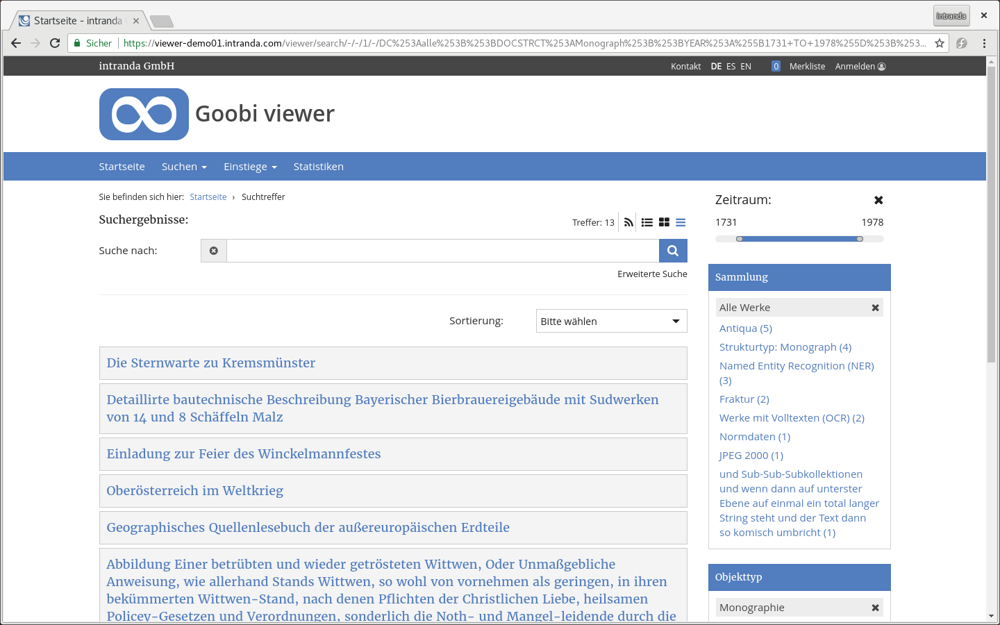
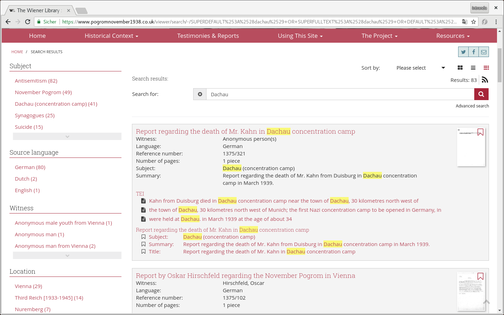

# Juni


Im Juni hat die Universitätsbibliothek Kassel eine Veranstaltung zum Thema Crowdsourcing durchgeführt. Dabei wurden ORKA und das Grimm-Portal zusammen mit dem Crowdsourcing-Modul und dessen Möglichkeiten vorgestellt. Wir freuen uns über die Veranstaltung in der Grimm-Welt mit über 50 Teilnehmern.

* [https://www.hna.de/kassel/hobby-historiker-fuers-uni-bibliothek-in-kassel-gesucht-9943601.html](https://www.hna.de/kassel/hobby-historiker-fuers-uni-bibliothek-in-kassel-gesucht-9943601.html)
* [https://www.uni-kassel.de/uni/en/aktuelles/meldung/post/detail/News/die-universitaets-bibliothek-bietet-plattformen-fuer-citizen-science/](https://www.uni-kassel.de/uni/en/aktuelles/meldung/post/detail/News/die-universitaets-bibliothek-bietet-plattformen-fuer-citizen-science/)

## Entwicklungen

### CMS

Im CMS Backend gibt es ein neues Template im Core, dass es erlaubt eine FAQ Seite zu erstellen. Einzelne Fragen und Antworten werden dabei als CMS Seite erfasst und klassifiziert. Die FAQ Seite zeigt alle Einzelseiten zusammengeführt an.


### Suche

In der Suchtrefferanzeige ist es nun möglich die Suchtreffer nicht nur in der bisherigen Form, sondern auch als Kacheln oder einfache Liste anzeigen zu können. Die Umschaltung ist auf der Suchtrefferseite über drei neue Icons oberhalb des Suchfeldes möglich. Die bisher bekannte Detailanzeige ist weiterhin der voreingestellte Wert.




Benutzergenerierte Inhalte die im Crowdsourcing erfasst wurden, werden nun in der Suchtrefferanzeige ebenfalls als Untertreffer zu den entsprechenden Strukturelementen angezeigt. Dabei weißt das vorangestellt Icon auf den Typ des erfassten Inhalts hin.


Ebenfalls neu ist die Möglichkeit Untertreffer aus TEI-Dokumenten anzuzeigen. Da diese Treffer in der Regel keinem Strukturelement zugeordnet sind, werden diese als eigenständige Kategorie aufgelistet:



Ansonsten gab es kleinere Bugfixes und Verbesserungen. Die Phrasensuche die durch das Setzen von Anführungszeichen um die gewünschten Suchbegriffe angezeigt wird steht nun auch für eine Suche im Werk zur Verfügung. Außerdem werden die Solr-Stopwörter nun auch bei dem Highlighting der Suchbegriffe für Untertreffer mit ausgewertet. Wird zum Beispiel nach der Phrase "Das Kloster Heilsbronn" gesucht, dann werden auch Treffer die nur "Kloster Heilsbronn" sind gefunden und angezeigt. Der Artikel "Das" als Stopwort wird nicht nur bei der Suche, sondern auch bei dem Highlighting ignoriert. Letzteres war bisher nicht der Fall, was zu Verwirrungen in der Anzeige führte.

### Stöbern

Es ist nun auch möglich nur in bestimmten Sammlungen zu stöbern. Diese Funktionalität kann bisher nicht konfiguriert werden, ist aber über einen direkten Aufruf der URL ansprechbar. Die URL muss dafür wie folgt aufgebaut sein:&#x20;

```
https://viewer.example.org/viewer/term/STOEBERNFELDNAME/DC:kollektionsname/-/1/
```

### Zeitleiste

Die Anzahl der Treffer in der Zeitleiste ist nun konfigurierbar. Dafür steht der folgende neue Schalter in der Konfigurationsdatei zur Verfügung.


```markup
<timeline>
    <hits>108</hits>
</timeline>
```


### Strukturelement-Whitelist

Die gesamte Strukturelement-Whitelist kann jetzt deaktiviert werden, wenn ein einziges Element mit einem Stern-Zeichen hinzugefügt wird. Dieses kann zum Beispiel bei der Realisierung von Portalen nützlich sein, bei der nur Objekte bestehend aus Einzelbildern eingespielt werden, die Anzahl der Objekttypen aber sehr groß ist.


```markup
<metadata>
    <docStructWhiteList>
        <docStruct>*</docStruct>
    </docStructWhiteList>
</metadata>
```


## Dokumentation

Die bisher als PDF-Dokument verfügbare Dokumentation für den Goobi viewer wurde in ein web-basiertes Dokumentationssystem überführt. Im Zuge dieser Arbeit wurde sie aktualisiert und auch in Teilen neu strukturiert. Die Dokumentation steht ab sofort unter der folgenden Adresse zur Verfügung:&#x20;

* [https://docs.intranda.com/goobi-viewer-de](https://docs.intranda.com/goobi-viewer-de)

Ebenfalls im Juni wurden die bisherigen Digests veröffentlicht, zu finden unter:&#x20;

* [https://docs.intranda.com/goobi-viewer-de/digests](https://docs.intranda.com/goobi-viewer-de/7.-digests)
