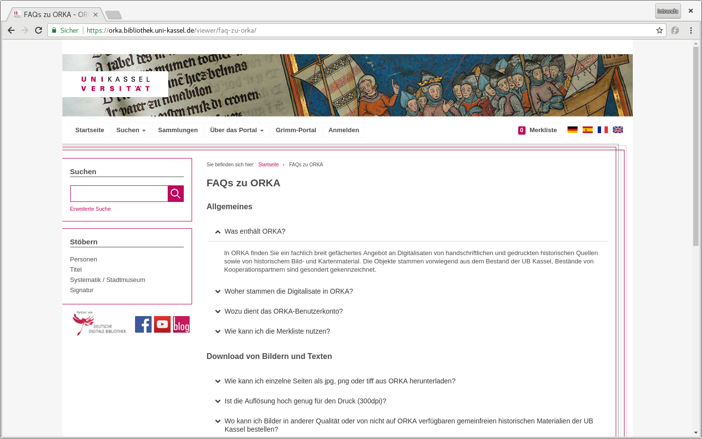

# September

Der Monat September war vor allem von dem Goobi Anwendertreffen geprägt. Alle Folien der Vorträge sind in der Medienecke auf intranda.com zu finden:



Auf dem Anwendertreffen wurde auch das[ Goobi Community Forum](https://community.goobi.io) vorgestellt. Anliegen im Kontext Digitalisierung und/oder Goobi können dort diskutiert werden. Alles rund um den Goobi viewer gibt es in der [Kategorie viewer](https://community.goobi.io/c/viewer).

Gefreut haben wir uns über die große Resonanz zum Thema Crowdsourcing. In der näheren Zukunft werden wir hier sicherlich spannende Neuigkeiten sehen!

Abgesehen von dem Anwendertreffen sind im September zwei neue Goobi viewer Instanzen offiziell online gegangen. Zum Einen ist das Ergebnis von dem Projekt WorldViews auf dem Historikertag in Münster vorgestellt worden. 



Die Webseite wurde auf Basis des Goobi viewers entwickelt. Die Funktionalitäten sind in den Core eingeflossen, speziellere Entwicklungen die sehr kundenspezifisch waren sind in ein eigenes Modul ausgelagert worden. Spannend ist, dass die Inhalte komplett aus TEI Dokumenten stammen. Die Seite ist unter [http://worldviews.gei.de](http://worldviews.gei.de) zu finden.

Zum Anderen wurde die [Künstlerdatenbank und Nachlassarchiv Niedersachsen](https://www.kuenstlerdatenbank.niedersachsen.de/) offiziell eröffnet. Das Portal basiert auf dem Goobi viewer, die technische Umsetzung erfolgte hier durch den GBV.

## Entwicklungen

### CMS

Die Möglichkeit eine FAQ über das CMS Modul zu realisieren wurde noch einmal deutlich erweitert. Für FAQ Einzelbeiträge kann nun eine Reihenfolge definiert werden um die Position des Eintrages in der Gesamtliste festzulegen. Die vorherige Sortierung basierte auf der Reihenfolge des Anlegens der einzelnen Einträge und konnte nicht angepasst werden. FAQ Einzelbeiträge müssen nun nicht mehr einer bestimmten Klassifikation angehören. Werden auf der FAQ Übersicht mehrere Klassifikationen ausgewählt, dann werden die Beiträge nach diesen gruppiert . Der Name der Klassifikation dient dabei optional als Zwischenüberschrift.

Das Ergebnis ist zum Beispiel in den [FAQs zu ORKA der UB Kassel](https://orka.bibliothek.uni-kassel.de/viewer/faq-zu-orka/) sichtbar:

### Bedienbarkeit

Im Kontext Usabillity gab es kleinere Änderungen, die aber einen deutlichen Sprung an Komfort bedeuten. Diese sind:

1. Administrationsbereich
   * Die Zugriffslizenzen sind kein Freitextfeld mehr, sondern ein Dropdown-Menü. Die indexierten Werte können nun direkt ausgewählt werden. Ein Suchen der Bezeichnung in der METS-Datei entfällt.
2. CMS Backend
   * Wenn bei dynamischen Inhalten die auf einem Solr-Feld basieren auch eine Sortierung angeboten wurde, war die Auswahl des Sortierfeldes ein Freitextfeld. Analog zu den Zugriffslizenzen wurde auch das auf ein Dropdown-Menü umgestellt.
   * Wenn in ein Template ein Bild eingefügt werden soll kann in dem sich öffnenden Medien-Modal nun direkt auf das gewünschte Bild geklickt werden. Der vorher dafür angebotene Link entfällt.
   * Die Seitenübersicht der vorhandenen CMS Seiten zeigt nun den vergebenen Titel und den Menütitel an. Das erleichtert eine im Menü verlinkte Seite mit eigenständigem Titel in der Übersicht zu identifizieren.
   * Ebenfalls in der Seitenübersicht ist es nun möglich verschiedene Spalten zu Sortieren und darin zu Suchen.

Außerdem wurde immer mal wieder der Wunsch geäußert auf Seiten mit einem Paginator, egal ob Front- oder Backend, diesen nicht nur unten sondern auch oben auf der Seite anzuzeigen. Ziel war jedes mal eine schnellere Navigation durch die Seiten / Suchtreffer ohne jedes mal scrollen zu müssen. Im kompletten Gegensatz zu diesem Wunsch steht aber die Anforderung, die relevanten Seiteninhalte so weit wie möglich oben auf der Seite anzuzeigen um direkt beim Laden so viel wie möglich wichtiges zu sehen. Als Kompromiss haben wir eine Navigation mit den Pfeiltasten der Tastatur implementiert. Überall wo ein Paginator angeboten wird um zwischen Seiten oder Suchtreffern zu blättern, kann dieser nun mit den Pfeiltasten nach Links und nach Rechts auf der Tastatur bedient werden um eine Seite nach vorne, oder eine Seite nach hinten zu navigieren. Zusätzlich kann man die Pfeiltasten zweimal schnell hintereinander anklicken, um auf die erste oder die letzte Seite zu springen.

### Authentifizierung

Der Goobi viewer bietet die Möglichkeit sich über einen lokalen oder einen OpenID Account \(zum Beispiel Google\) zu Authentifizieren. Dieser Bereich wurde intern überarbeitet und es besteht jetzt die neue Option sich gegen eine HTTP API von VuFind zu authentifizieren. Die [Dokumentation wurde aktualisiert](https://docs.intranda.com/goobi-viewer-de/2/2.5) und [Anmerkungen die bei einem Update des Cores bedacht werden müssen](https://docs.intranda.com/goobi-viewer-de/9/9.1#2018-10-09) in die entsprechende Sektion der Dokumentationsplattform eingepflegt. 

### Indexer

Der Goobi viewer Indexer unterstützt ab jetzt die Indexierung von Videos aus LIDO Dateien. Bisher war das nur bei METS-Dokumenten der Fall.

