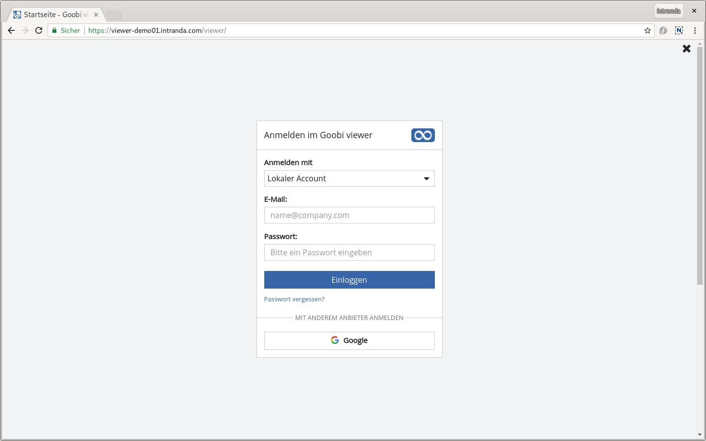
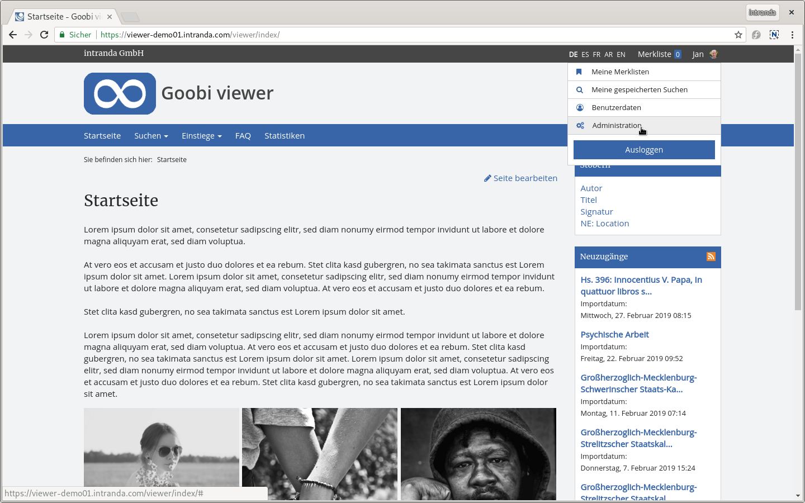
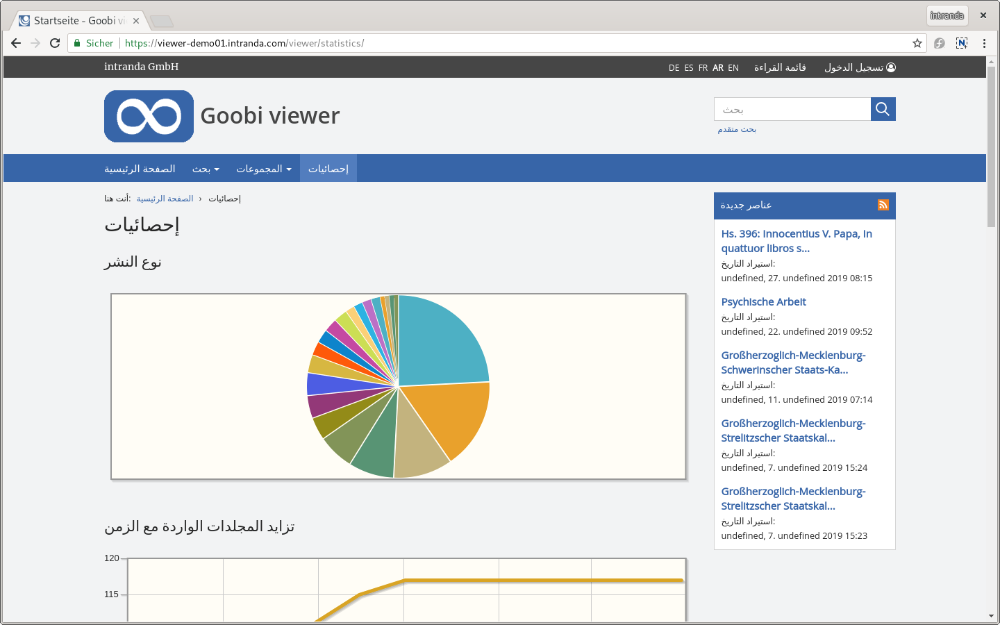

# Mai

Im Mai hat sich vor allem hinter und neben den Kulissen etwas getan. Außerdem gibt es eine wichtige Ankündigung.

Wir freuen uns sehr darüber, dass die Goobi viewer Instanz ORKA wie auch das Crowdsourcing-Modul des Goobi viewers in dem **Jahresbericht 2018 der Universitätsbibliothek Kassel** erwähnt wird:

*  [https://www.uni-kassel.de/ub/fileadmin/datas/ub/dokumente/Jahresbericht\_2018\_WEB.pdf](https://www.uni-kassel.de/ub/fileadmin/datas/ub/dokumente/Jahresbericht_2018_WEB.pdf)

Außerdem möchten wir an dieser Stelle der **Zentral- und Landesbibliothek Berlin** für die Wahl zur **Bibliothek des Jahres** gratulieren. Die Retrodigitalisierung \(Goobi workflow\) und die Digitale Landesbibliothek Berlin \(Goobi viewer\) wurden in der Pressemitteilung des Deutschen Bibliotheksverbands und der Deutschen Telekom Stiftung zur Preisvergabe mit erwähnt:

* [https://www.zlb.de/ueber-uns/presse/pressemitteilung-detail/news/forum-fuer-die-stadtgesellschaft-die-zentral-und-landesbibliothek-berlin-ist-bibliothek-des-jahre.html](https://www.zlb.de/ueber-uns/presse/pressemitteilung-detail/news/forum-fuer-die-stadtgesellschaft-die-zentral-und-landesbibliothek-berlin-ist-bibliothek-des-jahre.html)

Der Goobi viewer wurde innerhalb eines **Short Courses** auf der [**Archiving 2019 Konferenz** in Lissabon](https://www.intranda.com/general/goobi-auf-der-archiving-2019-digitization-preservation-access/) gezeigt und diskutiert. Es ist immer wieder spannend zu erleben, wie viele Menschen und Einrichtungen aus der ganzen Welt positiv interessiert an der Goobi Community und deren Arbeit sind.

Im Juni findet in Göttingen die **IIIF Konferenz** statt. Dort gibt es einen **Workshop** mit dem Titel "Creating, delivering and consuming IIIF Manifests within the Goobi Community". Der Goobi viewer und die Arbeiten der Goobi Community im Kontext IIIF werden dort vorgestellt und praktisch gezeigt. Weitere Informationen hier:

* [https://iiif.io/event/2019/goettingen/workshops/\#creating-delivering-and-consuming-iiif-manifests-within-the-goobi-community](https://iiif.io/event/2019/goettingen/workshops/#creating-delivering-and-consuming-iiif-manifests-within-the-goobi-community)

Die mit Abstand größte Neuerung des vergangenen Monats ist die Umstellung des Build-Systems von **Ant** auf **Maven**. Die vielen hundert Arbeitsstunden die dort hinein geflossen sind, sind nur leider gar nicht an der Oberfläche sichtbar. Was das eigentlich ist und weitere Details dazu sind unten beschrieben.

Bevor es nun zu der Beschreibung neuer Entwicklungen übergeht, noch eine Ankündigung: Von Ende Juni an bis Anfang August, wird das Goobi viewer Team nur eingeschränkt arbeiten können. Durch sich überschneidende Elternzeiten und Urlaube besteht das Team teilweise nur noch aus einem Kollegen. Aus diesem Grund legen wir während der Zeit unseren kompletten Fokus auf den Support und werden keine neuen Funktionalitäten entwickeln.

## Entwicklungen

### Neuer Login

Bereits länger stand eine Veränderung des Loginprozesses auf der Agenda. Dabei waren zwei Dinge im Vordergrund:

1. Die Anmeldemaske zu vereinfachen: Durch den Zuwachs an unterschiedlichen Authentifizierungsprovidern war auch die Anmeldemaske gewachsen, folgte keinem klaren Konzept mehr und war schlicht unübersichtlich.
2. Den Anmeldeprozess selbst vereinfachen: Egal an welcher Stelle man sich im Goobi viewer authentifiziert, der Benutzer soll immer auf der gleichen Seite bleiben.

Herausgekommen ist eine neuer Anmeldebildschirm, in der die unterschiedlichen Authentifizierungsmöglichkeiten als Dropdown Menü zur Verfügung stehen. Der Login ist auf großen Bildschirmen wie auch auf kleinen Smartphones gut bedienbar. Auch der Login selbst führt nun nicht mehr dazu, dass danach Benutzereigenschaften angezeigt werden, oder man schlichtweg nicht mehr weiß in welchem Werk unter welchem Bild man einen Kommentar schreiben wollte. Nach der Authentifizierung wird man zu der gleichen Seite zurück geleitet auf der der Anmeldelink geklickt wurde.

In dem Rahmen dieser Entwicklung wurden noch zwei weitere Dinge geändert. Der Link zum Administrationsbackend wurde aus dem Hauptmenü entfernt und ist nun im Benutzermenü zu finden. Dadurch sind alle benutzerrelevanten Funktionen: Benutzerdaten verwalten, gespeicherte Suchen, Merklisten und jetzt auch bei entsprechender Berechtigung optional der Zugang zum Administrationsbackend, an einer Stelle.

Außerdem wurde das Seitenleisten-Widget, in der ein Benutzer zu seinen Benutzerdaten gelangen oder sich Ausloggen konnte, entfernt. Dies ist ein erster Schritt um die teilweise sehr überladene Seitenleiste aufzuräumen.

### Arabische Übersetzung

Von einem Projektpartner im Sudan wurde die Oberfläche des Goobi viewers ins arabische übersetzt. Damit steht der Goobi viewer nun in den folgenden Sprachen zur Verfügung:

* Deutsch
* Englisch
* Spanisch
* Französisch
* Arabisch

### PDF-Unterstützung im CMS-Template für wissenschaftliche Bearbeitung

Das CMS-Template für die wissenschaftliche Bearbeitung ermöglicht jetzt den Upload und Anzeige von PDF-Dokumenten. Dadurch können wissenschaftliche Bearbeitungen im PDF-Format hochgeladen und layoutgetreu im Werkskontext angezeigt werden.

Die hier gewonnene Erfahrung kann perspektivisch auch auf die Anzeige von Born-Digital PDF-Dokumenten übertragen werden.

### DenkXweb Unterstützung im Goobi viewer Indexer

Der Goobi viewer Indexer unterstützt nun das Format DenkXweb. Dieses in der Denkmalpflege verwendete und von der Deutschen Digitalen Bibliothek unterstützte Format kann jetzt vom Indexer verarbeitet werden, so dass für jedes Denkmal \(im Standard ein Monument genannt\) ein eigener Datensatz im Goobi viewer angezeigt wird.

### Umstellung des Build-Systems von Ant auf Maven

Softwareentwicklung bedeutet, dass Menschen Quelltext \(Sourcecode\) schreiben, der dann mit einem Compiler in eine vom Computer verstandene Form übersetzt wird. Aus Sourcecode wird während des Kompilierens dann Bytecode.

Neben dem Kompilieren sind aber noch viele weitere Schritte notwendig. Beim Goobi viewer müssen zum Beispiel auch XHTML Seiten oder CSS-Dateien für die Anzeige im Webbrowser bedacht werden. Am Ende soll eine Datei herauskommen die alles enthält und die auf einem Server installiert werden kann.

Um diesen Prozess zu steuern gibt es sogenannte Build-Tools. Diese helfen einem den oben angesprochenen Weg zu strukturieren und verlässlich durchzuführen. Der Goobi viewer hat bisher ein Build-System mit dem Namen "Ant" verwendet. Dieses wurde im Mai durch das Build-System "Maven" ersetzt. Die Änderung des Systems hat verschiedene Gründe. Ganz entscheidend ist der vereinfachte Austausch und Wiederverwendung von Funktionalitäten zwischen verschiedener Software. Als Beispiel dient hier der intranda ContentServer, der unter anderem in Goobi workflow und dem Goobi viewer für die Bildanzeige zuständig ist. Mit Maven kann bei einem Update des ContentServers dieses viel Einfacher auch in den einzelnen Applikationen aktualisiert werden. Ein weiterer Vorteil ist, dass Maven auch Empfehlungen für Projektstrukturen, besser verständlich vielleicht als Ordnerstrukturen, mitbringt. Jeder Softwareentwickler kann sich in einem Projekt bewegen ohne die Software selbst kennen zu müssen, sofern er Maven kennt und das Projekt diesem Standard folgt.

Bei der Umstellung musste auch die interne Projektstruktur der einzelnen Komponenten untereinander angepasst werden. Wie weitreichend die Änderungen sind lässt sich am besten am folgenden Beispiel nachvollziehen:

* **Ant**: Mit dem Build-System Ant wurde an einer zentralen Stelle im Core eine Liste an Themes und Installationszielen gepflegt. Wenn der Goobi viewer Core gebaut wurde, wurde das Theme als Abhängigkeit mit in den Core aufgenommen und alles gemeinsam ausgeliefert.
* **Maven**: Mit dem Build-System Maven enthält das Theme eine Ahängigkeit zum Core. Es wird also das Theme gebaut und der Core als Abhängigkeit mit aufgenommen.

Diese Umstrukturierung hat in den letzten Wochen und Monaten im gesamten Team viele Kapazitäten gebunden. Wir sind uns aber sicher, dass diese Umstellung dem Projekt und der Software perspektivisch viele Vorteile bieten wird.

