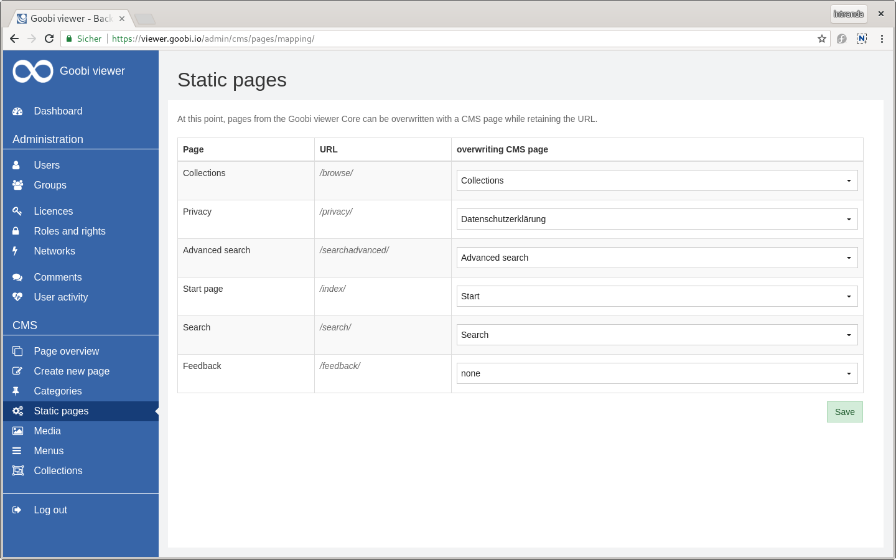
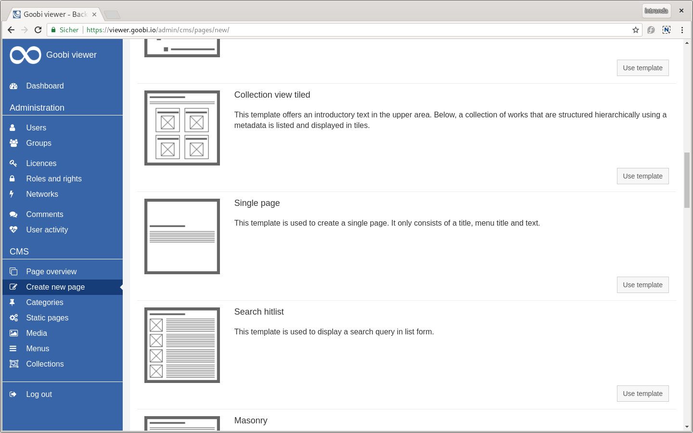
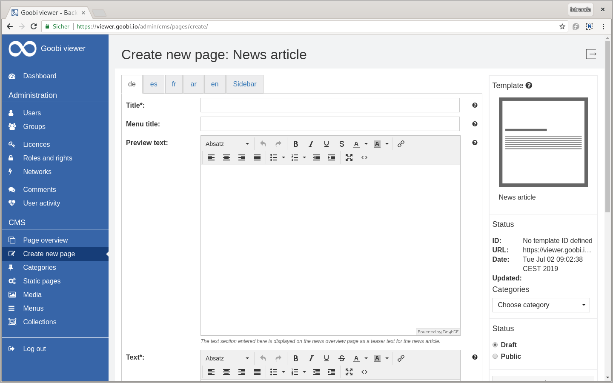
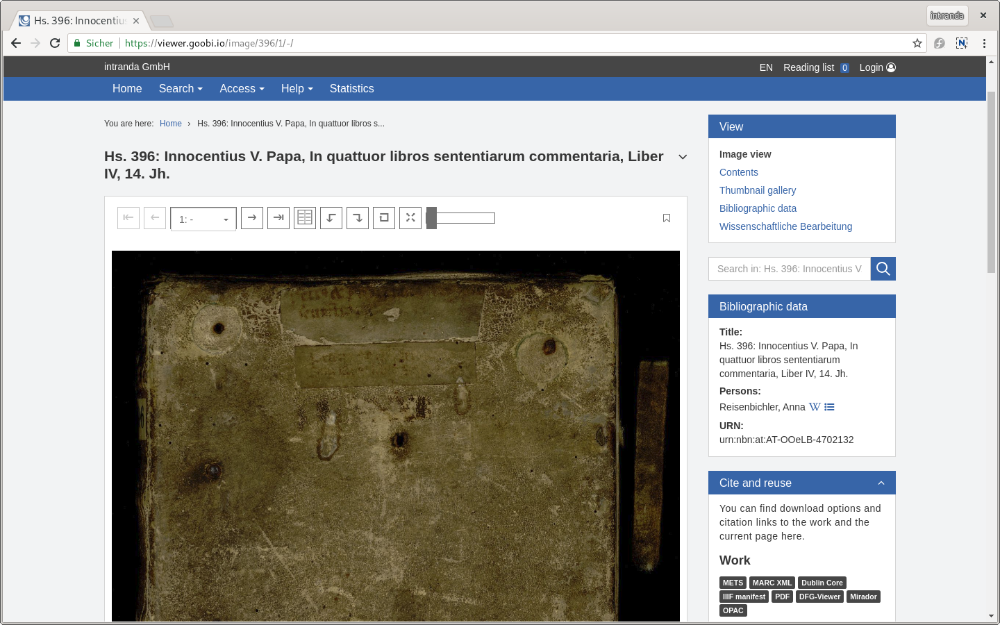
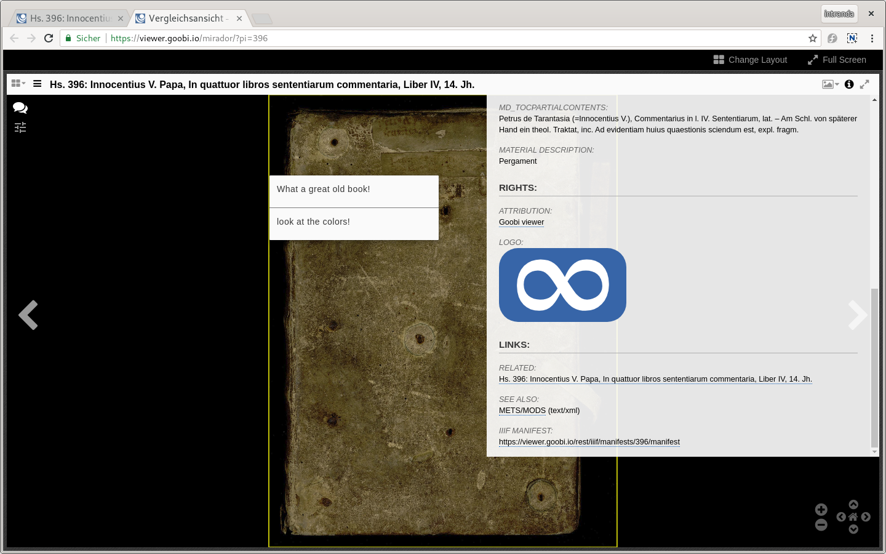
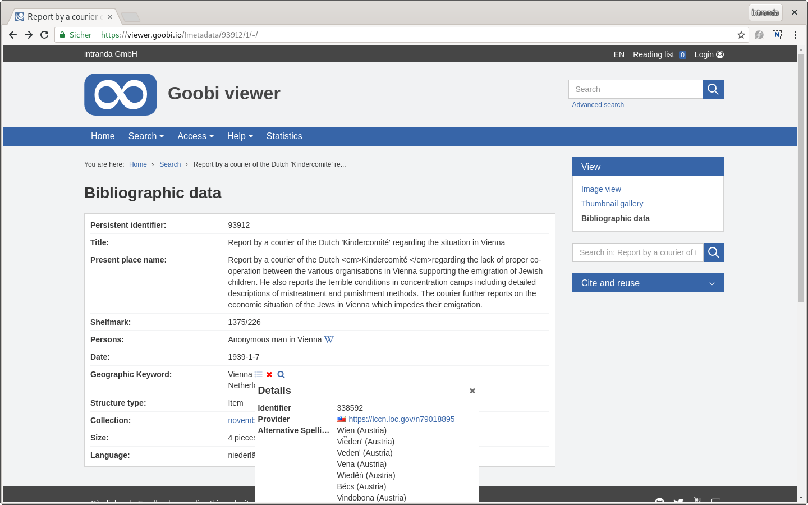

# Juni

Wir freuen uns über die Freischaltung von MNHA Collections. Hier präsentiert das **Musée national d'histoire et d'art** aus Luxemburg erste digitalisierte Bestände. Das Besondere ist dabei die komplett dreisprachige Unterstützung für Deutsch, Englisch und Französisch in Oberfläche und den Metadaten. Die Installation ist unter der folgenden Adresse zu finden:&#x20;

* [https://collections.mnha.lu/](https://collections.mnha.lu/)



Ebenfalls im Juni fand die **IIIF Konferenz** in Göttingen statt. Dort wurde der Goobi viewer auf einem Workshop eingehend vorgestellt:



Die **Maven Umstellung**, die im Mai bereits ausführlich Thema war, wurde im Juni weitergeführt. Zum Beispiel ist die Package Struktur von `de.intranda.digiverso.presentation` zu `io.goobi.viewer` angepasst worden und die Ordnerstruktur im Goobi viewer Indexer und dem Goobi viewer Connector entsprechen jetzt der Standard Maven Ordnerstruktur.

Eine Demo- und **Testinstallation des Goobi viewers** ist ab sofort unter der folgenden Adresse erreichbar:

* [https://viewer.goobi.io](https://viewer.goobi.io)

## Entwicklungen

### CMS

#### Statische Seiten

Seiten aus dem Goobi viewer Core können mit CMS Seiten überschrieben werden. Damit ist es zum Beispiel möglich eine individuelle Startseite oder eine eigene Sammlungsseite im CMS zu erstellen und diese dann unter den bekannten URLs zu hinterlegen.

Die Seite auf der diese Konfiguration vorgenommen wird, ist in Hinblick auf die Bedienbarkeit deutlich überarbeitet worden. Ein einleitender Satz erklärt jetzt, was auf der Seite überhaupt gemacht werden kann. Außerdem ist ersichtlich welche URL überschrieben wird.

#### CMS Templates

Bei den CMS-Templates gab es mehrere Änderungen. Der Titel und die Beschreibung sind ab sofort mehrsprachig. Damit steht seit Juni 2019 die gesamte Oberfläche mehrsprachig zur Verfügung!

Ebenfalls neu ist die Möglichkeit für einzelne Elemente eines CMS-Templates eine Inlinehilfe zu konfigurieren. Damit können Nutzern jetzt noch mehr Instrumente an die Hand gegeben werden um sich intuitiv im Backend zu bewegen und eigene Seiten zu erstellen.

Bestimmte Elemente einer CMS-Seite können innerhalb einer anderen eingebunden werden. So kann zum Beispiel ein Vorschautext eines Newsbeitrages auf einer Newsübersichtsseite oder einzelne FAQ Einträge auf einer FAQ Seite zusammengefasst und angezeigt werden. Dieser Mechanismus war bisher an den internen Namen der Elemente geknüpft und dann in den Templates hard codiert. Neu ist das Element `preview="true"` in der Templatedefinition, dass diese starre Verknüpfung aufhebt und das Element kennzeichnet, dass eingebunden werden soll.

### IIIF

Drei Neuerungen gibt es im IIIF Kontext in diesem Monat. Zuerst ist es nun möglich auch einzelne Werke im internen Mirador zu öffnen. Dafür haben wir im Widget "Zitieren und Nachnutzen" einen neuen Badge "Mirador" hinzugefügt der das Werk dann entsprechend öffnet.

Kommentare zu Bildern, die bereits vorher in den Manifesten ausgegeben wurden, werden nun auch im Mirador angezeigt. Dafür war es wichtig zusätzlich die Koordinaten der gesamten Seite mit zu übergeben.

Zu guter Letzt werden CMS-Seiten, die mit einem Werk verknüpft sind, automatisch als related Resource im Manifest ausgegeben.

Wie immer erfolgt die Generierung der Manifeste on-the-fly und neue Kommenare und verknüpfte CMS-Seiten sind direkt ohne weiteres Zutun sichtbar.

Das Klassenmodell für die Generierung und die Verarbeitung von IIIF Manifesten wurde aus dem Goobi viewer Core in eine eigene Java Bibliothek ausgelagert um sie auch in anderen Projekten direkt nutzen zu können. Die Bibliothek kann über Maven eingebunden werden und ist auf Github veröffentlicht:&#x20;

* [https://github.com/intranda/iiif-api-model](https://github.com/intranda/iiif-api-model)

### Bildanzeige

Standardmäßig werden für eine konsistente Anzeige die Bilder immer auf die Breite des Bildcontainers skaliert. Allerdings führt das zu Problemen, wenn zum Beispiel ein Buchrücken oder ein innen liegendes Leporello digitalisiert werden. Dann sind die angezeigten Bilder entweder riesig groß und lang, oder extrem schmal und breit.

Um diesem Effekt entgegenzuwirken beschränkt der Goobi viewer die Bildanzeige nun auf eine Höhe von 1200px sobald bestimmte Schwellwerte überschritten werden.

Siehe auch [Kapitel 2.11.3](https://docs.intranda.com/goobi-viewer-de/2/2.11/2.11.3) in der Dokumentation.

### Suche

In der Suche kann für die Sorterung nun eine zusätzliche statische Liste an Sortierfeldern definiert werden um bestimmte Werke anhand des Vorhandenseins eines bestimmten Indexfeldes stets oben zu plazieren. Die hier konfigurierten Felder werden in der Sortierreihenfolge vor den normalen Sortierfeldern angewandt und sind für den Nutzer nicht sichtbar.

Siehe auch [Kapitel 2.17.1](https://docs.intranda.com/goobi-viewer-de/2/2.17/2.17.1) in der Dokumentation.

### Normdaten (VIAF und Suche)

Der Goobi viewer unterstützt nun auch die Anzeige von Normdaten aus VIAF. Neben den bereits aus der GND bekannten Funktionen wird zusätzlich ein Icon des Datenlieferanten und eine URL zu der lokalen Datenbank angezeigt.

Mit dem neuen Feldtyp `normdatasearch` kann ein Button gerendert werden, der mit dem konfigurierten Indexfeld eine Suche startet, die alle Werke mit dieser Feld:Wert-Kombination auflistet. Damit können zum Beispiel Suchen nach Werken durchgeführt werden bei dem der gleiche Normdatensatz verwendet wurde.

Siehe auch [Kapitel 2.19.1](https://docs.intranda.com/goobi-viewer-de/2/2.19/2.19.1) in der Dokumentation.

### Indexer

Werden in der Konfigurationsdatei `solr_indexerconfig.xml` Änderungen an der Feldkonfiguration vorgenommen, dann lädt der Goobi viewer Indexer die Konfigurationsdatei automatisch neu und übernimmt die Änderungen. Das Neustarten des Dienstes ist nur noch erforderlich, wenn Änderungen außerhalb des  Bereiches vorgenommen werden.

### Reference Theme

Das Goobi viewer Reference Theme wurde überarbeitet und an den aktuellen Standard der Theme Boilerplate angepasst. Dabei wurden Farben, Abstände, Schriftgrößen und die mobile Version einer Revision unterzogen.

Das Reference Theme ist auf der oben angesprochenen Demo-Instanz sichtbar.

### Dokumentation

Die Goobi viewer Dokumentation und die Goobi viewer Digests stehen ab sofort auch in englischer Sprache auf der bekannten Dokumentationsplattform zur Verfügung:

* [https://docs.intranda.com/docs/](https://docs.intranda.com/docs/)

Immer wieder wurde uns außerdem die Frage gestellt, welche Schnittstellen der Goobi viewer eigentlich Unterstützt und wie diese aussehen. Gerade im Kontext IIIF kam die Frage häufiger auf.

Wie haben eine Seite erstellt, um die Schnittstellen zu beschreiben. Dabei sind nicht nur die einzelnen Schnittstellen, sondern auch jeweils Beispiel URLs dazu aufgelistet. Diese URLs sollten bei Übernahme der Seite auf die jeweilige Installation individuell angepasst werden. Die Seite ist als Kopiervorlage in Deutsch und Englisch unter der folgenden Adresse zu erreichen:

* [https://viewer.goobi.io/interfaces/](https://viewer.goobi.io/interfaces/)
