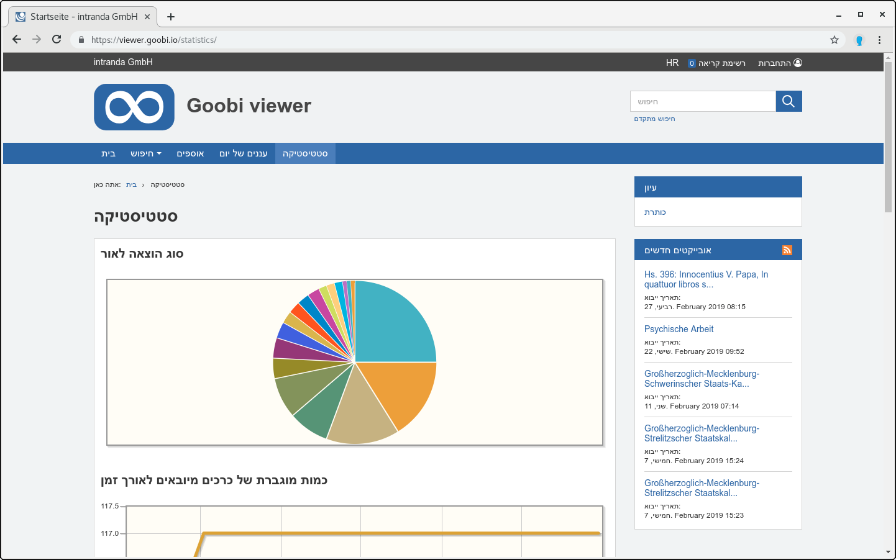
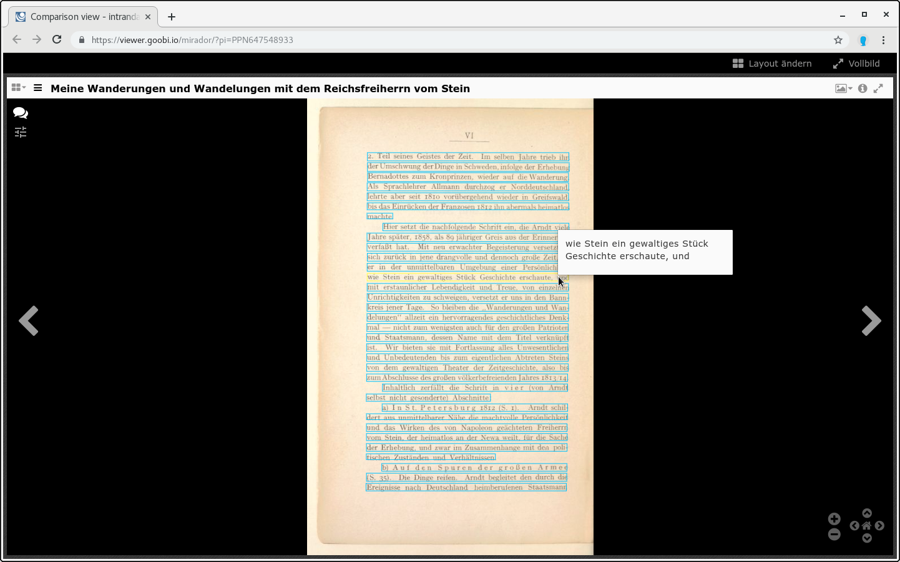

# Juli

Der Juli war wie angekündigt ein ruhiger Monat, wenn auch ein ganz besonderer! Noch nie gab es in einem Monat so viele externe Beiträge aus der Community wie im vergangenen. Gleich drei voneinander unabhängige Beiträge im Kontext Sprachen wurden eingereicht und in den Core eingepflegt.

Außerdem freuen uns darüber, dass der Verein für Computergenealogie seine digitale Bibliothek mit dem Goobi viewer präsentiert:

* [https://www.digibib.genealogy.net/viewer/](https://www.digibib.genealogy.net/viewer/)

Ansonsten war der Goobi viewer erneut Thema im IIIF Newsletter: 



Und auch im weitesten Sinne IIIF: Auf der Konferenz wurden wir von einem Teilnehmer auf seine persönliche Evaluation der Software aufmerksam gemacht. Er war sehr positiv angetan und hat sich viel bedankt. Wer von den Lesern kann hier japanisch?

* [http://digitalnagasaki.hatenablog.com/entry/2019/04/24/051339](http://digitalnagasaki.hatenablog.com/entry/2019/04/24/051339)

## Entwicklungen

### Sprachen

Wie bereits geschrieben gab es drei Beiträge aus der Community. Das erste ist eine Übersetzung des Goobi viewer Core in das hebräische. 

Zum Zweiten ist an der portugiesischen Übersetzung deutlich weiter gearbeitet worden und zu guter Letzt wurde eine Sprachtabelle mit offiziellen MARC Sprachcodes und deren Übersetzungen für Deutsch, Englisch, Französisch und Spanisch den Goobi viewer übernommen.  
Zur Diskussion rund um die Sprachtabelle siehe auf den folgenden Thread im Community Forum: 



### IIIF

Auf der IIIF Konferenz haben wir viele Gespräche geführt und Kontakte geknüpft. Ein Ergebnis ist, dass Volltexte aus ALTO Dateien in den IIIF Manifesten als Annotation ausgegeben werden.

### Installations- und Schnittstellenübersicht

Immer wieder werden wir die folgenden beiden Fragen gefragt:

* Welche Goobi viewer Installationen gibt es eigentlich?
* Welche Schnittstellen werden unterstützt?

Die Liste an Installationen wird oft zur Inspiration herangezogen, wenn es darum geht den Funktionsumfang der eigenen digitale Bibliothek zu evaluieren oder ein Update davon vorzubereiten. Die Liste an Schnittstellen wird immer mal wieder von Wissenschaftlern nachgefragt.

Um diesen Fragen in Zukunft einfacher begegnen zu können haben wir eine Übersicht erstellt unter der folgenden Adresse veröffentlicht:

* [https://goobi.io/viewer/installations/](https://goobi.io/viewer/installations/)

### Indexer

Liegen Volltexte in Textdateien nicht als UTF-8 vor, konvertiert der Goobi viewer Indexer diese ab sofort automatisch in das Format..

