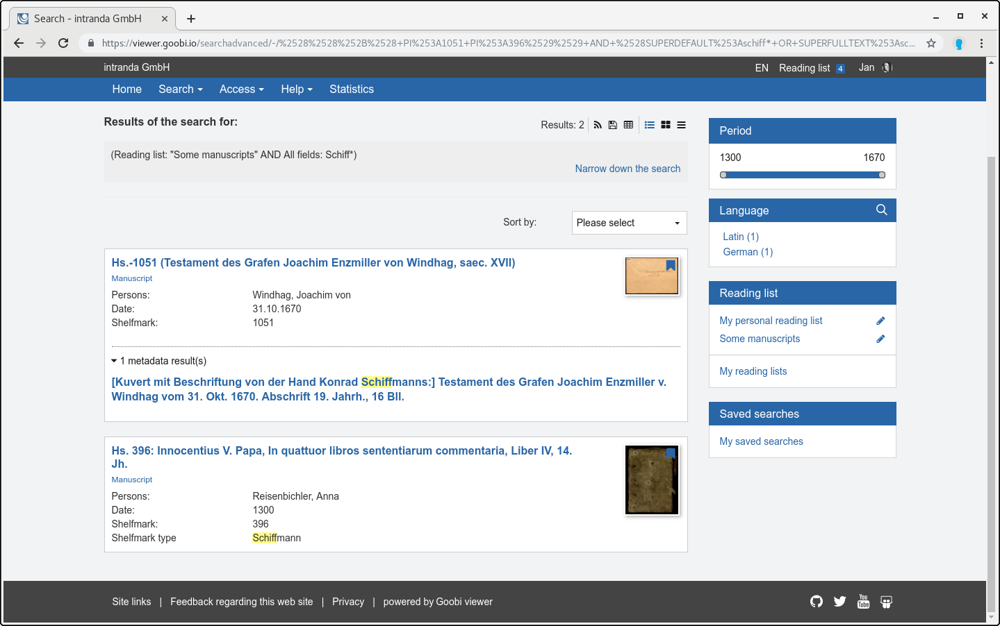
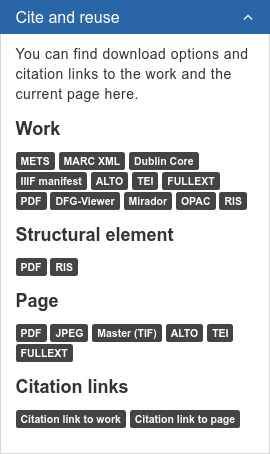

# August

Der August bringt vor allem kleinere Verbesserungen im Goobi viewer. Mehr dazu im folgenden Digest:

## Entwicklungen

### Suche

Ab sofort kann neben den bereits bekannten Suchoptionen auch in allen zusammengehörigen Bänden gesucht werden. Dafür wird das Widget "Suche im Werk" auch im Inhaltsverzeichnis von Anchor Werken wie zum Beispiel mehrbändigen Werken, Zeitschriften oder Zeitungen angezeigt.

Analog dazu kann auch in allen Werken eines Konvoluts oder einer Serie gesucht werden.

Ganz neu ist die Möglichkeit in den Werken einer Merkliste zu suchen. Ein Link steht für nicht angemeldete Benutzer im DropDown Menü der Merkliste zur Verfügung. Authentifizierte Nutzer können aus der Übersicht der gespeicherten Merklisten eine Suche starten. Beide Varianten führen auf die erweiterte Suchmaske in der die Session Merkliste oder alternativ eine der gespeicherten Merklisten für die Suche ausgewählt werden kann.

### Widget: Zitieren und Nachnutzen

In dem Widget "Zitieren und Nachnutzen" gibt es verschiedene neue Möglichkeiten: 

1. Auf Seitenebene kann das angezeigte Bild als JPEG heruntergeladen werden. Über einen neuen Schalter in der Konfigurationsdatei kann die Größe des Bildes festgelegt oder der Schalter komplett deaktiviert werden. 
2. Auf Seitenebene kann auch das vorliegende Masterbild im Goobi viewer zum Download angeboten werden. Dafür steht ein neuer Badge "Master \(DATEIENDUNG\)" zur Verfügung. Die Dateiendung wird je nach vorliegendem Bildformat zum Beispiel auf TIF, JP2 oder PNG angepasst. Auch diese Funktion ist über einen neuen Schalter deaktivierbar. Siehe für die Punkte 1 und 2 auch [Kapitel 2.23](https://docs.intranda.com/goobi-viewer-de/2/2.23) in der Dokumentation. 
3. Es gibt zwischen der Sektion "Werk" und "Seite" einen neuen Bereich "Strukturelement". Hier kann unter anderem das aktuelle Strukturelement als PDF heruntergeladen werden.

### Unterstützung von RIS

Der Goobi viewer generiert für Werke und Strukturelemente auf Anforderung RIS \(Research Information System\) Dateien. Damit wird ein weiteres, weit verbreitetes und standardisiertes Format von Literaturverwaltungsprogrammen unterstützt.

RIS Dateien für das Werk oder für das aktive Strukturelement stehen in dem Widget "Zitieren und Nachnutzen" zur Verfügung.

Die für die Generierung der Datei hinzugezogenen Metadatenfelder sind in der Liste der speziellen Solr-Felder in [Kapitel 3.14](https://docs.intranda.com/goobi-viewer-de/3/3.14) der Dokumentation aufgeführt.

### Metadatenanzeige

Zwei neue Schalter sorgen für zusätzliche Möglichkeiten bei der Anzeige von Metadaten.

In der `<mainMetadataList />` kann pro Publikationstyp ein Template mit der anzuzeigenden Metadaten definiert werden. Diese Liste an Metadaten und deren Reihenfolge wird dann auch für alle Strukturelemente herangezogen.

Technisch bedingt müssen Metadaten wie zum Beispiel Zugriffsbeschränkungen oder Kollektion auch in jedes Strukturelement vererbt werden. Das führt dazu, dass zum Beispiel bei jedem Strukturelement die Kollektionen des Hauptwerkes angezeigt wird.

Ab sofort kann dieses Verhalten mit dem neuen Schalter `topstructOnly="true"` für einen `<param />` Eintrag unterbunden werden. Wird dieser für ein Metadatum definiert, dann wird dieses nur beim Hauptelement angezeigt. Siehe auch [Kapitel 2.19.1](https://docs.intranda.com/goobi-viewer-de/2/2.19/2.19.1) in der Dokumentation.

Ein weiterer Schalter bezieht sich auf die Metadaten in der Seitenleiste neben dem Bild. Hier werden die Metadaten des aktuellen Strukturelements angezeigt. Damit ist bei einem Zeitschriftenartikel immer gleich ein Titel, Autor etc. sichtbar. Bisher war es nicht möglich an dieser Stelle auch Metadaten vom Hauptelement anzuzeigen. Mit dem neuen Schalter `topstructValueFallback="true"` ist das ab sofort anders. Damit kann zum Beispiel - unabhängig vom ausgewählten Strukturelement - in einer Handschrift immer die Signatur in der Seitenleiste angezeigt werden.

### OAI Schnittstelle

Sofern eine METS-Datei mit eingebettetem MARCXML Datensatz vorliegt wird über die OAI Schnittstelle bei der Anfrage nach MARCXML keine Antwort mehr aus dem MODS generiert, sondern der vorhandene Datensatz direkt ausgeliefert.   
Damit ist nun die komplette Prozesskette vom Anlegen eines Vorgangs in Goobi workflow auf Basis von MARCXML über den Export in der METS-Datei bis hin zur Auslieferung über OAI möglich.

Liegt eine reine METS/MODS Datei vor wird der MARCXML Record wie gewohnt generiert.

### Goobi viewer Indexer

Der Goobi viewer normalisiert nun die Schreibweisen von Unicode Zeichen. Technisch gesehen gibt es nämlich mehrere Möglichkeiten Buchstaben oder Sonderzeichen zu kodieren. [Wikipedia](https://de.wikipedia.org/wiki/Normalisierung_%28Unicode%29) listet das folgende Beispiel:

Bei der Stöbern Funktion des Goobi viewers kam es dabei manchmal zu Phänomenen, dass ein Autor doppelt aufgelistet wurde mit einer unterschiedlichen Anzahl an Treffern. Für den Endnutzer war die Schreibweise aber gleich und es war auch die selbe Person gemeint.

Ursache dafür war die unterschiedliche Kodierung der Buchstamen im Namen. Einmal wurden diese kombiniert `(NFC),` und einmal zerlegt `(NFD)` gespeichert. So etwas kann zum Beispiel passieren wenn beim Eintragen in den Katalog oder in den Goobi workflow Metadateneditor Schreibweisen über Copy & Paste übernommen werden.

Der Gooobi viewer Indexer normiert diese Daten von jetzt an automatisch zu der kombinierten, also der NFC Kodierung. Sofern in der eigenen Goobi viewer Instanz Phänomene wie oben geschildert sichtbar sind, sollte der Goobi viewer Indexer aktualisiert und der Datenbestand neu indexiert werden.

Außerdem wurde ein Bug behoben, der das saubere und verlässliche Herunterfahren des Dienstes verhinderte.

