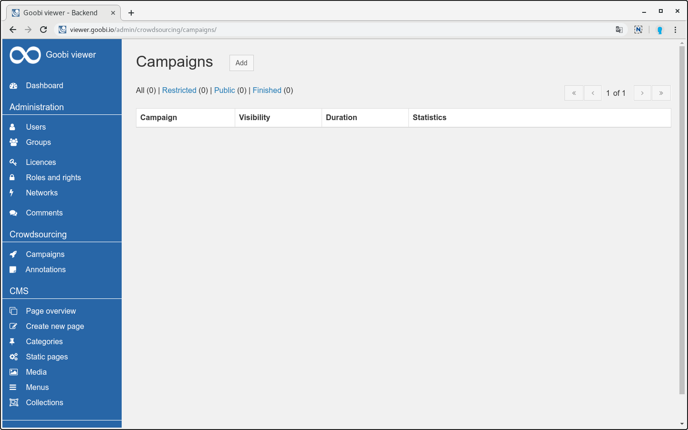
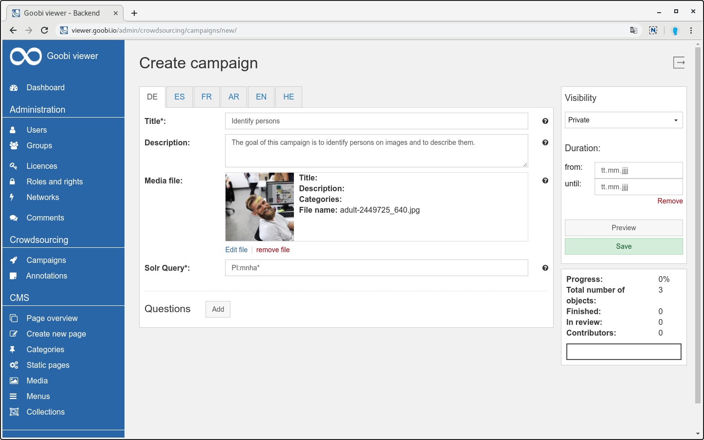
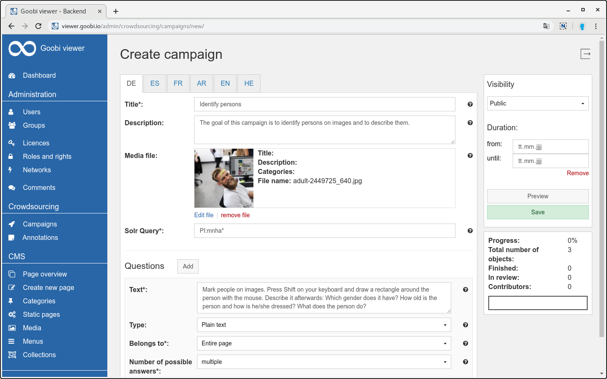
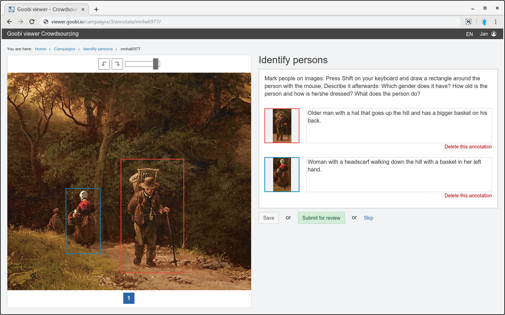
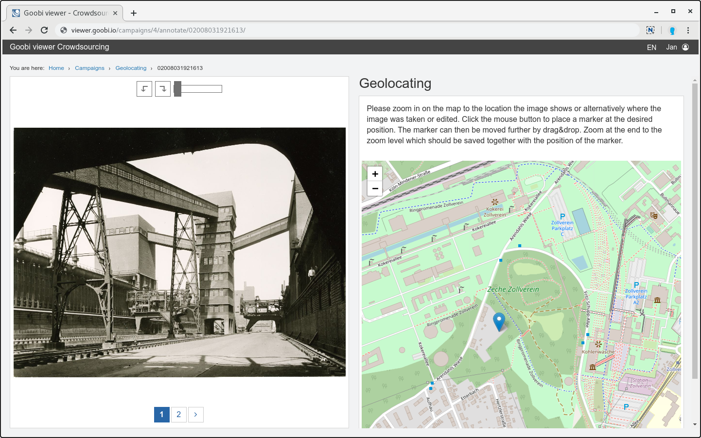
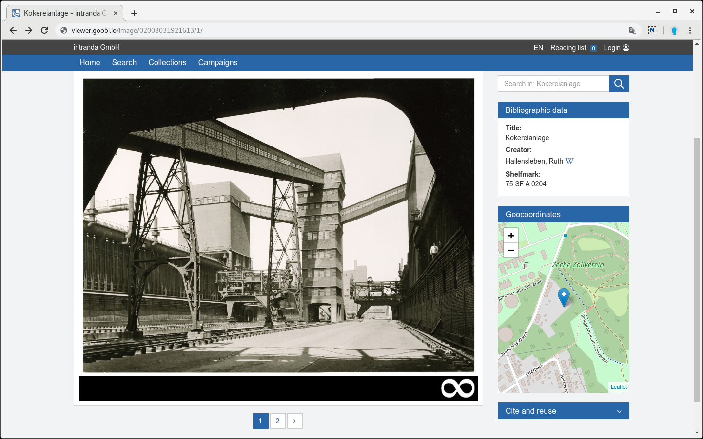
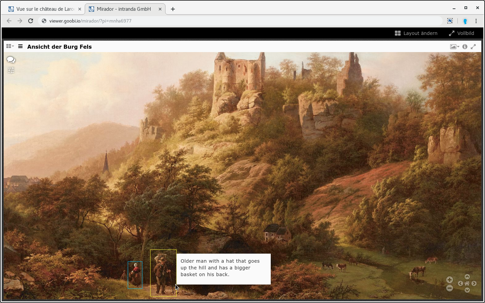

# September

Im September wurde die Kampagnen Funktionalität im Goobi viewer fertig. Hiermit ist die Grundlage für den weiteren Ausbau der Open Source Crowdsourcing Funktionalität gelegt. Mit der Fertigstellung einher ging das **Release des Goobi viewers 4.0**.

Die Crowdsourcing Kampagnen wurden bereits im [neusten IIIF Newsletter](https://iiif.io/news/2019/10/02/newsletter/#crowdsourcing-campaigns-with-the-goobi-viewer) erwähnt.

Ende des Monats war das jährliche Goobi Anwendertreffen. Hier gab es wieder eine ganze Reihe spannender Vorträge und Präsentationen im Kontext Goobi viewer. Vortragsfolien werden noch separat veröffentlicht. Alle die, die nicht dabei waren, haben zum Beispiel Vorträge zu virtuelle Ausstellungen in der Universitätsbibliothek Kassel, dem Erkennen von Gegenständen auf Abbildungen mittels künstlicher Intelligenz oder [App](https://github.com/atopion/cuby) Entwicklung via REST und IIIF an das Goobi viewer Backend und dessen Inhalte verpasst 😎 

## Entwicklungen

### Metadaten

Es ist nun möglich bei der Konfiguration der Metadaten zur Anzeige innerhalb der Werte zu Suchen- und Ersetzen. Dadurch kann sichergestellt sein, dass ein für die Anzeige konfigurierter Platzhalter wie `© [year]` ersetzt wird zu `© 2019` ohne jedes Jahr die Metadaten anzupassen, neu zu exportieren und zu indexieren. 

Die neuen Möglichkeiten sind in [Kapitel 2.19.1](https://docs.intranda.com/goobi-viewer-de/2/2.19/2.19.1) beschrieben.

### Zitieren und Nachnutzen

In dem Widget wurden die Unterüberschriften "Werk" und "Seite" dahingehend angepasst, dass anstelle von "Werk" der Dokumenttyp wie zum Beispiel "Monographie", "Akte" oder "Urkunde" angezeigt wird. Anstelle von Seite heißt es nun "Image". Durch diese Modifikation haben die Unterüberschriften nun weniger einen bibliothekarischischen sondern mehr einen generellen Kontext zum präsentierten Kulturerbe.

### Crowdsourcing Kampagnen

Auf dem Goobi Anwendertreffen 2018 gab es ein spontanes Treffen, bei dem über 15 verschiedene Einrichtungen darüber diskutierten wie sie sich eine Weiterentwicklung des Goobi viewers mit Crowdsourcing vorstellen könnten und wie dabei die Prioritäten aussehen. Aus diesem Treffen resultierten verschiedene kleinere und größere Bausteine die dann innerhalb der letzten 12 Monate entwickelt wurden.

Der letzte Baustein ist die jetzt fertig gestellt neue Kampagnen Funktionalität. Dabei handelt es sich um ein generisches Framework, dass es erlaubt Inhalte zusammenzustellen und mit Fragen zu verknüpfen. Hierfür steht im Backend ein neuer Bereich zur Verfügung in dem beliebig viele Kampagnen erstellt und kuratiert werden können.

Eine Kampagne besteht dabei aus einem Titel, einer optionalen Beschreibung und einem Bild, sowie einer Solr-Query die die Werke definiert, die in der Kampagne enthalten sind. Danach können Fragen definiert werden. Diese haben neben dem eigentlichen Text einen Typ - zur Zeit stehen hier Text und Geokoordinate zur Auswahl - und es kann festgelegt werden, ob sich die Frage auf das ganze Werk, das angezeigte Bild oder einen Teilbereich des Bildes bezieht und ob eine oder mehrere Antworten möglich sind.

Im Frontend steht eine Kampagnenübersicht zur Verfügung, die bei Bedarf auch über ein neues CMS-Template individualisiert werden kann. Je nach gewähltem Fragentyp steht dann innerhalb der eigentlichen Crowdsourcing Erfassung eine eigene Oberfläche zur Verfügung. Nach der erfolgreichen Bearbeitung muss ein anderer Benutzer die Ergebnisse innerhalb eines Review-Modus prüfen und bestätigen.

Die erstellten Annotationen werden nativ innnerhalb der Oberfläche des Goobi viewers angezeigt und automatisch in die IIIF Manifeste als WebAnnotation übernommen.

Die folgenden Screenshots geben einen Einblick in die neue Funktionalität:

Neben der Neuentwicklung der Kampagnen wurde auch die Integration des bisherigen Crowdsourcing Moduls zur OCR Korrektur \(ALTO\) und Transkription verbessert. So führt ein neuer "Text bearbeiten" Link in der Volltextanzeige gemeinsam mit dem bereits im Mai vorgestellten neuen Login dazu, dass die die Funktionen deutlich näher zum Nutzer gerückt sind.

Um die Links anzuzeigen muss der neue Schalter `<displayCrowdsourcingModuleLinks />` auf `true` gestellt werden, siehe dazu auch [Kapitel 2.24](https://docs.intranda.com/goobi-viewer-de/2/2.24) in der Dokumentation.

### Goobi viewer Indexer

Der Goobi viewer Indexer wurde um die Funktionalität erweitert die innerhalb der Kampagnen erzeugten Annotationen zu indexieren. Damit einher geht auch ein Update des Solr-Schemas. Beide müssen zwingend bei einem Goobi viewer Update mit aktualisiert werden. Eine Neuindexierung des Datenbestandes ist nicht notwendig.

