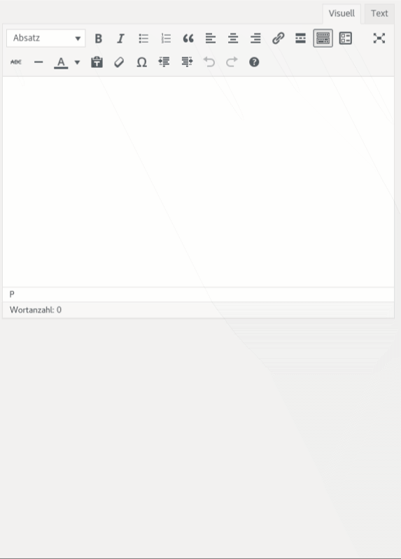
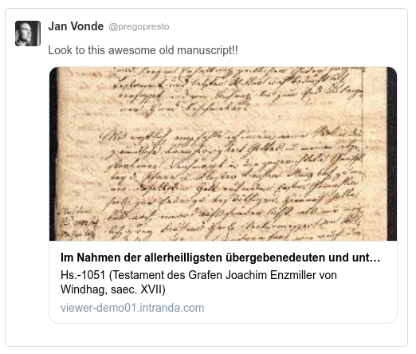
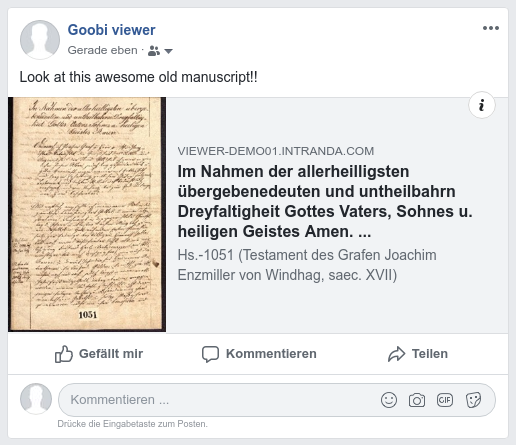
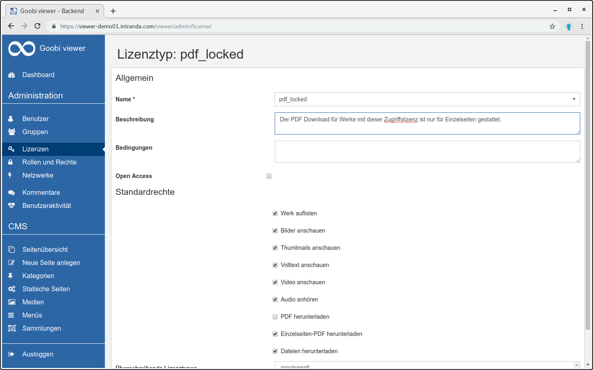
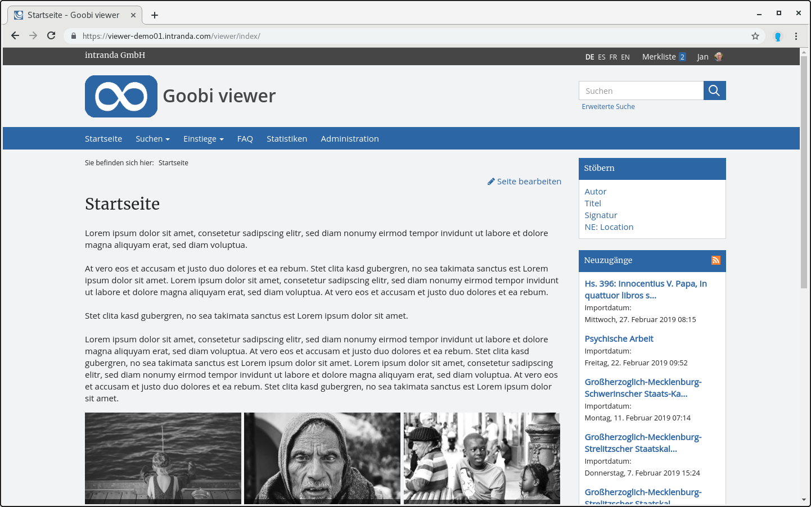
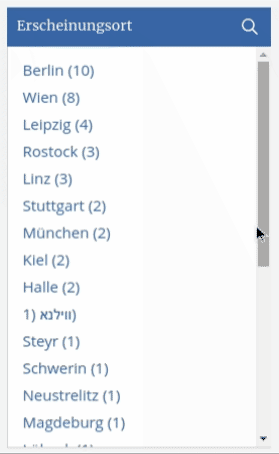

# April

Der April hat wieder spannende Themen hervorgebracht. Es gab Entwicklungen im Kontext Social Media, verschiedenes zur Verbesserung der Bedienbarkeit im CMS oder Umstrukturierungen innerhalb der Dokumentation.

Der Goobi viewer wurde außerdem im IIIF Community Newsletter mit der Implementierung der Change Discovery API erwähnt: 



## Entwicklungen

### Social Media

Der Goobi viewer unterstützt nun drei Methoden damit Links zu Werken in sozialen Netzwerken besser angezeigt werden:

* oEmbed
* Twitter Cards
* OpenGraph

Der oEmbed Standard wird zum Beispiel von Content Management Systemen wie Wordpress unterstützt. Eine URL zu einem Werk wird dort dann direkt als Bild aufgelöst. Hier ein Beispiel aus dem Wordpress-Editor während des Schreiben eines Beitrages:

Twitter Cards erlauben, dass nicht nur der Link zu einer Seite, sondern darüber Hinaus auch Bilder oder Videos inklusive Metadaten direkt in der Timeline angezeigt werden. OpenGraph ist das äquivalent dazu in Facebook.

### Zugriffsbeschränkung

Bei der Konfiguration von Zugriffsbeschränkungen ist es nun möglich den Download auf Einzelseiten-PDF zu beschränken. Bisher konnte der PDF-Download für ein Werk nur komplett ausgeschaltet oder alternativ auf einen Strukturelementtyp begrenzt werden. Mit der neuen Option können jetzt auch Werke, die mehrere tausend Bilder mit wenigen Strukturelementen enthalten, im Goobi viewer zum Download angeboten werden. Die Einschränkung auf Einzelseiten-PDF hilft hier um die Last auf den Servern zu verringern.

### CMS

Im CMS gab es zwei kleinere Anpassungen. Zum einen kann aus der Werksansicht heraus eine neue verknüpfte CMS Seite erstellt werden. Dazu steht im Widget "Änderungen am Werk" in der Seitenleiste ein neuer Link "Verknüpfte CMS-Seite erstellen" zur Verfügung. Per Klick wird hier im CMS-Bereich eine neue Seite auf Basis des Templates "Wissenschaftliche Bearbeitung" erstellt. Das verknüpfte Werk ist dabei vorausgewählt.

Sofort sichtbar ist für alle authentifizierten Benutzer mit entsprechender Rechtestufe der neue Link "Seite bearbeiten". Dieser wird im Frontend angezeigt und ermöglicht es von dort direkt in das Backend in den Bearbeiten-Modus der betrachteten CMS-Seite zu wechseln.

### Bedienbarkeit

Bei der Bedienbarkeit gab es verschiedene Detailverbesserungen. So funktionieren die bekannten Tastenkombinationen zum Blättern mit den Pfeiltasten jetzt auch in der Vollbildanzeige. Dort wird sich jetzt beim Blättern auch die Breite der Sidebar und dessen Scrollposition gemerkt. Das vereinfacht zum Beispiel die parallele Anzeige von Bild und Volltext während im Werk geblättert wird.

Aus dem Kontext Suche gibt es ebenfalls zwei Optimierungen zu berichten. Scrollt man in einer Suchtrefferliste nach unten, klickt auf einen Suchtreffer und geht von dort zurück zur Suchtrefferliste wird sich die Scrollposition gemerkt und man landet auf der bekannten Seite an der gleichen Stelle wo man sie verlassen hat. Früher wurde die Seite oben angezeigt und man musste neu nach unten scrollen. 

Neu ist weiter die Möglichkeit in den Facettierungsoptionen zu Filtern. Ist die Liste der angebotenen Möglichkeiten sehr groß, kann mit einem Klick auf den Titel oder die danebenliegende Lupe eine Input-Box angezeigt werden, die ein direktes Filtern in den Möglichkeiten erlaubt.

### Breadcrumbs

In den Breadcrumbs wird nun beim einer Werks-URL automatisch der Sammlungsbaum aufgelistet, wenn das Werk nur einer Sammlung zugehörig ist. Dadurch kann der Kontext des Werkes einfacher erschlossen werden. Weiter werden auch CMS-Seiten korrekt verlinkt und aufgeführt.

### Dokumentation

Neu hinzugekommen sind in der Dokumentation die [Kapitel 3.13](https://docs.intranda.com/goobi-viewer-de/3/3.13) und [3.14](https://docs.intranda.com/goobi-viewer-de/3/3.14), die das Solr-Schema selbst sowie spezielle Felder beschreiben die im Goobi viewer Verwendung finden. Das ist vor allem für Profi-Anwender interessant, die ein eigenes Schema pflegen oder das Datenmapping selbst konfigurieren.

Wie im Community Forum bereits angekündigt wurde die Linkstruktur der Dokumentation an die von Goobi workflow angeglichen. Die URLs sind weniger sprechend, erlauben aber in künftig verschiedenen Sprachversionen einen einfacheren Wechsel dazwischen.   
Auch die Digests wurden aus der Dokumentation selbst heraus an einen neuen Ort umgezogen um die Trennung zwischen den Inhalten klarer zu machen.

### intern

Nicht alles was entwickelt wird ist auch direkt in der Oberfläche sichtbar. So wurde im April viel Zeit investiert, um an allen Stellen im Quelltext den internen urlBuilder zu verwenden. Damit werden URLs vom Goobi viewer selbst zu anderen Seiten innerhalb des Goobi viewers generiert. Während der Entwicklung ist es manchmal einfacher den Link "eben von Hand zu bauen". Hier wurde einmal aufgeräumt.

Das gleiche gilt für die Unterstützung der DataRepositories. Der PDF-Download aus selbigen war noch nicht vollständig unterstützt. Das wurde ebenfalls fertig implementiert.

### Goobi viewer Connector

In der OAI Schnittstelle gab es kleinere Updates die für mehr Stabilität sorgen. Ein Update ist nur notwendig wenn es Probleme gibt.

### Goobi viewer Indexer

Der Goobi viewer Indexer unterstützt jetzt in ALTO Volltexten Wörter, die durch einen Zeilenumbruch getrennt werden und sich in ComposedBlocks befinden. Die Indexierung wurde implementiert und die korrekte Anzeige in den Suchtreffern verifiziert.  
Wenn bei LIDO Dateien der automatische Bilddownload genutzt wird können nun auch Bilder von einer IIIF Image API kompatiblen Schnittstelle heruntergeladen werden.

Ein Update ist ebenfalls nur notwendig, wenn es bei einem der beiden genannten Punkten aktuell Probleme gibt.

