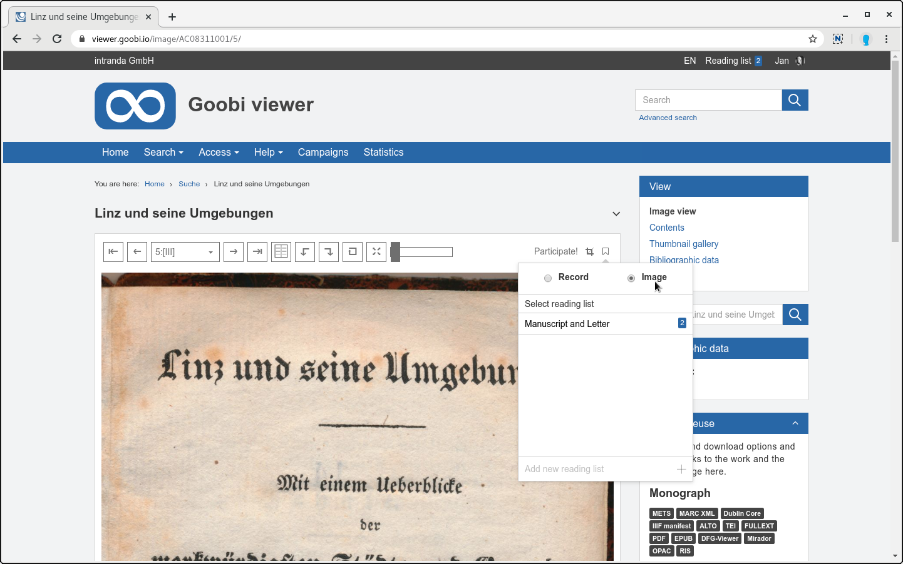
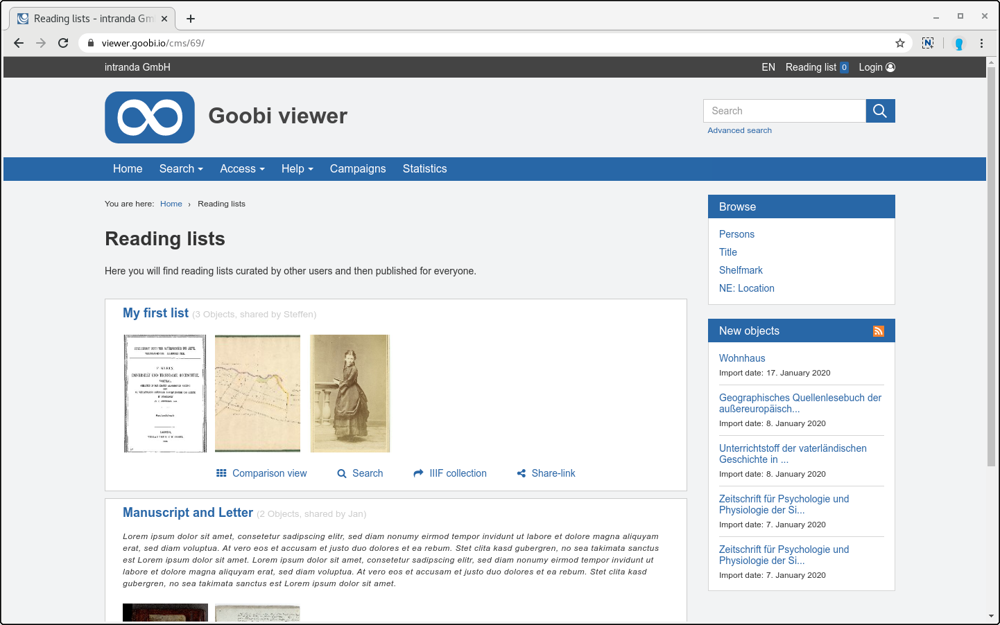
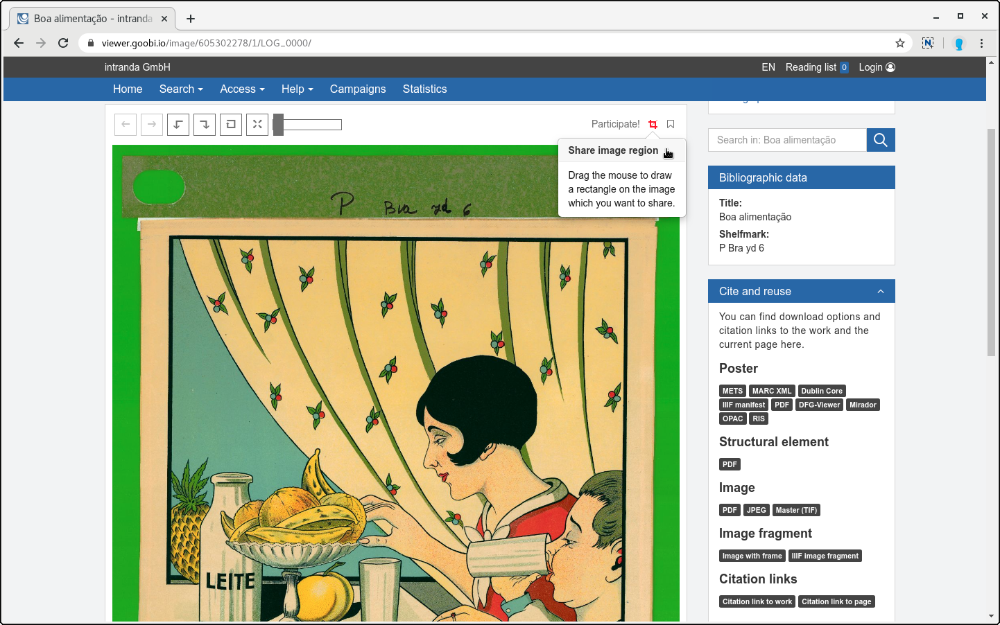
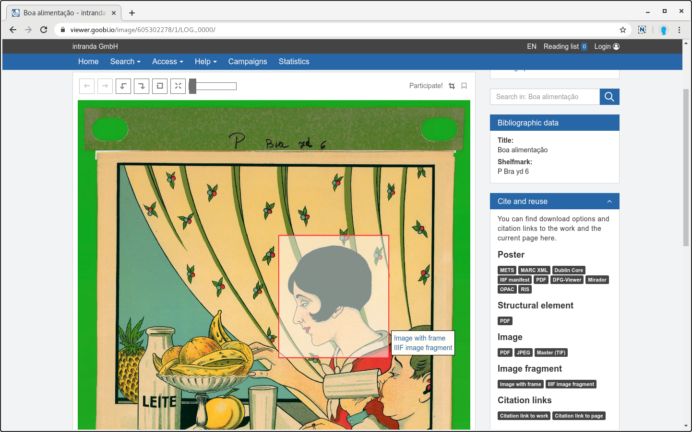
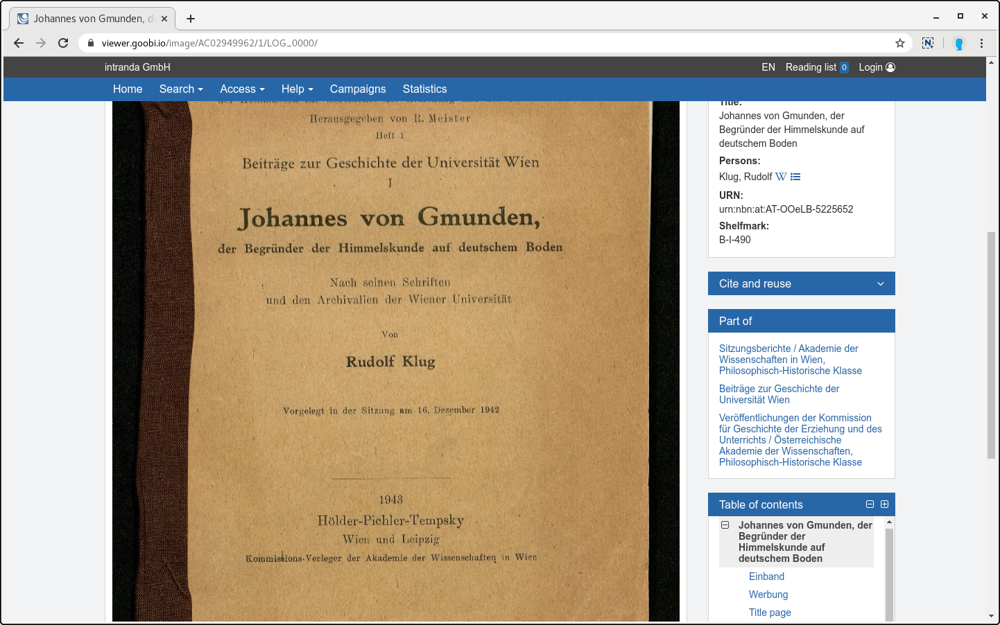
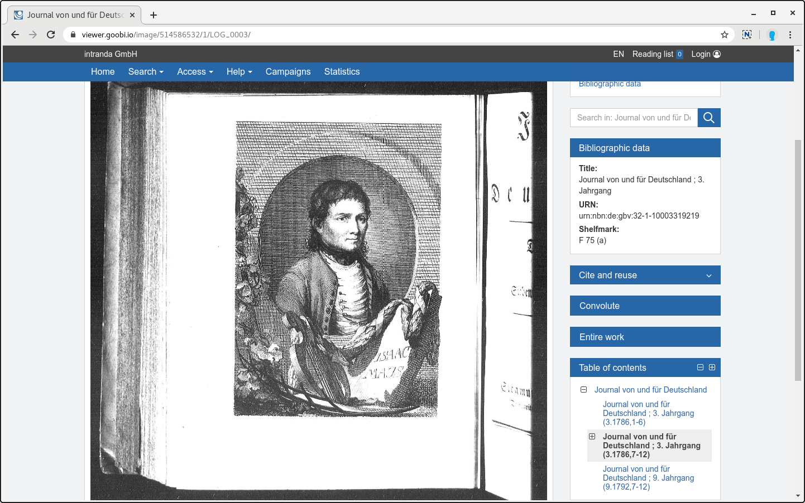

# Januar

## Coming soon

* 📝 Bedingungen für die **Anzeige von Metadaten**
* \*\*\*\*🔐 **Shibboleth**
* \*\*\*\*🗺 **Karten**

## Aktuelles

Das neue Jahr fängt krachend an. Es gibt tolle neue Funktionen im Goobi viewer und im Hintergrund hat sich einiges getan!

Mit dem Jahreswechsel hat der Goobi viewer die Marke von 1000 automatischen Unit Tests überschritten.  Mit diesen Tests wird automatisch geprüft ob Funktionalität und Logik sich verhalten wie intendiert. Das gibt Sicherheit, dass ein einmal behobener Fehler nicht wieder auftaucht, oder wenn bestehende Funktionalität verändert wird diese nicht kaputt geht.

Außerdem wurde im Hintergrund der Goobi viewer Core auf die Standard Maven Ordnerstruktur umgestellt. Damit ist die vor einem Jahr begonnene Umstellung des Buildsystems nun abgeschlossen. Sie trägt auch bereits erste Früchte: Viele verwendete Java Libraries konnten aktualisiert und auf den neuesten Stand gebracht werden.

Neu ist auch das automatische Erzeugen von Releases. In dem Goobi viewer Core, Indexer und Connector können kompilierte und für die Installation benötigte Dateien direkt von Github heruntergeladen werden.

Zuletzt haben wir den Datenbestand auf der [Goobi viewer Demo- und Testinstanz](%20https://viewer.goobi.io) überarbeitet. 

## Entwicklungen

### Merklisten

Die Merklisten wurden umfassend überarbeitet. Dabei ist verschiedenes Feedback aus der Community eingeflossen. Die Neuerungen sind im Einzelnen:

#### Bilder speichern

Ab sofort ist es möglich auch einzelne Bilder innerhalb einer Merkliste zu speichern. Bisher war das nur für Werke möglich. Durch diese Erweiterung können Inhalte nun viel granularer zusammengestellt werden. Die Auswahl ob das Werk oder das aktuelle Bild gespeichert werden soll befindet sich in dem bekannten Dialog.



Der Wunsch für diese Funktionalität wurde bereits häufiger in der Community geäußert. Zuletzt im Kontext Crowdsourcing und Kampagnen wo der Bedarf formuliert wurde Kampagnen nicht nur für komplette Werke, sondern auch für dedizierte Inhalte kuratieren zu können. Mit der Möglichkeit einzelne Bilder auf Merklisten zu speichern wurde jetzt ein erster Schritt in diese Richtung gegangen.

#### Vergleichsansicht mit nur einem Werk öffnen

Ebenfalls aus der Community kam der Wunsch die [Vergleichsansicht mit nur einem Werk](https://community.goobi.io/t/goobi-viewer-digest-fuer-dezember-2019/446/2) öffnen zu können. Da es inhaltlich gut passte konnte auch dieser Wunsch direkt mit berücksichtigt werden.

#### Merklisten teilen

Ab sofort ist es möglich Merklisten mit anderen Nutzern zu teilen. Dafür stehen drei Varianten zur Verfügung.

**Teilen mit einer Benutzergruppe:** Wenn ein Nutzer selbst Mitglied in einer Benutzergruppe ist, dann kann er Merklisten mit den anderen Mitgliedern aus dieser Gruppe teilen.

**Teilen mittels eines kryptischen Links:** Für jede Merkliste kann ein kryptischer Link generiert werden. Dieser kann dann weitergegeben werden und externe können sich ohne Authentifizierung die Merkliste und dessen Inhalte anschauen. Die Freigabe mittels kryptischen Link kann auch widerrufen oder der Link neu erzeugt werden.

**Öffentlich für Alle:** Eine Merkliste kann auch komplett veröffentlicht werden. Sie ist dann ohne Anmeldung für jeden Nutzer sichtbar. Dafür gibt es eine neue Seite, die die öffentlichen Merklisten einer Instanz auflistet. Die Seite kann wie gewohnt in das Menü aufgenommen werden. Die Seite kann über ein dediziertes CMS-Template mit individuellem Text versehen werden.



#### Merklisten und IIIF

Der IIIF Gedanke wurde auch hier konsequent weitergedacht. Die Inhalte einer per Link geteilten oder öffentlichen Merkliste stehen als IIIF Collection zur Verfügung. Auf diese Weise kann sich jeder Nutzer eigene individuelle IIIF Collections aus dem Datenbestand zusammenstellen.

#### Merklisten Übersicht

Die Übersicht der vorhandenen Merklisten zeigt jetzt direkt die Thumbnails der Inhalte an. Dies erlaubt einen schnelleren Überblick und Einstieg in die Inhalte. 

#### Backend

Sehr große Umstellungen gab es auch im Hintergrund. Früher hießen die Merklisten Bücherregale. Als diese vor einiger Zeit zu Merklisten umbenannt wurden, hießen sie im Code zu 50% weiterhin `bookshelf`, zu 30% `readinglist` und zu 20% `watchlist`. Die Benennung wurde intern einheitlich auf die Bezeichnung `bookmark` angeglichen.

### Zitierlinks für Bildausschnitte

Neu ist die Möglichkeit Zitierlinks für Bildausschnitte zu erzeugen. Damit wird die Möglichkeit zur kollaborativen Arbeit mit dem Datenbestand gestärkt. Nutzer können Bildbereiche markieren zum Beispiel Links dahin per Emails weitergeben. Oberhalb des Bildes kann dafür die Funktionalität zum "Bildausschnitt teilen" aktiviert werden. Danach kann innerhalb des angezeigten Bildes ein Kasten aufgezogen werden. Neben dem Rechteck wird dann angeboten den Link zu der Seite mit dem Kasten selbst, oder den Link zu dem gewählte Bildfragment via IIIF Image API zu kopieren.

Wird der Link zu der Seite weitergegeben dann wird der Kasten beim Laden der Seite direkt im Bild angezeigt. Außerdem stehen die beiden Links zur Seite und zum Bildfragment im Widget "Zitieren und Nachnutzen" zur Verfügung.





Das hier gezeigte Beispiel kann unter dem folgenden Link betrachtet werden:

* [https://viewer.goobi.io/image/605302278/1/\#xywh=2907,1961,1589,1769](https://viewer.goobi.io/image/605302278/1/#xywh=2907,1961,1589,1769)

### Serien und Werke mit Anchor

Ist ein Werk Teil eines mehrbändigen Werkes oder Teil einer Serie / Konvolut, so wird ab sofort ein Link in der Sidebar angezeigt, der auf diese Inhalte verweist. Bisher musste das explizit für einzelne Instanzen freigeschaltet werden.

Der Links verweisen auf die Serie / das Konvolut beziehungsweise das Gesamtwerk. Ist ein Werk Teil mehrerer Serien so werden die Serien - sofern konfiguriert - mit Namen als Liste aufgeführt.





### Vollbildanzeige

In der Vollbildanzeige gab es verschiedene kleinere Anpassungen. So steht zum Beispiel ab sofort auch die Suche im Werk zur Verfügung. 

Weiter ist es möglich die Seite, die beim Verlassen des Vollbildmodus aufgerufen wird, zu konfigurieren. Mehrt dazu in [Kapitel 2.12](https://docs.intranda.com/goobi-viewer-de/2/2.12) der Dokumentation.

### Authentifizierung

Mit Bibliotheca von OCLC wird ein weiterer Authentizierungsprovider unterstützt, der für die Nutzeranmeldung konfiguriert werden kann.

Mehr dazu in [Kapitel 2.5.1](https://docs.intranda.com/goobi-viewer-de/2/2.5/2.5.1) der Dokumentation.

### portugiesische Sprachunterstützung

Die portugiesische Sprachunterstützung wurde aus der Community heraus aktualisiert. Ein herzliches Dankeschön dafür! :-\)

### DenkXweb

Der Goobi viewer Indexer kann nun auch Datensätze im DenkXweb Standard indexieren die Bilder enthalten. Im Goobi viewer Core wurden kleinere Anpassungen vorgenommen um die Datensätze des Standards besser darzustellen.

### Erweiterte Suche

Die erweiterte Suche hat eine Unterstützung für mehrsprachige Metadaten bekommen - zu erkennen an den `_LANG_` Feldern. Wenn diese Felder für die erweiterte Suche konfiguriert werden, dann werden - wie bei anderen Bereichen auch-  nur noch die Felder der im Browser aktiven Sprache angezeigt.

## Versionsnummern

Die Versionen die in der `pom.xml` des Themes eingetragen werden müssen um die in diesem Digest beschriebenen Funktionen zu erhalten lauten:

```markup
<dependency>
    <groupId>io.goobi.viewer</groupId>
    <artifactId>viewer-core</artifactId>
    <version>4.3.0</version>
</dependency>
<dependency>
    <groupId>io.goobi.viewer</groupId>
    <artifactId>viewer-core-config</artifactId>
    <version>4.3.3</version>
</dependency>
```

Der **Goobi viewer Indexer** hat die Versionsnummer **4.3.3**.

Der **Goobi viewer Connector** hat die Versionsnummer **4.3.0**.

Das **Goobi viewer Crowdsourcing Modul** hat die Versionsnummer **1.1.8**.

