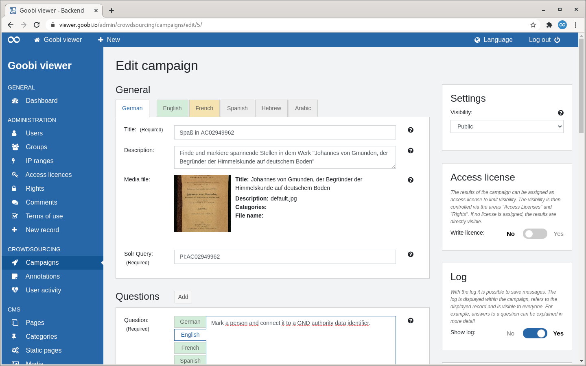
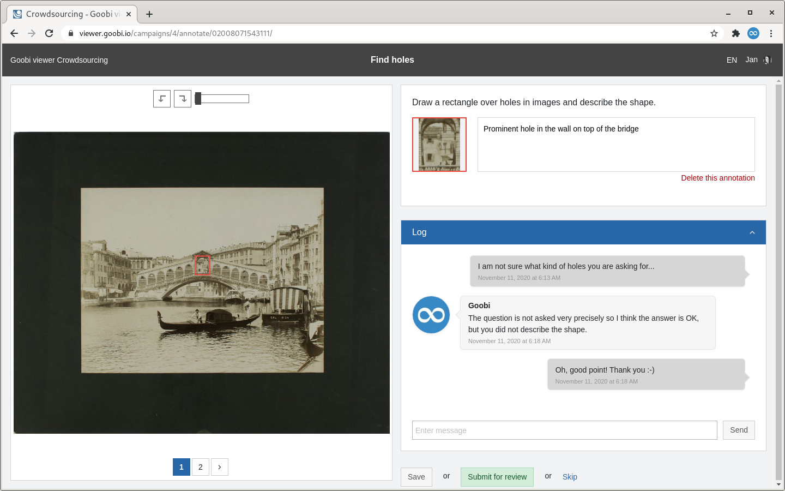
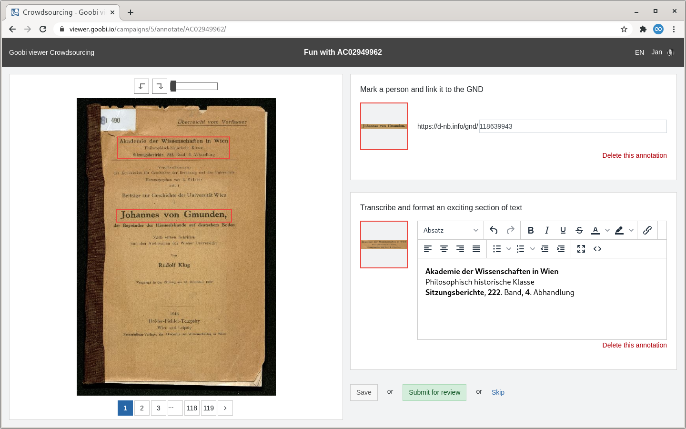
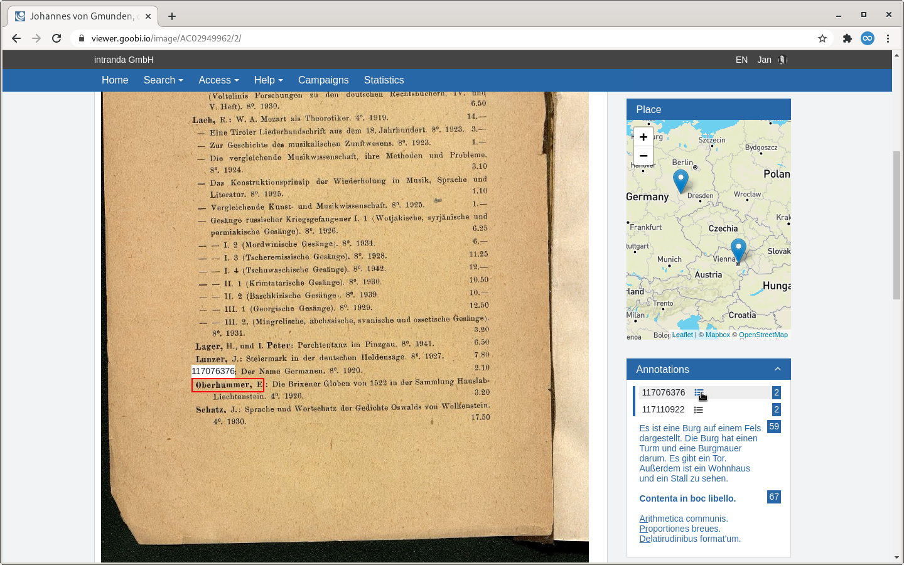
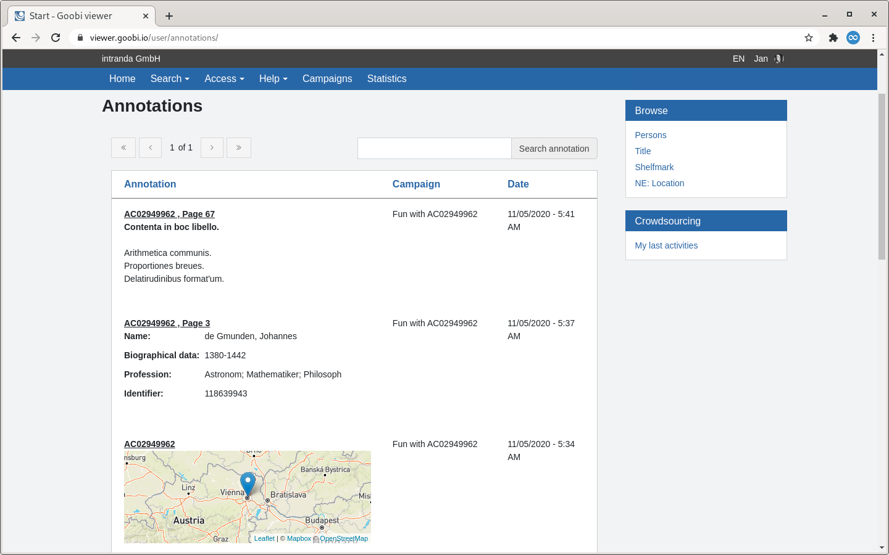
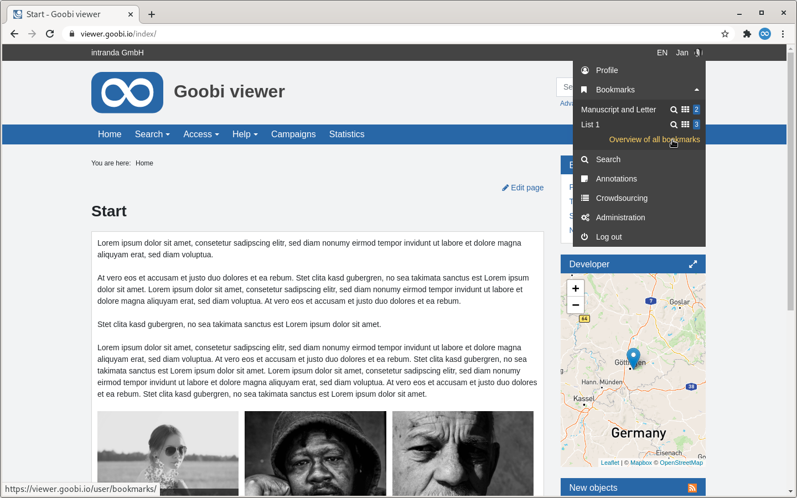

# Oktober

## Coming soon 🚀 

* Anpassungen an den **IIIF** Schnittstellen
* **WCAG**
* Anzeige einer **Tektonik**

## Entwicklungen

### Kampagnen

Die Arbeiten in dieser Version standen vollkommen im Lichte der Crowdsourcing Kampagnen. An vielen Stellen gab es Erweiterungen und Veränderungen. Diese hatten allesamt den Fokus die Funktionalität und die Bedienung für einen eingeschränkten Kreis an Wissenschaftlern intuitiver zu gestalten. Die Änderungen sind in den folgenden Abschnitten erklärt:

#### Backend

Die Seite für die Bearbeitung einer Kampagne wurde in das neue Bedienkonzept überführt. Dabei wurden die im letzten Monat vorgestellten neuen Tabs für die Übersetzungen auf die Kampagnen übernommen. Die Bereiche sind auch visuell besser abgegrenzt. Das Bedienkonzept um eine Kampagne nur für einen Benutzergruppe oder einen dedizierten Zeitraum zur Verfügung zu stellen wurde überarbeitet: In der Mitte sind alle Einstellmöglichkeiten, die die Kampagne im Frontend betreffen. In der Sidebar sind alle weiteren Einstellmöglichkeiten zur Kampagne. Die rechte Sidebar scrollt intelligent mit. Weiter wurden alle Texte der Inline-Hilfe geprüft und teilweise umformuliert um weitergehende Informationen zu liefern.



#### Zugriffslizenz

Für Ergebnisse einer Kampagne kann jetzt im Backend optional eine Zugriffslizenz aktiviert werden. Wenn aktiv, wird der Name der Kampagne als Lizenz geschrieben und die Steuerung des Zugriffs auf die Annotationen erfolgt über die bekannten Bereiche "Zugriffslizenzen" und "Rechte". Dadurch können - wenn eine Kampagne zum Beispiel nur für eine Benutzergruppe freigegeben ist - auch die Ergebnisse nur für diese Benutzergruppe sichtbar gemacht werden.

#### Log

Das neue Log bietet die Möglichkeit innerhalb einer Kampagne und dort innerhalb eines Werkes Nachrichten zu hinterlassen. Damit können zum Beispiel Antworten auf eine Frage weitergehend erläutert werden, oder zwischen verschiedenen Bearbeitern diskutiert werden.

Die Funktionalität ist optional und kann für eine Kampagne im Backend ein- oder ausgeschaltet werden.



#### Fragentypen

Die Fragentypen wurden um zwei weitere Varianten erweitert. So können jetzt formatierte Texte mit einem TinyMCE Editor erstellt werden um zum Beispiel Texte zu transkribieren. Außerdem ist es möglich GND Normdatenidentifier zu erfassen.



#### Annotationen im Werk

Bisher wurden Annotationen im Werk unterhalb des Bildes angezeigt. Dieser Bereich wurde in ein Widget innerhalb der Seitenleiste verschoben. Dadurch ist es schneller möglich ausgewählte Annotationen im Bild zu sehen. Die Funktionalität des neuen Widgets wurde erweitert, so dass jetzt alle Annotationen innerhalb des Werkes angezeigt werden. Vorher waren nur die der aktuellen Seite sichtbar.

Orte werden weiterhin auf einer Karte angezeigt. Für erfasste Normdaten kann das bekannte Popup geöffnet werden. 



#### Annotationen eines Nutzers

Benutzern steht eine neue Übersichtsseite zur Verfügung, die alle selbst erstellten Annotationen auflistet. Dort werden die Annotationen formatiert angezeigt, das bedeutet, dass neben reinem Text auch die erfassten Kartenausschnitte, formatierter Text oder Normdaten eines Identifiers direkt angezeigt werden. Die gleiche Art der Visualisierungen wird auch an anderen Stellen bei denen Annotationen aufgelistet werden verwendet.



#### Annotationen einer Kampagne

Erstmals gibt es auch eine Übersicht aller Annotationen die innerhalb einer Kampagne erstellt wurden. Dafür wird in der Kampagnenübersicht ein neuer Button angezeigt sobald in einer Kampagne mindestens eine Annotation erstellt wurde. Es öffnet sich dann eine tabellarische Übersicht die visuell an den obigen Screenshot angelehnt ist.

### Merklisten

Die Benutzerführung bei den Merklisten von angemeldeten und nicht angemeldeten Benutzern hat sich geändert um hier in Zukunft für mehr Klarheit zu sorgen. Der Bereich "Merklisten" für nicht angemeldete Benutzer wird nun nur noch angezeigt, wenn mindestens ein Werk auf der Merkliste existiert. Damit wird das Prinzip "Zeige nur Bereiche an in denen es mindestens eine Auswahl gibt" auch auf diese Sektion ausgedehnt.

Für Session-Merklisten von nicht angemeldeten Benutzern bleibt alles gleich. Für angemeldete Benutzer ist die Auswahl der vorhandenen Merklisten in das Benutzermenü gewandert und wurde dort mit dem Link zu der Übersicht der Merklisten zusammengeführt.



### Goobi viewer Indexer

Der Goobi viewer Indexer kann nun auch Bounding Box Koordinaten indexieren die im Sexagesimalsystem erfasst wurden. Das Anwendungsszenario in [Kapitel 6.14](https://docs.goobi.io/goobi-viewer-de/6/6.14) innerhalb der Dokumentation wurde entsprechend erweitert.

Eine weitere Entwicklung betrifft die Indexierung von Normdaten. Mit einem neuen Schalter können Normdaten optional mit in das Strukturelement geschrieben werden und nicht mehr verpflichtend in die gruppierten Metadaten. Dies ermöglicht mit entsprechender Konfiguration, dass die Suche nach unterschiedlichen Schreibweisen des selben Ortes immer die gleiche Anzahl von Treffern ausgegeben wird. Siehe dazu auch [Kapitel 3.7.5](https://docs.goobi.io/goobi-viewer-de/3/3.7#3-7-5-parameter-parameter-groupentity) in der Dokumentation.

Zuletzt wurde der Indexer angepasst, um die neuen Annotationstypen korrekt zu erkennen und in Apache Solr zu schreiben.

### Sonstiges

* Wird die CMS-Seite für die Zeitleiste einem Subtheme zugeordnet, so werden die angezeigten Werke auch nur aus dem Subtheme bezogen
* Wird eine Trefferliste nach Erscheinungsdatum sortiert, wird das Datumsfeld nun formatiert angezeigt. Dabei wurde der neue Schalter "millisfield" eingeführt. Siehe dazu auch [Kapitel 2.19.1](https://docs.goobi.io/goobi-viewer-de/2/2.19/2.19.1) in der Dokumentation.
* Die URL zu den gespeicherten Suchen wurde angepasst um diese wie die anderen URLs auch unterhalb des `/user/` Bereiches anzugliedern.
* In dem Goobi viewer Connector hat es kleinere Bugfixes an der OAI Schnittstelle gegeben.

## Versionsnummern

Die Versionen die in der `pom.xml` des Themes eingetragen werden müssen um die in diesem Digest beschriebenen Funktionen zu erhalten lauten:

```markup
<dependency>
    <groupId>io.goobi.viewer</groupId>
    <artifactId>viewer-core</artifactId>
    <version>4.12.0</version>
</dependency>
<dependency>
    <groupId>io.goobi.viewer</groupId>
    <artifactId>viewer-core-config</artifactId>
    <version>4.12.0</version>
</dependency>
```

Der **Goobi viewer Indexer** hat die Versionsnummer **4.12.0**.

Der **Goobi viewer Connector** hat die Versionsnummer **4.12.0**.

Das **Goobi viewer Crowdsourcing Modul** hat die Versionsnummer **4.12.0**

