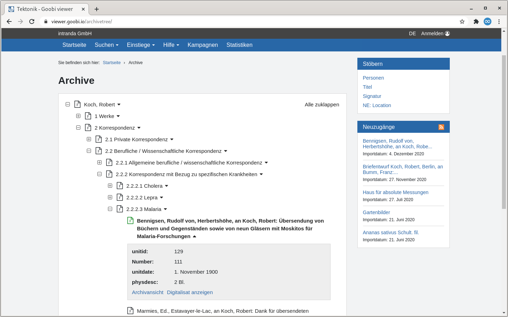
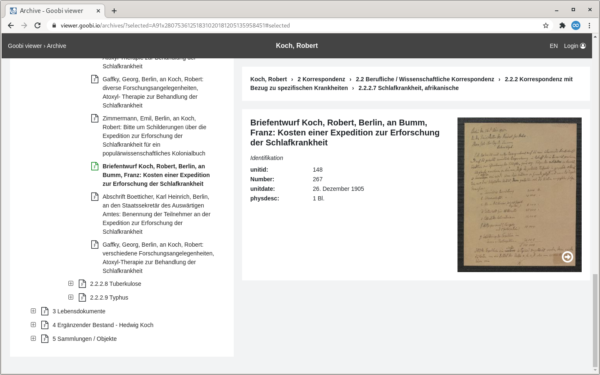
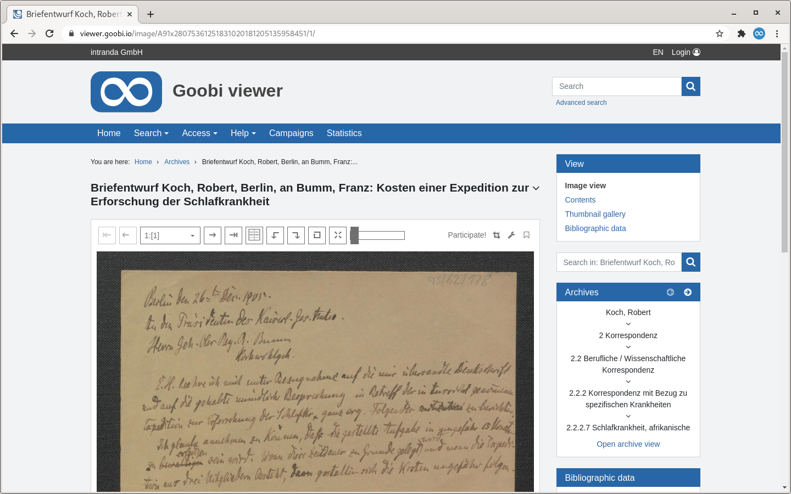
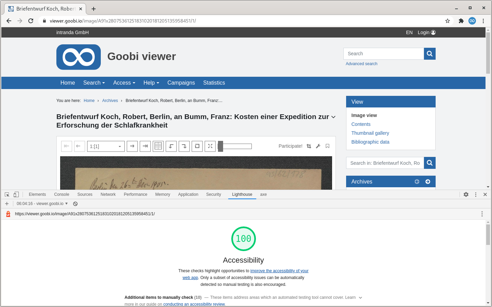

# November

## Coming soon 🚀 

* Anpassungen an den **IIIF** Schnittstellen
* Themes mit **rechts-nach-links** **Leserichtung**
* **werksbasierte Hinweise** mit formatiertem Text

## Ankündigung

Im ersten Quartal 2021 werden umfangreiche Änderungen am Goobi viewer Core vorgenommen. Um eine vollständige Unterstützung der rechts-nach-links Leserichtung auch in Themes zu unterstützen müssen XHTML Strukturen angepasst und CSS Anweisungen auf neuere Konzepte wie zum Beispiel CSS Grid und Flexbox umgestellt werden. Als veraltet geltende Konzepte wie floats werden entfernt. Weiter müssen individuelle Lösungen, zum Beispiel für absolut positionierte Elemente oder Pfeile erarbeitet werden.  
Ein positiver Nebeneffekt ist eine verbesserte Responsivität für mobile Endgeräte.

Diese strukturellen Anpassungen werden sich auf die notwendige Zeit auswirken die ein Theme Update anschließend benötigt.

## Entwicklungen

### Archiv

Der Goobi viewer ist nun in der Lage die mit dem Archiv-Management Plugins in Goobi workflow erstellten Bäume zusammen mit potentiell vorhandenen Digitalisaten anzuzeigen. Dafür wurden zwei neue Bereiche und ein neues Widget entwickelt.

Der erste Bereich zeigt einen Baum innerhalb des Corporate Designs an. Es kann im Bestand navigiert und die Metadaten betrachtet werden. Von dort kann - sofern ein Digitalisat vorliegt - in die Werksanzeige gewechselt werden. Ansonsten steht ein Link zu der Archivansicht zur Verfügung.



Der zweite Bereich ist die dedizierte Archivansicht. Sie erstreckt sich über den kompletten Bildschirm und erlaubt auch eine Suche im Bestand und das Anzeigen von Bildern direkt neben den Metadaten.



Ist für ein digitalisiertes Werk eine Referenz zu einem Archivbestand vorhanden, so wird die Baumstruktur in einem neuen Widget angezeigt. Von hier kann ebenfalls in die Archivansicht gewechselt werden. In der Kopfzeile des Widgets ist das Browsen zu dem nächsten oder vorherigen digitalisierten Werk im Bestand möglich.



### Barrierefreiheit

Der Goobi viewer Core wurde im Kontext Barrierefreiheit umfassend begutachtet und überarbeitet. Dabei wurden die Richtlinien für barriefreie Webinhalte \(Web Content Accessibility Guidelines, kurz WCAG\) in der Version 2.1 in der AA Kompatibilität geprüft. Hierfür wurden die Tools [axe](https://www.deque.com/axe/) und [Lighthouse](https://developers.google.com/web/tools/lighthouse/) verwendet. Alle dort ausgegebenen Anmerkungen wurden entweder korrigiert oder manuell geprüft, um auszuschließen, dass eine Verletzung der Richtlinien vorliegt.

Basierend auf der Ausgabe dieser automatischen Analysetools können wir jetzt mit ruhigem Gewissen sagen, dass die Richtlinien eingehalten werden. Dies ist auch in Hinblick auf die verpflichtende Barrierefreiheit gemäß "Barrierefreie-Informationstechnik-Verordnung \(BITV\) 2.0" relevant.



### CMS

Auf der CMS-Seite für die Suche kann eine Filterquery übergeben werden. Damit kann die Suche auf einen bestimmten Datenbestand eingegrenzt werden. Neu ist, dass wenn diese CMS-Seite einem Subtheme zugewiesen ist, automatisch im Datenbestand des Subthemes gesucht wird. Die Funktionalität wird hier anderen CMS-Seiten angeglichen. Sofern eine zusätzliche Filterquery existiert kann diese bei einem Update entfernt werden.

### Download Widget

Innerhalb eines Werkes können zusätzliche Dateien zum Download angeboten werden. Darin können Dateien jetzt mittels eines regulären Ausdrucks ausgeblendet werden. Das Ausblenden bezieht sich nur auf die Anzeige, der Download bleibt weiterhin möglich.

Siehe dazu auch [Kapitel 2.23](https://docs.goobi.io/goobi-viewer-de/2/2.23) in der Dokumentation.

### Sonstiges

* Auf der Datenschutzseite kann jetzt auch unterhalb des Matomo Opt-Out iframes ein Text angezeigt werden.
* In der Suche ist es möglich die initialen Suchtreffer randomisiert anzuzeigen. Siehe dazu auch [Kapitel 2.17.1](https://docs.goobi.io/goobi-viewer-de/2/2.17/2.17.1) in der Dokumentation
* Der SMTP Port ist bei der Konfiguration für den E-Mailversand ab sofort individuell konfigurierbar. Siehe dazu auch [Kapitel 2.5.2](https://docs.goobi.io/goobi-viewer-de/2/2.5/2.5.2) in der Dokumentation
* Die automatische Konvertierung von Volltextdateien zu UTF-8 kann jetzt optional deaktiviert werden. Siehe dazu auch [Kapitel 3.1.14](https://docs.goobi.io/goobi-viewer-de/3/3.1#3-1-14-parameter-fulltextforceutf8) in der Dokumentation

## Versionsnummern

Die Versionen die in der `pom.xml` des Themes eingetragen werden müssen um die in diesem Digest beschriebenen Funktionen zu erhalten lauten:

```markup
<dependency>
    <groupId>io.goobi.viewer</groupId>
    <artifactId>viewer-core</artifactId>
    <version>4.13.0</version>
</dependency>
<dependency>
    <groupId>io.goobi.viewer</groupId>
    <artifactId>viewer-core-config</artifactId>
    <version>4.13.0</version>
</dependency>
```

Der **Goobi viewer Indexer** hat die Versionsnummer **4.13.0**.

Der **Goobi viewer Connector** hat die Versionsnummer **4.13.0**.

Das **Goobi viewer Crowdsourcing Modul** hat die Versionsnummer **4.13.0**

