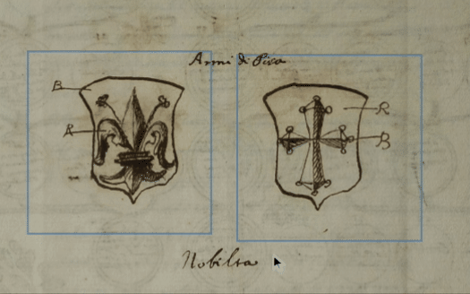
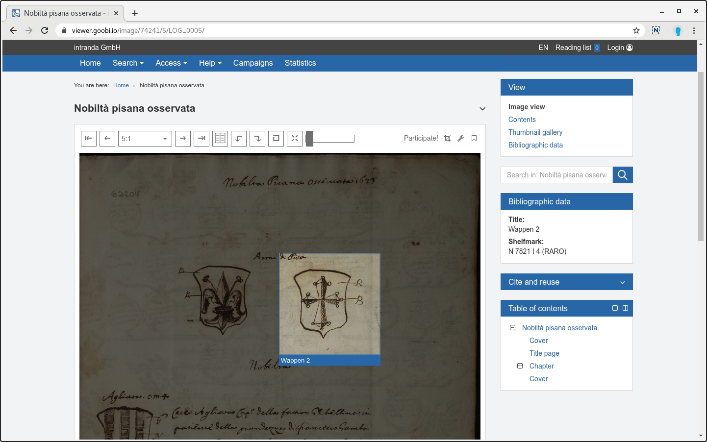
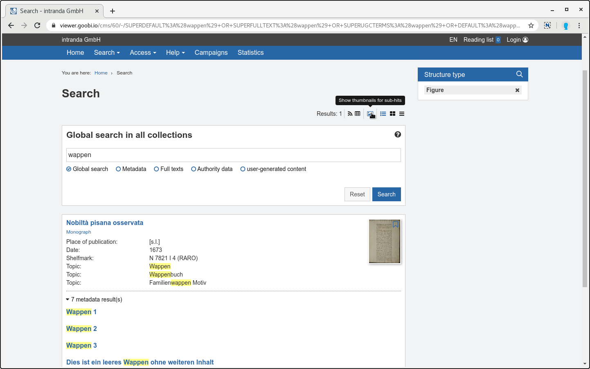
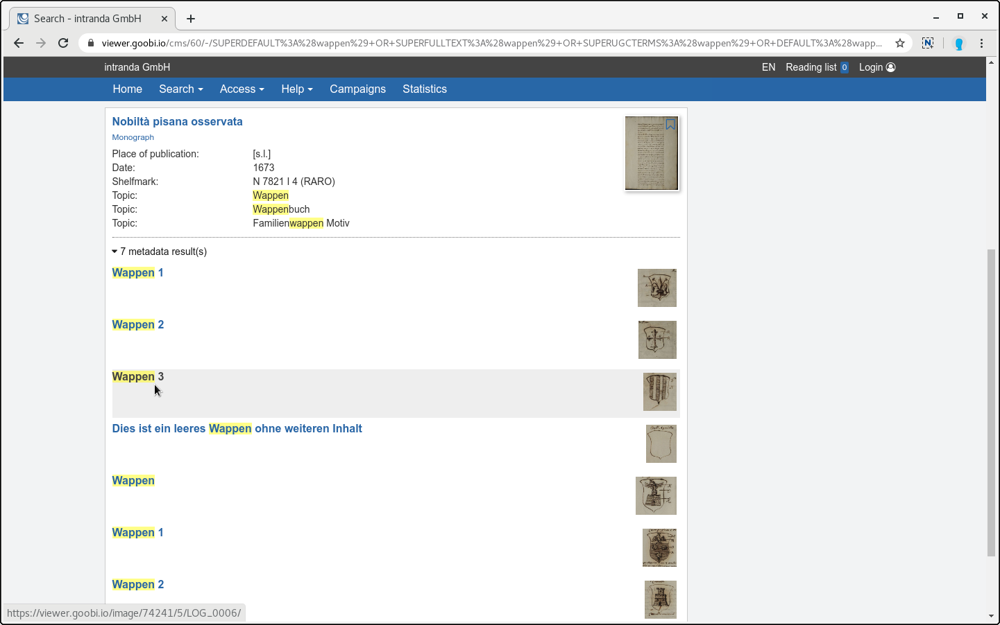
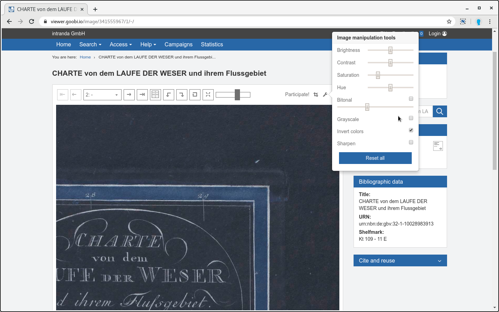

# Februar

## Coming soon

* ⁉ Bedingungen für die **Anzeige von Metadaten**
* \*\*\*\*🔐 **Shibboleth**
* \*\*\*\*🗺 **Karten**

## Aktuelles

Die letzten Wochen hat sich sehr viel getan! Es wurden diverse Goobi viewer Instanzen aktualisiert, dazu zählen unter anderem die Digitalen Sammlungen der Universitätsbibliothek der Humboldt-Universität zu Berlin:



Auch die Digitale Landesbibliothek Berlin wurde auf die neue Codebasis gebracht:



Im Januar ging bereits der Denkmalatlas Niedersachsen Online, herzlichen Glückwunsch zu dem gelungenen Portal:

* [https://denkmalatlas.niedersachsen.de](https://denkmalatlas.niedersachsen.de)

Neben vielen neuen Features die unten vorgestellt werden wurde die Infrastruktur zum Testen des Solr Suchindexes komplett erneuert. Dadurch ist es nun möglich noch viel mehr Anwendungsfälle automatisch zu testen.


Mit dieser Version wird der Upload von DOC, DOCX und HTML Dateien im Backend als deprecated markiert. Die Funktionalität wird mit einem der nächsten Releases entfernt. Mit dem Upload von PDF-Dateien steht eine bessere und verlässlichere Alternative zur Verfügung.


## Entwicklungen

### Metadaten für Bildausschnitte

In dem Goobi workflow Digest für Januar 2020 wurde die Möglichkeit vorgestellt Struktur- und Metadaten für Bildausschnitte zu erfassen. Der Goobi viewer bekommt mit diesem Release die Unterstützung für die Anzeige.

Existieren auf einem Bild ein oder mehrere Strukturelemente werden diese mit einem leichten Rahmen visualisiert. Fährt man mit der Maus darüber, wird der Bereich hervorgehoben und der Titel des Strukturelementes eingeblendet



Wird ein Strukturelement für einen Bildbereich angeklickt, so wird der Bereich hervorgehoben und der Rest des Bildes abgedunkelt. Der Titel des Strukturelementes wird unter dem aktiven Bildausschnitt angezeigt:



### Anzeige von Thumbnails für Untertreffer

Neu ist ebenfalls die Anzeige von Thumbnails für Untertreffer in der Suchtrefferanzeige. Seit der Einführung der aggregierten Suchtrefferanzeige vor einigen Jahren war diese Funktionalität immer mal wieder nachgefragt worden. 

Um die Thumbnails anzuzeigen steht in der Suchtrefferanzeige rechts oben ein neues Icon zur Verfügung, dass die Bilder ein- und ausblendet:





Der folgende Screencast erklärt die beiden genannten Funktionen noch einmal und gibt dazu noch einen Einblick in die Kodierung der Informationen in der METS-Datei:



### Werkzeuge zur Bildmanipulation

In der Bildanzeige und im Vollbildmodus stehen jetzt neue Werkzeuge zur Bildmanipulation zur Verfügung. Über Filter können zum Beispiel die Helligkeit und der Kontrast angepasst, die Farben invertiert oder das angezeigte Bild binarisiert werden.



### Leserichtung: Rechts nach Links

Immer wieder wurde innerhalb der Community das Thema diskutiert, wie eine native User-Experience bei Materialien, die von Rechts nach Links gelesen werden, zur Verfügung gestellt werden kann. Dabei ging es zum Beispiel um Fragen zum [Speichern der Leserichtung in MODS](https://community.goobi.io/t/leserichtung-in-mods-daten-angeben/398) bis hin zu wie sich die Pfeile zum Blättern möglichst nativ verhalten.

Gemeinsam mit Kollegen aus der HLB Fulda, der SUB Göttingen, verschiedenen Max-Planck Instituten in Berlin, Frankfurt und Florenz bis hin zu Muttersprachlern in Israel haben wir gemeinsam eine Lösung entwickelt, die Nutzern, Forschern und Muttersprachlern gleichermaßen eine native Leserichtung ermöglicht.

In dem folgenden Video ist das Ergebnis zu sehen:



Hier geht es zum [selber ausprobieren](https://viewer.goobi.io/image/001935281/1/).

### Rechte bei Lizenzen

Innerhalb der Lizenzen stehen zwei neue Rechte zur Verfügung: 

1. Download von den IIIF Manifesten 
2. Download von Metadaten


Die neuen Rechte werden bei einem Update nicht automatisch hinzugefügt. Bestehende Lizenzkonfigurationen müssen geprüft und die Rechte manuell hinzugefügt werden!


### Erweiterungen im Goobi viewer Indexer

Im Goobi viewer Indexer gab es im letzten Monat drei Entwicklungen:

1. Die Unterstützung für das Format DenkXweb wurde weiter ausgebaut.
2. METS-Dateien mit Strukturelementen die sich auf Bildbereiche beziehen werden nun korrekt erkannt und indexiert. Die Daten werden dabei so im Solr Suchindex abgelegt wie der Goobi viewer Core sie für die Visualisierung benötigt.
3. Bei der Verwendung von DataRepositories in Zusammenspiel mit der `RemainingSpaceStrategy` gab es ein Problem wenn der Goobi viewer Indexer die Daten aus einem in ein anderes Repository verschoben hat. Im Goobi viewer Core wird für einen Datensatz das verwendete DataRepository gecached. Dieser Cache wurde beim Verschieben durch den Indexer nicht aktualisiert. Das führte dazu, dass bei dem verschobenen Datensatz die Bilder erst nach einem Neustart der Applikation wieder sichtbar waren.

Damit der Goobi viewer Core in Zukunft über die Änderung des DataRepositories informiert wird muss in der `solr_indexerconfig.xml` der Token für die WebAPI hinterlegt werden. Siehe dazu auch [Kapitel 3.1.15](https://docs.intranda.com/goobi-viewer-de/3/3.1) und [2.33.3](https://docs.intranda.com/goobi-viewer-de/2/2.33/2.33.3) in der Dokumentation.


```markup
<init>
  <viewerAuthorizationToken>CHANGEME</viewerAuthorizationToken>
</init>
```


### Connector

Der Goobi viewer Connector kann jetzt bei entsprechender Konfiguration das Inhaltsverzeichnis eines Werkes in das DublinCore Feld `dc:description` schreiben. Dafür muss der Connector und der Core mindestens auf die Version 4.4.0 aktualisiert werden.

In der OAI Schnittstelle müssen dafür in der lokalen `config_oai.xml` zwei Dinge sichergestellt sein: 

1. Der Link zu der REST API des Goobi viewer Core muss in  korrekt hinterlegt sein. Über diese URL wird das Inhaltsverzeichnis für den Datensatz vom Goobi viewer abgerufen, siehe [Kapitel 4.1.2](https://docs.intranda.com/goobi-viewer-de/4/4.1/4.1.2) in der Dokumentation. 
2. In der Feldkonfiguration für die DublinCore Datensätze muss das Metadatum mit dem Label `description` mit dem Value `#TOC#` konfiguriert sein. Siehe [Kapitel 4.1.3](https://docs.intranda.com/goobi-viewer-de/4/4.1/4.1.3) in der Dokumentation


```markup
<oai_dc>
  <fields>
    <template name="_DEFAULT">
      <metadata label="description" value="#TOC#" />
    </template>
  </fields>
</oai_dc>
```


## Versionsnummern

Die Versionen die in der `pom.xml` des Themes eingetragen werden müssen um die in diesem Digest beschriebenen Funktionen zu erhalten lauten:

```markup
<dependency>
    <groupId>io.goobi.viewer</groupId>
    <artifactId>viewer-core</artifactId>
    <version>4.4.0</version>
</dependency>
<dependency>
    <groupId>io.goobi.viewer</groupId>
    <artifactId>viewer-core-config</artifactId>
    <version>4.4.0</version>
</dependency>
```

Der **Goobi viewer Indexer** hat die Versionsnummer **4.4.0**.

Der **Goobi viewer Connector** hat die Versionsnummer **4.4.0**.

Das **Goobi viewer Crowdsourcing Modul** hat die Versionsnummer **1.1.10**.

