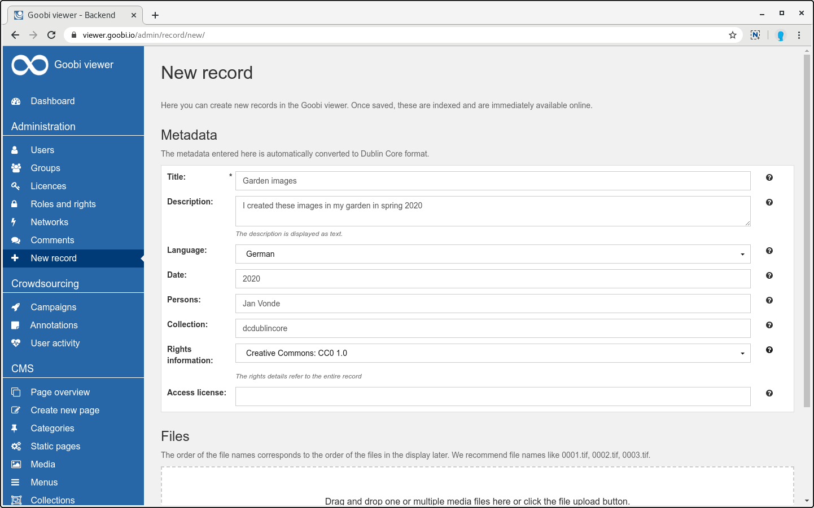
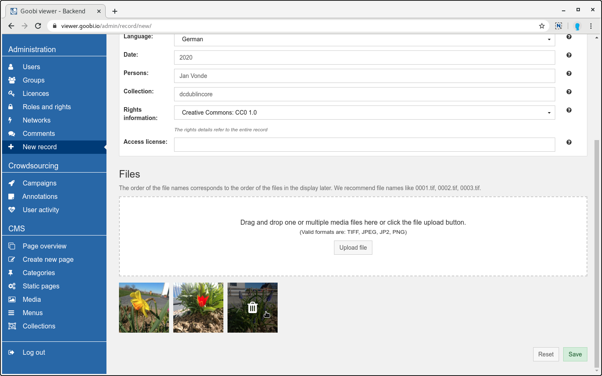
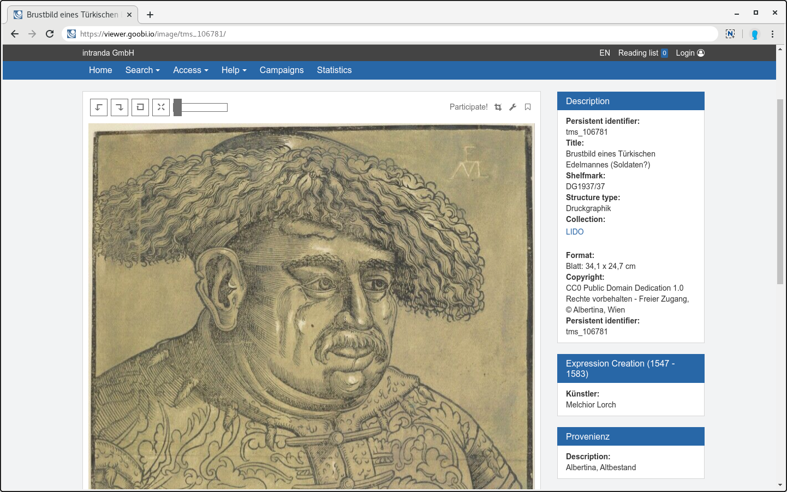

# März

## Coming soon

* 🔐 **Shibboleth**
* \*\*\*\*🗺 **Karten**
* \*\*\*\*🛠 **verbesserte Bedienung im Admin-Backend**

## Aktuelles

Auch im März hat sich trotz vieler Umstände und Veränderungen wieder einiges im Goobi viewer getan. Mehr dazu unten.

 Die Entwicklungen zur Merkliste und den individuellen IIIF Collections aus dem Januar wurden im IIIF Newsletter erwähnt: 




In der kommenden Version wird der Upload von DOC, DOCX und HTML Dateien im Backend entfernt. Mit dem Upload von PDF-Dateien steht eine bessere und verlässlichere Alternative zur Verfügung.


## Entwicklungen

### Dublin Core Datensätze über das Backend anlegen

Bisher hat der Goobi viewer Datensätze im METS/MODS, LIDO und DENKXWEB Format von externen Systemen entgegen genommen um sie zu indexieren und anzuzeigen. Für kleinere Einrichtungen ist das Erstellen der Formate aber eine zusätzliche Hürde. Um diese zu verringern wurde im Goobi viewer Backend ein neues Formular hinzugefügt mit dem Dublin Core Datensätze inklusive dazugehöriger Bilder angelegt werden können. Dafür wurde im Bereich "Administration" die neue Seite "Neuer Datensatz" hinzugefügt:





Das einzige Pflichtmetadatum ist der Titel. Als Identifier wird im Hintergrund automatisch eine UUID generiert. Für Sprach- und Rechteangaben steht ein DropDown Menü mit Werten zur Verfügung. So wird können zum Beispiel valide ISO 639-2b Sprachcodes geschrieben werden ohne diese kennen zu müssen.  Zu allen Feldern steht eine Inline-Hilfe bereit, die optional weitere Hinweise und Beschreibungen anzeigt. Nach dem Speichern werden die Daten automatisch indexiert und sind direkt sichtbar. Es stehen alle bekannten Funktionen wie die Bildanzeige, die Anzeige der Bibliographischen Daten oder die Suche zur Verfügung.

Natürlich ist auch der uneingeschränkte Zugriff auf die IIIF Funktionen möglich. IIIF Presentation Manifeste werden automatisch generiert und die Bilder werden über die IIIF Image API ausgeliefert. Über die integrierten Kampagnen können die Manifeste um Annotationen angereichert und über die Merklisten Funktionalität können die Datensätze zu individuellen IIIF Collections zusammengefasst werden.

Der folgende Screencast zeigt alle diese Funktionen noch einmal komplett:



### Bedingungen für die Anzeige von Metadaten

Der Goobi viewer unterstützt jetzt Bedingungen bei der Anzeige von Metadaten. Der Anwendungsfall der mit der Entwicklung realisiert wurde ist wie folgt: 

Eine Einrichtung digitalisiert zur Bestandserhaltung diverse Werke, die noch unter Copyright sind. Bei der inhaltlichen Erschließung wird angegeben, dass diese Werke als Zugriffsbeschränkung einer Moving Wall unterliegen und erst ab einem definierten Jahr angezeigt werden dürfen. Zu dem Zeitpunkt der automatischen Freischaltung haben die Werke die Lizenz "Public Domain Mark". Diese ist auch bereits in den Metadaten erfasst. 

Jetzt wurde der Goobi viewer aber konfiguriert, dass die Werke die der Moving Wall unterliegen an einem dedizierten Leseplatz PC innerhalb der Einrichtung angezeigt werden dürfen. Dort sollen aber keine falschen Rechteangaben stehen. Aus diesem Grund wurden im Februar bereits die Rechte für die Lizenzen erweitert, so dass der Zugriff auf die IIIF Manifeste und der Download der Metadaten eingeschränkt werden kann. Mit den Bedingungen bei der Anzeige von Metadaten wird dieses Bild nun komplettiert. Es ist ab sofort möglich die Anzeige des Metadatums mit der Lizenz für den Zeitraum der Moving Wall auf dem Leseplatz PC auf einen anderen Wert zu ändern, als bei der inhaltlichen Erschließung erfasst.

Mehr dazu inklusive Beispiel in [Kapitel 2.19.1](https://docs.goobi.io/goobi-viewer-de/2/2.19/2.19.1) in der Dokumentation.

### Separatoren in der erweiterten Suche

Zur besseren Strukturierung der Werte in dem Drop Down Menü innerhalb der erweiterten Suche ist es nun möglich Separatoren zu konfigurieren.

Mehr dazu inklusive Beispiel in [Kapitel 2.17.3](https://docs.goobi.io/goobi-viewer-de/2/2.17/2.17.3) in der Dokumentation.

### LIDO Metadaten und Events in der Seitenleiste

Bisher wurden die Metadaten und Events aus LIDO Datensätzen unterhalb des Bildes in verschiedenen Tabs angezeigt. Zusätzlich gab es in der Seitenleiste das Widget "Bibliographische Daten", dass nur die Metadaten des Haupdatensatzes anzeigen konnte.

Bei LIDO Datensätzen entfällt das Widget "Bibliographische Daten" ab sofort komplett und die Anzeige der LIDO Metadaten und Events wandert in die Seitenleiste. Damit wird die Anzeige der Metadaten über alle unterstützten Formate homogenisiert und rückt mehr in den Fokus. Anstelle von Tabs wird nun pro Event eine eigene Box angezeigt.



### CMS-Template für Stöbern

Es existiert ein neues CMS-Template für die "Stöbern" Funktionalität. Auf der Seite selbst kann in einem DropDown Menü das gewünschte Solr Feld ausgewählt werden. Dieses muss allerdings weiterhin wie in [Kapitel 2.19.8](https://docs.goobi.io/goobi-viewer-de/2/2.19/2.19.8) beschrieben auch in der lokalen Konfigurationsdatei definiert sein.

Wird die CMS-Seite einem Subtheme zugewiesen beziehen sich die ausgegeben Werte nur noch auf das Subtheme. Damit können Partner die sich in einer gemeinsamen Goobi viewer Instanz präsentieren jedoch mit den Subthemes eigene Teilbereiche pflegen das Stöbern nur für ihre eigenen Inhalte anbieten.

### Sonstiges

* Der integrierte **TinyMCE Editor** wurde auf die **Version 5** aktualisiert.
* Die **Bildausschnitt Teilen** Funktion steht jetzt auch in der **Vollbildanzeige** zur Verfügung
* Für die Verwendung des Widgets zur Anzeige von Geokoordinaten kann ein individueller **Mapbox Token** definiert werden
* **Entwickler** können jetzt steuern, ob CMS-Medien auch über die externe IIIF Schnittstelle oder von localhost geladen werden sollen

### Goobi viewer Indexer

#### Indexierung von Dublin Core Datensätzen

Der Goobi viewer Indexer wurde um die Möglichkeit erweitert die im Backend erzeugten Dublin Core Datensätze zu indexieren. Ein so erzeugter Datensatz sieht zum Beispiel so aus:

```markup
<?xml version="1.0" encoding="UTF-8" ?>

<record xmlns:dc="http://purl.org/dc/elements/1.1/">
    <dc:title>Garden images</dc:title>
    <dc:description>I created these images in my garden in spring 2020.</dc:description>
    <dc:language>ger</dc:language>
    <dc:creator>Jan Vonde</dc:creator>
    <dc:identifier>4fda256e-70b3-11ea-b891-08606e6a464a</dc:identifier>
    <dc:subject>dcdublincore</dc:subject>
    <dc:date>2020</dc:date>
    <dc:rights>http://creativecommons.org/publicdomain/zero/1.0/</dc:rights>
    <dc:relation>IMG_20200322_144253.jpg</dc:relation>
    <dc:relation>IMG_20200322_144324.jpg</dc:relation>
    <dc:relation>IMG_20200322_144401.jpg</dc:relation>
</record>
```

Hierfür bitte auch die [Updateanleitung](https://docs.goobi.io/goobi-viewer-de/8/8.1#goobi-viewer-indexer) beachten.

#### Aufwärtsvererbung von Metadaten

Über den neuen Schalter `<addToParents>true</addToParents>` können Metadaten in das Hauptelement verschoben werden.

Zum Hintergrund: In einem Projekt soll pro Vorgang eine zentrale Übersicht aller Personen die innerhalb eines Werkes mitgearbeitet haben angezeigt werden. Diese Personen sind mit ihren dedizierten Rollen auf die verschiedenen Strukturelemente verteilt. Mit dem neuen Schalter können die Personen in ein eigenes Indexfeld im Hauptdokument geschrieben werden und mit dem `topstructValueFallback="true"` Attribut im Core konstant in der Seitenleiste angezeigt werden.

Siehe dazu auch [Kapitel 2.19.4](https://docs.goobi.io/goobi-viewer-de/2/2.19/2.19.4) und [Kapitel 3.7.18](https://docs.goobi.io/goobi-viewer-de/3/3.7#3-7-18-parameter-addtoparents) in der Dokumentation.

#### Boolean ob Datensatz Bilder enthält oder nicht

Der Goobi viewer Indexer schreibt ab der Version 4.5.0 automatisch das Feld `BOOL_IMAGEAVAILABLE`, dass einen Boolean enthält der Anzeigt ob ein Datensatz Bilder hat oder nicht.

### Goobi viewer Connector

Die OBJID in den METS Headerdateien wird nun auch über OAI ausgegeben.

## Versionsnummern

Die Versionen die in der `pom.xml` des Themes eingetragen werden müssen um die in diesem Digest beschriebenen Funktionen zu erhalten lauten:

```markup
<dependency>
    <groupId>io.goobi.viewer</groupId>
    <artifactId>viewer-core</artifactId>
    <version>4.5.0</version>
</dependency>
<dependency>
    <groupId>io.goobi.viewer</groupId>
    <artifactId>viewer-core-config</artifactId>
    <version>4.5.0</version>
</dependency>
```

Der **Goobi viewer Indexer** hat die Versionsnummer **4.5.0**.

Der **Goobi viewer Connector** hat die Versionsnummer **4.5.0**.

Das **Goobi viewer Crowdsourcing Modul** hat die Versionsnummer **1.3.0**.

