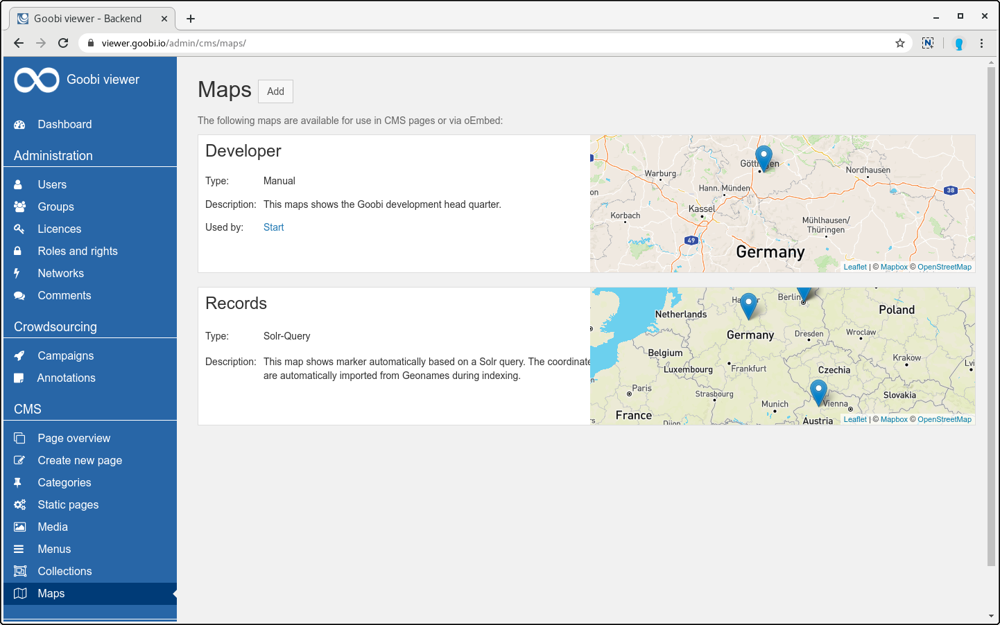
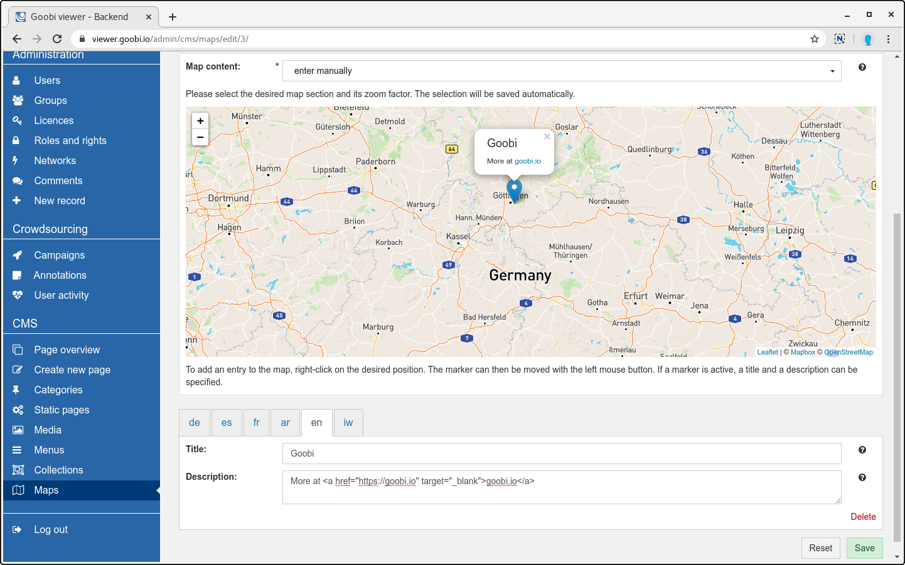
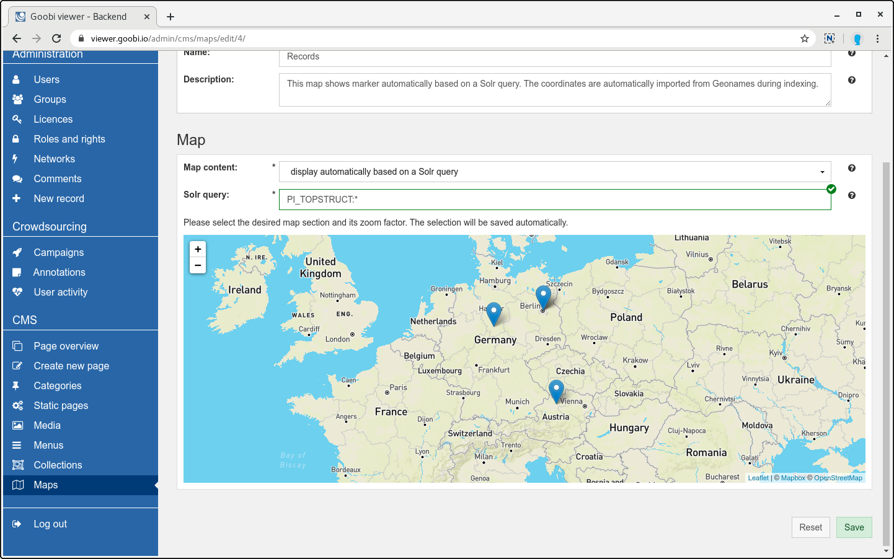
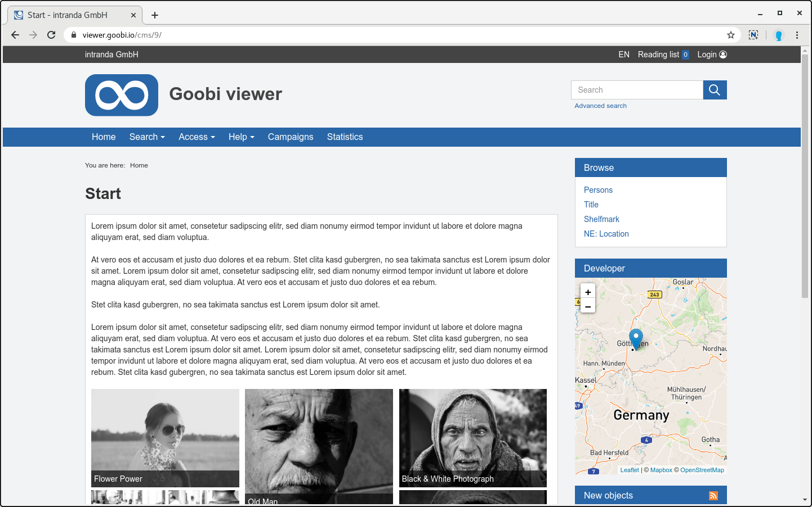
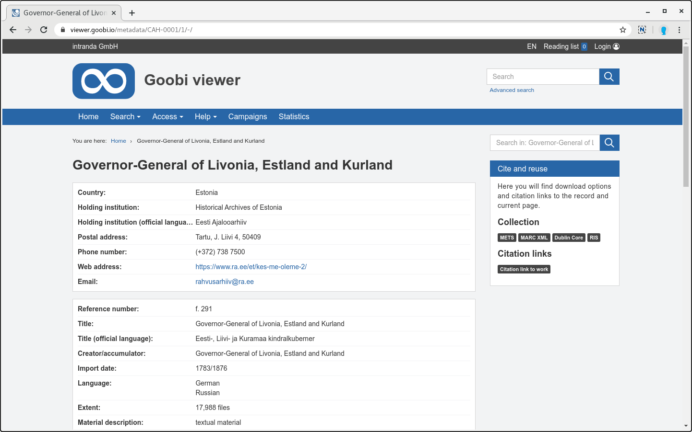
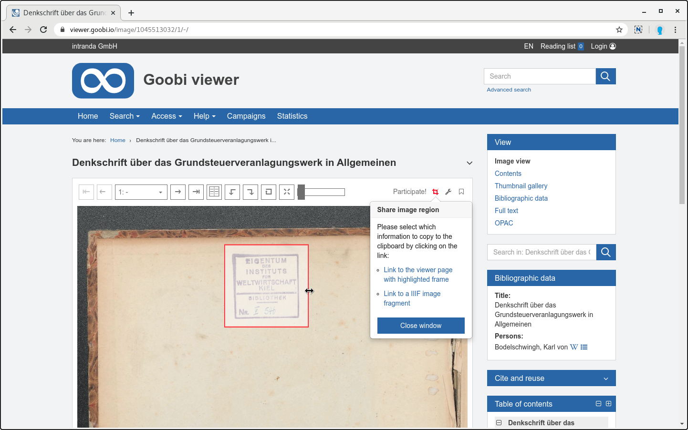
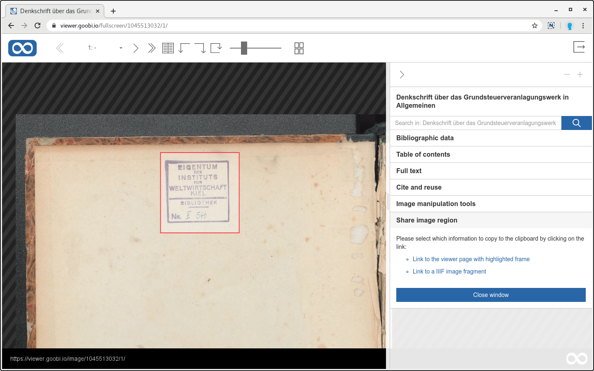
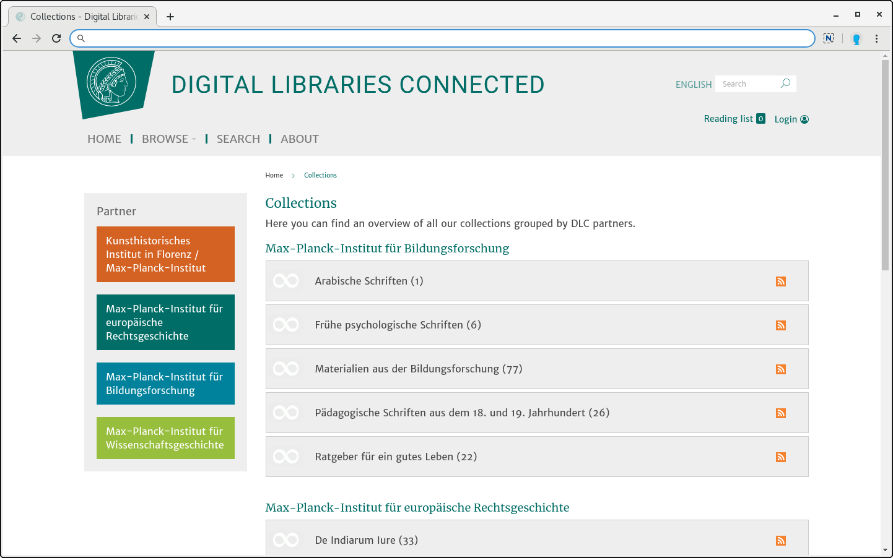
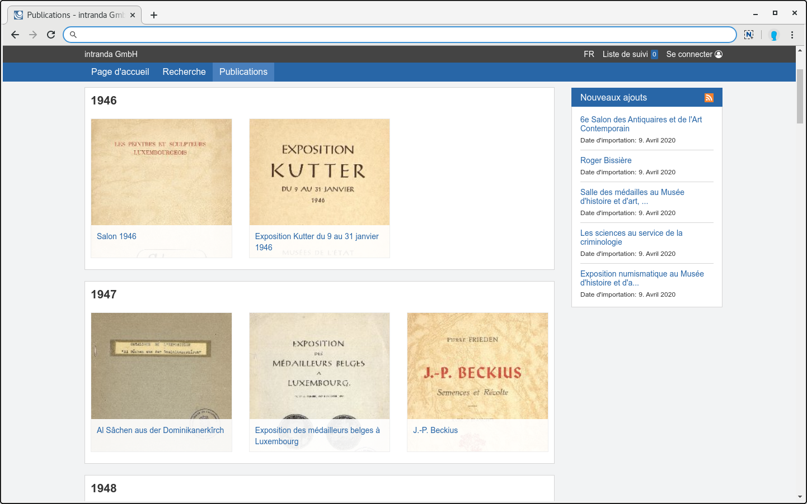

# April

## Coming soon

* \*\*\*\*🗺 **Karten**
* \*\*\*\*🛠 **verbesserte Bedienung im Admin-Backend**
* \*\*\*\*💻 **REST API**

## **Aktuelles**

Diesen Monat gibt es vor allem aus der Entwicklung selbst zu berichten. Die neuen Möglichkeiten mit den Karten sind hier ein echtes Highlight!

Wichtig ist, dass mit dem Update auf die Version 4.6 auch ein Update des Goobi viewer Indexers und die Neuindexierung des Datenbestandes notwendig ist. Im Widget "Zitieren und Nachnutzen" werden ansonsten aufgrund einer veränderten Logik nicht mehr alle Optionen angezeigt.

## **Entwicklungen**

### **Karten**

Im Backend gibt es einen neuen Bereich "Karten". Dort können Karten entweder manuell oder basierend auf einer Solr-Query angelegt und verwaltet werden. Diese stehen anschließend in dem neuen CMS-Template "Text und Karte" oder in allen Templates als Widget in der Seitenleiste zur Verfügung.



Bei der manuellen Definition von Karten können beliebig viele Marker gesetzt werden. Pro Marker kann ein Titel und ein Text eingegeben werden. Neben der Unterstützung der Mehrsprachigkeit kann in dem Text auch HTML verwendet werden, um zum Beispiel Links zu weiteren Seiten zu hinterlegen.



Sofern im Solr Suchindex Werke mit indexierten Koordinaten vorliegen, kann auf dieser Basis ebenfalls eine Karte generiert werden. Dafür wird pro Treffer ein Marker angezeigt. Sind für einen Punkt mehrere Treffer vorhanden, so werden diese automatisch zusammengefasst. 



Mit dem neuen "Karten"-Widget für die Seitenleiste ist das bisherige Widget "Geokoordinaten" komplett entfallen. Eine Migration von bestehenden Konfigurationen zu der neuen Karten-Funktionalität existiert nicht. Sofern das "Geokoordinaten"-Widget in Verwendung war, müssen die konfigurierten Punkte nach einem Update als Karte neu angelegt und mit dem neuen Widget zur Seitenleiste hinzugefügt werden. Da die Verwendung des Geokoordinaten-Widgets mit der manuellen Eingabe von Latitude und Longitude Werte sehr umständlich war, gehen wir davon aus, dass nur _sehr_ wenige Installationen betroffen sind.



### Datensätze ohne Bilder

Die Unterstützung für Werke ohne Bilder und Strukturdaten wurde noch einmal verbessert. Getreu dem Motto "Zeige nur das an was auch Sinn ergibt" wurde das bestehende Verhalten evaluiert und verschiedene Änderungen umgesetzt. 

Bisher wurde zum Beispiel in den Suchtreffern ein Platzhalterbild mit dem Hinweis angezeigt, dass kein Bild geladen werden konnte. In Installationen, in denen nur Datensätze ohne Bilder enthalten sind, ergibt das natürlich keinen Sinn. Anstelle dessen wird nun einfach das Thumbnail für die betreffenden Datensätze komplett ausgeblendet und den daneben liegenden Metadaten mehr Platz eingeräumt.

Wenn keine Bilder vorhanden sind, wurde schon immer die Seite "Bibliographische Daten" aufgerufen. Existiert sonst keine weitere Seite für das komplette Werk, wird hier als Überschrift anstelle von "Bibliographische Daten" ab jetzt der Titel des Werkes angezeigt.



### Stöbern

In der Stöbern Funktionalität konnte bisher nur der indexierte Wert angeboten werden. Bei Metadaten wie Personen- oder Ortsnamen ist das kein Problem. Werden jedoch intern Sprachcodes nach ISO-639-2b wie zum Beispiel `ger`, `eng`, `fre` oder Ländercodes nach ISO-3166-1-alpha2 wie zum Beispiel  `DE`, `EN`, `FR` gespeichert, dann ergab das Stöbern hier wenig Sinn.

Mit dem neuen Attribut `translate="true"` in der Felddefinition für das Stöbern können diese Felder nun übersetzt werden. 


```markup
<metadata>
  <browsingMenu>
    <luceneField translate="true">MD_LANGUAGE</luceneField>
  </browsingMenu>
</metadata>
```


Achtung: Die Übersetzung benötigt Rechenzeit und sollte aus Performancegründen nur bei kleineren Datenmengen, wie den oben angegebenen Normdaten-Beispielen verwendet werden.

### Zitierlinks für Bildausschnitte

Die im Januar vorgestellt Funktionalität der Zitierlinks für Bildausschnitte wurde noch einmal in seiner Bedienung verbessert. Nach dem Aktivieren der Funktionalität über das Icon oberhalb der Bildanzeige werden in dem selben Popover auch die generierten Links angezeigt und können per Klick in die Zwischenablage kopiert werden.

Zusätzlich kann auch die Größe des Rahmens nun bis zum Schließen des Popovers noch verändert werden.



In der Vollbildanzeige ist die Funktionalität nun in der Seitenleiste verfügbar:



### PDF-Dateien

Der Goobi viewer generiert PDF-Dateien "on-the-fly" und greift dafür auf den ContentServer zurück. Schon länger gab es in der Community Kritik, dass die generierten PDF-Dateien schnell sehr groß werden können.

Mit der Version 4.6 verwendet der Goobi viewer eine neue ContentServer Version, die zwei neue, optionale Schalter mitbringt um auf die Größe der generierten PDF Dateien Einfluss zu nehmen:


```text
imageScale="0.5"
imageCompression="50"
```


Mit dem Schalter `imageScale=""` wird angegeben, wie viel das Bild gegenüber seiner Originalgröße skaliert werden soll. Der Schalter `imageCompression=""` definiert wie stark die JPEG Dateien komprimiert werden. Die oben angegebenen Werte sind die neuen Standartwerte.

In Zahlen bedeutet das, dass unser Testwerk mit 120 Bildern und hinterlegtem Volltext vorher 514,3MB und unter der Verwendung der oben angegebenen Schalter nur noch 88,7MB groß ist. 

Die Größe der generierten PDF-Datei konnte um. 83 Prozent reduziert werden!

### Gruppierung von Treffern auf CMS-Seiten

Gemeinsam von zwei Anwendern wurde die Gruppierung von Treffern auf CMS-Seiten beauftragt. Diese neue Funktionalität steht in den CMS-Templates "Text mit Suchtreffern" und "Akkordeon Sammlungsansicht" zur Verfügung. Ist ein Gruppierfeld ausgewählt, werden die Inhalte nach den Werten des Feldes zusammengefasst angezeigt, zum Beispiel nach Jahr oder nach Subtheme. Felder, bei denen mehrere Werte möglich sind, stehen für die Gruppierung nicht zur Verfügung.





### Verbesserte Registrierung von Benutzeraccounts

Anfang Mai wurde in vielen Goobi viewer Installationen die massenhafte automatische Registrierung von SPAM Benutzeraccounts beobachtet. Als kurzfristige Lösung musste der Emailversand im Goobi viewer deaktiviert werden.

Als direkte Konsequenz auf den Vorfall wurden verschiedene Verbesserungen integriert, die die automatische Registrierung in Zukunft verhindern.

Die einzig sichtbare Neuerung ist eine Sicherheitsfrage im Formular für die Benutzerregistrierung. Die Fragen sind bewusst trivial gewählt und können durch einen Menschen sehr einfach beantwortet werden. SPAM Bots scheitern allerdings daran. Ein Vorteil dieser Variante liegt in der Barrierefreiheit: Captchas mit Bildern sind nur dann barrierefrei wenn sie auch als Audiodatei angeboten werden. Auf externe Dienste wollten wir verzichten.

Unsichtbare Neuerungen sind zum Beispiel ein sogenanntes "Honeypot-Feld". Dafür wurde in das Formular ein zusätzliches Feld integriert, dass in der Oberfläche über Styling Anweisungen ausgeblendet ist. Menschen können das Feld also nicht ausfüllen weil sie es nicht sehen. SPAM Bots orientieren sich aber am Seitenquelltext. Wird das Feld also ausgefüllt, muss es sich bei der Registrierung um einen SPAM Bot handeln.  
Zusätzlich wurden im Quelltext weitere Überprüfungen hinzugefügt und Logging ergänzt, das bei der Diagnose Anfang Mai geholfen hätten.

Das Pool an Sicherheitsfragen und dafür erlaubten Antworten kann in der Konfigurationsdatei angepasst werden. Standardmäßig werden drei Fragen und entsprechende Antworten ausgeliefert.  Weitere Vorschläge für entsprechende Fragen und eine Erklärung zur Konfiguration gibt es in der Dokumentation [Kapitel 2.5.3](https://docs.goobi.io/goobi-viewer-de/2/2.5/2.5.3).


### CMS: Verbesserte FAQ Templates

Die CMS Templates zum Erstellen einer FAQ wurden überarbeitet. In FAQ Beiträgen können nun auch Bilder enthalten sein. Die Inline-Hilfe wurde komplett neu geschrieben und das Styling der Seiten wurde verbessert.

### Zeitleiste

Eine der Einstiege in die Inhalte den Datenbestand ist die Zeitleiste. Die Funktionalität war in seiner jetzigen Form in die Jahre gekommen. Die Bedienung war umständlich, die Ladezeiten zu lang und Benutzer wussten auch nicht ob und wenn ja was passiert.

Aus diesem Grund kam der Zeitleiste ein Frühjahrsputz zugute und sie erstrahlt nun in neuem Glanz.. Die technologische Basis ist jetzt modern, die Anzeige deutlich schlanker und Inhalte werden viel schneller angezeigt. Mit der Möglichkeit die maximale Trefferzahl selber festzulegen ist auch eine neue Funktionalität hinzugekommen.

Für die Anpassung des einleitenden Textes steht auch ein neues CMS-Template zur Verfügung.


### Sonstiges

* Eine erste Implementierung für **SAML** ist in den Core eingeflossen und kann als neuer IdentityProvider, zum Beispiel für **Shibboleth** konfiguriert werden. Eventuell sind hier bei der lokalen Inbetriebnahme noch weitere Anpassungen am Code notwendig.
* Es wird nun bei der Anzeige von **Volltexten** unterschieden, ob die Dateien im Textformat oder als HTML vorliegen. **Die Anzeige von HTML wurde optimiert**.
* Im Widget "**Zitieren und Nachnutzen**" wird im dem **Badge für den PDF-Download** nun ein **zusätzliches Icon** angezeigt um diese wichtige Funktionalität schneller visuell zu finden. 
* Im Widget "**Zitieren und Nachnutzen**" wird anstelle der Überschrift "Strukturelement" jetzt der **Name des Strukturelements angezeigt**, also zum Beispiel "Kapitel", "Titelblatt" "Einband" oder "Inhaltsverzeichnis".

### Goobi viewer Indexer

Der Goobi viewer Indexer wurde um die Möglichkeit der Indexierung von Geokoordinaten erweitert. Siehe dazu auch [Kapitel 3.7.19](https://docs.goobi.io/goobi-viewer-de/3/3.7/#3-7-19-parameter-geojsonsource) in der Dokumentation.

## Versionsnummern

Die Versionen die in der `pom.xml` des Themes eingetragen werden müssen um die in diesem Digest beschriebenen Funktionen zu erhalten lauten:

```markup
<dependency>
    <groupId>io.goobi.viewer</groupId>
    <artifactId>viewer-core</artifactId>
    <version>4.6.0</version>
</dependency>
<dependency>
    <groupId>io.goobi.viewer</groupId>
    <artifactId>viewer-core-config</artifactId>
    <version>4.6.2</version>
</dependency>
```

Der **Goobi viewer Indexer** hat die Versionsnummer **4.6.0**.

Der **Goobi viewer Connector** hat die Versionsnummer **4.6.0**.

Das **Goobi viewer Crowdsourcing Modul** hat die Versionsnummer **1.4.0**.

