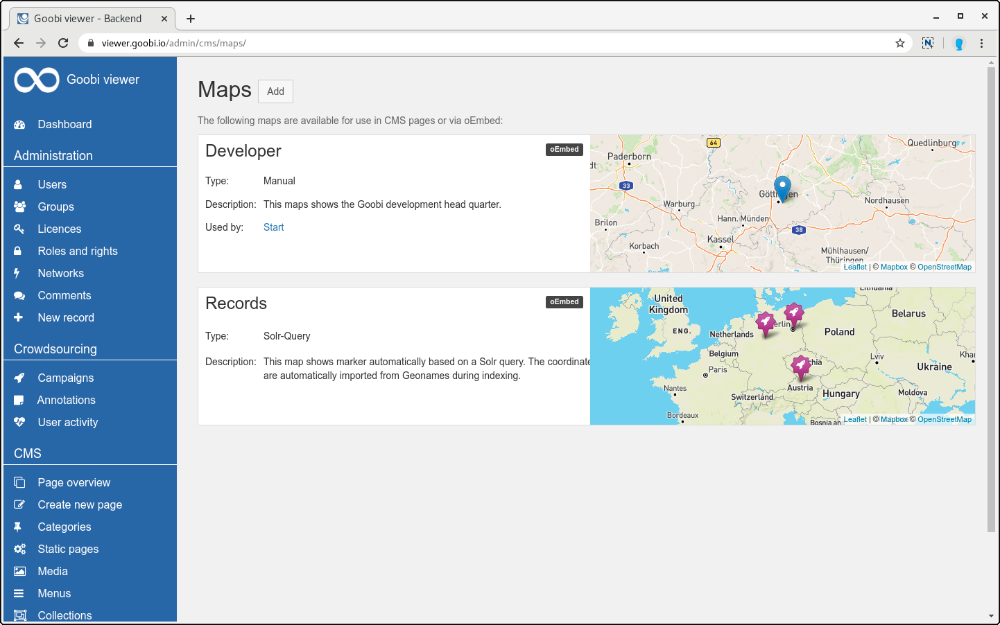
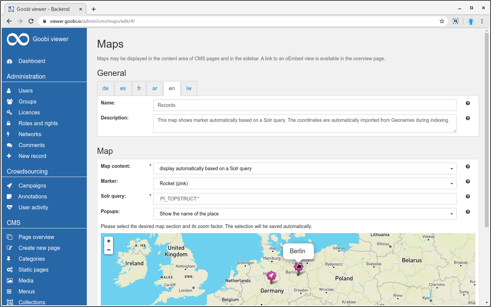
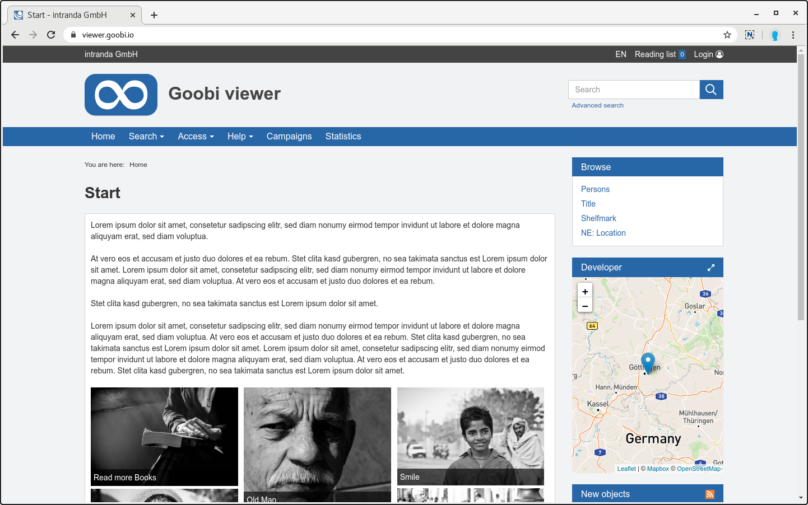
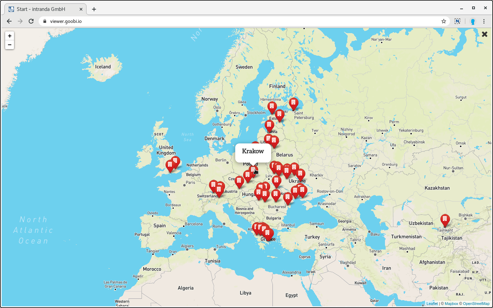
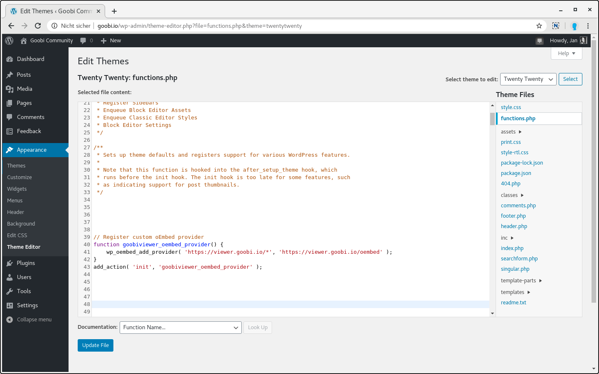
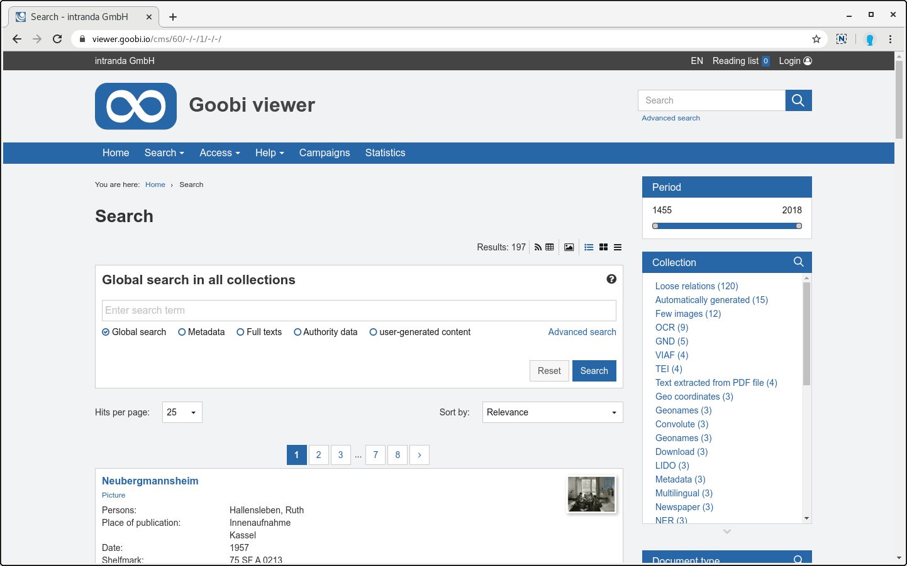
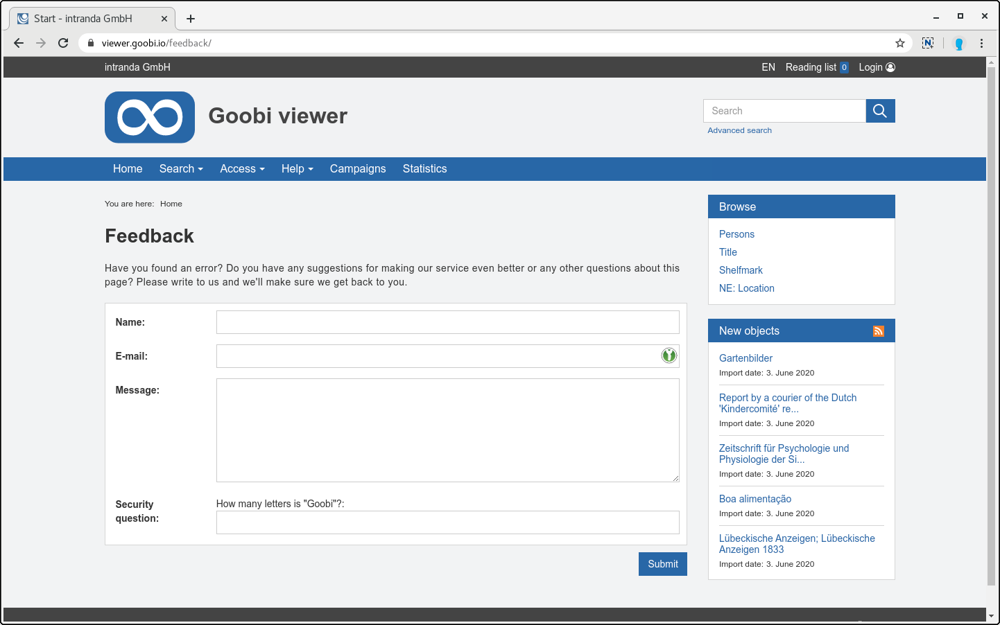

# Mai

## Coming soon

* \*\*\*\*🛠 **verbesserte Bedienung im Admin-Backend**
* \*\*\*\*💻 **REST API**

## Entwicklungen

### Karten

Die im Mai vorgestellte Funktionalität der Karten wird mit diesem Release erweitert. So kann ab sofort das Design der Marker für eine Karte ausgewählt werden. Damit können unterschiedliche Typen von Karten besser visuell voneinander getrennt werden. Die Marker sind konfigurierbar und in der Standard Konfigurationsdatei sind bereits einige Beispiele vordefiniert. Siehe dazu auch [Kapitel 2.36](https://docs.goobi.io/goobi-viewer-de/2/2.36) in der Dokumentation.



Bei Karten, die automatisch auf Basis einer Solr-Query generiert werden, kann jetzt ausgewählt werden was in dem Popup des Markers angezeigt werden soll. Zur Auswahl stehen:

* Kein Popup anzeigen
* Den Namen des angezeigten Ortes
* Den Wert des Metadatums

Diese Differenzierung ist zum Beispiel wichtig, wenn eine Karte mit Einrichtungen gezeigt werden soll, bei dem der Namen der Einrichtung angezeigt wird, und auf einer anderen Karte aber den Namen des Ortes in dem die Einrichtung steht.



Werden Karten in der Seitenleiste angezeigt steht im Titel des Widgets jetzt ein Icon zur Verfügung um die Karte in groß zu betrachten. Sie wird dabei in einem Overlay geöffnet. Das ermöglicht eine bessere Navigation bei vielen Werten.





Die im Backend konfigurierten Karten stehen über einen oEmbed Endpoint zur Verfügung. Damit können die Karten zum Beispiel direkt in eine Wordpress Instanz eingebettet werden. Der Link zu der oEmbed URL wird im Backend in der Kartenübersicht angezeigt.

Wordpress hat eine eingebaute Whitelist an Seiten denen es bei oEmbed mit Rich-Inhalten vertraut. Um eine Goobi viewer Instanz hinzuzufügen genügt es in dem Theme-Editor des Themes in den der `functions.php` die gewünschte Goobi viewer Instanz als oEmbed Provider bekannt zu machen. Dafür kann zum Beispiel dieses Code Snippet verwendet werden:

```php
// Register custom oEmbed provider
function goobiviewer_oembed_provider() {
	wp_oembed_add_provider( 'https://viewer.goobi.io/*', 'https://viewer.goobi.io/oembed' );
}
add_action( 'init', 'goobiviewer_oembed_provider' );
```



### Suche

Im Kontext Suche hat es verschiedene kleinere Anpassungen gegeben.

So ist die Anzahl der Treffer auf der Seite mit den Suchtreffern nun in einem DropDown Menü auswählbar. Bisher wurde der Wert statisch in der Konfigurationsdatei gesetzt. Ab sofort kann dort eine Liste hinterlegt werden aus der der Nutzer dann wählen kann. Die Standardwerte sind `10`, `25`, `50` und `100` Treffer.

Auch bei der Sortierung gibt es zwei kleine Neuerungen. Zum einen ist die standardmäßige Sortierung nach "Relevanz" jetzt auch so benannt und lässt sich nach einem Wechsel auch wieder dorthin zurücksetzen. Zum anderen wird sichergestellt, dass das Feld nachdem sortiert wird auch in den angezeigten Metadaten für das Werk immer sichtbar ist. Es wird angezeigt auch wenn es in der `<searchHitMetadataList />` nicht dafür konfiguriert wurde. Mit dieser Änderung kann die Sortierung  viel schneller verstanden und verglichen werden.

Eher unter der Haube aber wichtig für die Wartbarkeit ist die Homogenisierung des Suchfeldes selbst. Dafür gab es vier unterschiedliche Implementierungen. Diese wurden zusammengeführt und vom Styling angeglichen. Diese Komponente wird ab sofort überall verwendet.



### Feedback

Die im letzten Monat vorgestellte Sicherheitsmechanismus mit den Honeypot Feldern und der Sicherheitsfrage gegen SPAM Bots bei der Registrierung neuer Benutzeraccounts wurde auch in das Feedback Formular integriert. Die reCaptcha Funktionalität wurde dafür an dieser Stelle entfernt. Im gleichen Zuge wurden das Pool der standardmäßig ausgelieferten Fragen erweitert.



### ContentServer

Der intranda ContentServer reicht Bilder im GIF-Format nun direkt durch. Damit ist es ab sofort möglich kleine Animationen im Backend hochzuladen und in CMS zu verwenden.

### Goobi viewer Indexer

Der Goobi viewer Indexer unterstützt die Interpolierung von Jahreszahlen. Siehe dazu auch [Kapitel 3.7.20](https://docs.goobi.io/goobi-viewer-de/3/3.7#3-7-20-parameter-interpolate) in der Dokumentation.

Außerdem wurde die Abhängigkeit von Joda-Time entfernt und durch die native java.time Implementierung ersetzt.

## Versionsnummern

Die Versionen die in der `pom.xml` des Themes eingetragen werden müssen um die in diesem Digest beschriebenen Funktionen zu erhalten lauten:

```markup
<dependency>
    <groupId>io.goobi.viewer</groupId>
    <artifactId>viewer-core</artifactId>
    <version>4.7.0</version>
</dependency>
<dependency>
    <groupId>io.goobi.viewer</groupId>
    <artifactId>viewer-core-config</artifactId>
    <version>4.7.0</version>
</dependency>
```

Der **Goobi viewer Indexer** hat die Versionsnummer **4.7.2**.

Der **Goobi viewer Connector** hat die Versionsnummer **4.7.0**.

Das **Goobi viewer Crowdsourcing Modul** hat die Versionsnummer **1.4.0**.

