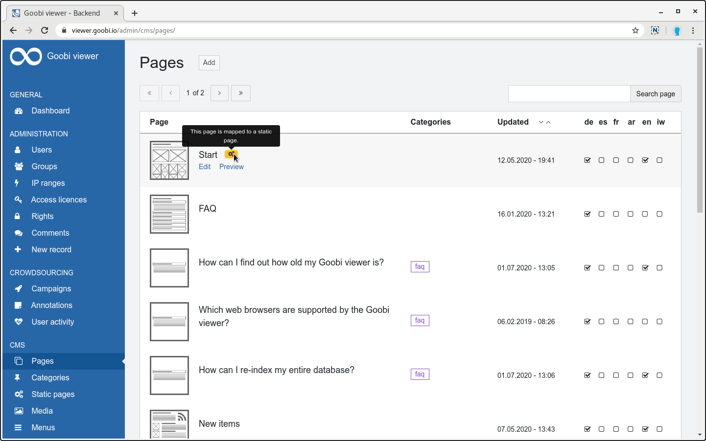

# Juni

## Coming soon 🚀 

* Erweiterung der Crowdsourcing **Kampagnen**
* Anpassungen an den **IIIF** Schnittstellen
* Datensätze ohne Bilder auf den **Merklisten**

## Entwicklungen

### Backend

Vor eineinhalb Jahren haben wir ein neues Designs für das Admin Backend eingeführt. Unser Ziel war es ein über alle Installationen hinweg einheitliches Design zu schaffen um Dokumentation inklusive Screenshots schreiben zu können. Kurze Zeit später mussten wir aber feststellen, dass es mit dem einheitlichen Design nicht getan ist. Bevor wir mit dem Dokumentieren beginnen können, müssen auch die einzelnen Seiten überarbeitet werden um Elemente einheitlich zu positionieren, zu benennen oder die Bedienung dort anzupassen, wo sie nicht intuitiv ist.

Mit der in diesem Monat veröffentlichten Version gehen wir jetzt den nächsten Schritt denn wir haben in den vergangenen Monaten viele Seiten generalüberholt. Dabei wurde ein besonderes Augenmerk auf die Bedienbarkeit gelegt.

Das Bedienkonzept sieht vor, dass Informationen klar gegliedert sind und sich auf den verschiedenen Seiten immer an der gleichen Stelle wieder finden lassen. So sind zum Beispiel die Buttons zum Hinzufügen von neuen Inhalten immer oben rechts neben der Seitenüberschrift. Links zu Anzeigen, Bearbeiten oder Löschen werden erst angezeigt wenn mit der Maus über den Bereich gefahren wird. Die Links werden in Tabellen einheitlich in der ersten Spalte oder alternativ innerhalb der Boxen angezeigt. Für alle Formularelemente steht eine Inline-Hilfe zur Verfügung die bei Bedarf eingeblendet werden kann. Ja/Nein Fragen werden nicht mehr über eine Checkbox, sondern über einen Schalter visualisiert.

Außerdem wurde ein neues URL-Konzept umgesetzt. Die Adressen der einzelnen Seiten sind nun wie im Frontend auch "stateless". Das bedeutet, dass eine URL aus der Adresszeile kopiert und weitergegeben werden kann. Die Umstellung entschärft auch in der Vergangenheit aufgetretene Probleme, wenn mir dem Zurück-Button des Browsers oder mit mehreren gleichzeitig geöffneten Tabs gearbeitet wurde.


Alle überarbeiteten Seiten erfüllen jetzt den **WCAG 2.1** Standard.


Die Anpassungen und Neuerungen der einzelnen Seiten sind in den folgenden Abschnitten beschrieben.

### Administration

#### Dashboard

Wird der Administrationsbereich betreten so begrüßt einen jetzt nicht mehr eine leere Seite, sondern ein gefülltes Dashboard. Angezeigt werden neben einer Begrüßung die zuletzt bearbeiteten CMS-Seiten und die Versionen der installierten Goobi viewer Komponenten. Wenn Piwik / Matomo aktiviert ist kann von dem Dashboard direkt zu dem Matomo Backend gewechselt werden.

Liegen unkonfigurierte Zugriffslizenzen vor wird darauf hingewiesen. Auch die zuletzt exportierten Werke sind vertreten, da die Anzeige für einen Administratoren anders sein kann als für nicht angemeldete Benutzer.


#### Benutzer

Die Tabelle mit den Benutzern zeigt nun das vom Benutzer gewählte Profilbild. Außerdem ist sichtbar ob ein Benutzer Mitglied einer Gruppe ist oder Administratorenrechte besitzt. Dabei folgen die Farben der Badges dem folgenden Schema:

* Schwarz: Der Nutzer ist Mitglied in der angegebenen Gruppen
* Hellblau : Der Nutzer ist Eigentümer der Gruppe
* Rot: Der Nutzer hat Administratorenrechte

Wird ein Benutzer bearbeitet gibt es den neuen Abschnitt "Account löschen". Hier kann ein Administrator einen Account löschen und dabei auswählen, ob potentiell vom Benutzer erstellte Kommentare, Crowdsourcing Inhalte und Annotationen anonymisiert, oder komplett entfernt werden sollen. Ausgenommen sind OCR Korrekturen. Bei der Anonymisierung werden die Daten der Sammel E-Mailadresse `anonymous@goobi.io` zugewiesen. Wenn eine andere Adresse gewünscht wird, kann diese in der lokalen Konfigurationsdatei gesetzt werden. Siehe dazu auch [Kapitel 2.5.3](https://docs.goobi.io/goobi-viewer-de/2/2.5/2.5.3) in der Dokumentation.


#### Gruppen und IP-Bereiche

Benutzergruppen werden jetzt als Kacheln dargestellt. War früher nur der Name und der Eigentümer sichtbar, so wird nun auch die Beschreibung direkt mit angezeigt. Neu ist weiter die Angabe, wie viele Mitglieder eine Gruppe hat.

IP-Bereiche werden analog zu den Gruppen als Kacheln dargestellt.


#### Zugriffslizenzen

Der Bereich "Lizenzen" wurde in "Zugriffslizenzen" umbenannt, um durch eine Schärfung des Begriffes mehr Klarheit über die Funktionalität zu geben. Die Einstellungen in den Zugriffslizenzen steuern den **Zugriff auf Datensätze für nicht angemeldete Benutzer**.

Neben der Umbenennung gab es aber noch weitreichende andere Veränderungen. Die wichtigste ist die Umkehr der Logik bei unkonfigurierten Werten. Bisher wurden Datensätze mit einer Zugriffslizenz angezeigt, bis deren Einschränkung im Backend konfiguriert wurde. Ab sofort sind Datensätze mit einer Zugriffslizenz so lange gesperrt, bis festgelegt wurde, wie sie sich verhalten soll.

Auf nicht konfigurierte Werte wird prominent hingewiesen. Darunter sind die bereits konfigurierten in der bereits vorgestellten Kachelform aufgelistet. Früher wurden nur die zugewiesenen Funktionen aufgelistet. Ab sofort werden auch die nicht zugewiesenen angezeigt, so dass in der Übersicht bereits erfasst werden kann was erlaubt wurde und was nicht. Neu ist auch die Anzeige wie viele Datensätze unter diese Zugriffslizenz fallen. Ein Klick auf diese Zahl führt zu einer Suchetrefferliste, die die zugehörigen Datensätze auflistet.

Für das Zuweisen und Entfernen von Funktionen zu einer Zugriffslizenz wurde das aus Goobi workflow bei der Verwaltung von Benutzergruppen bekannte Bedienkonzept mit farbigen Badges übernommen.


#### Rechte

Diese Seite ist komplett neu. Sie ersetzt die bisherigen Zuweisungsmöglichkeiten in den weggefallenen Reitern auf den Seiten "Benutzer", "Gruppen", "IP-Ranges" und "Lizenzen".

Während eine Zugriffslizenz nur den Zugriff für nicht angemeldete Benutzer steuert können hier jetzt Benutzern, Gruppen und IP-Bereichen weitergehende Funktionen eingeräumt werden. Die Auflistung der vergebenen Rechte erfolgt wieder in Kachelform. Die verwendeten Farben innerhalb der Badges folgen einem Farbkonzept, das auf der Seite selbst erklärt ist.

Im folgenden zwei Beispiele für die Möglichkeiten der Konfiguration:

**Beispiel 1**: Für eine Zugriffslizenz wurde nur die Anzeige von Metadaten konfiguriert, hier kann einem IP-Bereich auch der Zugriff auf die Bilder erlaubt werden.   
**Beispiel 2**: Ein Benutzer soll nur bestimmte Seiten im CMS bearbeiten können

Wenn ein neues Recht hinzugefügt wird müssen zuerst drei Fragen beantwortet werden:

1. Wem ein Recht zugewiesen werden soll. Zur Auswahl stehen Benutzer, Gruppen und IP-Bereiche
2. Der konkrete Eintrag. Zur Auswahl stehen die verfügbaren Werte des zuvor selektierten Typs.
3. Um welche Funktionalität oder welche Zugriffslizenz es sich handelt.

Sind alle drei Fragen beantwortet erscheint eine Box mit Informationen zu dem ausgewählten Werten.

Sofern eine weitere Konfigurationsmöglichkeit existiert wird auch die Box "Funktionen" angezeigt in der die zusätzlichen Rechte konfiguriert werden können. Das kann entweder die Freischaltung weiterer Funktionen für eine Zugriffslizenz oder die Freischaltung von bestimmten Bereichen im CMS sein.


### CMS

#### Seiten

Auch bei den CMS-Seiten gibt es Neuerungen. Der Link "Neue Seite anlegen" ist aus der Seitenleiste verschwunden und befindet sich nun als Hinzufügen Button oben rechts neben der Seitenüberschrift.

Die Tabelle mit der Auflistung der bereits existierenden CMS-Seiten wurde ebenfalls überarbeitet. Neben der Neustrukturierung der Inhalte wurden zwei weitere Informationen hinzugefügt: 

1. Wenn eine CMS-Seite auf eine statische Seite gemappt wurde, dann wird es mit einem orangenen Badge visualisiert
2. Wenn eine CMS-Seite einem Subtheme zugeordnet ist, wird das gewählte Subtheme aufgelistet

Beim Hinzufügen einer neuen Seite ist die Liste der verfügbaren CMS-Templates über die Jahre stets gewachsen. Damit wurde sie auch unübersichtlicher. Deswegen besteht ab sofort für Administratoren die Möglichkeit diese Liste zu verwalten. Dafür gibt es am Ende der Seite den Link "Angezeigte Templates verwalten". Dort können die Templates für die Anzeige aktiviert oder deaktiviert werden können.



#### Kategorien

Die Kategorien werden jetzt auch als Badge visualisiert. Der lila Farbton zieht sich dabei konsequent durch alle Bereiche, in denen Kategorien verwendet werden. 

#### Statische Seiten

Bisher wurden auf der Seite "Statische Seiten" die Einträge mit überschreibender CMS-Seite oben und die ohne Zuweisung darunter angezeigt. Diese Logik wurde geändert und die Einträge haben jetzt eine feste Reihenfolge. Dadurch entfällt das Suchen eines Eintrages in der Tabelle, da sie nun immer an der gleichen Stelle sind.

### REST API

Komplett neu ist auch die überarbeitete REST API. Sie wurde im OpenAPI Standard dokumentiert und kann über Swagger-UI entdeckt werden. Dort werden die einzelnen REST Endpoints auflistet und beschrieben. Diese Seite ist unter der folgenden URL zu finden:

* [https://viewer.example.org/api/swagger/](https://viewer.example.org/api/swagger/)

Ebenfalls neu ist, dass die REST API jetzt einer Versionierung unterliegt. Damit kann bei notwendigen, nicht abwärtskompatiblen Änderungen die Versionsnummer erhöht werden und Applikationen die gegen die API entwickelt wurden gehen nicht kaputt. In dem neuen Endpoint `/index/stream` kann direkt mit Solr Streaming Expressions gearbeitet werden. Weiter wurde die Testabdeckung der REST API signifikant erhöht.


### Under the hood

Auch unter der Haube gab es auch entscheidende Änderungen. Zum Einen wurde das Bootstrap Framework im Goobi viewer Core auf die Version 4 aktualisiert. Diese Änderung bedeutet, dass standardmäßig modernere Stylinganweisungen im Browser verwendet werden.

Zum Anderen wurde der verwendete Solr Suchindex auf die Version 8 gehoben. Bisher wurde die Version 4 eingesetzt. Da Solr eine Migration über mehr als zwei Major Versionen offiziell nicht unterstützt \([Hintergrund](https://issues.apache.org/jira/browse/LUCENE-9127)\) wurde der Goobi viewer Indexer erweitert, um bei der Neuindexierung des Datenbestandes in Solr 8 die notwendigen Informationen automatisch aus dem alten Index abzufragen und in den neuen mit zu übernehmen.

Siehe dazu auch die [Core Changelog für die Version 4.8.0](https://docs.goobi.io/goobi-viewer-de/8/8.1#4-8-0).

### Sonstiges

* Für das Stöbern wurde ein neuer Konfigurationsschalter eingeführt, bei dem führende Zeichen bei der Sortierung ignoriert werden sollen. Siehe auch [Kapitel 2.19.8](https://docs.goobi.io/goobi-viewer-de/2/2.19/2.19.8) in der Dokumentation.
* Der Modus `dcList` in der Blacklist für Kollektionen wurde entfernt.

### Goobi viewer Indexer

Der Goobi viewer Indexer wurde auf die Kompatibilität mit Solr 8 angepasst und um die Möglichkeit erweitert relevante Daten aus einem Solr Index in einen anderen zu übernehmen. Siehe dazu auch [Kapitel 3.1.4](https://docs.goobi.io/goobi-viewer-de/3/3.1#3-1-4-parameter-oldsolrurl) in der Dokumentation.

### Goobi viewer Connector

Der Goobi viewer Connector wurde auf die Kompatibilität mit Solr 8 angepasst.

## Versionsnummern

Die Versionen die in der `pom.xml` des Themes eingetragen werden müssen um die in diesem Digest beschriebenen Funktionen zu erhalten lauten:

```markup
<dependency>
    <groupId>io.goobi.viewer</groupId>
    <artifactId>viewer-core</artifactId>
    <version>4.8.0</version>
</dependency>
<dependency>
    <groupId>io.goobi.viewer</groupId>
    <artifactId>viewer-core-config</artifactId>
    <version>4.8.1</version>
</dependency>
```

Der **Goobi viewer Indexer** hat die Versionsnummer **4.8.2**.

Der **Goobi viewer Connector** hat die Versionsnummer **4.8.2**.

Das **Goobi viewer Crowdsourcing Modul** hat die Versionsnummer **1.5.0**.


