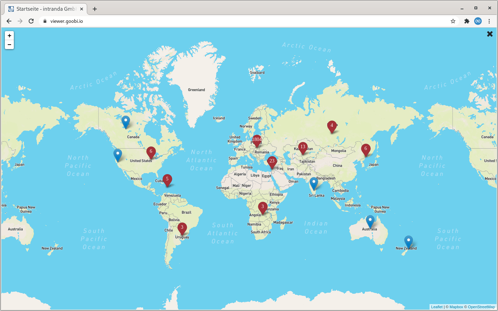
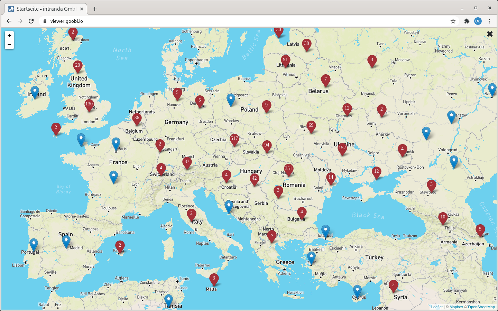
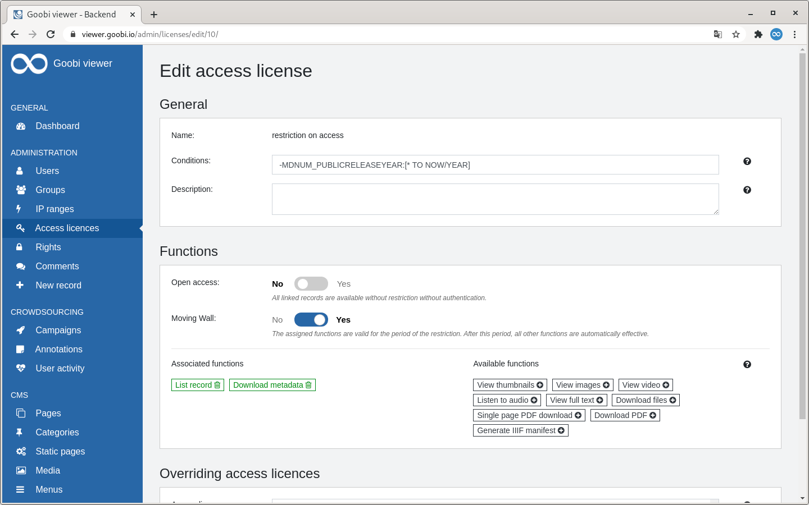
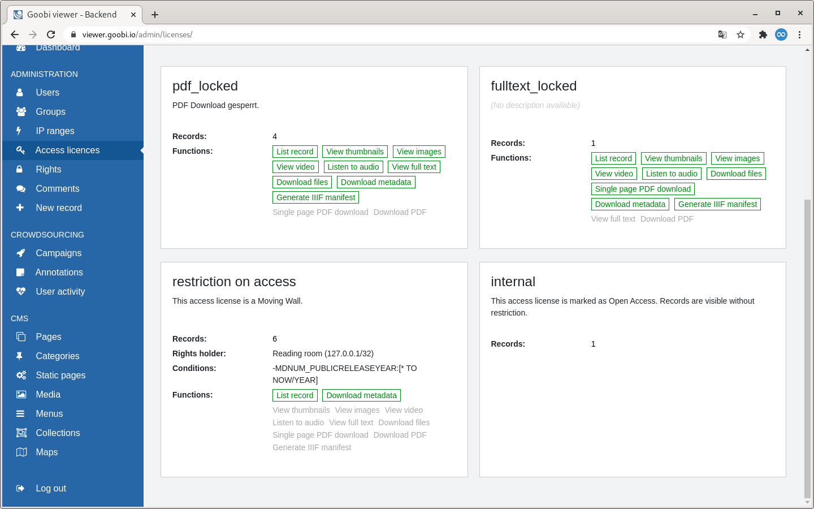
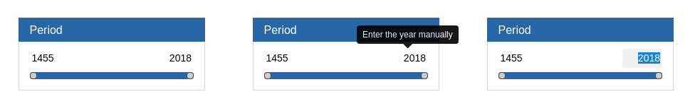

# Juli

## Coming soon 🚀 

* Erweiterung der Crowdsourcing **Kampagnen**
* Anpassungen an den **IIIF** Schnittstellen
* Datensätze ohne Bilder auf den **Merklisten**

## Ankündigung

In den Monaten August und September wird das Goobi viewer Team aufgrund von Elternzeit und Jahresurlauben nur eingeschränkt zur Verfügung stehen.

## Entwicklungen

### Karten

Die im April und Mai vorgestellte Kartenfunktionalität wurde um ein Clustering von Markern erweitert. Ab einigen hundert Punkten auf einer Karte brach die Performance ein. 

Bei dem Clustering werden nah beieinander liegende Punkte aggregiert angezeigt. Wird dann in den Kartenbereich hinein gezoomt, teilen sich die Marker automatisch auf die einzelnen Positionen auf. Durch diesen Mechanismus können jetzt auch mehrere tausend Punkte schnell und zuverlässig dargestellt werden.





### Backend

An dem im letzten Monat vorgestellten Entwicklungen am Backend gab es kleinere Änderungen die das Bild insgesamt weiter abrunden. So wurde zum Beispiel der Toggle Schalter für Ja/Nein Fragen umgedreht, um der allgemeinen Konvention zu folgen, dass Nein links und Ja rechts steht.

Wenn für eine Zugriffslizenz ein Recht konfiguriert wurde, dann wird dieser Rechtenehmer auf der Seite Zugriffslizenzen mit angezeigt.

Die Suchfunktion auf den Seiten "Benutzer" und "Seiten" wurde erweitert. Bei den Benutzern kann jetzt zusätzlich nach der Gruppenzugehörigkeit gesucht werden. Bei den CMS-Seiten wird neben dem Titel auch in den zugewiesenen Kategorien oder Subtheme gefiltert.





### Facettierung

Bisher wurde in dem Widget für die Facettierung über einen Zeitraum das Start- und Endjahr ausschließlich über den Slider festgelegt. Ab diesem Release können die Jahreszahlen alternativ über die Tastatur eingegeben werden. Dafür kann die Jahreszahl im Widget angeklickt und bearbeitet werden. Die Einstellungen werden mit Enter übernommen.



### Stöbern

Die Stöbern Funktionalität ist sehr komplex und die Anforderungen daran sind sehr unterschiedlich. Bei einem Titelindex sollen vielleicht nur die Titel von Werken aufgelistet und dabei ein Sortierfeld bedacht werden. Bei einem Personenindex wiederum sollen auch die erfassten Werte aus Strukturelementen mit enthalten sein. Und natürlich müssen eventuelle Zugriffslizenzen bedacht werden. Und das ganze soll auch bei ~75.000 Werten mit ~25.000 einzelnen Einträgen \(Peter Müller hat 1358 Einträge, Christian Wagner nur 2\) noch schnell funktionieren. Diese Aufgabe ist sehr komplex und erfordert viel Zeit um zufriedenstellende Lösungen zu erarbeiten.

Mit diesem Release wurde die Performance der Stöbern Funktionalität verbessert. Der Schalter `docstructFilters` ist entfallen und wird durch `filterQuery` ersetzt. Neu ist der Schalter `alwaysApplyFilter="true"` mit dem beim Aufrufen der Stöbern Funktionalität nicht eine Liste mit allen Werten generiert, sondern automatisch auf den ersten Buchstaben oder die erste Zahl facettiert wird.

### Cookies etc.

Immer wieder werden wir gefragt ob der Goobi viewer Cookies verwendet und welche Daten darin gespeichert werden. Die Antwort darauf lautete immer, dass der Goobi viewer selbst _keine_ Cookies speichert. In einer modernen Welt gibt es aber noch viel mehr Möglichkeiten um Daten zu speichern und das nutzt auch der Goobi viewer. Um diese Frage jedoch gut beantworten zu können haben wir verschiedene Umstellungen vorgenommen.

Ab sofort können wir mit ruhigem Gewissen sagen: "Alle automatisch vom Goobi viewer zur Bereitstellung der Funktionalität erstellten Daten werden mit Ablauf der Session wieder gelöscht."

Technisch gesehen gibt es einen Cookie. Der wird automatisch vom Tomcat Application Server generiert. In dem Cookie ist nur eine temporäre Zeichenfolge, die JSESSIONID gespeichert. Diese Session wird serverseitig beim Aufruf des Goobi viewers erzeugt und speichert Informationen wie die gewählte Sprache in der Benutzeroberfläche oder ob sich ein Nutzer angemeldet hat. Die Session wird nach 30 Minuten Inaktivität automatisch gelöscht. Der Goobi viewer speichert darüber Hinaus weitere Daten. Dies geschieht allerdings in der Browsersession. Also auf dem Computer des Nutzers und nicht auf dem Server. Die hier gespeicherten Informationen sind zum Beispiel, welche Ansicht für die Suchtreffer gewählt wurde \(Details, Liste, Thumbnails\) oder welche Zoomstufe und Position ein Bild hat, damit diese Information beim Blättern beibehalten werden kann.

An dieser Stelle hat es nun eine entscheidende Änderung gegeben. Der Browser bietet nämlich verschiedene Möglichkeiten diese Informationen zu Speichern. Früher haben wir dafür den sogenannten "Local Storage" verwendet. Seit einiger Zeit wird vermehrt mit dem "Session Storage" gearbeitet. Mit diesem Release wurde die Verwendung des "Local Storage" abgeschafft und alle Informationen werden ausschließlich im Session Storage verwaltet. Dieser Storage wird beim Schließen des Tabs oder beim Schließen des Browser Fensters automatisch gelöscht.

### Sonstiges

* Die REST API hat einen neuen Endpoint um unabhängig vom Dateinamen auf den Repräsentanten eines Werkes zugreifen zu können. Hier eine Beispiel-URL: [https://viewer.goobi.io/api/v1/records/1045513032/representative/full/!400,400/0/default.jpg](https://viewer.goobi.io/api/v1/records/1045513032/representative/full/!400,400/0/default.jpg)
* Die Anzeige des Inhaltsverzeichnis in der Seitenleiste der Vollbildanzeige ist nun separat steuerbar. Siehe dazu auch [Kapitel 2.20.2](https://docs.goobi.io/goobi-viewer-de/2/2.20/2.20.2) in der Dokumentation. 
* Der PDF-Download über den ausgelagerten TaskManager wurde aktualisiert und kann nun auch die neusten Schalter zur Komprimierung und Skalierung des ContentServers verwenden. Weiter wurde ein Fehler bei der Generierung von epub Dateien behoben.
* Werden über die Sammlungsübersicht die in einer Sammlung enthaltenen Werke angezeigt, dann entspricht das einer internen Suche. Mit diesem Release wird das nun auch in der URL so gezeigt und der Infix `/browse/` wurde durch `/search/` ersetzt. Damit ist es nun möglich individuelle Suchseiten auch bei den Sammlungen zu verwenden.
* Die Installationsanleitung wurde auf die Verwendung von Ubuntu Linux 20.04 aktualisiert.

### Goobi viewer Connector

Bei der Ausgabe von Dublin Core Datensätzen kann jetzt die Ausgabe des `<dc:rights />` Elements in Abhängigkeit der in dem Feld `ACCESSCONDITION` indexierten Werte individuell konfiguriert werden.  Siehe dazu auch [Kapitel 4.13](https://docs.goobi.io/goobi-viewer-de/4/4.1/4.1.3) in der Dokumentation.

## Versionsnummern

Die Versionen die in der `pom.xml` des Themes eingetragen werden müssen um die in diesem Digest beschriebenen Funktionen zu erhalten lauten:

```markup
<dependency>
    <groupId>io.goobi.viewer</groupId>
    <artifactId>viewer-core</artifactId>
    <version>4.9.2</version>
</dependency>
<dependency>
    <groupId>io.goobi.viewer</groupId>
    <artifactId>viewer-core-config</artifactId>
    <version>4.9.0</version>
</dependency>
```

Der **Goobi viewer Indexer** hat die Versionsnummer **4.9.0**.

Der **Goobi viewer Connector** hat die Versionsnummer **4.9.0**.

Das **Goobi viewer Crowdsourcing Modul** hat die Versionsnummer **1.5.0**.


