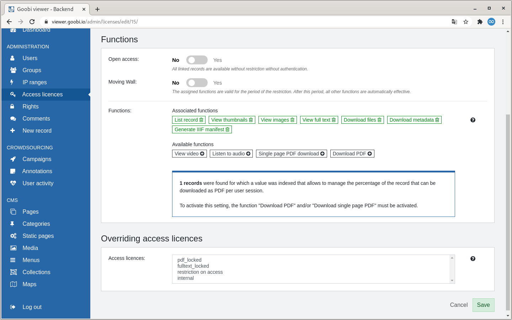
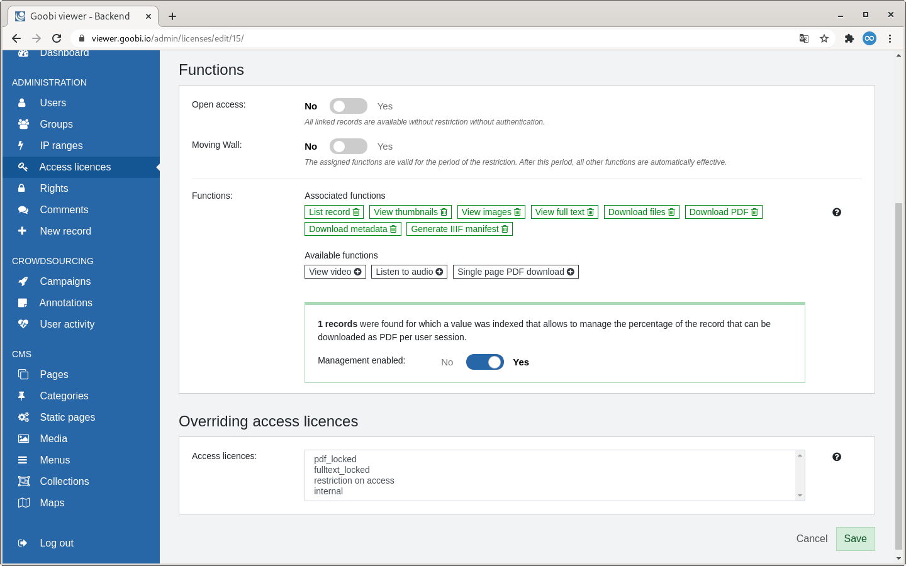
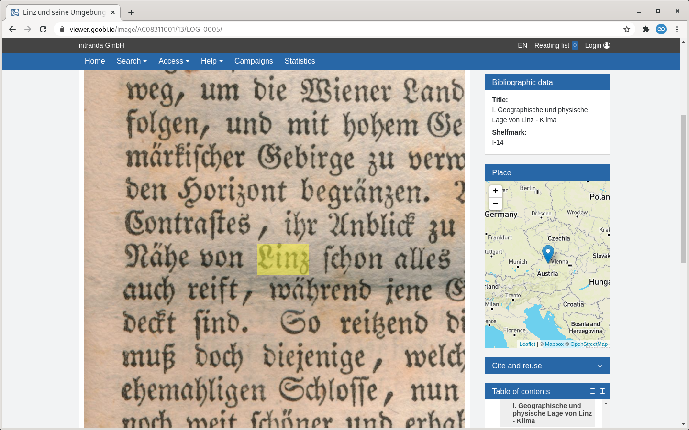
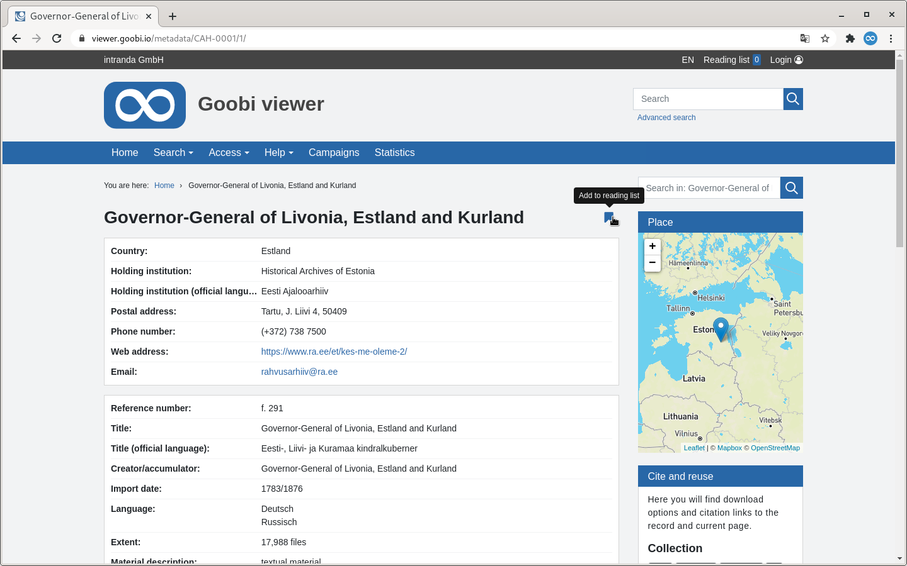

# August

## Coming soon 🚀 

* Erweiterung der Crowdsourcing **Kampagnen**
* Anpassungen an den **IIIF** Schnittstellen
* Datensätze ohne Bilder auf den **Merklisten**

## Ankündigung

In dem Monat September wird das Goobi viewer Team aufgrund von Elternzeit und Jahresurlauben nur eingeschränkt zur Verfügung stehen.

## Entwicklungen

### Erweiterte PDF-Download Zugriffsbeschränkung

Schon länger kann der Goobi viewer die Funktionen für den PDF-Download über Zugriffsbeschränkungen steuern. Bisher gab es drei Möglichkeiten: 

1. Den PDF-Download komplett zu unterbinden
2. Den PDF-Download zusammen mit einer Bedingung auf bestimmte Strukturelemente einzuschränken
3. Nur das Herunterladen von Einzelseiten-PDF zu gestatten

Ab sofort besteht zusätzlich die Möglichkeit den PDF-Download auf einen prozentualen Anteil des Werkes zu beschränken. Die genaue Zahl muss dabei in den Metadaten des Werkes hinterlegt und in dem Feld `ACCESSCONDITION_PDF_PERCENTAGE_QUOTA` indexiert sein. Damit können Anwendungsszenarien realisiert werden, die innerhalb einer Nutzersession den Download auf beispielsweise 10% des Werkes einschränken. Wird versucht mehr herunterzuladen bekommt der Nutzer eine Fehlermeldung.





### Karten

Wenn für ein Werk indexierte Geokoordinaten vorliegen werden diese in der Werksansicht automatisch in einem Widget mit einer Karte in der Seitenleiste dargestellt.



### Merklisten

Datensätze ohne Bilder können jetzt wieder auf Merklisten gespeichert werden. Dies war mit der Vorstellung der erweiterten Unterstützung für Datensätze ohne Bilder im April weggefallen. Die Funktionalität stehe jetzt an der bekannten Stelle in der Suchtrefferliste zur Verfügung. Zusätzlich wird sie für diese Werke auch auf der Metadatenseite angezeigt.



### Resolver

Der Goobi viewer besitzt verschiedene Möglichkeiten um ein Werk zu resolven. Einer der Resolver ist der sogenannte _benutzerdefinierte Resolver_. Dabei kann in der URL ein Feldname und ein Wert angegeben werden. Hat diese Kombination genau einen Treffer, wird automatisch dorthin weitergeleitet.

Der benutzerdefinierte Resolver wurde erweitert, um beliebige weitere Feldnamen und Wertekombinationen übergeben zu können. Dadurch kann ein Ergebnis weiter eingeschränkt werden. So ist es nun möglich zum Beispiel auf eine genaue Zeitungsausgabe zu verlinken, auch wenn diese kein eigenständiges Werk darstellt. Zum Beispiel:

```text
https://viewer.example.org/viewer/resolver?field=PI_ANCHOR&identifier=000141932&field2=YEARMONTHDAY&value2=19630221&field3=DC&value3=newspaper
```

Siehe dazu auch [Kapitel 2.22](https://docs.goobi.io/goobi-viewer-de/2/2.22) in der Dokumentation.

### RSS-Feed und Stöbern Widget

Die beiden Widgets für die Anzeige eines RSS-Feeds und des Stöbern Menüs in der Seitenleiste sind nun über einen Schalter in der Konfiguration ein- und ausstellbar. Damit sind jetzt alle Widgets aus dem Goobi viewer Core über die Konfigurationsdatei steuerbar.

Siehe dazu auch [Kapitel 2.23](https://docs.goobi.io/goobi-viewer-de/2/2.23) in der Dokumentation.

### Java 11

Der Goobi viewer ist nun vollständig vorbereitet für Java 11. Die Vorbereitung und Umsetzung hat ungefähr ein Jahr lang gedauert. Sie sind ein gutes Beispiel für notwendige Entwicklungen und Arbeiten, die an der Oberfläche nicht über neue Features sichtbar jedoch für ein solides Fundament notwendig sind.

In **Schritt 1** haben wir die vom Goobi viewer Core, Indexer und Connector verwendeten Abhängigkeiten auf aktuelle Versionen aktualisiert. Dieses ist Voraussetzung dafür um Problemen in der Laufzeitumgebung vorzubeugen \(`Unsupported major.minor version`\).

In **Schritt 2** haben die Entwickler die Entwicklungsumgebung auf Java 11 umgestellt und sichergestellt, dass weiterhin alles funktioniert und kompiliert. Hier wurden dann teilweise Abhängigkeiten hinzugefügt, die zwischen Java 8 und Java 11 entfernt wurden und jetzt explizit eingebunden werden müssen.

In **Schritt 3** wurden in unserer Continuous integration und Buildplattform die Docker Images angepasst, so dass alle Goobi viewer Jobs mit Java 11 laufen. Dort tauchten die nächsten Punkte auf die angepasst werden mussten, denn die automatischen Unit und Integrationstests sowie die Frameworks die dafür verwendet werden waren nicht vollständig Java 11 kompatibel.

In **Schritt 4** und damit vorerst letzten Schritt haben wir den Goobi viewer auf verschiedenen Kundensystemen in einer reinen Java 11 Laufzeitumgebung in Betrieb genommen und beobachtet. Core, Indexer und Connector laufen dort seit mehreren Monaten im stabilen Einsatz und funktionieren ohne Probleme.

Damit können wir ruhigen Gewissens sagen: Vorbereitet für Java 11 ✔

Die nächsten Schritte dauern nun wieder etwas. Sobald ungefähr zwei drittel der uns bekannten Installationen aktualisiert wurden, werden wir die Java 8 Kompatibilität abkündigen und von den Neuerungen in Java 11 auch in dem Quellcode Gebrauch machen können.

### Sonstiges

* Der Goobi viewer Indexer ist bei dem Download von in METS-Dateien referenzierten ALTO Dateien flexibler geworden.
* Die Abhängigkeit von der Java Bibliothek Joda wurde entfernt und durch native Java Methoden ersetzt.
* Die Logik bei den Subthemes wurde vereinfacht. Es werden in der Konfigurationsdatei nun nur noch die Attribute `mainTheme` und `discriminatorField` ausgewertet.
* Die Apidocs sind ab sofort wieder auf Github zu finden:



## Versionsnummern

Die Versionen die in der `pom.xml` des Themes eingetragen werden müssen um die in diesem Digest beschriebenen Funktionen zu erhalten lauten:

```markup
<dependency>
    <groupId>io.goobi.viewer</groupId>
    <artifactId>viewer-core</artifactId>
    <version>4.10.0</version>
</dependency>
<dependency>
    <groupId>io.goobi.viewer</groupId>
    <artifactId>viewer-core-config</artifactId>
    <version>4.10.0</version>
</dependency>
```

Der **Goobi viewer Indexer** hat die Versionsnummer **4.10.0**.

Der **Goobi viewer Connector** hat die Versionsnummer **4.10.0**.

Das **Goobi viewer Crowdsourcing Modul** hat die Versionsnummer **1.6.0**.

