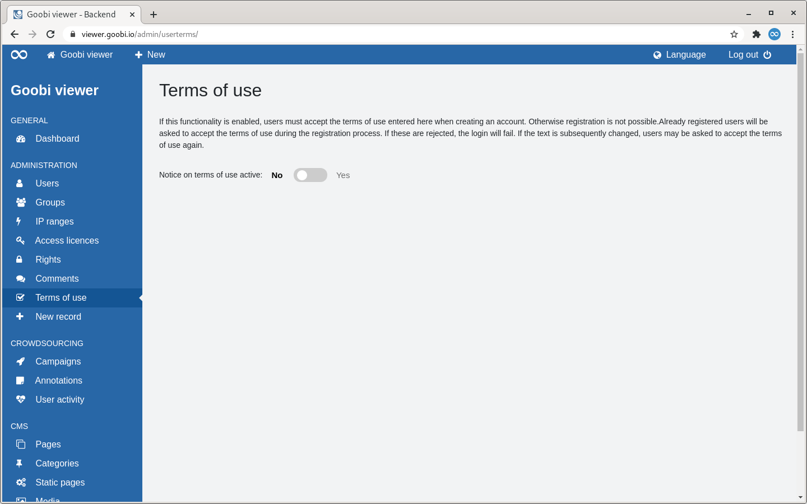
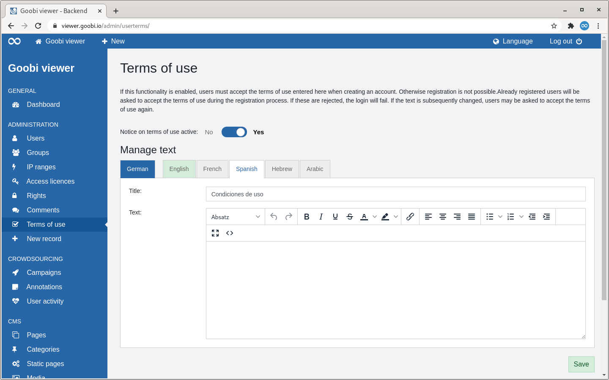
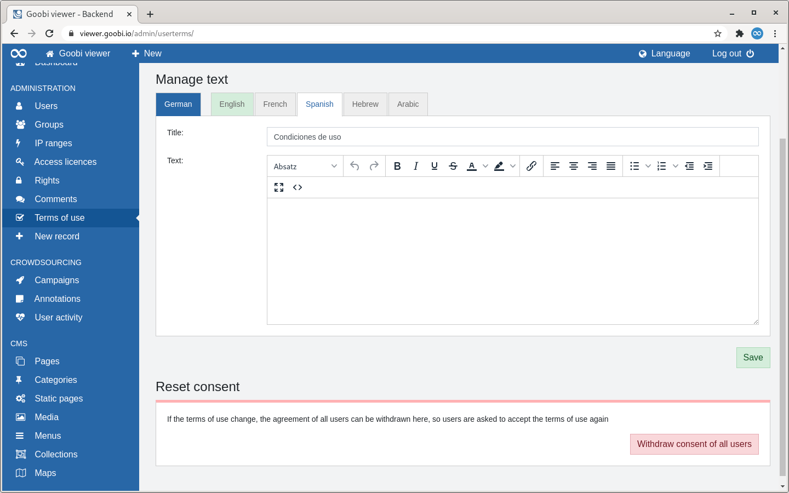
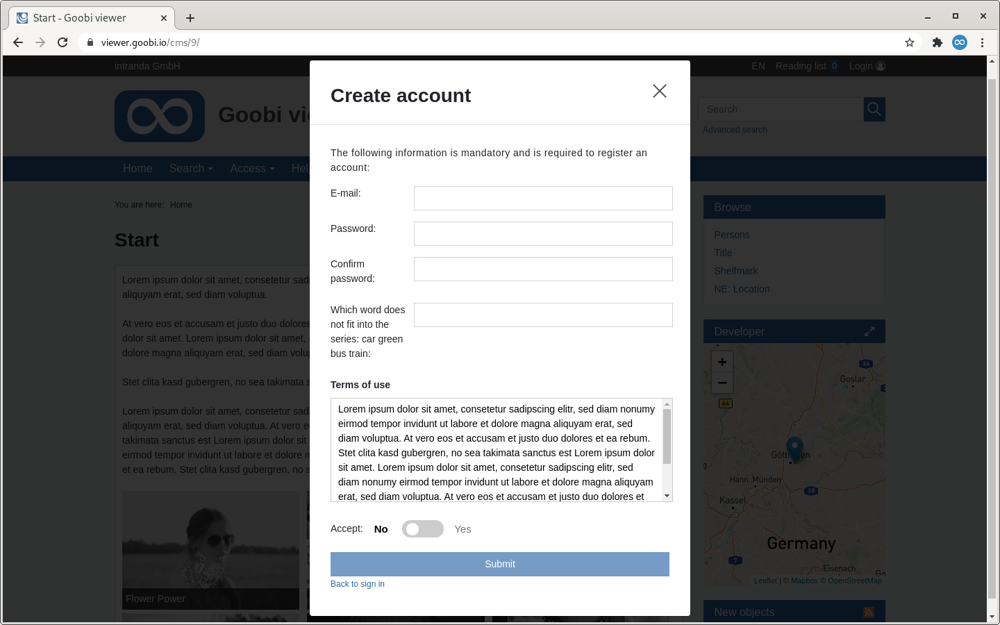
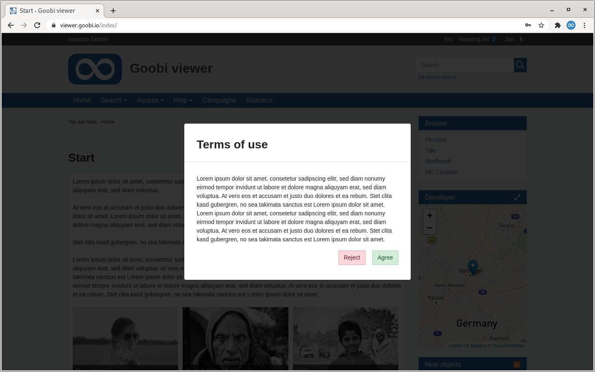
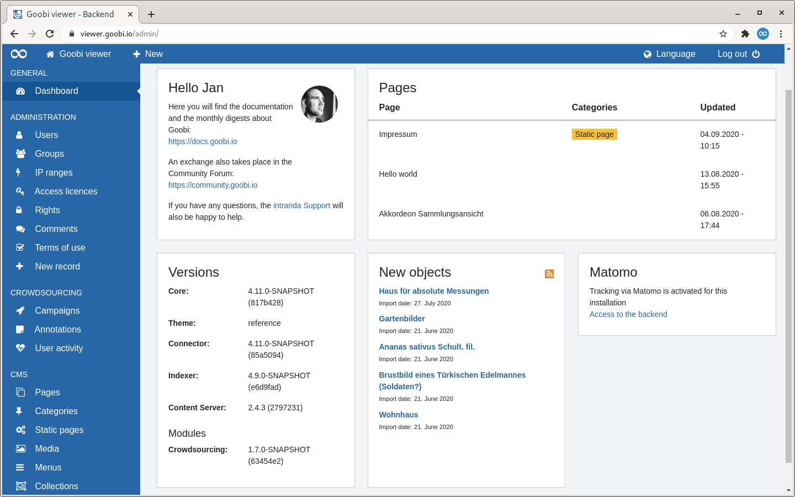
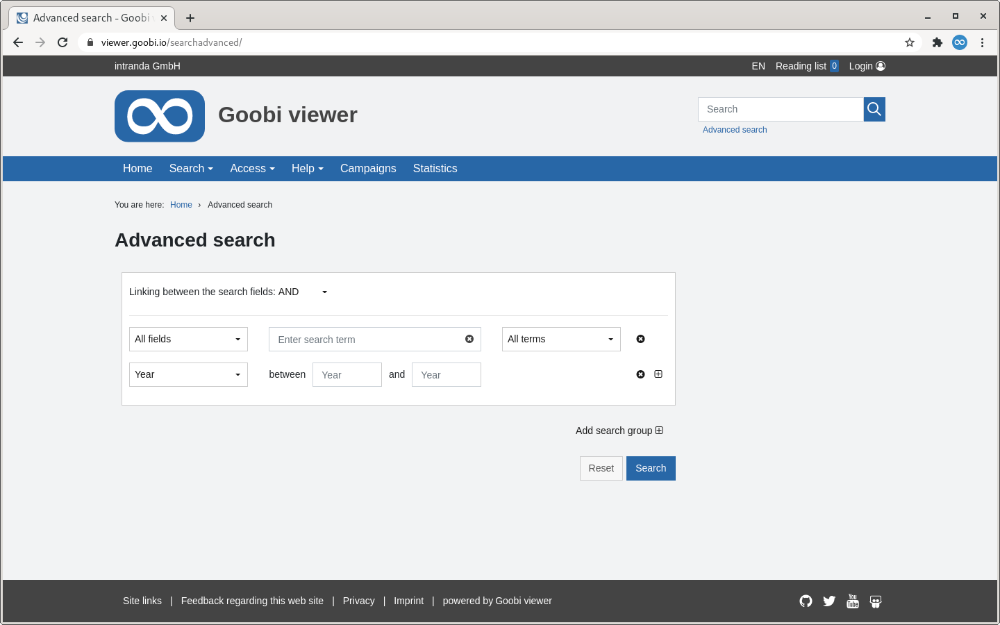
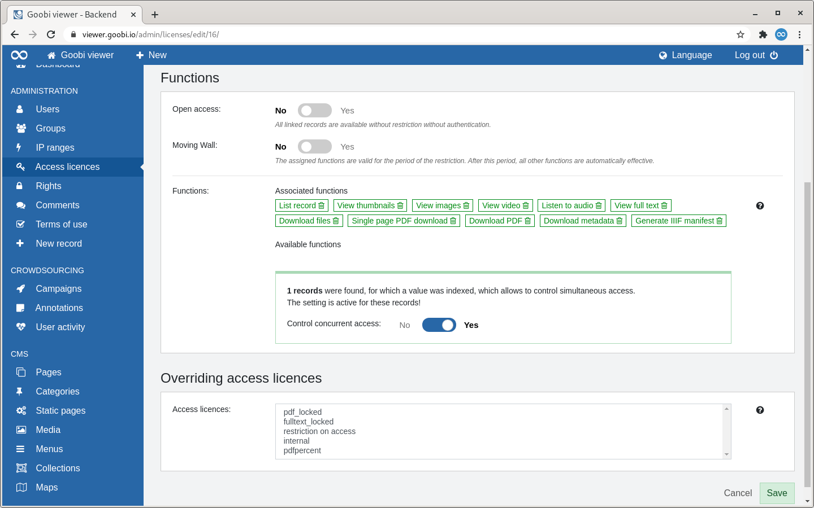
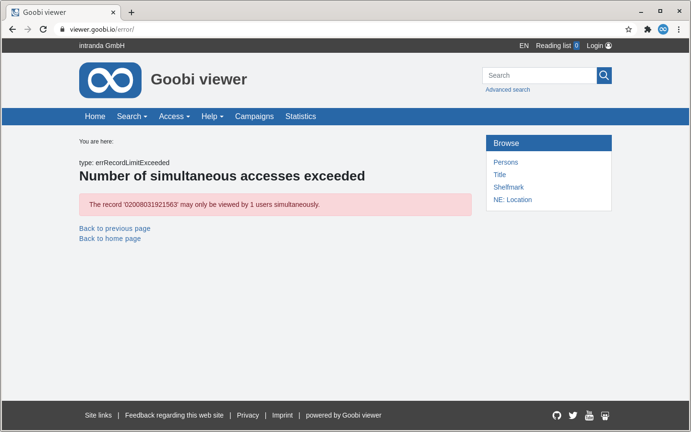

# September

## Coming soon 🚀 

* Erweiterung der Crowdsourcing **Kampagnen**
* Anpassungen an den **IIIF** Schnittstellen
* **WCAG**

## Entwicklungen

### Nutzungsbedingungen

Im Goobi viewer Backend können jetzt Nutzungsbedingungen hinterlegt werden. Hierfür steht im Backend ein neuer Bereich zur Verfügung:



Ist die Funktion aktiv, kann ein Titel und ein Text in den aktivierten Sprachen hinterlegt werden. Außerdem steht die Möglichkeit zur Verfügung die Zustimmung aller Benutzer zurückzusetzen. Dies kann notwendig werden, wenn die Nutzungsbedingungen nachträglich verändert werden.





Die Nutzungsbedingungen müssen dann bei der Registrierung oder einmalig beim Anmelden akzeptiert werden. Hierfür wurde die Maske zum Anmelden und neu Registrieren umgestaltet. Das Design wurde angepasst, die Option zum registrieren eines neuen Accounts prominenter hervorgehoben und das dazugehörige Formular umgestaltet. Die Eingabe eines Anzeigenamens entfällt, da dieser für die Registrierung nicht zwingend erforderlich ist und die Nutzungsbedingungen werden - sofern aktiv - angezeigt.





Mit den Nutzungsbedingungen wurde auch ein neues Bedienkonzept für die Mehrsprachigkeit entwickelt. Die gewohnte Register Ansicht wurde beibehalten aber visuell erweitert: 

1. Die Standardsprache steht immer an erster Stelle
2. Die Standardsprache ist optisch durch Farbe und Abstand von den Übersetzungen abgesetzt
3. Die Reihenfolge der Sprachen ist durch die Konfigurationsdatei `faces-config.xml` eines Themes fest vorgegeben
4. Die Namen der Sprachen sind ausgeschrieben
5. Wenn die Standardsprache nicht ausgefüllt ist, ist ein Wechsel zu den Übersetzungen nicht möglich
6. Wenn eine Sprache vollständig übersetzt ist, dann wird das visuell über die Farbe der Registerkarte signalisiert

Der Screenshot weiter oben zeigt neben der fertig ausgefüllten Standardsprache, eine abgeschlossene englische Übersetzung und die spanische ist gerade in Arbeit ist.

### Backend

Im Backend gibt es weitere kleine Anpassungen. So ist eine neue Topbar hinzugekommen die verschiedene Links zum Schnelleinstieg anbietet. Das Community Forum und die Dokumentation sind nun genauso schnell erreichbar wie das Frontend oder die Möglichkeit eine neue CMS-Seite anzulegen. Es wurde ein Sprachumschalter in das Backend integriert und die Option zum Abmelden ist aus der Seitenleiste nach oben rechts in die Topbar gewandert.

Sind zusätzliche Module installiert, wird dessen Versionsnummer jetzt auf dem Dashboard in dem Versions-Widget mit aufgelistet.



Weiter ist es möglich ein Impressum als CMS-Seite zu realisieren und als statische Seite zu mappen.

### Datensätze ohne Bilder auf den Merklisten

Die Merklisten können jetzt auch mit Datensätzen ohne Bilder umgehen. Bisher war die Ansicht an dieser Stelle sehr bildzentriert. Enthält eine Merkliste Datensätze mit und ohne Bildern werden die Repräsentanten weiterhin in der Übersicht angezeigt. Zusätzlich wird über einen Text auf weitere Werke hingewiesen die keine Bilder enthalten. Enthält eine Merkliste nur Datensätze ohne Bilder entfällt der komplette Bereich.

Die Darstellung der einzelnen Datensätze auf der Merkliste wurde an das Layout der Suchtrefferliste angeglichen.

### Erweiterte Suche

In der erweiterten Suche kann jetzt auch direkt ein Zeitraum für die Suche definiert werden. Dafür muss bei dem gewünschten Feld in der Konfigurationsdatei das Attribut `range="true"` gesetzt werden. Danach werden in der Oberfläche zwei Eingabefelder angezeigt in die jeweils Start- und Endjahr eingetragen werden kann



### Gleichzeitiger Zugriff auf ein Werk steuern

Im August haben wir darüber geschrieben wie der PDF-Download auf einen prozentualen Anteil des Werkes pro Nutzersession eingeschränkt werden kann. Jetzt besteht auch die Möglichkeit den gleichzeitigen Zugriff auf Werke über eine Zugriffslizenz zu steuern. Dafür muss - analog zu der PDF-Funktionalität - eine Zahl in das Feld `ACCESSCONDITION_CONCURRENTUSE` indexiert sein. Ist dieser Fall gegeben erkennt der Goobi viewer den Wert automatisch und bietet die Einschränkung im Backend an.

Ist die Quota für die gleichzeitige Anzeige ausgeschöpft bekommt der Nutzer einen Hinweis angezeigt.





### Sonstiges

* Die Liste der Feldnamen in denen Geokoordinaten indexiert sind, ist nicht mehr fest vorgegeben sondern kann in der `config_viewer.xml` individuell festgelegt werden. Siehe dazu auch [Kapitel 2.36](https://docs.goobi.io/goobi-viewer-de/2/2.36) in der Dokumentation.
* Der Goobi viewer Indexer kann jetzt bei gruppierten Metadaten optional Standardwerte schreiben falls der konfigurierte XPATH Ausdruck keinen Wert liefert. Siehe dazu auch [Kapitel 3.7.5](https://docs.goobi.io/goobi-viewer-de/3/3.7#3-7-5-parameter-parameter-groupentity) der Dokumentation
* Die Versionsnummer des Crowdsourcing Moduls wurde an die anderen Komponenten des Goobi viewers angepasst.

## Versionsnummern

Die Versionen die in der `pom.xml` des Themes eingetragen werden müssen um die in diesem Digest beschriebenen Funktionen zu erhalten lauten:

```markup
<dependency>
    <groupId>io.goobi.viewer</groupId>
    <artifactId>viewer-core</artifactId>
    <version>4.11.0</version>
</dependency>
<dependency>
    <groupId>io.goobi.viewer</groupId>
    <artifactId>viewer-core-config</artifactId>
    <version>4.11.0</version>
</dependency>
```

Der **Goobi viewer Indexer** hat die Versionsnummer **4.11.0**.

Der **Goobi viewer Connector** hat die Versionsnummer **4.11.0**.

Das **Goobi viewer Crowdsourcing Modul** hat die Versionsnummer **4.11.0**

