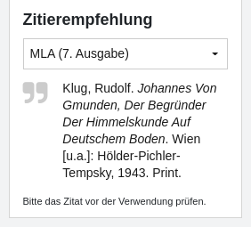
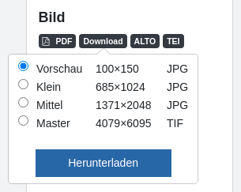
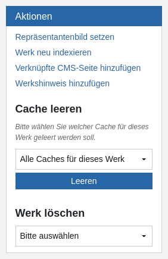
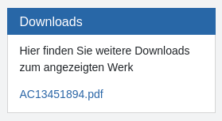
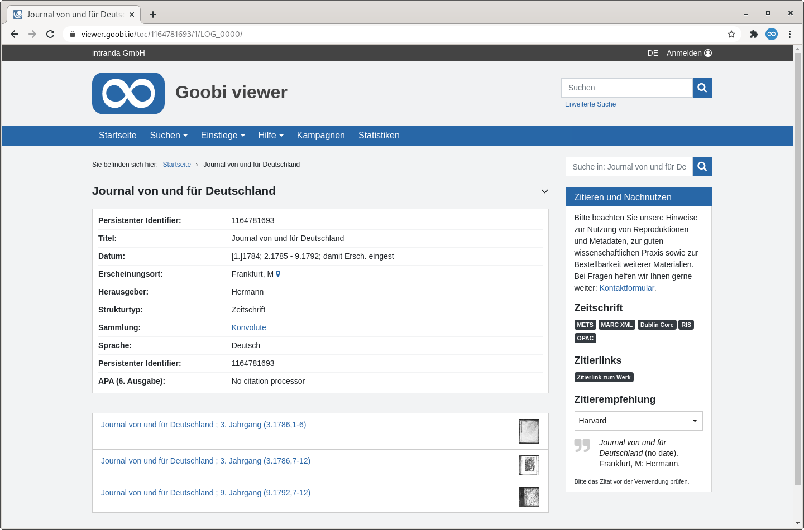

# Februar

## Coming soon 🚀

* Anpassungen an den **IIIF** Schnittstellen
* Erweiterungen bei den **Karten**
* Anpassungen im **Crowdsourcing**

## Ankündigungen

Mit jedem Release stellen wir auf Github auch eine fertig kompilierte Version mit dem Reference-Theme zur Verfügung. Sie kann direkt für eine Installation oder ein Updates verwendet werden. Bisher konnte die Datei im Goobi viewer Core Repository heruntergeladen werden. Ab sofort ist sie im Repository des Reference Themes zu finden.

## Entwicklungen

### Zitierempfehlung

Im Widget "Zitieren und Nachnutzen" wird ab sofort eine Zitierempfehlung für das angezeigte Werk angeboten. Dabei wird auf die Möglichkeiten der Citation Styles zurückgegriffen, über die mehrere tausend Zitierstile zur Verfügung stehen. Die Standardkonfiguration enthält unter anderem Zitierstile nach APA, MLA, Harvard oder Oscola. Der gewünschte Zitierstil kann in einem DropDown Menü ausgewählt und die darunter stehende Zitierempfehlung dann per Mausklick in die Zwischenablage kopiert werden.



Eine Zitierempfehlung kann auch in der Liste der Metadaten auf der Seite "Bibliographische Daten" konfiguriert werden.

### Bilddownload

Bisher konnte das aktuell angezeigte Bild als JPEG oder im Originalformat \(in der Regel TIF\) heruntergeladen werden. Dafür standen im Widget "Zitieren und Nachnutzen" zwei Badges zur Verfügung. Über die Konfigurationsdatei konnte die Anzeige und die Auflösung weiter gesteuert werden.

Diese beiden Links werden ersetzt durch ein neuen Badge "Download". Per Klick öffnet sich ein Popover das verschiedene Auflösungen des Bildes zum Download zur Verfügung stellt.   
Dafür können in der Konfigurationsdatei Einträge mit einem Label, dem Format und einer Box in Pixeln definiert werden, in die das Bild skaliert werden soll. Der Goobi viewer berechnet Anhand der tatsächlichen Bildgröße dann die richtigen Bildmaße und prüft auch, dass keine Einträge angeboten werden die größer sind als das Originalbild.   
Standardmäßig werden vier Bildgrößen \(Vorschau, Klein, Mittel, Groß\) und das Masterbild angezeigt.



### Caches leeren

Am 1. Februar 2010 um 09:06 Vormittags wurde ein Feature-Ticket für die Software "intranda Presentation" mit dem Titel "Admin-GUI: Cache leeren" erstellt. Das Ticket hatte die Nummer \#3055. Zum Vergleich: heute sind wir bei Nummer \#20280.

Nach 11 Jahren und 22 Tagen wurde es geschlossen. Es ist vermutlich das älteste bearbeitete Ticket in der Geschichte der Applikation die heute ja nicht mehr _intranda Presentation_ sondern ~~_intranda viewer_~~ **Goobi viewer** heißt.

Das nur Administrationen in der Werksansicht zur Verfügung stehende Widget "Änderungen am Werk" wurde umbenannt zu "Aktionen" und um die Möglichkeit ergänzt entweder einzelne oder alle Caches für das Werk zu leeren.



### Downloads

Das Widget "Downloads", in dem zusätzliche Dateien zu einem Werk zum Herunterladen angeboten werden können, kann nun auch analog zum Widget "Zitieren und Nachnutzen" einen einleitenden Text enthalten.



### Mirador

Die im Goobi viewer integrierte Version des Mirador wurde auf die Version 3 aktualisiert. Wird für ein Werk das IIIF Manifest geöffnet oder die Vergleichsansicht genutzt, steht er dort automatisch zur Verfügung.

### Anchor Datensätze

Bisher standen für Anchor Datensätze, wie sie zum Beispiel bei mehrbändigen Werken oder Zeitschriften vorliegen, zwei Ansichten zur Verfügung: Die bibliographische Daten zum Anchor und das Inhaltsverzeichnis mit den enthaltenen Bänden. Automatisch geöffnet wurde immer das Inhaltsverzeichnis.

Beide Ansichten werden mit diesem Release zusammengeführt, so dass im oberen Bereich die Metadaten und darunter das Inhaltsverzeichnis angezeigt wird.



### REST API

Wenn eine REST-API nicht dokumentiert ist kann sie von Externen nur schwer verwendet werden. Ist sie dann dokumentiert und wird sie benutzt, kommen natürlich sofort Fragen auf. So auch im Goobi viewer.

Dieses Release bringt verschiedene Änderungen an der REST API mit. Hervorzuheben sind vor allem die folgenden Anpassungen: 

1. Der Endpoint `/index/query` gibt jetzt auch die Gesamtzahl der Treffer und der Facettierfelder aus 
2. Der neue Endpoint `/index/fields` zeigt Informationen zu den vorhandenen Solr-Feldern an. Damit kann ein leichterer Überblick über die Struktur und den Datenbestand erlangt werden.

### Performance

Bei der Generierung der IIIF Manifeste und bei der Sammlungsauflistung gab es massive Performanceverbesserungen. Leider kann man zu solchen Themen nicht viel schreiben, sie sind aber absolut erwähnenswert. Die Generierzeit konnte bei manchen IIIF Manifesten von 15 auf 3 Sekunden reduziert werden. Bei der Sammlungsauflistung ist der Effekt vor allem zu beobachten, wenn die Installation viele Werke enthält. Die bisher eingesetzte Solr-Query skalierte nicht mit vielen Datensätzen. Durch eine Umstellung konnte die Zusammenstellung der Sammlungsübersicht unter Berücksichtigung der Zugriffsbeschränkungen von mehreren Sekunden auf wenige Millisekunden reduziert werden.

Falls auf einer CMS-Seite die Gruppierung von Suchtreffern verwendet wird muss diese nach dem Update neu gesetzt werden.

### rechts-nach-links Leserichtung

Die XHTML und CSS Anweisungen im Core wurden überarbeitet um auch Themes mit einer rechts-nach-links Leserichtung zu unterstützen. Diese Änderung ist in Themes sichtbar, die die Sprachen arabisch oder hebräisch aktiviert haben.

### Goobi viewer Indexer

Ab sofort kann der Goobi viewer Indexer während der Indexierung eines Datensatzes einen externen Katalog abfragen und dazu weitere bibliographische Daten indexieren. Das Anwendungsbeispiel, wofür diese Funktionalität entwickelt wurde, sind LIDO Datensätze zu musealen Objekten, in denen ein Identifier auf ein Werk mit beschreibender Literatur enthalten ist. Der Indexer fragt dann mit Hilfe des angegebenen Identifiers die bibliographischen Daten zum Werk ab, indexiert diese und im Goobi viewer können diese dann neben dem Objekt angezeigt werden.

Siehe dazu auch den folgenden Abschnitt in der Dokumentation:



### Sonstiges

* Im Benutzermenü wird der Eintrag "Annotationen" erst sichtbar, sobald die erste Annotation erstellt wurde.
* Die Anzahl der Bilder die ein Werk mindestens besitzen muss damit über der Bildanzeige ein DropDown zur direkten Seitenauswahl angezeigt wird ist jetzt konfigurierbar. Siehe dazu auch [Kapitel 1.11.1](https://docs.goobi.io/goobi-viewer-de/conf/1/11/1) in der Goobi viewer Core Konfiguration.
* Aus der Volltextanzeige ist nun der direkte Wechsel in die Vollbildansicht möglich. Dort wird dann auch der entsprechende Reiter mit dem Volltext direkt geöffnet angezeigt.
* Auf mehrfachen Wunsch wurde das CMS-Template für eine Bildergalerie mit Text, mit denen die Universitätsbibliothek Kassel eine virtuelle Ausstellung mit den Schätzen der Sondersammlungen realisiert hat, in den Core übernommen und steht somit für alle in der Liste der CMS-Templates zur Verfügung.

## Versionsnummern

Die Versionen die in der `pom.xml` des Themes eingetragen werden müssen um die in diesem Digest beschriebenen Funktionen zu erhalten lauten:

```markup
<dependency>
    <groupId>io.goobi.viewer</groupId>
    <artifactId>viewer-core</artifactId>
    <version>21.02</version>
</dependency>
<dependency>
    <groupId>io.goobi.viewer</groupId>
    <artifactId>viewer-core-config</artifactId>
    <version>21.02</version>
</dependency>
```

Der **Goobi viewer Indexer** hat die Versionsnummer **21.02**

Der **Goobi viewer Connector** hat die Versionsnummer **21.02**

Das **Goobi viewer Crowdsourcing Modul** hat die Versionsnummer **21.02**

