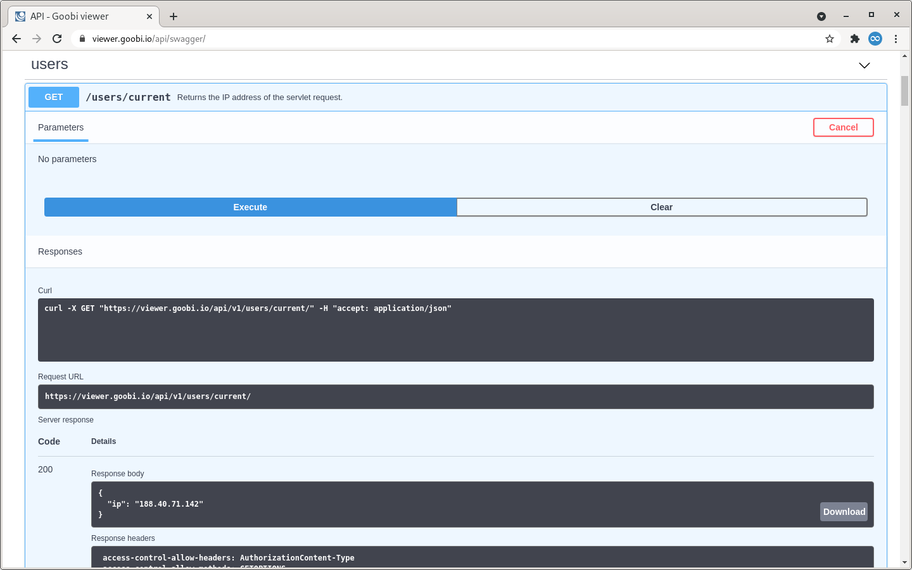

# März

## Coming soon 🚀

* Anpassungen an den **IIIF** Schnittstellen
* Erweiterungen bei den **Karten**
* Anpassungen im **Crowdsourcing**

## Entwicklungen

### Metadaten

Anwender, die viel Liebe in ihre Metadaten stecken, können diese jetzt noch besser präsentieren. Im letzten Monat wurden hierfür zwei Features entwickelt.

Zum einen können Metadaten jetzt auf mehrere Seiten aufgeteilt werden. Der konkrete Anwendungsfall für diese Entwicklung war der Wunsch, sehr umfassende kodikologische Daten für Handschriften separiert von den anderen bibliographischen Daten des Werkes anzuzeigen. Dafür wurde die Konfigurationsdatei angepasst, die es jetzt erlaubt dynamisch Seiten für die Metadatenanzeige zu konfigurieren. Siehe dazu auch [Kapitel 1.19.1](https://docs.goobi.io/goobi-viewer-de/conf/1/19/1) in der Goobi viewer Dokumentation.

Die andere Entwicklung betrifft die Anzeige von Metadaten von Strukturelementen. Bisher wurden diese immer angezeigt, auch wenn sie eigentlich keine zusätzlichen relevanten Informationen enthielten. So stand dort häufig nur der Titel des Strukturelementes und der war ja bereits aus dem Inhaltsverzeichnis klar. Über einen neuen Schalter in der Konfigurationsdatei können nun die Metadaten markiert werden die - wenn sie die einzigen für die Anzeige wären - automatisch ignoriert werden.

Wir haben in die [Updateanleitung](https://docs.goobi.io/goobi-viewer-de/devop/1#liebe-fuer-die-metadatenkonfiguration) ein paar Punkte aufgenommen die bei einem Update geprüft werden sollten. Vielleicht fällt das Ergebnis auf den ersten Blick gar nicht auf. Aber auf den zweiten ist es logischer und übersichtlicher.


### Slider

Im Goobi viewer Backend gibt es einen neuen Bereich um Slider zu definieren. Dafür können die folgenden Quellen verwendet werden:

* **Werke** Diese werden über eine Solr-Query ausgewählt. Verwendet werden der Titel und der Repräsentant der Werke. Es wird automatisch auf das Werk verlinkt.
* **Sammlungen** Hier steht ein Multiselect Feld zur Verfügung. Der übersetzte Sammlungsname und der konfigurierte Repräsentant einer Sammlung werden hier verwendet. Es wird automatisch auf die Sammlung verlinkt.
* **CMS-Seiten** Hier können Kategorien ausgewählt werden in denen CMS-Seiten zusammengefasst sind. Aus den Seiten wird dann die Überschrift und ein enthaltenes Bild verwendet. Es wird automatisch auf die CMS-Seite verlinkt.
* **Medien** Erstellt einen Slider auf Basis von Bildern die im Medien Bereich hochgeladen und einer gemeinsamen Kategorie zugewiesen wurden. Verwendet werden der Titel und das Bild selbst. Sofern ein Link angegeben wurde wird auch dorthin verlinkt.

Der Goobi viewer kommt mit einer Vorauswahl von verschiedenen Slider Styles. Diese können im Theme visuell angepasst und alternativ auch durch eigene Konfigurationen ergänzt werden.

Für die Verwendung des Sliders steht ein neues CMS-Template zur Verfügung.


### Widget: Aktionen

Das im letzten Monat inhaltlich überarbeitete Widget "Aktionen" wurde noch einmal visuell angepasst. Aus der Community kam der Vorschlag das Widget, das administrative Tätigkeiten erlaubt und nur Nutzern mit entsprechenden Rechten zur Verfügung steht, in dem blauton des Backends einzufärben. Damit wäre eine visuelle Verbindung geschaffen und es ist auch optisch sofort ersichtlich, dass es sich hierbei um eine administrative Möglichkeit handelt.

Diese Idee haben wir sehr gerne aufgegriffen und umgesetzt. Hier noch einmal das alte und neue Styling nebeneinander:


### REST API

Zugriffslizenzen für Werke können mit IP-Adressen verknüpft werden. Damit ist es Möglich den Zugang zum Beispiel auf einen Lesesaal einzuschränken. Bei größeren Netzwerken mit Proxies und NAT ist es manchmal schwer herauszufinden, welche IP-Adresse der Goobi viewer eigentlich am Ende sieht um die Zugriffslizenz zu prüfen. Um dieses zu vereinfachen wurde ein neuer REST Endpoint entwickelt, der genau diese IP-Adresse zurück gibt. So kann von dem gewünschten PC einfach die URL aufgerufen und dann für die weitere Konfiguration verwendet werden.

Der Endpoint ist in der Swagger Dokumentation aufgelistet und befindet sich unter `/users/current/`. Er  kann auf der Demoinstanz unter der folgenden URL ausprobiert werden:

* [https://viewer.goobi.io/api/v1/users/current/](https://viewer.goobi.io/api/v1/users/current/)



### Sonstiges

* Für angemeldete Benutzer gibt es eine Auflistung der **Merklisten** im DropDown Menü. Die Sortierung erfolgte darin bisher in der **Reihenfolge** in der die Merklisten angelegt wurden. Sie erfolgt jetzt **absteigend nach zuletzter Bearbeitung**. Die Listen, zu denen zuletzt Werke oder Bilder hinzugefügt wurden, stehen an oberster Stelle.
* Die Anzeige von **Annotationen** ist jetzt auch wieder **unter dem Bild** möglich. Das Widget in der Seitenleiste wird dann ausgeblendet. Siehe dazu auch Kapitel 1.24 in der Goobi viewer Dokumentation.
* Deaktivierte Elemente werden im Backend visuell stärker gekennzeichnet.
* Ein sehr alter und langwieriger Bug konnte behoben werden. Wenn bei der **Authentifizierung** mit **Google** eine **weiße Seite** angezeigt wird, dann muss der Timeout für den Authentication Provider erhöht werden, zum Beispiel auf den Wert `60000`.

## Versionsnummern

Die Versionen die in der `pom.xml` des Themes eingetragen werden müssen um die in diesem Digest beschriebenen Funktionen zu erhalten lauten:

```markup
<dependency>
    <groupId>io.goobi.viewer</groupId>
    <artifactId>viewer-core</artifactId>
    <version>21.03</version>
</dependency>
<dependency>
    <groupId>io.goobi.viewer</groupId>
    <artifactId>viewer-core-config</artifactId>
    <version>21.03</version>
</dependency>
```

Der **Goobi viewer Indexer** hat die Versionsnummer **21.03**

Der **Goobi viewer Connector** hat die Versionsnummer **21.03**

Das **Goobi viewer Crowdsourcing Modul** hat die Versionsnummer **21.03**

