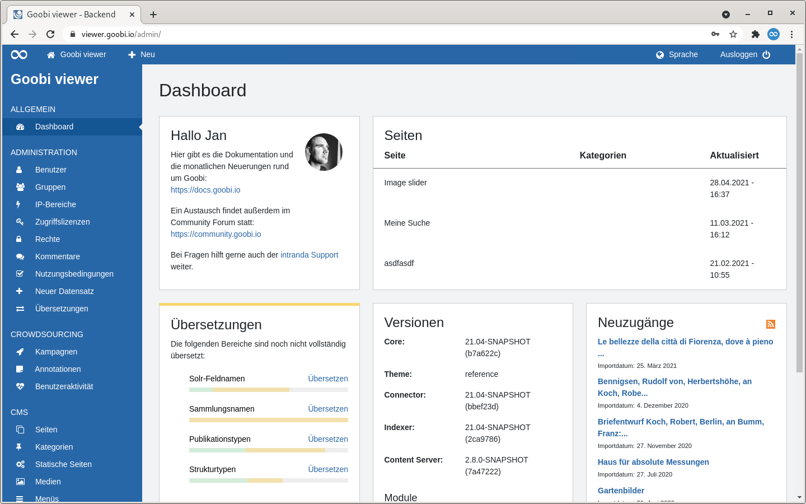
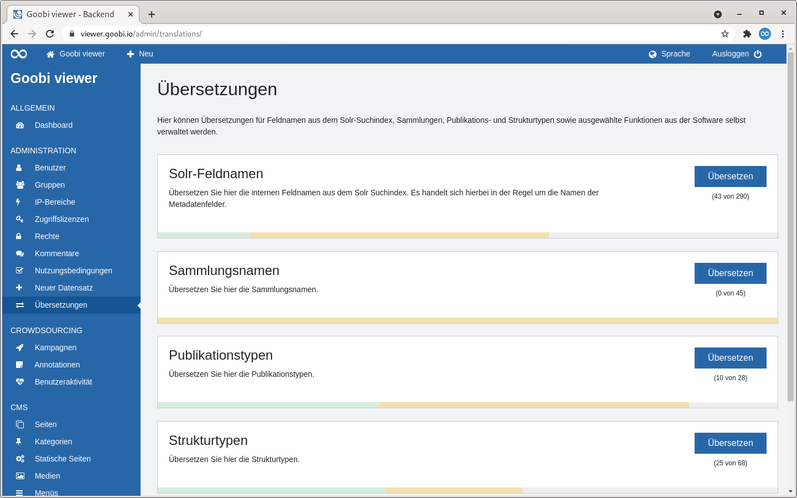
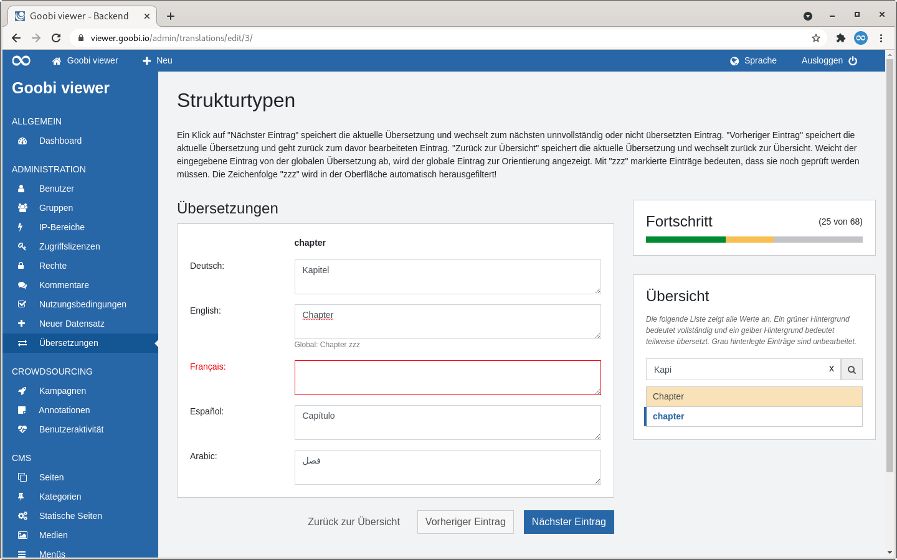
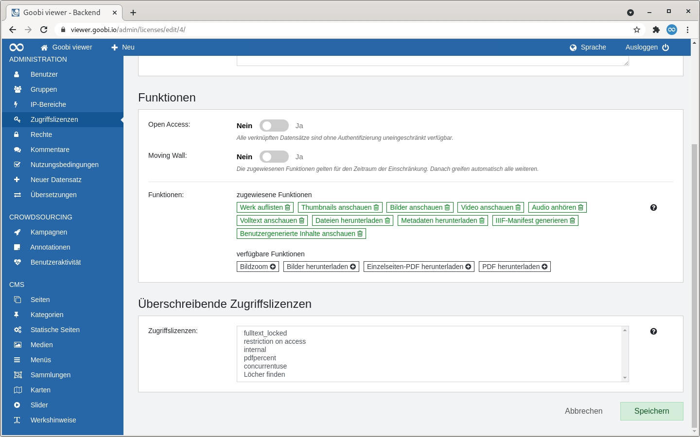
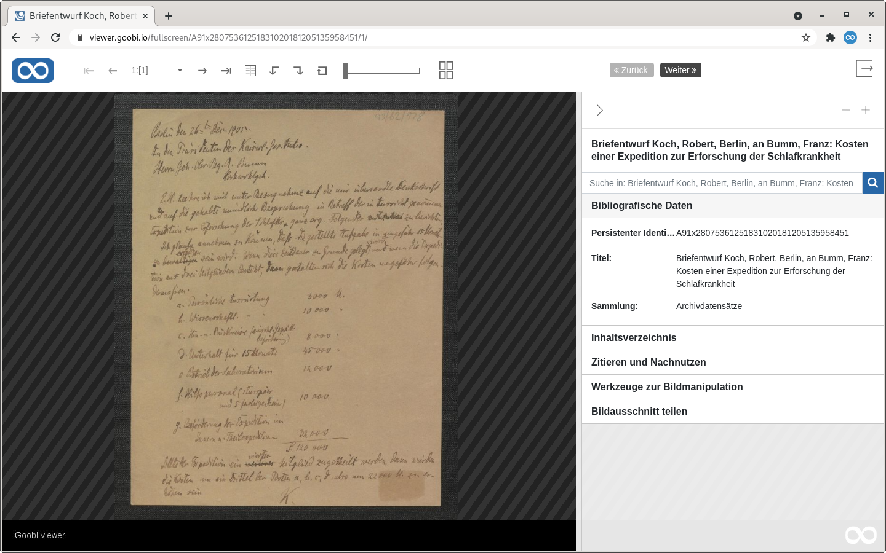
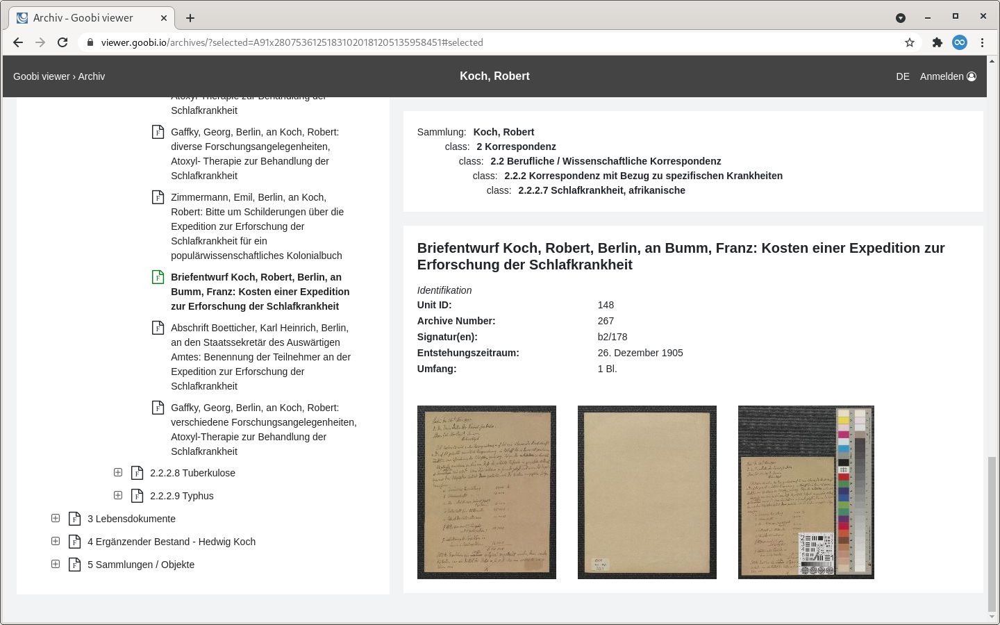

# April

## Coming soon 🚀

* Erweiterungen bei den **Karten**
* Anpassungen im **Crowdsourcing**
* URL Anpassungen bei **Doppelseiten**

## Entwicklungen

### IIIF

Der Goobi viewer Core implementiert jetzt die IIIF Presentation API und die IIIF Image API in den jeweiligen 3.0er Versionen. Dafür wurde in der REST API der neue Namespace /api/v2/ eingeführt. Dadurch bleiben die URLs zu den bisherigen Manifesten stabil. In der Konfigurationsdatei kann eingestellt werden welche IIIF Version der Goobi viewer in seiner eigenen Oberfläche standardmäßig ausliefert.

Zu dieser und weiterer Konfigurationsoptionen siehe auch [Kapitel 1.33.2](http://docs.goobi.io/goobi-viewer-de/conf/1/33/2) in der Goobi viewer Dokumentation.

### Übersetzungen

Das Thema Übersetzungen im Goobi viewer war in der Vergangenheit sehr umständlich und komplex. Ursächlich dafür war vor allem, dass die in der Oberfläche angezeigten Inhalte an verschiedenen Stellen übersetzt werden müssen. Erschwerend kommt hinzu, dass die Inhalte oft auch aus unterschiedlichen Quellen kommen. Für die Übersetzung gab es:

* Die globalen messages mit den Werten die der Goobi viewer Core selbst mitbringt und bei jedem Update überschreibt
* Die lokalen messages mit lokal überschriebenen und angepassten Werten
* Das CMS-Backend mit individuellen Texten

Als potentielle Quellen für die Anzeige diente neben den drei bereits genannten Bereichen aber auch noch der Solr-Suchindex bei dem einerseits die Feldnamen selbst und andererseits Teile der Feldinhalte relevant sind. So soll in der Oberfläche nicht der Feldname `MD_LANGUAGE` sondern `Sprache` stehen. Außerdem soll bei der Sprache nicht der Feldwert `ger` auftauchen sondern die entsprechende Übersetzung `deutsch`.

Wenn man jetzt noch bedenkt, dass die globale messages Datei gute 3.400 Einträge umfasst war schnell klar, dass das zum selber bearbeiten für Anwender viel zu kompliziert war.

Aus diesem Grund wurde im Backend ein neuer Bereich "Übersetzungen" implementiert. Dieser Bereich kann über die Konfigurationsdatei gesteuert werden um relevante beziehungsweise gewünschte Übersetzungsgruppen freizugeben. Anschließend steht im Backend ein Editor zur Verfügung, der es erlaubt die Übersetzungen für die gewünschten Sprachen zu pflegen.

Alle Arbeiten werden dabei konsequent in den lokalen messages Dateien gespeichert, es gibt keine Datenbank dazwischen oder ähnliches. Ein Locking-Mechanismus verhindert, dass mehrere Administratoren gleichzeitig an den Dateien arbeiten.

Die Standardkonfiguration bringt eine Vorauswahl fünf Gruppen mit, die in der Vergangenheit für die Übersetzung oft angefragt wurden:

1. Die Namen der Solr-Felder \(Angezeigter Name eines Metadatums\) 
2. Die Werte des Solr-Feldes DC \(Sammlungsnamen\) 
3. Die Werte des Solr-Feldes DOCSTRCT\_TOP \(Publikationstypen\) 
4. Die Werte des Solr-Feldes DOCSTRCT\_SUB \(Strukturtypen\) 
5. Die E-Mailtexte der versendeten E-Mails

Für weitere Informationen siehe auch [Kapitel 1.37](https://docs.goobi.io/goobi-viewer-de/conf/1/37) in der Goobi viewer Core Dokumentation und/oder hier ein paar Eindrücke aus der Oberfläche:







### Zugriffsbeschränkungen

Neu ist die Möglicheit den Zoom und den Download von Bildern über eine Zugriffslizenz einzuschränken. Damit ist die normale Bildanzeige zwar zugänglich aber die ausgelieferten Inhalte werden beschränkt. Dafür stehen die neuen Funktionen "Bildzoom" und "Bild-Download" für Zugriffslizenzen und Rechte zur Verfügung.

In diesem Zuge wurde ein weitere Konfigurationsschalter eingeführt, der die maximale Bildbreite in Pixeln definiert bis wohin das Bild zugänglich gemacht werden soll. Der Standardwert sind 600px, für eine Anpassung siehe auch [Kapitel 1.7](https://docs.goobi.io/goobi-viewer-de/conf/1/7) in der Goobi viewer Core Dokumentation.

Ist die Einstellung für einen Datensatz aktiv, ist auch die Bildauslieferung über die IIIF API entsprechend eingeschränkt.


Bei einem Update auf die Version 21.04 müssen die im Backend konfigurierten Zugriffslizenzen und Rechte geprüft und die neuen Rechte explizit hinzugefügt werden!




### Strukturelement-Navigation

In der Vollbildansicht besteht die Möglichkeit zwei zusätzliche Navigationselemente einzublenden um zwischen definierten Strukturelementen zu navigieren. Als Anwendungsfall für die Entwicklung dient ein digitalisierter Archivbestand, wo zwischen den einzelnen Dokumenten innerhalb einer Mappe navigiert werden soll.

Siehe dazu auch [Kapitel 1.11.2](https://docs.goobi.io/goobi-viewer-de/conf/1/11/2) in der Goobi viewer Core Dokumentation.



### Archivansicht

Die Bildvorschau in der Archivansicht wurde erweitert. Lagen für eine Verzeichnungseinheit bisher Digitalisate vor, wurde der Repräsentant angezeigt und man konnte in die Bildanzeige wechseln. Diese Funktionalität wurde erweitert, so dass wenn Strukturelemente vorliegen von der ersten Hierarchieebene jeweils das erste Bild des Strukturelements als Thumbnail angezeigt wird. Bei Klick auf ein Thumbnail öffnet sich das Bild in der Vollbildansicht. Bei einer Mappe mit mehreren enthaltenen einzelnen Dokumenten ist so ein schneller Überblick über den Inhalt der Mappe und das gezielte Springen zu einem gewünschten Dokument möglich.




### Arbeitsaufträge im Hotfolder

In der blauen Topbar kann die Anzahl der sich im Hotfolder befindlichen Dateien / Arbeitsauträge angezeigt werden. Dafür wurden der Goobi viewer Indexer und der Goobi viewer Core entsprechend erweitert.

Bereits heute gibt der Goobi viewer Indexer nach einer erfolgreichen Indexierung Informationen an den Goobi viewer Core weiter. Wenn Bilder verarbeitet wurden veranlasst er zum Beispiel die Leerung des Bildcaches für das Werk oder er übermittelt seine eigene Versionsnummer für die Anzeige auf dem Dashboard des Admin Backends. Neu hinzugekommen ist, dass der Goobi viewer Indexer nun auch die Anzahl der Arbeitsaufträge im Hotfolder ermitteln kann und dann weiterleitet. Dieses wird dann in der blauen Topbar im Backend angezeigt. Auf diese Weise ist für Administratoren schnell ersichtlich ob und wenn ja wie viele Dateien noch in der Queue sind.

Optional kann die Topbar auch nur für Administratoren im Frontend angezeigt werden.


## Versionsnummern

Die Versionen die in der `pom.xml` des Themes eingetragen werden müssen um die in diesem Digest beschriebenen Funktionen zu erhalten lauten:

```markup
<dependency>
    <groupId>io.goobi.viewer</groupId>
    <artifactId>viewer-core</artifactId>
    <version>21.04.3</version>
</dependency>
<dependency>
    <groupId>io.goobi.viewer</groupId>
    <artifactId>viewer-core-config</artifactId>
    <version>21.04.1</version>
</dependency>
```

Der **Goobi viewer Indexer** hat die Versionsnummer **21.04**

Der **Goobi viewer Connector** hat die Versionsnummer **21.04**

Das **Goobi viewer Crowdsourcing Modul** hat die Versionsnummer **21.04**

