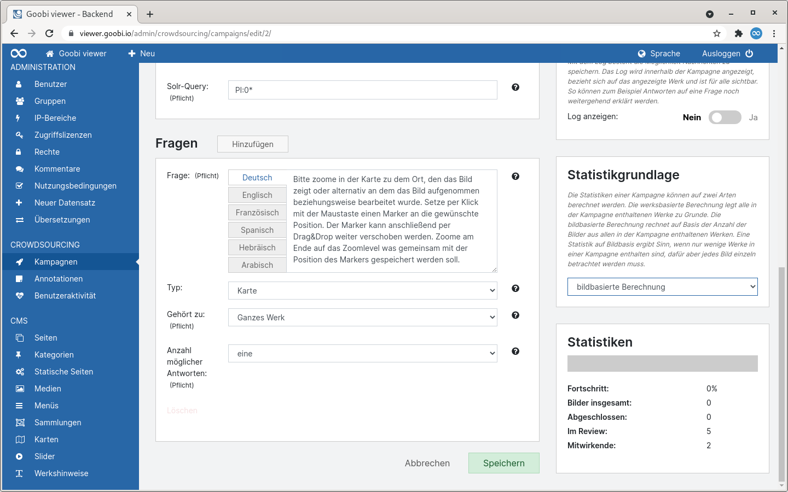
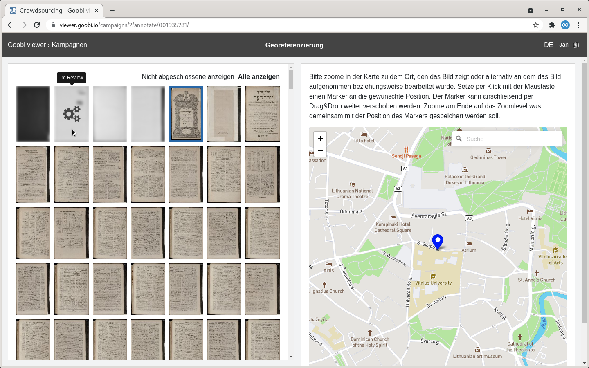
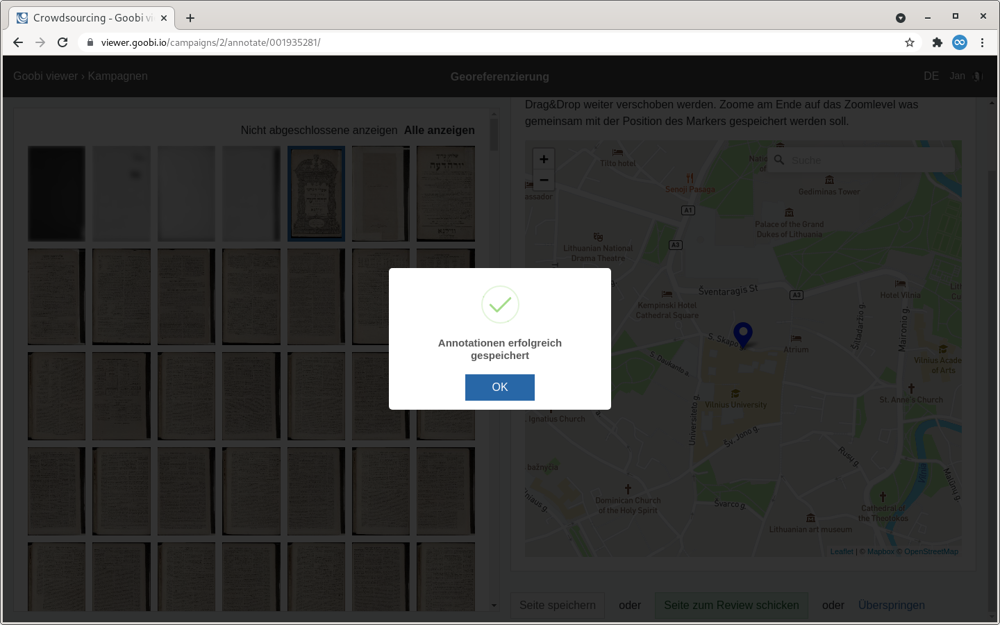
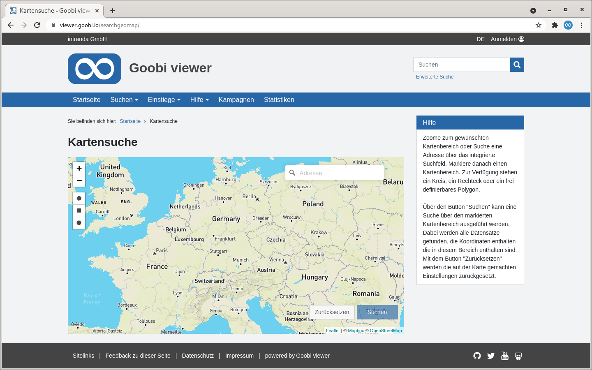
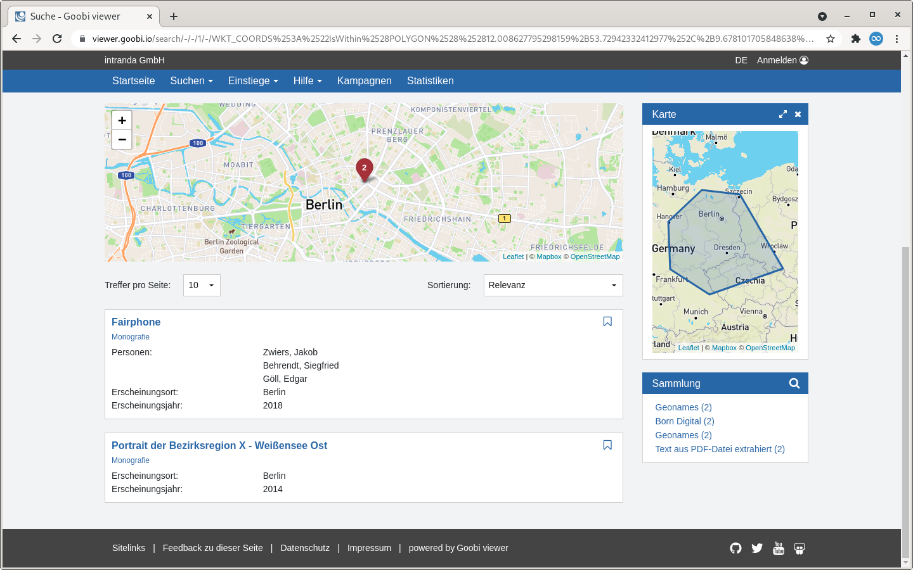
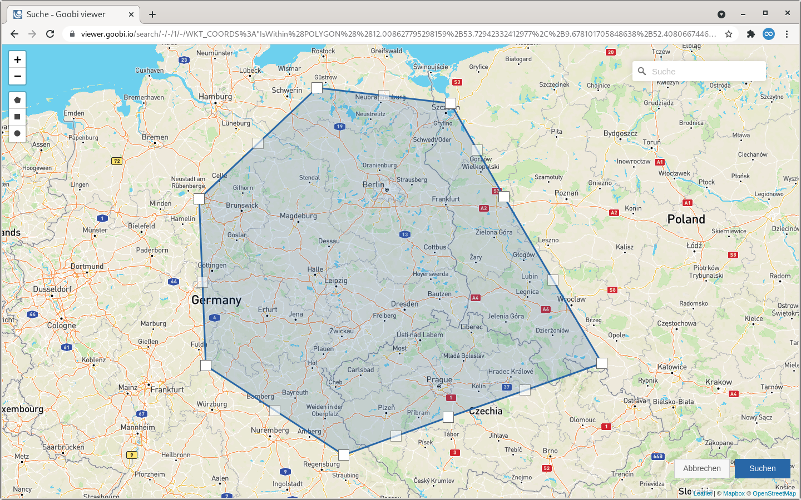
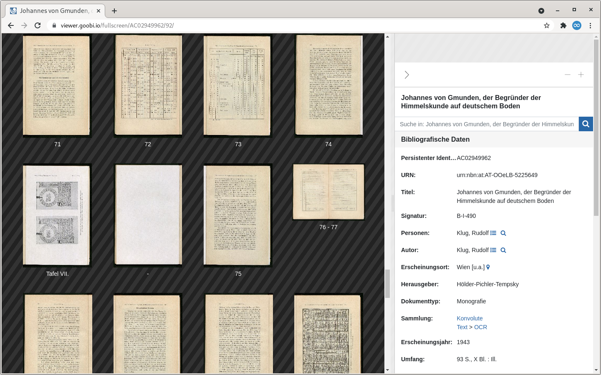
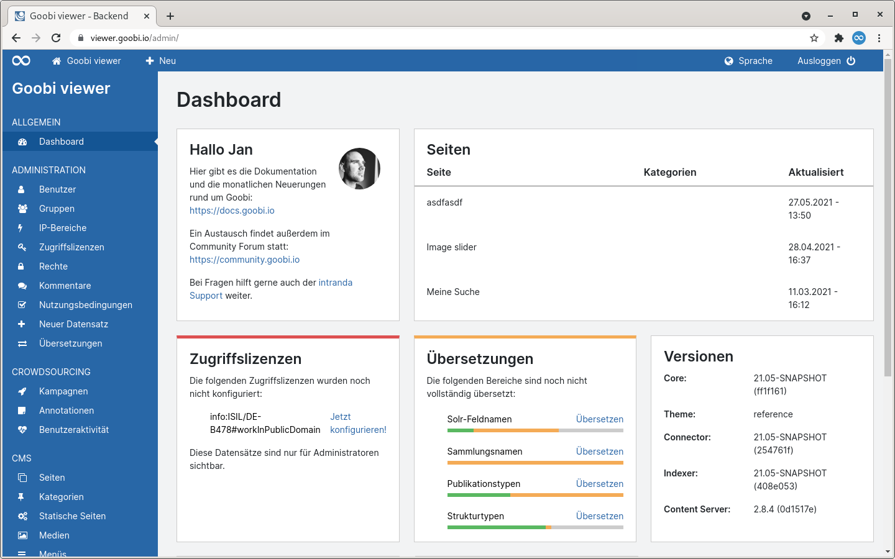

# Mai

## Coming soon 🚀

* **Sammlungskonfiguration** im Backend
* **Benutzerseite** im Frontend

## Entwicklungen

### Crowdsourcing Kampagnen

Bisher waren die Einheiten in den Kampagnen immer die Datensätze selbst. Wenn aber zum Beispiel nur fünf Datensätze mit jeweils 1.000 Bildern vorhanden sind und sich die Fragen auf die einzelnen Bilder beziehen, dann stellt die Betrachtung auf Datensatzebene eine Einschränkung dar.

Aus diesem Grund wurde die Möglichkeit geschaffen innerhalb einer Kampagne die werksbasierte Betrachtung auf eine bildbasierte zu ändern.



In dem Frontend gibt es nun eine neue Thumbnailanzeige. Dabei ist das aktive Bild mit einem blauen Rand hervorgehoben. Bilder die sich im Review-Modus befinden, Abgeschlossen sind oder durch einen anderen Benutzer bearbeitet werden dabei ausgegraut und leicht verwaschen dargestellt. Fährt man mit der Maus über ein Bild, so wird über ein Icon und einen Tooltip der genaue Status des Bildes angezeigt. Damit ist auch gleich die nächste Neuerung beschrieben: Bei einer bildbasierten Betrachtung findet ein Locking auf Bildebene statt. Damit wird verhindert, dass nicht mehrere Personen gleichzeitig an einem Bild arbeiten. Bisher fand ein Locking ausschließlich auf Datensatzebene statt.

In der Karte steht bei der Verwendung von Mapbox eine Suchmöglichkeit zur Verfügung mit der nach einem Ort oder einer Adresse gesucht werden kann.



Beim Speichern einer Annotation bekommt der Nutzer eine visuelle Erfolgsmeldung angezeigt.



Weitere Neuerungen sind, dass wir den Button zum Mitmachen in der Kampagnenübersicht farblich stärker hervorgehoben haben und das die Auflistung der Datensätze innerhalb einer Kampagne nicht mehr zufällig, sondern sortiert ist. Beide Änderungen sind basieren aus direkten Rückmeldungen von Anwendern die sich das für eine einfachere Bedienung gewünscht haben.

### Karten

Die Karten-Unterstützung des Goobi viewers wird sukzessive erweitert. Zu den bisherigen Funktionen gesell sich nun Möglichkeit hinzu auf einer Karte zu suchen und in den Suchtreffern auf einer Karte zu facettieren. Dafür steht eine neue Seite zur Verfügung die bei Bedarf im Menü verlinkt werden kann. Für die Facettierung muss in der Konfigurationsdatei das Feld `WKT_COORDS` als  konfiguriert werden.

Wenn Suchtreffer mit Koordinaten gefunden werden wird automatisch eine Karte angezeigt in der die indexierten Koordinaten angezeigt werden. Außerdem steht ein Widget zur Verfügung in dem Facettiert werden kann.







### Doppelseiten

Im Kontext Doppelseiten gibt es zwei Neuerungen im Goobi viewer. Die Erste ist, dass die Kodierung der Doppelseitenanzeige jetzt auch in der URL erfolgt. Damit besteht ab sofort die Möglichkeit eine Doppelseitenanzeige als Link an andere Weiterzuleiten. Die zweite Neuerung ist, dass wenn in Goobi workflow einzelne Seiten als Doppelseiten markiert wurden, diese Information in der Doppelseitenanzeige des Goobi viewers dazu führt, das hier einzelne Bilder angezeigt werden. Einfacher erklärt ist es mit einem Beispiel:

_Eine Monographie umfasst 100 Seiten. Diese wurde als Einzelseiten digitalisiert. Am Ende gibt es eine Tabelle die sich über zwei Seiten erstreckt. Dafür wurden die beiden Seiten als Doppelseiten gescannt. Bei der aktiven Doppelseitenanzeige zeigt der Goobi viewer immer zwei Einzelbilder zusammengefasst an. Bei dem gescannten Doppelseitenbild wird aber nur dieses eine Bild angezeigt. Es ist also nicht auf den ersten Blick ersichtlich ob es sich um zwei Einzelseiten oder um eine Doppelseite handelt._



### CMS: Text mit Suchtreffern

Im CMS-Template "Text mit Suchtreffern" steht eine neue Checkbox zur Verfügung mit der optional nicht die Werke wie bisher aufgelistet werden, sondern Strukturelemente gefunden werden. Damit können Solr-Queries für die Suchtreffer formuliert werden, die zum Beispiel alle in Telefon- und Adressbüchern enthaltene Karten auflistet um eine entsprechende Übersicht anzubieten.

### Metadaten

Metadaten können jetzt anhand von Bedingungen angezeigt werden. In dem realisierten Anwendungsfall lagen Literaturangaben mit Verweisen zum Katalog vor, von denen einige Werke auch bereits digitalisiert waren. Bei diesen Werken sollte ein zusätzlicher Link zum digitalisierten Werk angezeigt werden, nicht aber global bei jedem Datensatz um keine defekten Links zu generieren.

Siehe dazu auch die Dokumentation für `<param condition="" />` in [Kapitel 1.19.1](https://docs.goobi.io/goobi-viewer-de/conf/1/19/1) der Goobi viewer Core Dokumentation.

### Backend

Das Backend verwendet nun eine einheitliche Schriftart [Inter](https://rsms.me/inter/). Außerdem wurden die Akzentfarben in rot, orange und grün auf einen kräftigeren Farbton angepasst. 



### Goobi viewer Indexer

Für die Unterstützung der Indexierung der Informationen für die veränderte Doppelseitenansicht ist ein Update des Goobi viewer Indexers notwendig.

Weiter ist ein Schalter hinzugekommen um Koordinaten aus Normdatensätzen alternativ zu Speichern. Siehe dazu auch die Beschreibung des `addCoordsToDocstruct` Schalters in [Kapitel 2.5](https://docs.goobi.io/goobi-viewer-de/conf/2/5) der Goobi viewer Indexer Konfiguration.

### Goobi viewer Connector

In dem Goobi viewer Connector gab es zwei kleine Bugfixes an der OAI Schnittstelle.

## Versionsnummern

Die Versionen die in der `pom.xml` des Themes eingetragen werden müssen um die in diesem Digest beschriebenen Funktionen zu erhalten lauten:

```markup
<dependency>
    <groupId>io.goobi.viewer</groupId>
    <artifactId>viewer-core</artifactId>
    <version>21.05.2</version>
</dependency>
<dependency>
    <groupId>io.goobi.viewer</groupId>
    <artifactId>viewer-core-config</artifactId>
    <version>21.05</version>
</dependency>
```

Der **Goobi viewer Indexer** hat die Versionsnummer **21.05**

Der **Goobi viewer Connector** hat die Versionsnummer **21.05**

Das **Goobi viewer Crowdsourcing Modul** hat die Versionsnummer **21.05.1**

