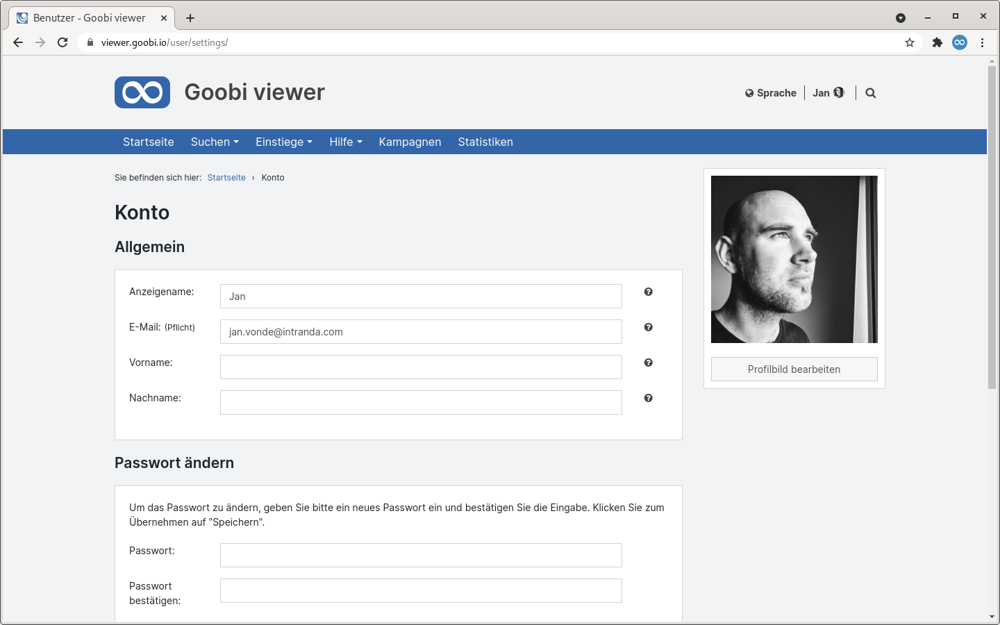
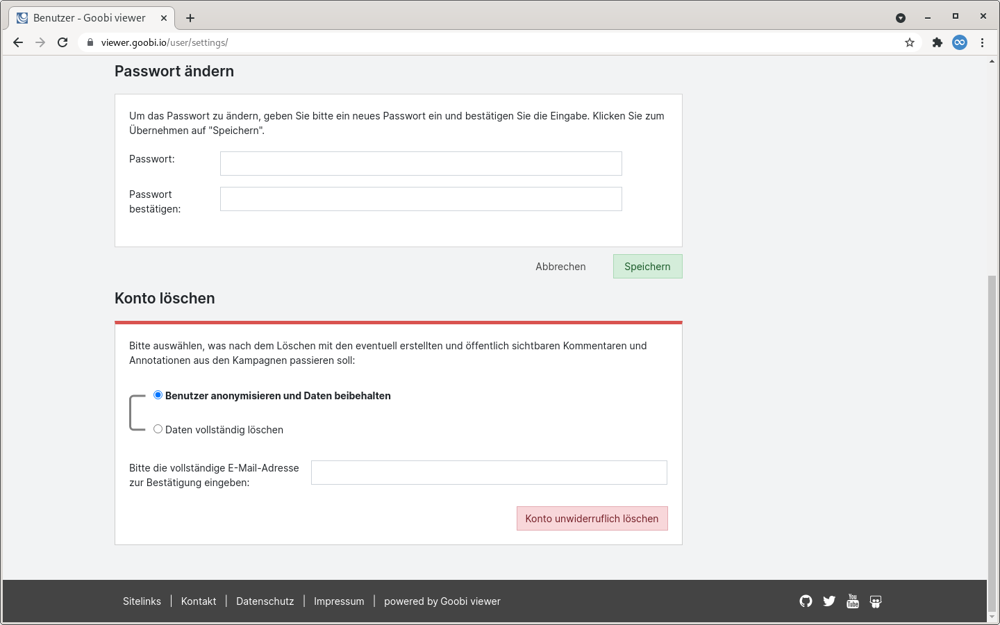
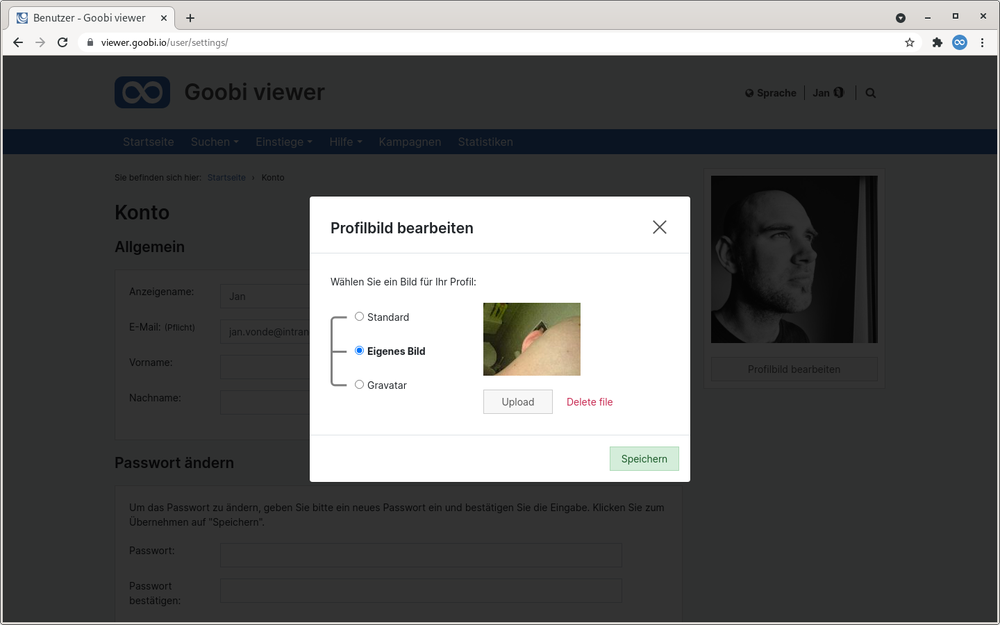
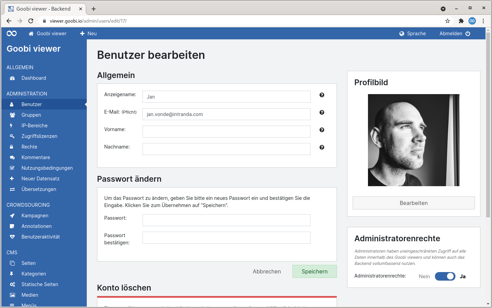
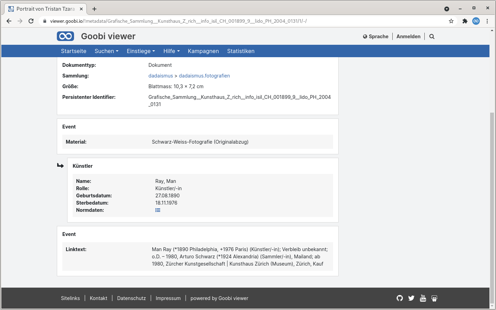
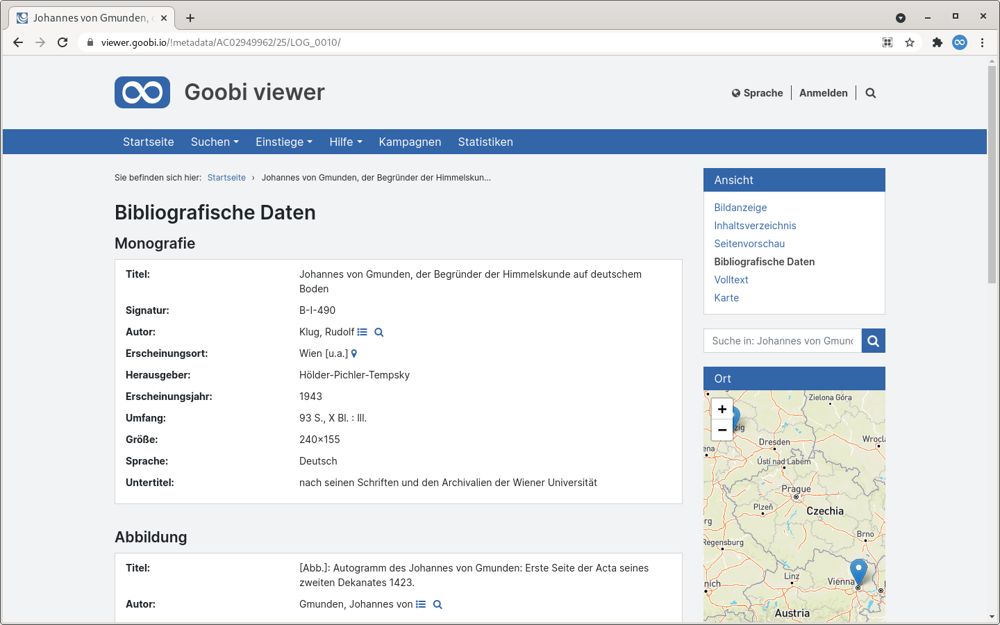
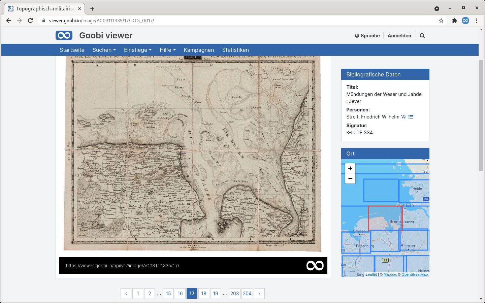

# September

## **C**oming soon 🚀

* Überarbeitung der **Kommentare**
* **Docker** Container
* **Benutzerdashboard** im Frontend

## Entwicklungen

### Docker


Mit dem September Release nimmt das Docker-Setup Gestalt an. Eine Vielzahl von Arbeiten wurde in diesem Monat in diesem Zusammenhang veröffentlicht. Dabei wurden bestehende Container angepasst und erweitert, es kamen neue hinzu und auch eine erste Installationsanleitung für den Produktivbetrieb steht ab sofort zur Verfügung.

Für die einfachere Verwaltung der verschiedensten Container und dessen Zusammenspiel wurde das Repository [goobi-viewer-docker](https://github.com/intranda/goobi-viewer-docker) veröffentlicht in dem alle notwendigen Dateien vorhanden sind um über Docker Compose ein Setup zu realisieren.

Für die Installation stehen zwei Szenarien zur Verfügung. Ein recht schnelles und triviales Testszenario und eines für den Produktiveinsatz. Für letzteres steht auch eine [eigene Installationsanleitung](https://docs.goobi.io/goobi-viewer-de/devop/3/2) zur Verfügung.

Wir haben im Produktivszenario darauf geachtet, dass sich möglichst vieles genauso verhält wie auch bei einer klassischen Installation. Das bedeutet, dass die Ordnerstruktur identisch ist und die entsprechenden Verzeichnisse und Konfigurationsdateien in die Container hineingereicht werden. Auch bekannte Aliase wie `ind` oder `cata` stehen analog zur Verfügung.

Insgesamt besteht das Goobi viewer Docker Setup aus den folgenden Containern:

* **goobi-viewer-docker**: Docker Compose Dateien \([Github](https://github.com/intranda/goobi-viewer-docker)\)
* **goobi-viewer-docker-solr**: Apache Solr für den Goobi viewer \([Github](https://github.com/intranda/goobi-viewer-docker-solr)\)
* **goobi-viewer-docker-proxy**: HTTP Proxy für den Goobi viewer \([Github](https://github.com/intranda/goobi-viewer-docker-proxy)\)
* **goobi-viewer-indexer**: Container mit dem Goobi viewer Indexer \([Github](https://github.com/intranda/goobi-viewer-indexer)\)
* **goobi-viewer-connector**: Container mit der Goobi viewer OAI & SRU Schnittstelle \([Github](https://github.com/intranda/goobi-viewer-connector)\)
* **goobi-viewer-theme-reference**: Container mit dem Goobi viewer Reference Theme \([Github](https://github.com/intranda/goobi-viewer-theme-reference)\)

Für den kommenden Monat stehen hier jetzt neben kleineren Entwicklungen vor allem Aufräumarbeiten, Polishing, Vereinheitlichung und Dokumentation an.

### Konto

Bisher konnten nur Administratoren ein Konto innerhalb des Goobi viewers löschen. Jetzt können Benutzer dieses in den überarbeiteten Kontoeinstellungen auch eigenständig. Weiter kann für ein Konto ein individuelles Profilbild hochladen werden. Bisher konnte hier nur zwischen einem Standardbild und dem Gravatar Dienst gewählt werden.

In dem Zuge der Überarbeitung des Bereiches wurde auch im Backend auf der Benutzerseite eine Sidebar eingeführt.









### Metadaten

Im Kontext Metadaten hat sich sehr viel getan. Vieles ist vielleicht auf den ersten Blick gar nicht sichtbar oder fällt erst bei einem Update auf.

Der Goobi viewer unterstützt nun die Anzeige von Metadatengruppen in Gruppen. Dabei ist es egal aus welchem Dateiformat \(LIDO, METS/MODS\) diese stammen. 



In diesem Zuge wurde im Code selbst kräftig aufgeräumt. Dieser Teil ist nämlich über die Jahre immer nur gewachsen. Er ist jetzt besser.

Für jeden sichtbar ist, dass der Dokumententyp oder ein Strukturtyp automatisch vor einem Block als Überschrift erscheint.



Auch im Kontext LIDO hat sich einiges verändert. So ist bei den Aufräumarbeiten zum Beispiel aufgefallen, dass es für die Konfiguration der Anzeige von Eventmetadaten in der Seitenleiste eine Vermischung mit dem Bereich der Hauptmetadaten gab. Ab jetzt regelt auch bei LIDO Metadaten der Block `<metadataView />` nur die Anzeige auf der dedizierten Seite, und in der `<sideBarMetadataList />` werden die Metadaten für die Seitenleiste definiert.

Weiter haben wir die Terminologie an den einzelnen Stellen angepasst, so dass bei LIDO Datensätzen einheitlich von "Metadaten" und nicht mehr teilweise von "Bibliographischen Daten" gesprochen wird.

Zu guter Letzt ist es jetzt auch Möglich Metadaten aus Events für die Anzeige in der `<searchHitMetadataList />` zu konfigurieren.

### Karten

Wenn für Strukturelemente Koordinaten erfasst sind werden diese als Marker oder als Bounding Box in der Seitenleiste angezeigt. Die Auswahl eines Strukturelementes war über die Karte bereits möglich.

Neu ist, dass das der aktive Marker oder die aktive Bounding Box jetzt visuell hervorgehoben werden. Dafür werden die Elemente rot eingefärbt. Auch wird automatisch zu dem aktiven Element gezoomt damit es gut sichtbar ist.



Bei der Facettierung können die Suchtreffer in der Karte über einen Schalter bei Bedarf initial ausgeblendet werden. Außerdem ist die Adresssuche in der Karte über Mapbox nun deaktivierbar. 

### Annotationen

Die Anzeige der Annotationen im Werk hat nun mehr Möglichkeiten. So ist das Widget in der Sidebar schlanker geworden und auch die Bedienbarkeit wurde verbessert. Die optionale Anzeige unter dem Bild verwendet nun die gleiche technische Infrastruktur wie das Sidebar Widget und die Anzeige der Texte im Bild lässt sich global deaktivieren, so dass nur der Rahmen sichtbar ist.

### Goobi viewer Indexer

Im Goobi viewer Indexer gab es eine größere interne Umstellung die das Einlesen und Verwalten der Konfigurationsdatei betrifft. Dies wurde für die Indexierung von mehrstufig gruppierten Metadaten notwendig. 

Weiter kann der Indexer jetzt auch für METS/MODS Dateien Bilder automatisch herunterladen, wenn der `_downloadImages` Indikatorordner im Dateisystem existiert.

Damit LIDO Events besser gefunden werden wird das Feld `ACCESSCONDITION` automatisch mitgeschrieben.

### Verschiedenes

* In dem CMS-Template "Einzelansicht einer Sammlung" wird nun auch die Trefferanzahl angezeigt und es stehen die Optionen zur Sortierung zur Verfügung
* Wird das Feedback-Modal über das Webfragment `#feedback` aufgerufen, so kann bei mehreren konfigurierten Adressen der vorausgewählte Eintrag ebenfalls dem Fragment mit übergeben werden, zum Beispiel `#feedback:recipient=unicorn`

## Versionsnummern

Die Versionen die in der `pom.xml` des Themes eingetragen werden müssen um die in diesem Digest beschriebenen Funktionen zu erhalten lauten:

```markup
<dependency>
    <groupId>io.goobi.viewer</groupId>
    <artifactId>viewer-core</artifactId>
    <version>21.09.3</version>
</dependency>
<dependency>
    <groupId>io.goobi.viewer</groupId>
    <artifactId>viewer-core-config</artifactId>
    <version>21.09</version>
</dependency>
```

Der **Goobi viewer Indexer** hat die Versionsnummer **21.09**

Der **Goobi viewer Connector** hat die Versionsnummer **21.09**

Das **Goobi viewer Crowdsourcing Modul** hat die Versionsnummer **21.09.1**

