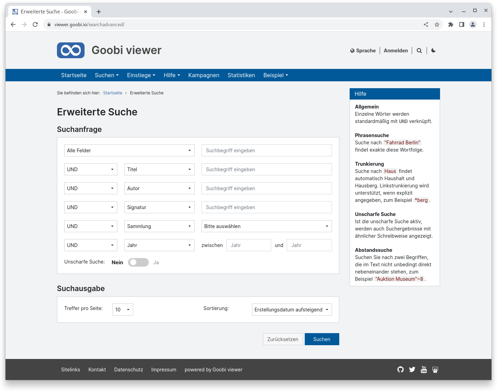
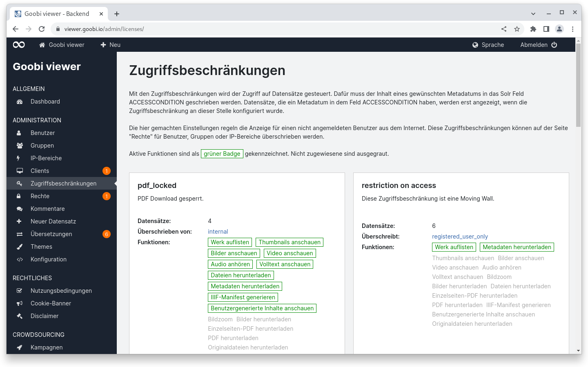
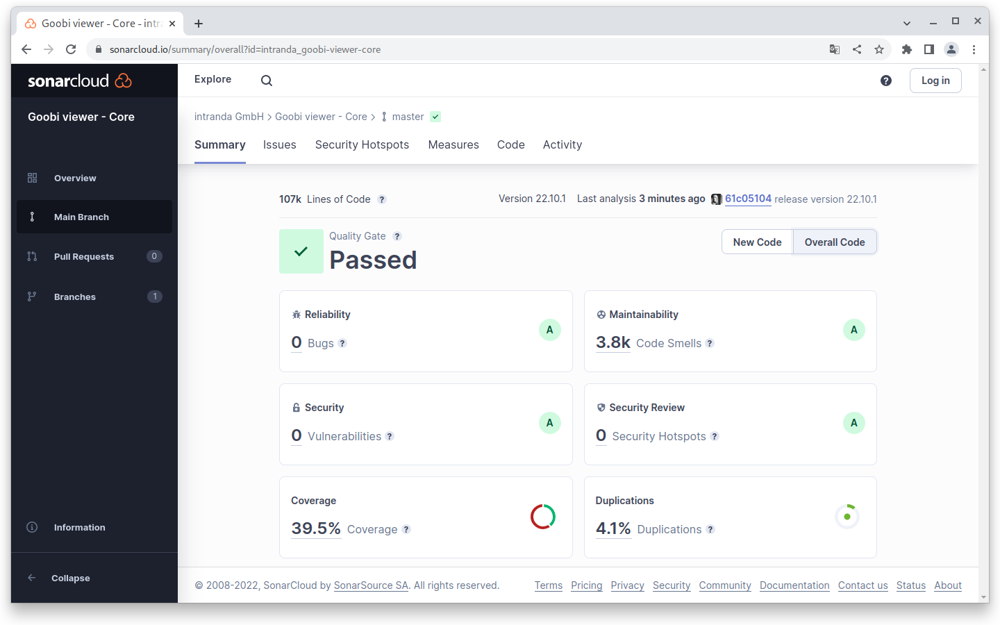
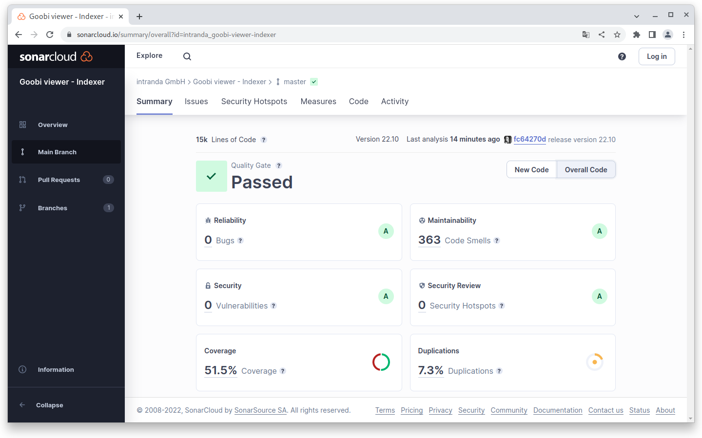
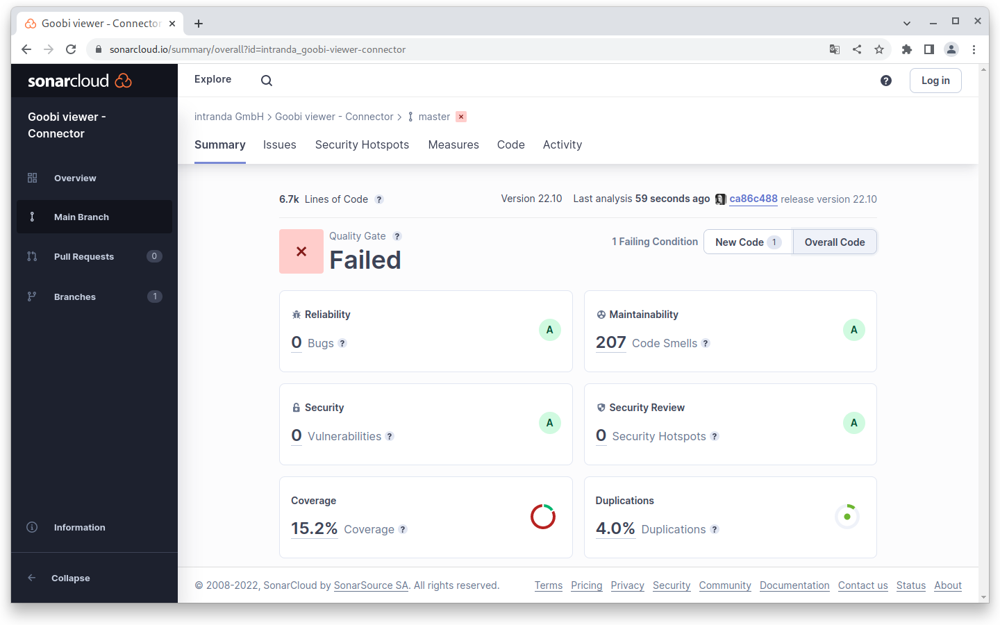

# Oktober

## Coming soon :rocket:

* **Überarbeitung** des **CMS**-Bereichs
* **kompakte** und hochaufgelöste **PDF Dateien**
* **Authentifizierung**

## Entwicklungen

### Suche

Die Oberfläche für die erweiterte Suche wurde vollständig überarbeitet. Dabei haben wir uns von dem bestehenden Konzept gelöst und auf Basis einer Evaluation mit der Community einen Vorschlag erarbeitet und umsetzen können.

Die neue Suchmaske ist jetzt grundsätzlich nur noch dafür ausgelegt auf einer eigenständigen Seite angezeigt zu werden. Vorher konnten optional die Suchtreffer darunter platziert werden. Der Umstand führte immer zu einem Konflikt zwischen Bedienbarkeit und Funktionalität. Die klare Trennung räumt damit auf und bringt viele Vorteile mit. So steht nun erstmals eine direkt sichtbare Hilfe in der Sidebar zur Verfügung, die die verschiedenen Suchoptionen inklusive Beispielen beschreibt. Außerdem kann die unscharfe Suche jetzt bei einer Suchabfrage optional dazugeschaltet werden. Vorher musste die Funktionalität global für eine Installation ein- oder ausgeschaltet sein.&#x20;

<figure><figcaption><p>Neue Seite für die Erweiterte Suche</p></figcaption></figure>

### Konfiguration

Vor einem Jahr haben wir in der Konfigurationsdatei schon einmal aufgeräumt und Schreibweisen vereinheitlicht etc. Siehe dazu auch den Digest von August 2021:



Im vergangenen Monat haben wir das Thema noch einmal aufgegriffen, ordentlich aufgeräumt und die Arbeiten in dem Bereich vorerst abgeschlossen. Elemente die zwar konfigurierbar waren aber nie angepasst wurden haben wir zurückgebaut, Schalter wurden verschoben oder überhaupt dokumentiert.

Ziel dieser Arbeiten war und ist, die inzwischen beachtlich große Konfigurationsdatei verständlich zu halten. So ist es unserer Ansicht nach zum Beispiel wichtig, dass die Terminologie im Frontend, Code und Backend einheitlich ist. Auch sollten Schalter immer gleich formuliert sein und nicht bei dem einen `<functionFoo enabled="true" />` und bei einem anderen `<barFunction disabled="true" />` stehen. \
Auch das Entfernen von obsoleten Einträgen trägt dazu bei, dass die Konfigurationsdatei trotz seines Umfangs übersichtlich bleibt.

Mehr zu dem Thema in der [Updateanleitung](https://docs.goobi.io/goobi-viewer-de/devop/1/2022#22.10)

### Zugriffsbeschränkungen

Gerade wenn Funktionalität wenig in Verwendung ist muss sie möglichst klar sein. Das ist aber umso schwerer je komplexer die Materie wird. Einer dieser Bereiche befindet sich in den Zugriffsbeschränkungen: Ein Datensatz kann mehrere Zugriffsbeschränkungen enthalten. Der folgende Anwendungsfall verdeutlicht das:

* Ein Datensatz hat die Zugriffsbeschränkung `metadaten_registriert` und `frei_lesesaal`
* Der Datensatz ist **standardmäßig weltweit **_**nicht**_** sichtbar**
* Die Zugriffsbeschränkung `metadaten_registriert` bedeutet, dass Forscher, die einer bestimmten Benutzergruppe angehören **nach dem Anmelden die Metadaten des Datensatzes lesen dürfen**.
* Die Zugriffsbeschränkung `frei_lesesaal` bedeutet, dass aus dem **IP-Adressbereich des Lesesaals der Datensatz vollständig zugänglich** ist

An dieser Stelle ist nun notwendig festzulegen welche der beiden Zugriffsbeschränkungen höher gewichtet ist und die andere überschreibt. Ansonsten kann es zu dem Fall kommen, dass sich ein Forscher im Lesesaal anmeldet und anschließend weniger sieht als vorher.

Um das klarer zu machen haben wir die Logik, Benennung und Erklärung im Backend angepasst. So wird jetzt unter anderem auf der Übersichtsseite der Zugriffsbeschränkungen in den Kacheln angezeigt ob eine Beschränkung eine andere überschreibt, oder ob sie von einer anderen überschrieben wird. &#x20;

<figure><figcaption><p>Weitere Informationen zur konfigurierten Zugriffsbeschränkung in der Übersicht</p></figcaption></figure>


Die Logik bei dem Überschreiben von Zugriffsbeschränkungen ist jetzt anders als vorher. Bei einem Update muss diese Funktionalität geprüft werden sofern sie verwendet wird!


### REST API

In der REST API steht ein neuer Endpoint zur Verfügung um eine Liste aller Datensätze zu generieren, die in einem bestimmten Jahr über die Moving Wall Funktionalität freigeschaltet wurden/werden.&#x20;

Die Antwort liefert immer alle Datensätze für das angefragte Jahr. Wenn ein Datensatz in dem angefragten Jahr erst an einem späteren Zeitpunkt freigeschaltet wird, so ist dieser ebenfalls enthalten. Da für jeden Datensatz ein genaues Datum angezeigt wird lassen sich diese Fälle aber sehr einfach erkennen.

Der Zugriff auf die Information ist abgesichert und nur mit einem TOKEN möglich.

### Desktop Client

Der Quelltext des Desktop Clients steht jetzt auf Github zur Verfügung:



### Snippets

* Im Backend wurden weitere Benachrichtigungen auf Sweetalerts umgestellt um so ein homogenes UI zu gewährleisten.
* Die Indexierung von Normdaten kann jetzt im Goobi viewer Indexer komplett deaktiviert werden.
* Die Parameter from/until werden im Goobi viewer Connector bei der OAI Schnittstelle jetzt auch ausgewertet, wenn Sets abgefragt werden.
* Wir haben die Applikation mit verschiedenen externen Tools von extern gescannt um mögliche XSS Sicherheitslücken zu finden. Es wurden keine Schwachstellen gefunden.

## Codeanalyse

Die folgenden Screenshots zeigen die SonarCloud Analyse des aktuellen Releases. Weitere Informationen gibt es direkt auf der [Projektseite](https://sonarcloud.io/organizations/intranda/projects).

<figure><figcaption><p>SonarCloud Analyse: Goobi viewer Core - für den Git Tag v22.10.1</p></figcaption></figure>

<figure><figcaption><p>SonarCloud Analyse: Goobi viewer Indexer - für den Git Tag v22.10</p></figcaption></figure>

<figure><figcaption><p>SonarCloud Analyse: Goobi viewer Connector - für den Git Tag v22.10</p></figcaption></figure>

Ein paar Worte zu der fehlschlagenden Analyse im Connector:

In SonarCloud lassen sich Qualitätsanforderungen, sogenannte Quality Gates, definieren. Die Quality Gates werden einmal auf den gesamten Quelltext angewendet und einmal auf den Quelltext der in den letzten 30 Tagen geändert wurde.

Das jetzt fehlschlagende Quality Gate im Goobi viewer Connector bezieht sich auf den angepassten Quelltext in den letzten 30 Tagen. Dort wird eine Testabdeckung von 25% gefordert, es gibt aber nur eine Abdeckung von 17,8%. Ursache dafür ist, dass bei Refaktorisierungsarbeiten viel Quelltext angefasst wurde und dieser jetzt als neu gilt.&#x20;

Das Quality Gate für den gesamten Quelltext wird erfüllt.

Absolut wurden im Goobi viewer Connector im Vergleich zum letzten Monat **178 Code Smells entfernt**, **15 Unit Tests hinzugefügt** und die **Testabdeckung um 5% gesteigert**!

## Versionsnummern

Die Versionen die in der `pom.xml` des Themes eingetragen werden müssen um die in diesem Digest beschriebenen Funktionen zu erhalten lauten:

```xml
<dependency>
    <groupId>io.goobi.viewer</groupId>
    <artifactId>viewer-core</artifactId>
    <version>22.10.1</version>
</dependency>
<dependency>
    <groupId>io.goobi.viewer</groupId>
    <artifactId>viewer-core-config</artifactId>
    <version>22.10.1</version>
</dependency>
<dependency>
    <groupId>io.goobi.viewer</groupId>
    <artifactId>viewer-connector</artifactId>
    <version>22.10</version>
</dependency>
```

Der Goobi viewer Indexer hat die Versionsnummer **22.10** Das Goobi viewer Crowdsourcing Modul hat die Versionsnummer **22.10**
