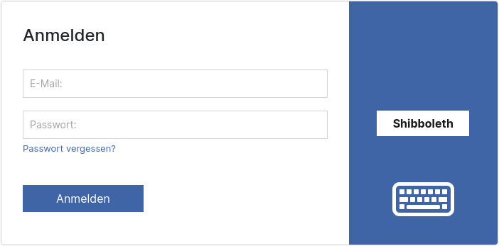
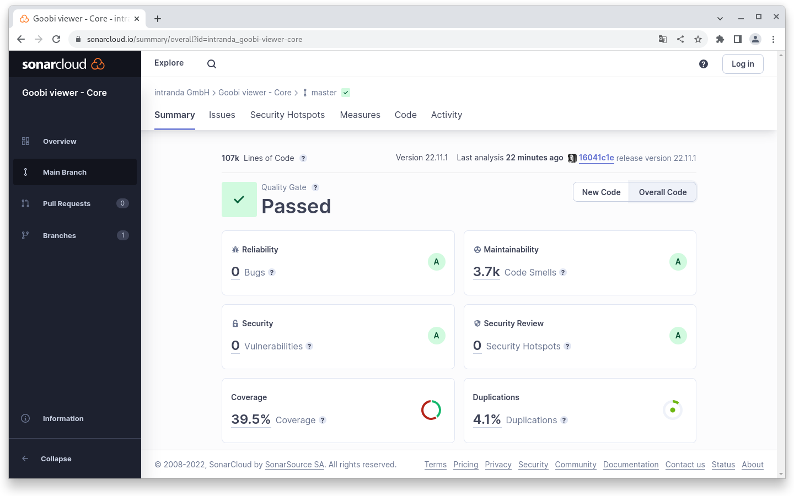
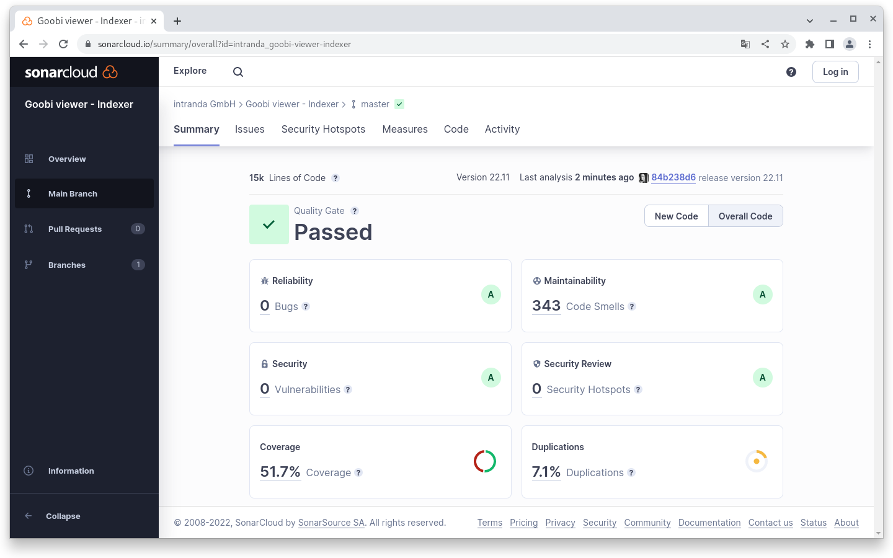
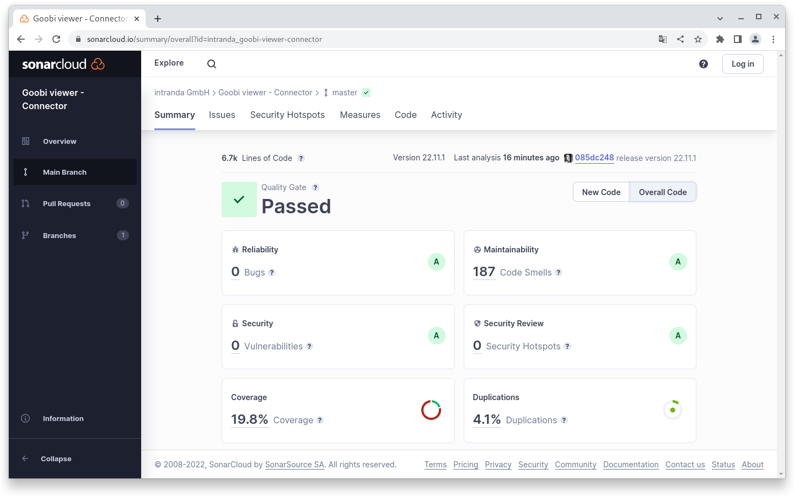

# November

## Coming soon :rocket:

* **Überarbeitung** des **CMS**-Bereichs
* **kompakte** und hochaufgelöste **PDF Dateien**

## Entwicklungen

### SAML / Shibboleth

Bereits im April 2020 wurde für die Authentifizierung eine erste SAML Implementierung in den Goobi viewer Core übernommen. Jetzt, zweieinhalb Jahre später, ist diese Implementierung vollständig und dabei so generisch geworden, dass sie zum Beispiel eine Authentifizierung über Shibboleth erlaubt.

Die jetzige Implementierung im Goobi viewer lehnt sich an dem an, was schon einige Zeit in Goobi workflow existiert und dort seine praxistauglichkeit unter Beweis gestellt hat. Die Lösung erlaubt für die Authentifizierung die Auswertung von HTTP-Headern oder Attributen. Das hat den großen Vorteil, dass sie für viele verschiedene Einsatzszenarien infrage kommen kann. Die eigentliche Authentifizierung wird - in dem konkreten Fall hier mit Shibboleth - jetzt nämlich dem shibd Service Provider und einem Apache Modul überlassen. Der Goobi viewer wertet am Ende nur noch das Ergebnis aus. Auf diese Art- und Weise sind noch viele weitere Authentifizierungsarten möglich.

Da die initiale Konfiguration ein bisschen komplexer ist, haben wir unsere Erfahrungen noch einmal  in einem dedizierten Anwendungsfall beleuchtet. Siehe dazu auch Kapitel 1.14 im Abschnitt Verschiedenes in der Goobi viewer Dokumentation.&#x20;

<figure><figcaption><p>Anmeldebildschirm mit aktivierter Shibboleth Authentifizierung</p></figcaption></figure>

### Snippets

* Wenn mehrere Goobi viewer Instanzen auf einem Server installiert sind und bisher bei jedem Update in der globalen Konfigurationsdatei der Standardpfad zum lokalen `<configFolder />` angepasst werden musste, kann dieses ab sofort auch als Java Variable übergeben werden. Die Einstellung kann zum Beispiel in der `/etc/default/tomcat9` erfolgen: `JAVA_OPTS="${JAVA_OPTS} -DconfigFolder=/path/to/second/viewer/config/"`
* Das Crowdsourcing Modul wurde intern auf die Standard Maven Orderstruktur umgestellt
* Basierend auf einer [Diskussion im Community Forum](https://community.goobi.io/t/zitierempfehlung-konfigurierbar/868) hat es kleinere Änderungen an den Möglichkeiten zur Zitierempfehlung gegeben
* Im Goobi viewer Indexer wird nun bei einer gescheiterten Indexierung der Dateiname in der Fehleremail explizit genannt.

## Codeanalyse

Die folgenden Screenshots zeigen die SonarCloud Analyse des aktuellen Releases. Weitere Informationen gibt es direkt auf der [Projektseite](https://sonarcloud.io/organizations/intranda/projects).

<figure><figcaption><p>SonarCloud Analyse: Goobi viewer Core - für den Git Tag v22.11.1</p></figcaption></figure>

<figure><figcaption><p>SonarCloud Analyse: Goobi viewer Indexer - für den Git Tag v22.11 </p></figcaption></figure>

<figure><figcaption><p>SonarCloud Analyse: Goobi viewer Connector - für den Git Tag v22.11.1</p></figcaption></figure>

## Versionsnummern

Die Versionen die in der `pom.xml` des Themes eingetragen werden müssen um die in diesem Digest beschriebenen Funktionen zu erhalten lauten:

```xml
<dependency>
    <groupId>io.goobi.viewer</groupId>
    <artifactId>viewer-core</artifactId>
    <version>22.11.1</version>
</dependency>
<dependency>
    <groupId>io.goobi.viewer</groupId>
    <artifactId>viewer-core-config</artifactId>
    <version>22.11</version>
</dependency>
<dependency>
    <groupId>io.goobi.viewer</groupId>
    <artifactId>viewer-connector</artifactId>
    <version>22.11.1</version>
</dependency>
```

Der Goobi viewer Indexer hat die Versionsnummer **22.11**\
****Das Goobi viewer Crowdsourcing Modul hat die Versionsnummer **22.11**
