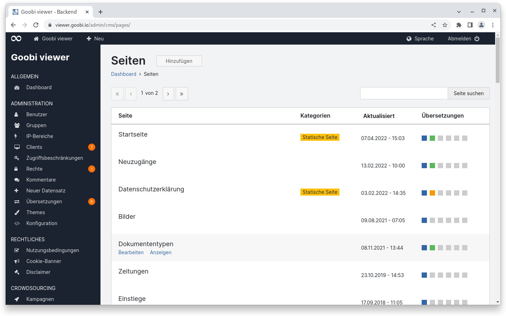
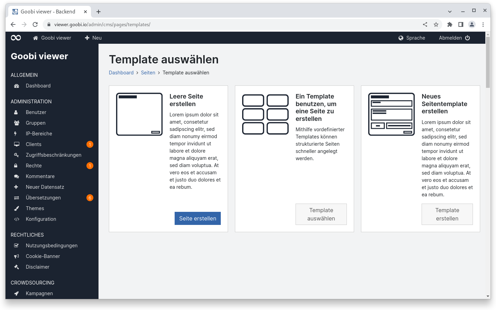
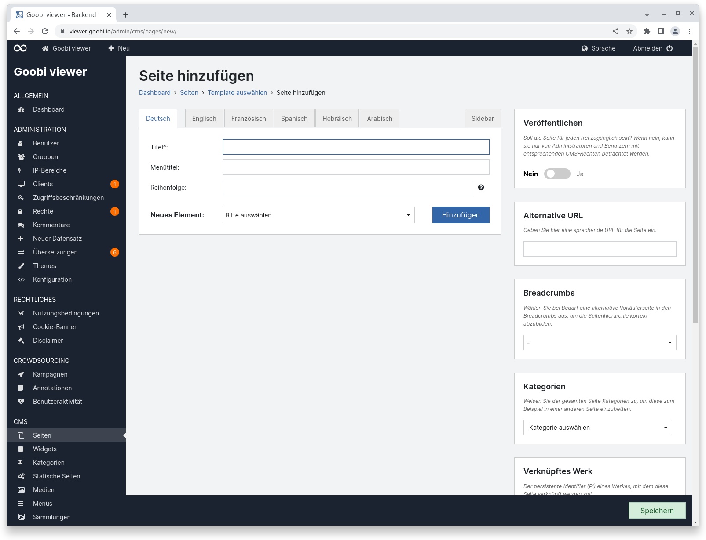
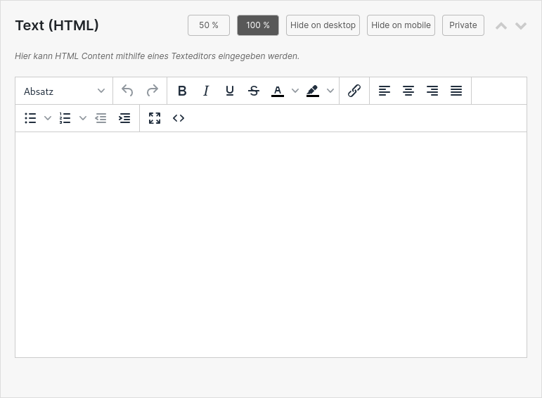
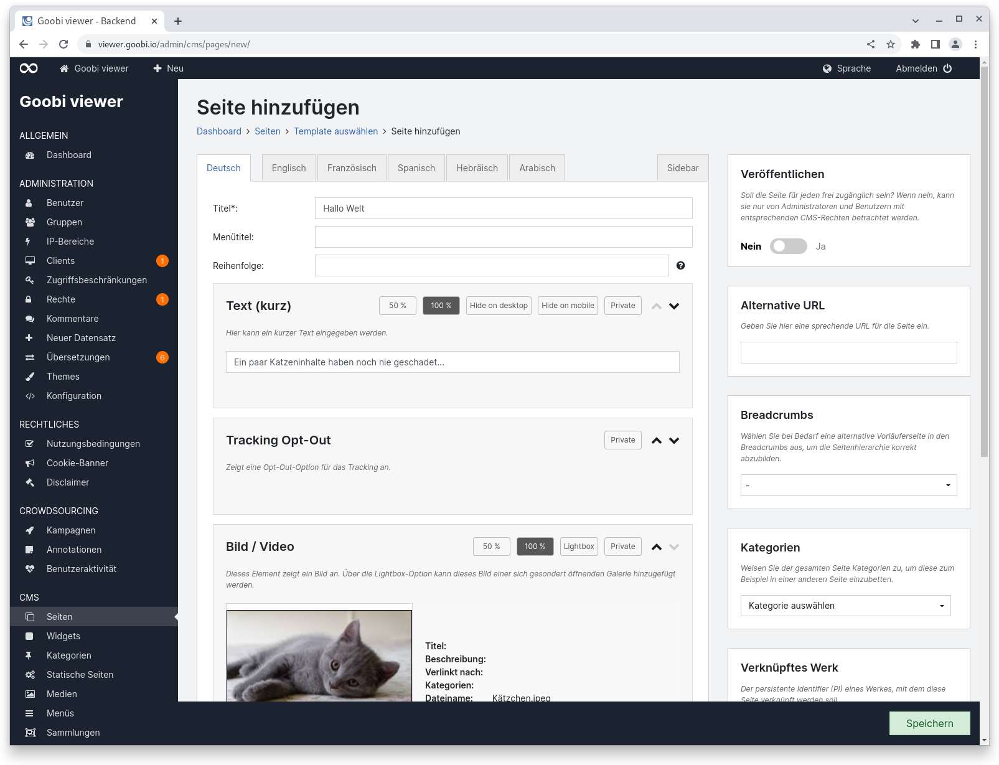
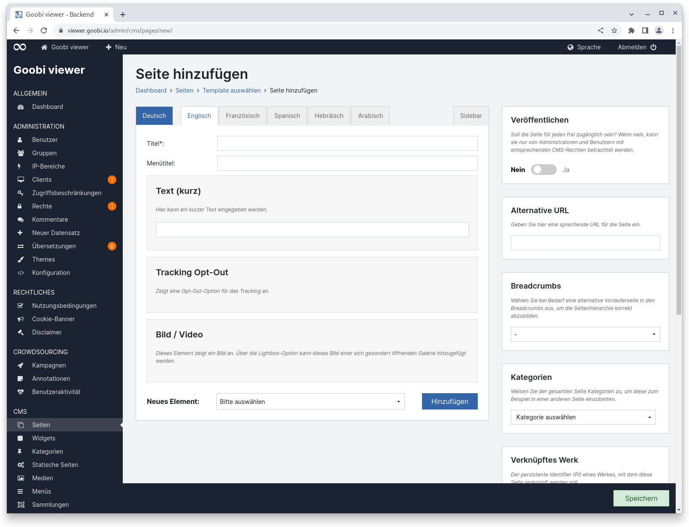
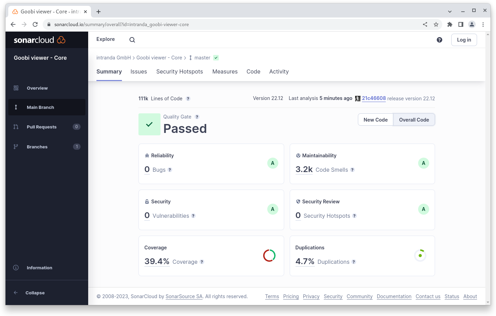
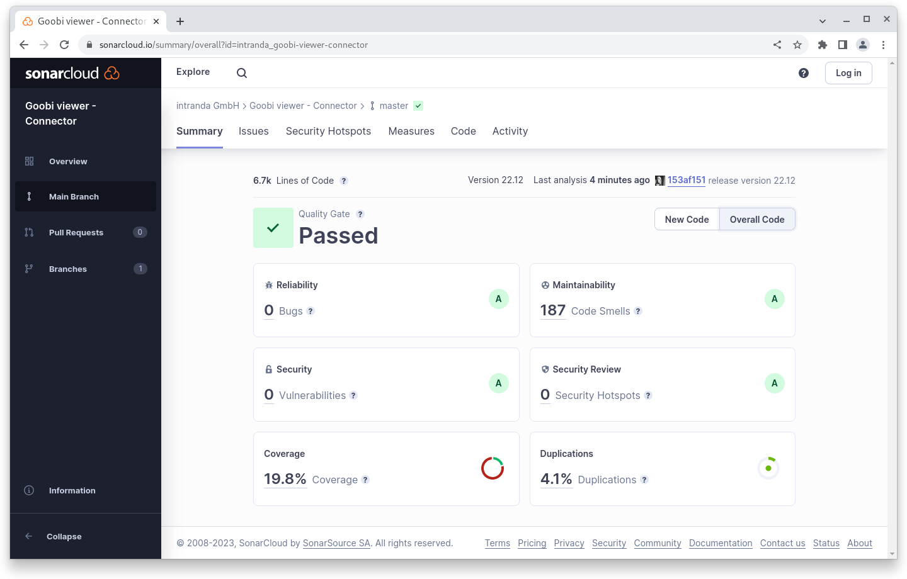

# Dezember

## Coming soon :rocket:

* **kompakte** und hochaufgelöste **PDF Dateien**

## Entwicklungen

### CMS

Endlich ist es da. Wir haben lange darüber geredet und viel zu lange daran entwickelt, aber der initiale Aufschlag für die Überarbeitung des CMS-Bereichs ist fertig. Die Ideen dafür sind bereits fast drei Jahre alt, ein Konzept wurde vor zwei Jahren erstellt und die Vorstellung im Community Forum ist auch schon über ein einhalb Jahre her. Lange haben wir entwickelt und dabei auch immer wieder feststellen müssen, dass Ideen in der Form nicht realisierbar waren oder wir Bereiche vergessen hatten mit zu bedenken. Jetzt sind wir in einem Status angelangt, bei dem wir die Entwicklungen veröffentlichen möchten.

#### Hintergrund

Der CMS-Bereich des Goobi viewers wurde im Bereich 2014 konzipiert und seitdem immer nur inhaltlich erweitert, nie aber von seinem Aufbau und seiner Struktur evaluiert. Das hatte verschiedene Gründe aber sollte dann aber vor ein paar Jahren nicht mehr als Ausrede gelten, wo wir den CMS-Bereich neben der Bildanzeige und dem Suchindex als eines der Kernkomponenten des Goobi viewers sehen.

Der Kerngedanke des CMS-Bereichs war, dass über Templates ein Seitenaufbau vorgegeben werden kann. Diese Templates stehen einerseits global zur Verfügung, können andererseits aber auch kundenspezifisch Entwickelt und dann im Theme hinterlegt werden. Dabei besteht ein CMS-Template aus verschiedenen Inhalten wie Text, Bild, Suchtreffern, etc. Neben diesen Inhalten selbst, sollen diese aber teilweise auch konfigurierbar sein und die Seite selbst enthält auch Einstellmöglichkeiten für die Seite selbst. Konfiguration von Inhalten sind zum Beispiel eine Solr-Query zur Einschränkung für Suchtreffer, Konfiguration von der Seite selbst ist zum Beispiel die alternative URL. Darüber hinaus enthält jede CMS-Seite eine Sidebar und auch diese ist seitenspezifisch konfigurierbar.

#### Bisherige Einschränkungen

Eine der Haupteinschränkungen im bisherigen Modell war die Starrheit der Seiten. Wenn auf einer Seite zwei Texte, ein Kachelgrid und eine Suchtrefferliste angezeigt werden sollten, dann konnten wir genau das über ein kundenspezifisches Template abbilden. Wenn dann aber ein weiterer Text hinzu kommen sollte mussten wir das Template aktualisieren und im Zweifelsfall damit einher gehend auch den ganzen Goobi viewer. Für eine kleine Textanpassung an einer CMS-Seite die innerhalb von fünf Minuten gemacht sein kann kamen da vielleicht mehrere Stunden Aufwand auf unserer Seite zu. Das war nicht nur für die Anwender, sondern auch für uns unbefriedigend. Das einfache und kreative erstellen von Seiten war nicht möglich.

Dazu kam, das ein über viele Jahre gewachsenes System einfach unübersichtlich wurde. Ideen, die wir bei der initialen Konzeption hatten, haben sich als als praxistauglich herausgestellt, wurden aber nicht geändert. Neue Funktionalität kam hinzu und wurde einfach irgendwo hinzugefügt wo es gerade passte. Dazu kommt auch, dass es einfacher ist eine Checkbox zur Verfügung zu stellen in der ein Anwender klicken muss ob er etwas möchte als es mit Logik im Code zu lösen und "intelligent" zu gestalten.

#### Was neu ist

Bei der Überarbeitung des Bereichs haben wir als erstes darauf geachtet, dass wir die visuellen Elemente aus dem Bedienkonzept der anderen Bereiche auf den CMS-Bereich adaptieren. So wird zum Beispiel der Übersetzungsstatus von einer Seite in der Übersicht jetzt auch über die farbigen Kästen angezeigt und nicht mehr über die Checkboxen. Das hat den Vorteil, dass auch teilweise übersetzte Seiten visualisiert werden können.

<figure><figcaption><p>CMS Seiteübersicht mit neuer Übersetzungsanzeige</p></figcaption></figure>

Wenn eine neue CMS-Seite hinzugefügt werden soll, steht ab sofort eine Auswahl zur Verfügung, ob mit einer leeren Seite begonnen, einer Seite basierend auf einem Template angelegt oder ein neues Seitentemplate angelegt werden soll.

<figure><figcaption><p>Auswahl was im CMS neu hinzugefügt werden soll</p></figcaption></figure>

Die Anzeige zum Hinzufügen oder Bearbeiten einer Seite oder Template ist immer gleich aufgebaut. Der Hauptbereich beinhaltet die bekannten Reiter für die verfügbaren Sprachen die auch den Übersetzungsstatus visualisieren. Rechtsbündig von den Übersetzungen ist der Reiter für die Sidebar der Seite verortet. In der Sidebar sind alle Optionen die generelle Seiteneinstellungen beinhalten. Ganz unten auf der Seite gibt es immer sichtbar eine Aktionsleiste, die - je nach Seitenstatus - die Buttons zum Speichern, Löschen und Anzeigen enthält. So können die Aktionen nicht mehr rausscrollen.

Innerhalb des Hauptbereiches befindet sich mit dem Titel das einzige Pflichtfeld für eine Seite.

<figure><figcaption><p>Neue leere CMS-Seite</p></figcaption></figure>

Komplett neu ist ab dann die Möglichkeit die Elemente auf einer CMS-Seite auszuwählen, anzuordnen und zu konfigurieren. In einem DropDown Menü stehen alphabetisch sortiert die Elemente zur Verfügung, die auf der Seite hinzugefügt werden können. Ein Element besteht aus verschiedenen Inhalten. Neben der Überschrift gibt es Attribute die das Element steuern. In dem folgenden Beispiel für einen HTML Text sind das die folgenden:

* 50% und 100%: Steuert wie viel Breite das Element im Content-Bereich der Seite einnehmen soll. Zwei 50% Inhalte werden dabei automatisch nebeneinander dargestellt.
* Hide on desktop / mobile: Steuert ob das Element auf einem einem großen Bildschirm beziehungsweise auf einem Mobilgerät ausgeblendet werden soll
* Private: Steuert ob das Element grundsätzlich veröffentlicht sein soll oder nicht. Als Privat markierter Elemente sind nur für Administratoren sichtbar und werden auf der Seite auch visuell gekennzeichnet
* Reihenfolge: Über die beiden Pfeile nach oben und unten kann die Reihenfolge der Elemente auf einer Seite frei nach oben und unten geschoben werden

<figure><figcaption><p>Text (HTML) Element mit Attributen im Kopfbereich</p></figcaption></figure>

In der Regel hat ein Element auch einen kleinen Hilfetext. Je nachdem was mit einem Element dann möglich ist, gibt es weitere Optionen. In dem Beispiel von dem HTML Text kann ein entsprechender Text eingegeben werden.

Andere Elemente, wie zum Beispiel ein Tracking Opt-Out haben keine weiteren Einstellmöglichkeiten sondern werden nur als Element angezeigt.

Elemente wie die Suchtreffer können dann dann weiter konfiguriert werden: Solr-Query, Sortierfelder, Gruppierung etc.

Die einzige Einschränkung die an dieser Stelle existiert ist, dass nicht mehr als ein Element pro CMS-Seite verwendet werden darf, dass potentiell mehrere Seiten hat. Da die Paginierung über die URL abgebildet wird, um die aktuell sichtbare Seite einfach weitergeben zu können, wäre sonst nicht klar in welchem Element geblättert worden wäre.

In den Reitern mit den Übersetzungen werden alle Elemente angezeigt, aber nur die übersetzbaren Inhalte sind steuerbar. Attribute, Konfigurationsoptionen oder die Möglichkeit zum Löschen steht nur in der Primärsprache zur Verfügung. Dadurch soll vermieden werden, dass der Eindruck entsteht, dass für verschiedene Sprachen verschiedene Einstellmöglichkeiten zur Verfügung stehen.

<figure><figcaption><p>Einstellmöglichkeiten für Elemente stehen nur in der Primärsprache zur Verfügung</p></figcaption></figure>

<figure><figcaption><p>In den Übersetzungen wird die Struktur der Elemente sichtbar, editiert werden können aber nur Texte</p></figcaption></figure>

Bestehende CMS-Seiten aus früheren Core-Templates werden bei einem Update automatisch migriert. Dafür wurde pro altem Template eine Legacy-Komponente angelegt. Dennoch sollten bei jedem Update auf einen Goobi viewer mit dem neuen CMS einmal alle bestehenden Seiten von Hand geprüft werden. Auch empfehlen wir die bestehenden Seiten von Legacy-Templates in dynamische Seiten zu überführen. Wenn wir nach einem Update gefragt werden bieten wir das gerne mit an. Bestehende Theme-Templates müssten geprüft und gegebenenfalls in neue Elemente überführt werden. Das wird individuell von Installation zu Installation geprüft.


**Ein Wort zum Schluss**: Der Umbau war massiv und wir können nicht ausschließen, dass es noch an der ein- oder anderen Stelle hakt. Wir bitten hier um Nachsicht, werden selbstredend Fehler korrigieren und mit Point Releases zur Verfügung stellen. Fehlende Features fließen dann jeweils in die nächste stabile Version ein.


### Snippets

* Der Goobi viewer Core wie auch der Goobi viewer Indexer können jetzt beim Verbindungsaufbau nach extern einen Proxy Server verwenden. Das ist zum Beispiel bei der Live-Abfrage von Normdaten sinnvoll.
* Bei aktivierten DataRepositories prüft der Goobi viewer Indexer nach dem Indexieren ob derselbe Datensatz auch in einem anderen DataRepository enthalten ist und löscht den dort sofern vorhanden.
* Tabellen im Backend enthalten jetzt deutlich mehr Einträge, so dass weniger geblättert werden muss
* Seiten im Backend haben jetzt Breadcrumbs. Dadurch wird die Navigation in der Seitenhierarchie deutlich ergonomischer.

### Was kommen wird

#### Warteschlange

Bereits in der Entwicklung ist eine überarbeitete Warteschlangenfunktionalität die die bisher über nur in der REST-API verfügbaren Tasts um Funktionalitäten wie Persistenz, graphische Oberfläche, potentielles Clustering sowie erweiterte Steuerungsmöglichkeiten wie zum Beispiel dem Pausieren von einzelnen Jobs ermöglicht. Einher gehen mit der Entwicklung geht die Möglichkeit PDF-Dateien im Goobi viewer automatisch vorrendern zu lassen

#### Facetten

Auch in diesem Jahr wollen wir weiter an der Ergonometrie der Suche arbeiten. Dabei stehen zum Beispiel verbesserte Facettierungsoptionen auf dem Plan. Die Facettierung nach Zeit soll über mehrere verschiedene Metadaten unabhängig möglich sein (zum Beispiel Geburtsdatum und Sterbedatum). Außerdem soll ein Graph die Anzahl der Suchtreffer in einem Zeitabschnitt visualisieren.

Ebenfalls neu hinzukommen soll die Möglichkeit der Facettierung nach Anfangsbuchstaben. Ähnlich wie das Stöbern, allerdings mit vollwertigen Suchtreffern, die gleich auch Thumbnail und weitere Informationen mitbringen

#### Karten

Marker auf Karten sollen einen Typ mitbekommen können, so dass zum Beispiel eine Karte mit Lebensstationen eines Künstlers angezeigt werden kann, auf der einzelne Stationstypen (Geburtsort, Ausbildungsort, Entstehungsort eines Werkes, Ausstellungsorte, Sterbeort) jeweils eigene Marker bekommen

#### Sidebar

Geplant ist auch die Steuerung der Sidebarkomponenten pro Seite konfigurierbasr zu machen. Dafür sind größere technische Umbauten notwendig um die Konfigurierbarkeit im Java Code zu ermöglichen. Die Steuerung ist bisher nur für CMS-Seiten möglich, soll ab dann aber auch für Core-Seiten gelten.

Diese Entwicklung soll dann auch die automatische Ausdehnung des Content-Bereiches auf die gesamte Seitenbreite ermöglichen, wenn keine Sidebar Widgets angezeigt werden.

#### Weiteres

Grundsätzlich ist bei uns geplant gerade den Bereich der Bedienbarkeit im Frontend zu verbessern. Dabei wollen wir in Absprache mit den Anwendern größere und kleinere Teilbereiche identifizieren und überarbeiten, so dass sich diese Bereiche weniger gewachsen und konsistenter anfühlen.

## Codeanalyse

Die folgenden Screenshots zeigen die SonarCloud Analyse des aktuellen Releases. Weitere Informationen gibt es direkt auf der [Projektseite](https://sonarcloud.io/organizations/intranda/projects).

<figure><figcaption><p>SonarCloud Analyse: Goobi viewer Core - für den Git Tag v22.12</p></figcaption></figure>

<figure><figcaption><p>SonarCloud Analyse: Goobi viewer Indexer - für den Git Tag v22.12</p></figcaption></figure>

<figure><figcaption><p>SonarCloud Analyse: Goobi viewer Connector - für den Git Tag v22.12</p></figcaption></figure>

## Versionsnummern

Die Versionen die in der `pom.xml` des Themes eingetragen werden müssen um die in diesem Digest beschriebenen Funktionen zu erhalten lauten:

```xml
<dependency>
    <groupId>io.goobi.viewer</groupId>
    <artifactId>viewer-core</artifactId>
    <version>22.12</version>
</dependency>
<dependency>
    <groupId>io.goobi.viewer</groupId>
    <artifactId>viewer-core-config</artifactId>
    <version>22.12</version>
</dependency>
<dependency>
    <groupId>io.goobi.viewer</groupId>
    <artifactId>viewer-connector</artifactId>
    <version>22.12</version>
</dependency>
```

Der Goobi viewer Indexer hat die Versionsnummer **22.12**\
****Das Goobi viewer Crowdsourcing Modul hat die Versionsnummer **22.11**
