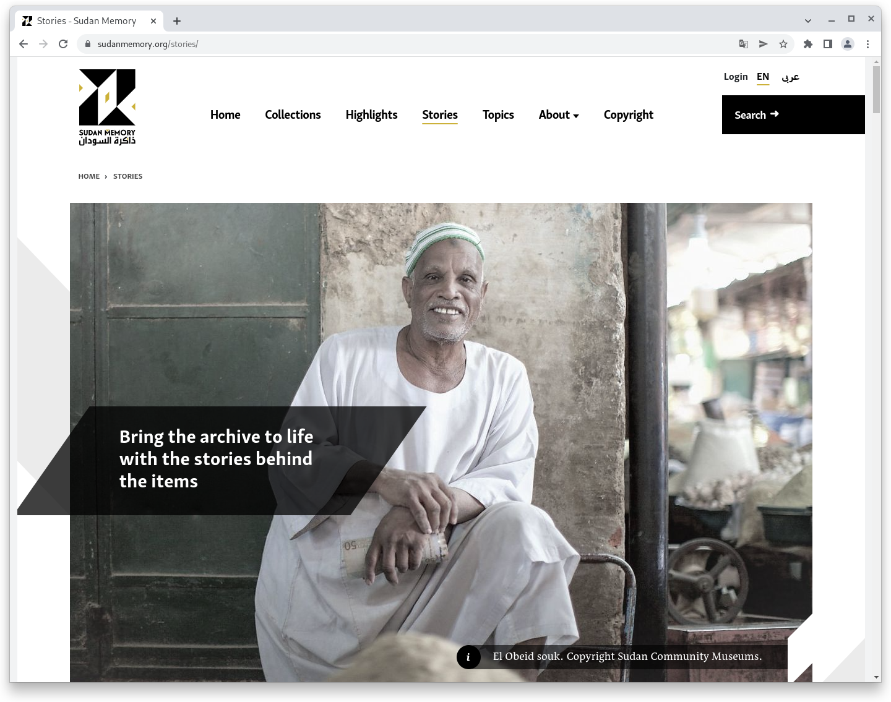
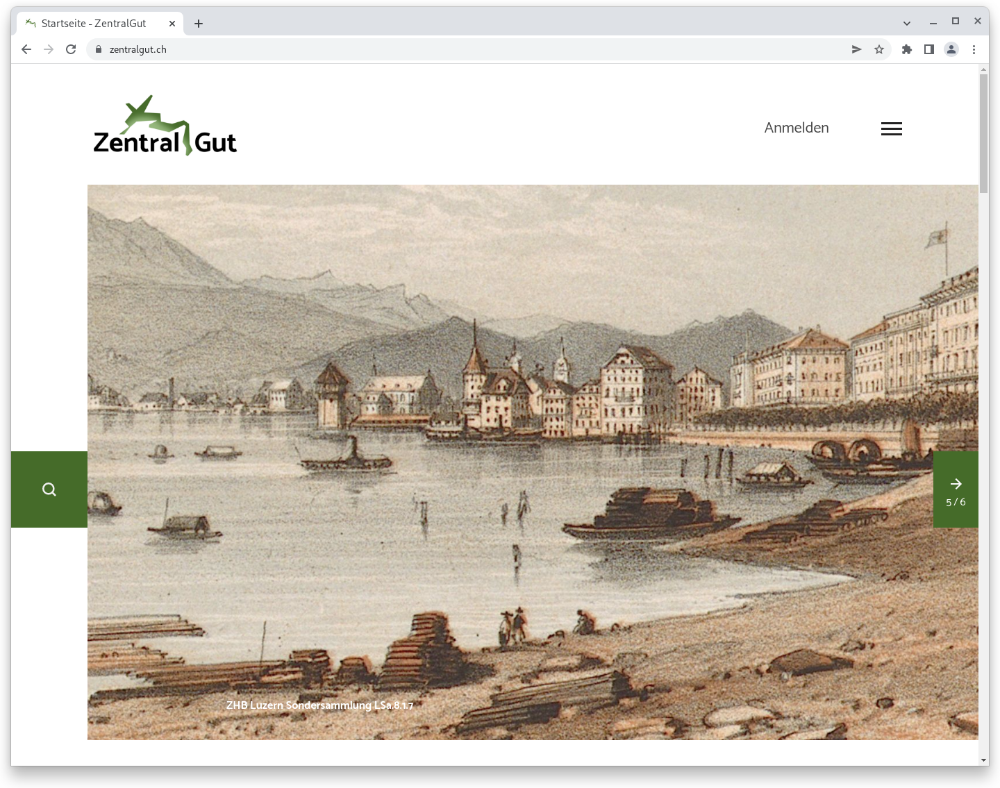

# Mai

## Coming soon :rocket:

* Neuerungen bei den **Zugriffsbeschränkungen**
* **Überarbeitung** des **CMS**-Bereichs

## Behind the scenes

Im ersten halben Jahr haben wir bereits viele Projekte abgeschlossen. Zwei davon möchten wir exemplarisch an dieser Stelle erwähnen und einladen in den Ergebnissen zu stöbern.

### Sudan Memory



> Das Projekt „Sudan Memory“ versucht, wertvolles kulturelles Material aus und über den Sudan durch Digitalisierung und über eine Online-Plattform zu bewahren und zu fördern. Im ganzen Land sind viele interessante und reichhaltige Archive aus einer Reihe von Gründen gefährdet: extreme Wetterbedingungen, Mangel an geeigneten Lagerbedingungen, Vernachlässigung und Konflikte. Auch viele öffentliche und private Sammlungen sind verschlossen und schwer zugänglich. &#x20;
>
> Unsere Mission ist es, diese Archive und ihre Geschichten zu bewahren, damit heutige und zukünftige Generationen von diesem wertvollen und wichtigen Erbe profitieren können.



### ZentralGut



> ZentralGut eröffnet Chancen, um Kulturgut der Region Zentralschweiz ortsungebunden und barrierearm zugänglich zu machen und vielschichtig zu präsentieren. Das Portal für digitalisiertes Zentralschweizer Kulturgut steht interessierten Gedächtnis- und Kulturinstitutionen aus der Region offen, um Objektabbildungen, Fotografien und Texte aus ihren Beständen zu veröffentlichen.
>
> ZentralGut ist eine vielfältige regionale Kulturgut-Plattform, die – wie unser Kulturerbe selbst – sich stetig erweitert und aktualisiert. In den Texten, Bild, Ton- und Videodokumenten kann recherchiert werden, bestehende Objekte kommentiert und umfangreiche Citizen Science-Projekte umgesetzt werden. Aber nicht nur Institutionen, sondern auch Privatpersonen sind eingeladen, ihr Wissen über die Region zu teilen und ihre eigenen Schätze beizusteuern.



## Entwicklungen

### Hardening

In diesem Release haben wir an der Verbesserung der Sicherheit des Goobi viewers gearbeitet. Dabei haben wir verschiedene Bereiche in den Blick genommen und verbessert.&#x20;

#### Passwörter

Passwörter müssen eine Mindestlänge von 8 Zeichen haben. Diese Prüfung gibt es schon länger, war jedoch an einigen Stellen nicht aktiv, so dass teilweise auch kürzere Passwörter akzeptiert wurden. Das Verhalten ist jetzt abgestellt. Zusätzlich wurde der Validator erweitert, so dass auch die maximal erlaubte Bytezahl des verwendeten bcrypt Hashalgorithmus mit geprüft wird.

Möchte ein Benutzer sein Passwort ändern ist ab sofort notwendig auch das aktuelle Passwort einzugeben. Wenn sich ein Benutzer zum Beispiel im Lesesaal nicht korrekt abgemeldet hat, kann ein anderer Benutzer nicht einfach das Passwort ändern.\
Administratoren können Passwörter weiterhin ohne weitere Kenntnis zurücksetzen.

#### Brute-Force

Um Brute-Force Attacken zu erschweren wird bei einem fehlgeschlagenen Anmeldeversuch ein Zähler für die eingegebene E-Mailadresse hochgezählt. Nach einem fehlgeschlagenen Anmeldeversuch muss die Anzahl der fehlgeschlagenen Versuche mal drei Sekunden gewartet werden. Versuche vor Ablauf der Wartezeit werden grundsätzlich abgewiesen. Beim nächsten erfolgreichen Login werden alle Zähler zurückgesetzt.

#### Konfiguration

Die Apache Web- und Tomcat Applicationserver Standardeinstellungen wurden sowohl in den Installationsanleitungen für die klassische und die Docker basierte Installation, als auch in der Updateanleitung angepasst, so dass sie eine höhere Sicherheit bieten und weniger allgemeine Systeminformationen preisgeben.

### Upload von Datensätzen

Eine neue Funktionalität ermöglicht es Besuchern des Goobi viewers eigene Inhalte beizutragen. Dadurch entstehen neue Möglichkeiten für Einrichtungen zur Interaktion. Die Funktionalität kann in der Konfigurationsdatei aktiviert werden.

Einmal eingerichtet steht angemeldeten Besuchern der neuer Bereich "Inhalte beitrage" zur Verfügung. In einem sehr einfachen Formular kann ein Titel und eine optionale Beschreibung eingegeben, sowie die Bilder hochgeladen werden. Beim Absenden wird dann im Hintergrund automatisch ein Vorgang innerhalb von Goobi workflow angelegt. Dort können die Angaben dann geprüft werden:

* Entsprechen die hochgeladenen Daten den gewünschten Anforderungen?
* Passen Titel und Beschreibung?
* Wie sieht es mit Copyright aus?
* ...

Für eine optionale Klärung wird die E-Mailadresse des Benutzers angezeigt, der die Inhalte beigetragen hat.

Der Goobi viewer prüft periodisch den Status der eingereichten Inhalte. Dabei gibt es drei mögliche Status:

* **Warten**. Dieser Status wird über eine Sanduhr visualisiert. Er bedeutet, dass die Bearbeitung innerhalb von Goobi workflow noch aussteht.
* **Erfolgreich**. Dieser Status wird über einen Haken visualisiert. Er bedeutet, dass die Bearbeitung erfolgreich abgeschlossen und der Datensatz in den Goobi viewer exportiert wurde.
* **Abgewiesen**. Der Status wird über ein X visualisiert. Er bedeutet, dass der Vorgang in Goobi workflow nicht gefunden werden kann, ODER, dass er abgelehnt wurde. Wenn dabei eine Begründung eingegeben wurde, dann wird diese ebenfalls im Goobi viewer angezeigt.

Mit der neuen Funktionalität wird das Portfolio für die Interaktion zwischen Nutzern und Einrichtungen um eine neue Option erweitert. Mit der Nutzung der bewährten Infrastruktur von Goobi workflow sind auch gleich nicht nur alle Fragen zur Moderation, sondern auch zum Backup, Archivierung etc. beantwortet.


### Kampagnen

Für Kampagnen ist es ab sofort konfigurierbar, ob Inhalte in einer fester Reihenfolge oder zufällig geöffnet werden.&#x20;

Außerdem ist es jetzt möglich für die Georeferenzierung innerhalb der Kampagnen die reguläre OpenStreetMap Ansicht zu verwenden. Auch der Mittelpunkt und der Standard Zoomfaktor sind jetzt einstellbar. Dadurch kann auch ein nicht deutschlandzentrierter Einstieg gewählt werden.


### Snippets

* Annotationen werden nun besser in der Suche gefunden und dargestellt
* Alternative URLs für CMS-Seiten können jetzt keine Leerzeichen mehr enthalten
* An verschiedenen Stellen wurde Deutsch als hart codierte Standard-Fallback-Sprache entfernt und durch den konfigurierten Standardwert ersetzt.

## Versionsnummern

Die Versionen die in der `pom.xml` des Themes eingetragen werden müssen um die in diesem Digest beschriebenen Funktionen zu erhalten lauten:

```markup
<dependency>
    <groupId>io.goobi.viewer</groupId>
    <artifactId>viewer-core</artifactId>
    <version>22.05</version>
</dependency>
<dependency>
    <groupId>io.goobi.viewer</groupId>
    <artifactId>viewer-core-config</artifactId>
    <version>22.05</version>
</dependency>
<dependency>
    <groupId>io.goobi.viewer</groupId>
    <artifactId>viewer-connector</artifactId>
    <version>22.05</version>
</dependency>
```

Der **Goobi viewer Indexer** hat die Versionsnummer **22.05**

Das **Goobi viewer Crowdsourcing Modul** hat die Versionsnummer **22.05**
