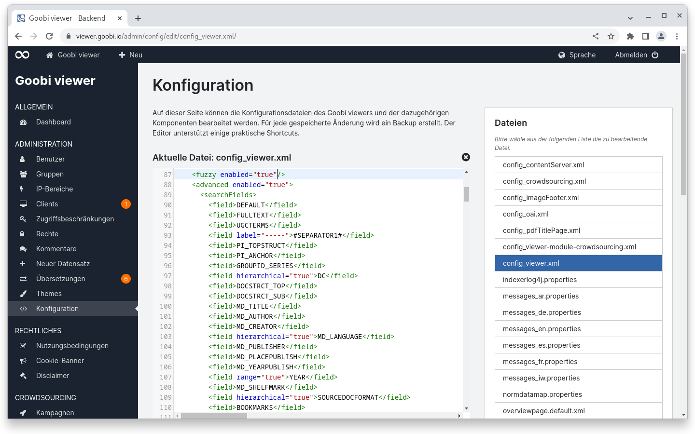
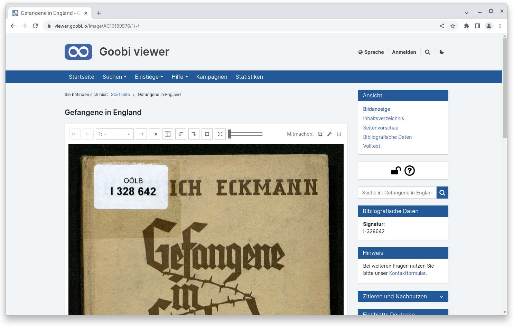
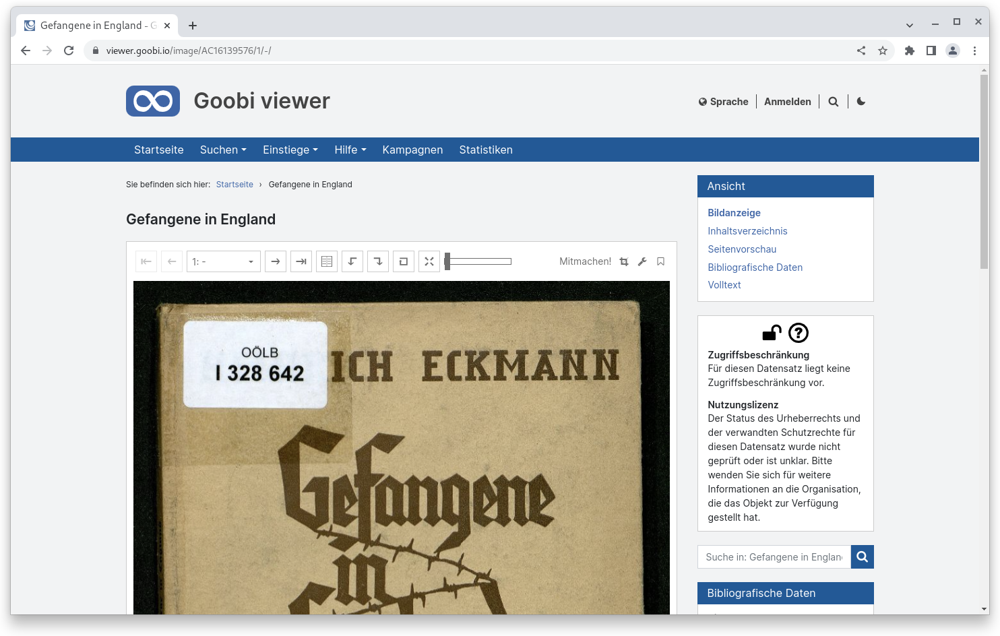
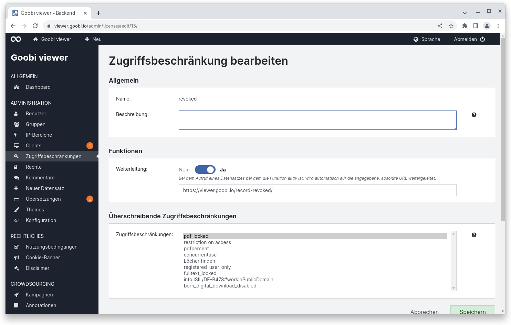
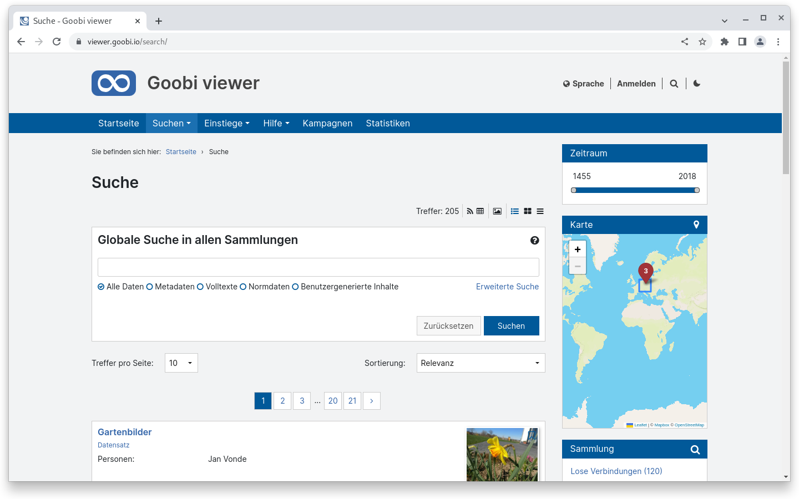
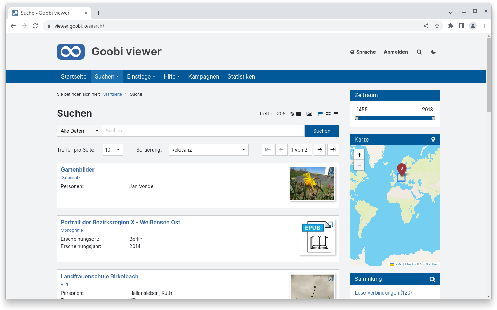
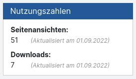

# August

## Coming soon :rocket:

* **Überarbeitung** des **CMS**-Bereichs
* **Überarbeitung** der **erweiterten Suche**
* **Goobi Anwendertreffen** :tada:****

## Entwicklungen

### Config Editor

Endlich ist es soweit: Die Konfigurationsdateien des Goobi viewers können auch direkt im Backend bearbeitet werden. Dafür steht die neue Seite "Konfiguration" zur Verfügung. In der Sidebar gibt es eine Liste an Dateien die editierbar sind. Backups werden automatisch angelegt und können bei Bedarf heruntergeladen werden. Ein intelligenter Locking-Mechanismus verhindert das gleichzeitige Zugreifen auf einzelne Dateien von mehreren Personen. Das Speichern von invalidem XML wird unterbunden, so dass die Oberfläche der Goobi viewer aufgrund von Syntaxfehlern nicht einfach kaputt gehen kann.

<figure><figcaption><p>Config-Editor mit geöffneter config_viewer.xml</p></figcaption></figure>

### Zugriffsbeschränkung und Nutzungslizenz

Ist der Zugriff auf ein Werk beschränkt und wenn ja was bedeutet das? Und ist ein Werk unter einer bestimmten Nutzungslizenz veröffentlicht und wenn ja welcher? Diese Fragen konnten bisher nur implizit oder versteckt beantwortet werden.

Ab sofort kann der Goobi viewer diese Information prominent in der Seitenleiste anzeigen. Direkt unterhalb der Navigation gibt es dafür ein neues Widget, dass beide Informationen auf einen Blick schnell zugänglich macht. Ob ein Werk einer Zugriffsbeschränkung unterliegt wird mit einem Schlosssymbol visualisiert. Die Nutzungslizenz hat ebenfalls entsprechende Icons. Per Klick auf das Widget werden weitere beschreibende Texte angezeigt. Diese werden über die Konfigurationsdatei gesteuert.

Eine Standardkonfiguration für die gängigsten Nutzungslizenzen wird mitgeliefert. Diese umfasst Lizenzen von Creative Commons, RightsStatements.org oder Beispiele für das deutsche Urheberrecht und VG Wort.

<div>

<figure><figcaption><p>Widget mit Icons</p></figcaption></figure>

 

<figure><figcaption><p>ausgeklapptes Widget mit Icons und Text</p></figcaption></figure>

</div>

Die Information kann alternativ in Form einer Ampel neben neben der Überschrift oberhalb des Werkes angezeigt werden.

### Zugriffsbeschränkungen

Datensätze die einer Zugriffsbeschränkung unterliegen können ab jetzt so konfiguriert werden, dass sie auf eine bestimmte URL weiterleiten. Dieses ist insbesondere dann praktisch, wenn ein Werk zurückgezogen wird und anschließend eine entsprechende Meldung angezeigt werden soll. Auch kann die Funktionalität im Zusammenspiel mit Goobi workflow dafür verwendet werden eine "Werk befindet sich in Digitalisierung" Meldung anzuzeigen.

<figure><figcaption><p>Weiterleitung auf eine URL für Zugriffsbeschränkungen</p></figcaption></figure>

### Suche

Der Kopfbereich der Suchtrefferseite wurde überarbeitet, so dass jetzt deutlich mehr Platz zur Verfügung steht. Hier ein vorher / nachher Vergleich:

<figure><figcaption><p>Suchtrefferseite vorher</p></figcaption></figure>

<figure><figcaption><p>Suchtrefferseite jetzt</p></figcaption></figure>

### Nutzungszahlen

Ab sofort kann der Goobi viewer von sich aus die folgenden Nutzungszahlen zu einzelnen Datensätzen ermitteln und speichern:

* absolute Zahl der Seitenansichten (jeder Aufruf einer Seite eines Werkes)
* eindeutigen Seitenansichten (jeder Aufruf einer Seite eines Werkes wird pro Nutzersession nur einmal gezählt)
* absolute Zahl der Downloads (jeder Download einer Datei)
* eindeutige Downloads (jeder Download einer Datei wird pro Nutzersession nur einmal gezählt)

Eine Nutzersession ist dabei die Session aus Sicht des Goobi viewers.&#x20;

Die Logik dabei ist, dass alle Aufrufe die ein Werk öffnen einer Datenbank zwischengespeichert werden. Volle Tage können dann in den Solr Suchindex übertragen werden. Sobald die Daten im Suchindex stehen können sie entweder in einem Widget angezeigt oder über die REST API abgerufen werden.

<figure><figcaption><p>Widget "Nutzungszahlen"</p></figcaption></figure>

### Snippets

* Werte von Metadaten können jetzt innerhalb eines IIIF Manifests dynamisch als seeAlso Referenz ausgegeben werden.
* Im Backend werden bei den Zugriffsbeschränkungen überschriebene Einträge in der Übersichts angezeigt.

## Versionsnummern

Die Versionen die in der `pom.xml` des Themes eingetragen werden müssen um die in diesem Digest beschriebenen Funktionen zu erhalten lauten:

```markup
<dependency>
    <groupId>io.goobi.viewer</groupId>
    <artifactId>viewer-core</artifactId>
    <version>22.08.1</version>
</dependency>
<dependency>
    <groupId>io.goobi.viewer</groupId>
    <artifactId>viewer-core-config</artifactId>
    <version>22.08</version>
</dependency>
<dependency>
    <groupId>io.goobi.viewer</groupId>
    <artifactId>viewer-connector</artifactId>
    <version>22.08</version>
</dependency>
```

Der **Goobi viewer Indexer** hat die Versionsnummer **22.08.1**

Das **Goobi viewer Crowdsourcing Modul** hat die Versionsnummer **22.08.1**

