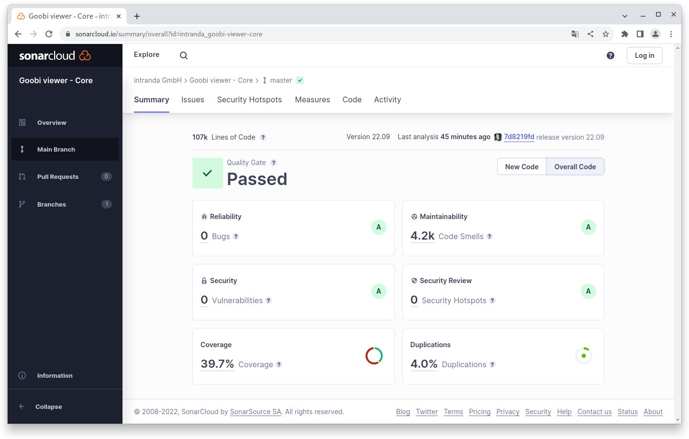
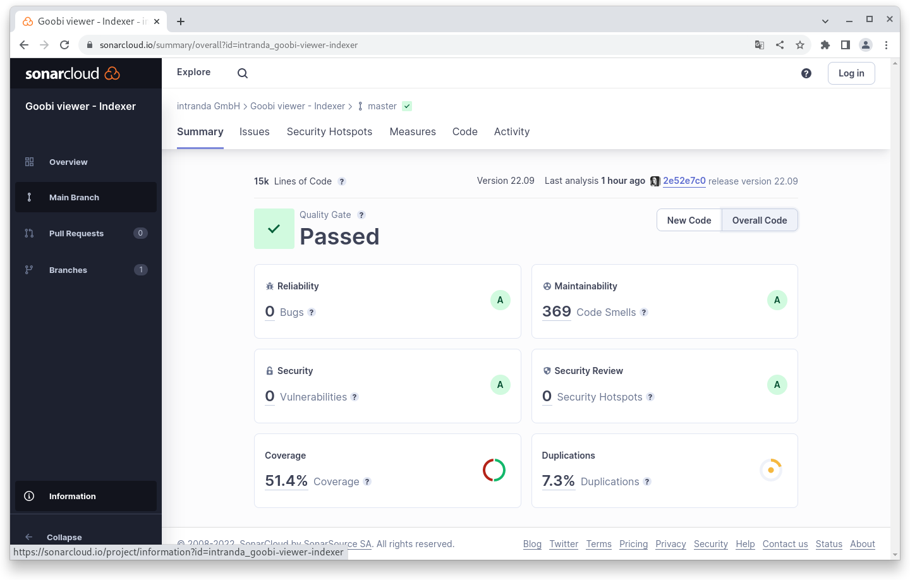
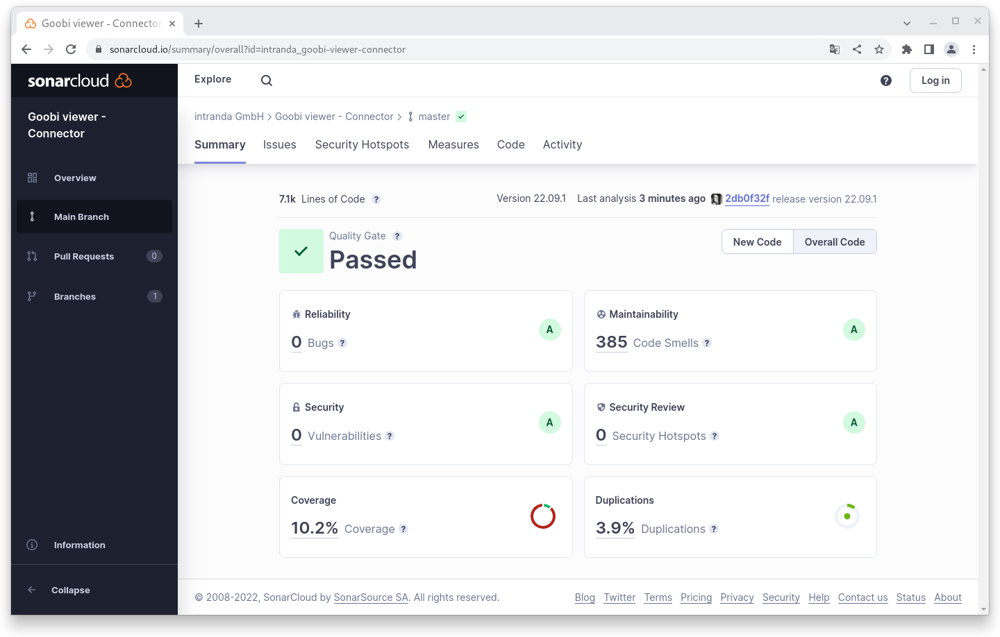

# September

## Coming soon :rocket:

* **Überarbeitung** des **CMS**-Bereichs
* **Überarbeitung** der **erweiterten Suche**

## Ankündigungen

Im September haben wir viel an den Coming Soon Features gearbeitet. Leider sind diese noch nicht fertig für das Release, so dass der Digest in diesem Monat - auch bedingt durch die Goobi Tage - weniger umfangreich ausfällt.

Neu ist aber der Abschnitt "Codeanalyse", in der wir Informationen zu dem Release mitliefern.

## Entwicklungen

### Resolver

Der URN-Resolver kann jetzt URNs für ein Werk in mehr als nur einem Solr-Feld suchen. Dafür können jetzt in der Konfigurationsdatei beliebig viele Felder angegeben werden.

### Suche

Im Quelltext gab es erste Vorarbeiten um die Feldauswahl bei der erweiterten Suche beim Aufruf über URLs besser vorzubelegen.

### Libs

Unter der Haube haben wir das Logging Framework SLF4J gegen natives Log4j2 getauscht. Außerdem wurde für die Datenbankanbindung EclipseLink von der Version 2 auf die Version 4 gehoben, was mit einer größeren Codeanpassung aufgrund von geänderten Packagenamen (javax -> jakarta) einher ging.

### Goobi viewer Indexer

Für den Mailversand kann im Goobi viewer Indexer jetzt auch der SMTP Port individuell konfiguriert werden.

## Codeanalyse

Die folgenden Screenshots zeigen die SonarCloud Analyse des aktuellen Releases. Weitere Informationen gibt es direkt auf der [Projektseite](https://sonarcloud.io/organizations/intranda/projects).

<figure><figcaption><p>SonarCloud Analyse: Goobi viewer Core - für den Git Tag v22.09</p></figcaption></figure>

<figure><figcaption><p>SonarCloud Analyse: Goobi viewer Indexer - für den Git Tag v22.09</p></figcaption></figure>

<figure><figcaption><p>SonarCloud Analyse: Goobi viewer Connector - für den Git Tag v22.09.1</p></figcaption></figure>

## Versionsnummern

Die Versionen die in der `pom.xml` des Themes eingetragen werden müssen um die in diesem Digest beschriebenen Funktionen zu erhalten lauten:

```markup
<dependency>
    <groupId>io.goobi.viewer</groupId>
    <artifactId>viewer-core</artifactId>
    <version>22.09</version>
</dependency>
<dependency>
    <groupId>io.goobi.viewer</groupId>
    <artifactId>viewer-core-config</artifactId>
    <version>22.09</version>
</dependency>
<dependency>
    <groupId>io.goobi.viewer</groupId>
    <artifactId>viewer-connector</artifactId>
    <version>22.09.1</version>
</dependency>
```

Der **Goobi viewer Indexer** hat die Versionsnummer **22.09**

Das **Goobi viewer Crowdsourcing Modul** hat die Versionsnummer **22.09**

