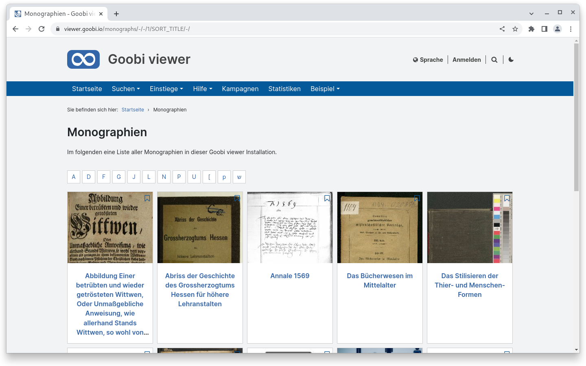
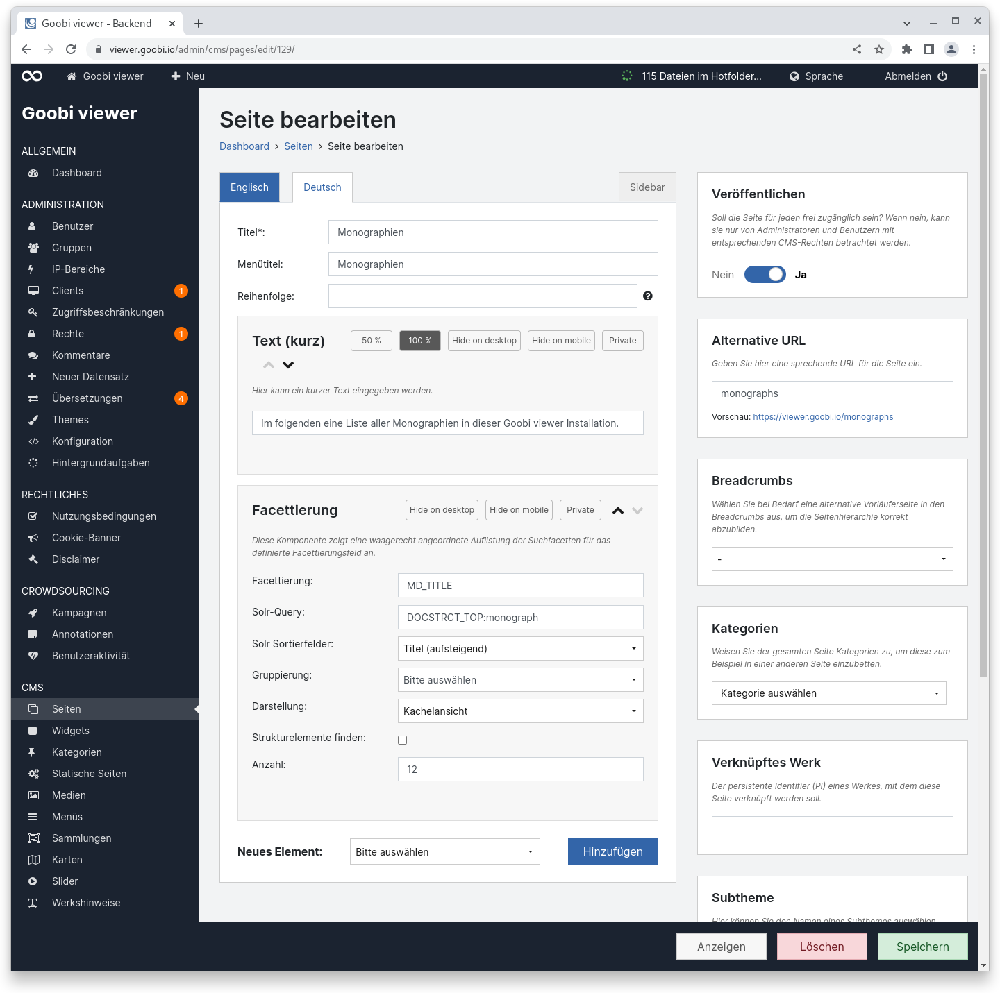
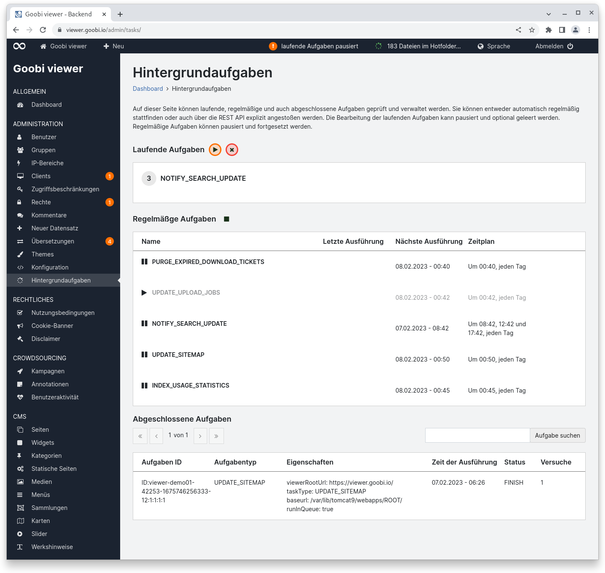
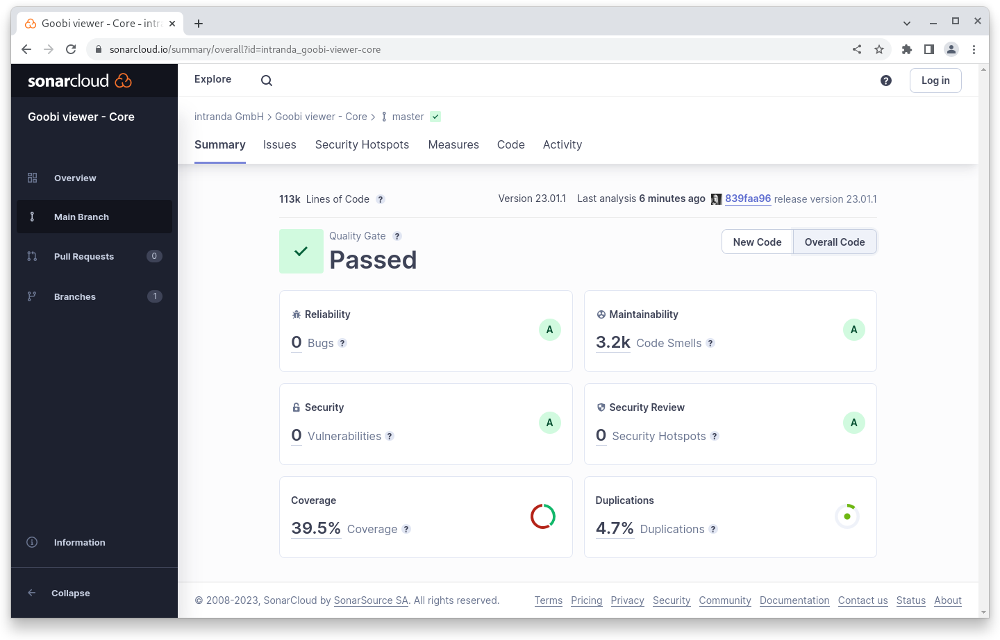
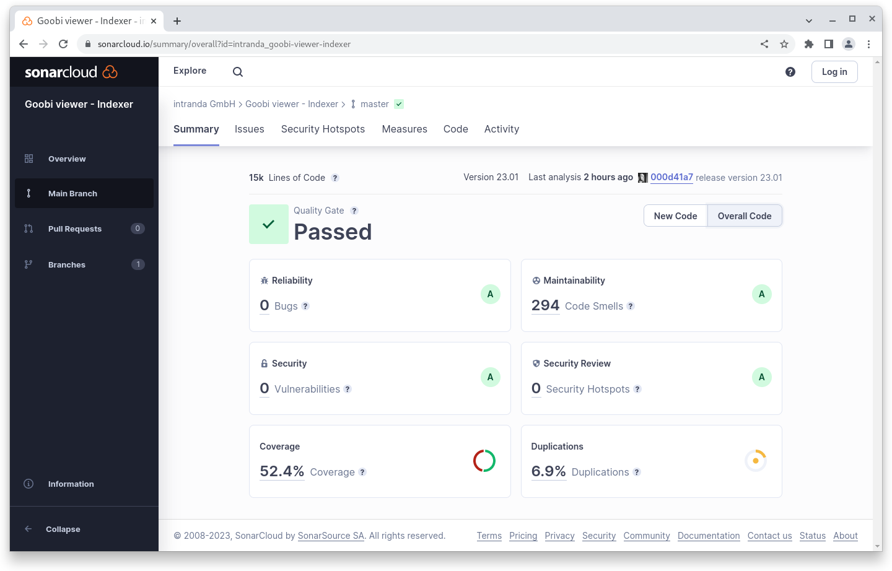

# Januar

## Coming soon :rocket:

* **kompakte** und hochaufgelöste **PDF Dateien**

## Entwicklungen

### Facettierung

Für CMS-Seiten wurde das neue Element "Facettierung" entwickelt. Es ist eine Mischung aus Suchtrefferliste und der Einschränkung nach Buchstaben so wie sie aus dem Stöbern bekannt ist. Während auf einer klassischen Stöbern-Seite eine Liste der Begriffe in Textform angezeigt wird, können mit dem Element auch Bilder angezeigt werden. Hier ein Beispiel, bei dem Monographien nach Anfangsbuchstaben nach Anfangsbuchstaben aufgelistet und facettiert werden können:

<figure><figcaption><p>Beispiel Frontend CMS Seite für die Facettierung nach Buchstaben</p></figcaption></figure>

<figure><figcaption><p>Beispielkonfiguration für CMS-Seite mit Element Facettierung</p></figcaption></figure>

### Hintergrundaufgaben

Unter der Haube hat sich in dem Monat Januar viel an Infrastruktur getan. Zwei in Goobi workflow bekannte Funktionen wurden ebenfalls in den Goobi viewer integriert:

1. eine Warteschlange (basierend auf ActiveMQ)
2. regelmäßige Aufgaben (basierend auf Quartz)

Die Funktionalität löst die bisher rein über die REST Schnittstelle und Cronjobs realisierten "Tasks" ab. Dafür wurde im Backend eine neue Seite "Hintergrundaufgaben" geschaffen. Sie teilt sich in drei Bereiche auf:

* Laufende Aufgaben
* Regelmäßige Aufgaben
* Abgeschlossene Aufgaben

Bei den laufenden Aufgaben wird der aktuelle Inhalt der Warteschlange angezeigt. Die Ausführung kann pausiert und fortgesetzt werden. In der Regel ist die Abarbeitung der laufenden Aufgaben sehr schnell, so dass es nur selten vorkommt, dass man hier in einer nicht pausierten Umgebung Einträge vorfindet. Wenn laufende Aufgaben vorliegen steht pro Aufgabentyp eine Box zur Verfügung die anzeigt wie viele Aufgaben existieren. Die Box kann optional aufgeklappt und einzelne Tickets aus der Queue gelöscht werden.

Bei den regelmäßigen Aufgaben existiert eine Liste mit Dingen, die gemäß eines Zeitplans regelmäßig ausgeführt werden können. Alle regelmäßigen Aufgaben können gemeinsam, aber auch nur einzelne für sich, pausiert werden. Es besteht die Möglichkeit eine regelmäßige Aufgabe auch einmalig auszuführen. Die Aktion wird wie gewohnt onHover über der jeweiligen Zeile eingeblendet.

Die abgeschlossenen Aufgaben sind ein Logbuch aus dem ersichtlich ist was wann ausgeführt wurde, ob die Bearbeitung erfolgreich war, wie viele Versuche dafür benötigt wurden und ob die Aufgabe am Ende erfolgreich oder nur mit einem Fehler abgeschlossen werden konnte. Einträge älter als 90 Tage werden automatisch gelöscht.

Werden laufende oder regelmäßige Aufgaben komplett pausiert visualisiert dieses ein Indikator in der Topbar.

Mit den Hintergrundaufgaben wird ein Systembruch entfernt und der Goobi viewer autarker, da er Funktionalität selbst implementiert und nicht mehr auf externe Dienste angewiesen ist. Durch die Warteschlange existiert eine Infrastruktur, mit der Aufgaben verlässlich auch über Neustarts der Applikation hinweg geplant und verarbeitet werden können. Sie ist bereits dafür vorbereitet Aufgaben auch über verschiedene Server hinweg zu Clustern sofern das notwendig wird. Über die Seite im Backend steht die Möglichkeit zur Verfügung Aufgaben für Wartungsarbeiten zu pausieren oder zu prüfen, ob alle Aufgaben ohne Fehler regelmäßig ausgeführt werden.

<figure><figcaption><p>Backend Seite für Hintergrundaufgaben mit pausierten laufenden Aufgaben</p></figcaption></figure>

### Snippets

* Die Dokumentation zum Aufsetzen der Entwicklungsumgebung wurde um einige Punkte ergänzt
* Der Goobi viewer Indexer hat einige Verbesserungen für die Indexierung von Dokumenten mit dem LIDO 1.1 Standard erhalten
* Im Goobi viewer Connector gab es Änderungen an der SRU Schnittstelle und der allgemeinen Wartbarkeit des Codes sowie der Testabdeckung

## Codeanalyse

Die folgenden Screenshots zeigen die SonarCloud Analyse des aktuellen Releases. Weitere Informationen gibt es direkt auf der [Projektseite](https://sonarcloud.io/organizations/intranda/projects).

<figure><figcaption><p>SonarCloud Analyse: Goobi viewer Core - für den Git Tag v23.01.1</p></figcaption></figure>

<figure><figcaption><p>SonarCloud Analyse: Goobi viewer Indexer - für den Git Tag v23.01</p></figcaption></figure>


<figure><figcaption><p>SonarCloud Analyse: Goobi viewer Connector - für den Git Tag v23.01.1</p></figcaption></figure>

## Versionsnummern

Die Versionen die in der `pom.xml` des Themes eingetragen werden müssen um die in diesem Digest beschriebenen Funktionen zu erhalten lauten:

```xml
<dependency>
    <groupId>io.goobi.viewer</groupId>
    <artifactId>viewer-core</artifactId>
    <version>23.01.1</version>
</dependency>
<dependency>
    <groupId>io.goobi.viewer</groupId>
    <artifactId>viewer-core-config</artifactId>
    <version>23.01</version>
</dependency>
<dependency>
    <groupId>io.goobi.viewer</groupId>
    <artifactId>viewer-connector</artifactId>
    <version>23.01.1</version>
</dependency>
```

Der Goobi viewer Indexer hat die Versionsnummer **23.01**\
****Das Goobi viewer Crowdsourcing Modul hat die Versionsnummer **23.01**
