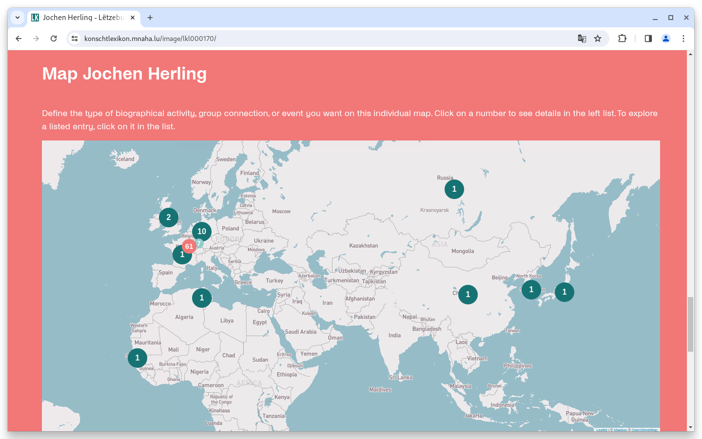
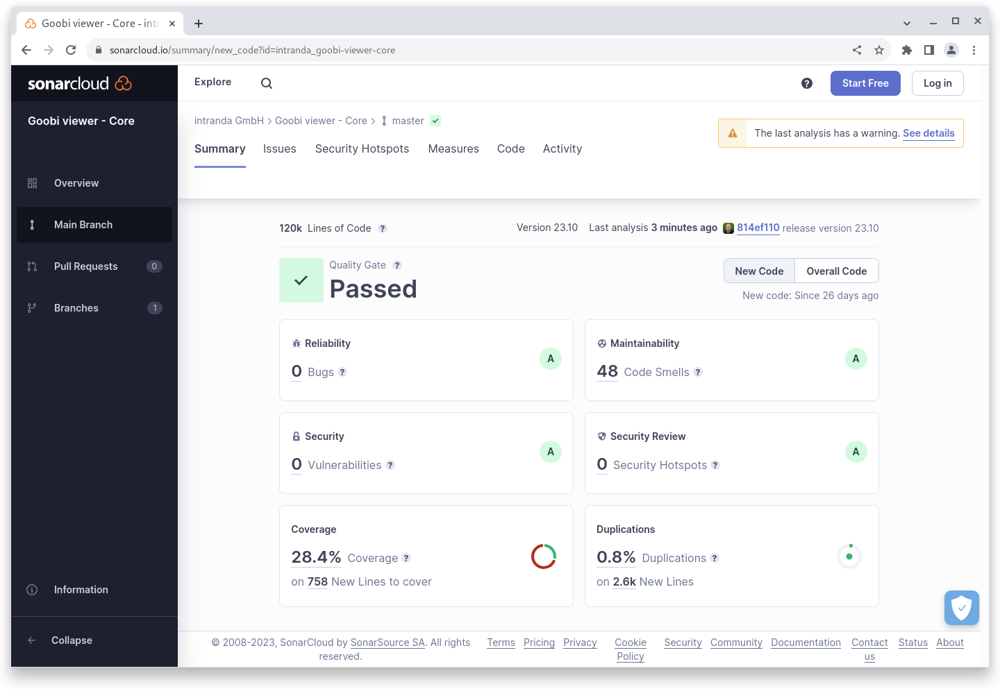
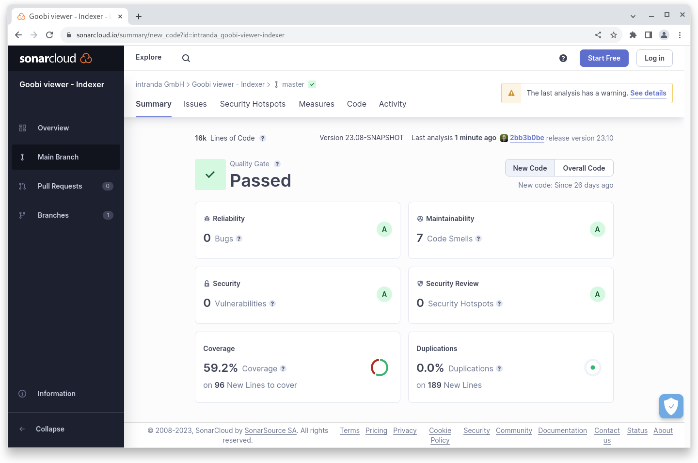
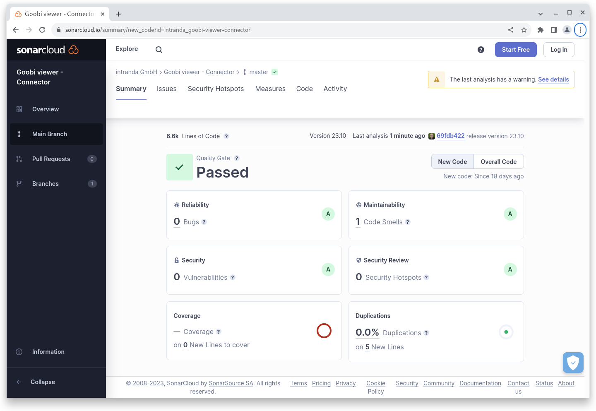

# Oktober

## Coming soon :rocket:

* **Suchmaschinenoptimierung**
* **Live-Aufbereitung** von Datensätzen

## Ankündigungen


Zum **1. Januar 2024** planen wir bei Neuinstallationen und Updates **Java 17** verpflichtend einzuführen. Weiter ist ein Update auf die aktuelle **Solr 9** Version geplant. Sollte ein System die Grundlagen dafür noch nicht erfüllen muss das nach diesem Termin spätestens mit einem Goobi viewer Update erfolgen. Beide Voraussetzungen sind mit einem aktuellen Ubuntu Linux erfüllt.


## Entwicklungen

### Karten

Die Karten im Goobi viewer Backend haben jetzt Featuresets. Damit können verschiedene Markertypen auf einer Karte gesetzt werden. Das können manuell gesetzte Orte sein, aber auch eine Kombination aus mehreren verschiedenen automatisch generierten Solr-Treffersets kann entsprechend angezeigt werden.

Entwickelt wurde diese Funktionalität für das Lëtzebuerger Konschtlexikon. Hier können zum verschiedene Ortstypen auf einer Karte in unterschiedlichen Farben visualisiert werden. Hier ein Beispiel:

<figure><figcaption><p>Karte mit verschiedenen Featuresets</p></figcaption></figure>

Die Karte kann auf der folgenden Seite in einem Goobi viewer betrachtet und ausprobiert werden:

* [https://www.konschtlexikon.mnaha.lu/image/lkl000170/](https://www.konschtlexikon.mnaha.lu/image/lkl000170/)

Für die Verbesserung der Performance von Karten wurde weiter eine Hintergrundaufgabe implementiert, die die Karten automatisch vorgeneriert und cached.

### Goobi viewer Indexer

Der Goobi viewer Indexer unterstützt jetzt auch die Indexierung von Metadaten aus einer METS/MARC Sektion. Es sind keine weiteren Einstellungen dafür notwendig, es reicht in der `config_indexer.xml` die entsprechenden XPATH Ausdrücke bei den Feldern zu definieren.

### Snippets

* Der Client wurde aktualisiert um eine Chromium WebP Sicherheitslücke zu schließen.

## Codeanalyse

Die folgenden Screenshots zeigen die SonarCloud Analyse des aktuellen Releases. Weitere Informationen gibt es direkt auf der [Projektseite](https://sonarcloud.io/organizations/intranda/projects).

<figure><figcaption><p>SonarCloud Analyse: Goobi viewer Core - für den Git Tag v23.10</p></figcaption></figure>

<figure><figcaption><p>SonarCloud Analyse: Goobi viewer Indexer - für den Git Tag v23.10</p></figcaption></figure>

<figure><figcaption><p>SonarCloud Analyse: Goobi viewer Connector - für den Git Tag v23.10</p></figcaption></figure>

## Versionsnummern

Die Versionen die in der `pom.xml` des Themes eingetragen werden müssen um die in diesem Digest beschriebenen Funktionen zu erhalten lauten:

```xml
<dependency>
    <groupId>io.goobi.viewer</groupId>
    <artifactId>viewer-core</artifactId>
    <version>23.10.9</version>
</dependency>
<dependency>
    <groupId>io.goobi.viewer</groupId>
    <artifactId>viewer-core-config</artifactId>
    <version>23.10.2</version>
</dependency>
<dependency>
    <groupId>io.goobi.viewer</groupId>
    <artifactId>viewer-connector</artifactId>
    <version>23.10</version>
</dependency>
```

Der Goobi viewer Indexer hat die Versionsnummer **23.10.1**\
Das Goobi viewer Crowdsourcing Modul hat die Versionsnummer **23.10**
