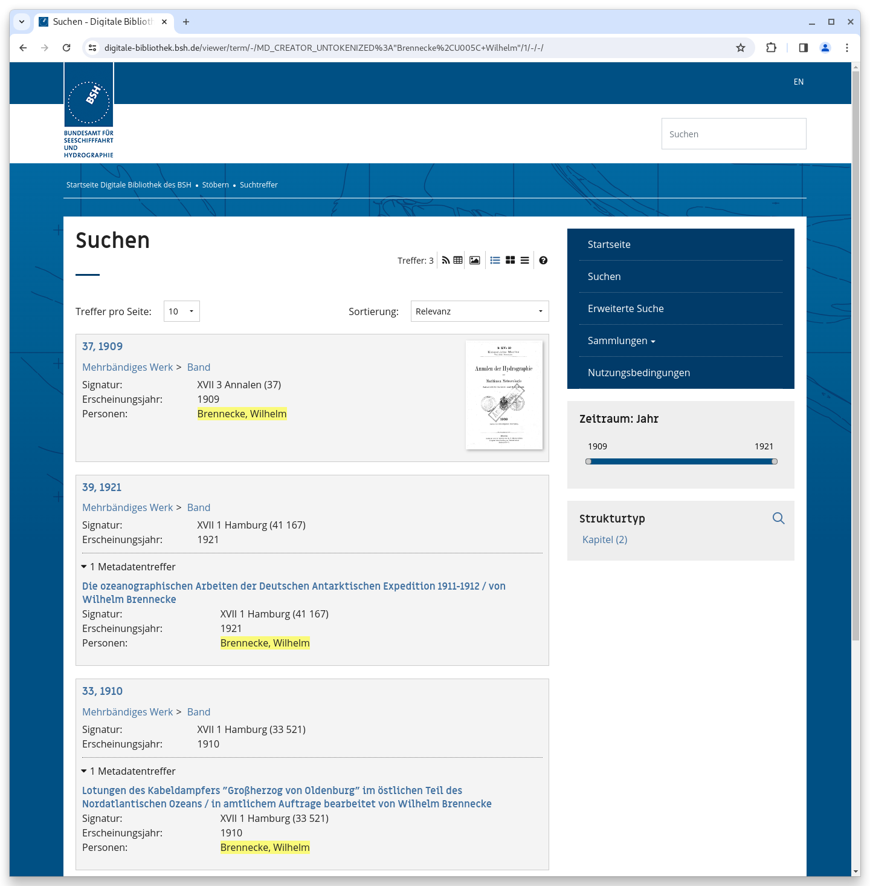

# November

## Coming soon :rocket:

* **Suchmaschinenoptimierung**
* **Live-Aufbereitung** von Datensätzen

## Ankündigungen


Zum **1. Januar 2024** planen wir bei Neuinstallationen und Updates **Java 17** verpflichtend einzuführen. Weiter ist ein Update auf die aktuelle **Solr 9** Version geplant. Sollte ein System die Grundlagen dafür noch nicht erfüllen muss das nach diesem Termin spätestens mit einem Goobi viewer Update erfolgen. Beide Voraussetzungen sind mit einem aktuellen Ubuntu Linux erfüllt.


## Entwicklungen

### Suche

Bei der einfachen Suche wird das DropDown für die verschiedenen Suchfilter (Suche in Allen Daten, Metadaten, Volltexten, ... ) ausgeblendet, wenn nur eine einzige Option existiert.

### Facettierung

Der Goobi viewer unterstützt die Suche in möglichen Werten einer Facette. Dafür wird in dem Titel des Widgets eine kleine Lupe angezeigt. Dieses Feature ergibt bei Facetten mit nur wenig Werten oder in manchen anderen Setups keinen Sinn. Aus diesem Grund kann jetzt über einen zusätzlichen Schalter in der Konfigurationsdatei pro Facette gesteuert werden, ob die Suche zur Verfügung stehen soll, oder nicht.

### Stöbern

Innerhalb der Stöbern-Funktionalität werden jetzt auch Unterelementen von Datensätzen angezeigt, wenn diese das ausgewählte Feld:Wert Paar enthalten. Bisher wurde nur der Hauptdatensatz gefunden.

Anschaulicher wird es mit einem Beispiel aus der Praxis: Wenn es innerhalb eines Zeitschriftenbandes verschiedene Artikel mit verschiedenen Autoren gibt, dann werden in der Stöbern-Funktionalität alle Autoren aufgelistet, auch die der Zeitschriften-Artikel. Hat man dann auf einen Autoren geklickt wurde der Band angezeigt. Jetzt wird der Band angezeigt und dazu der Untetreffer mit dem dazugehörigen Zeitschriften-Artikel sowie dem hervorgehobenen Namen, der für den Treffer verantwortlich ist.

<figure><figcaption>
Stöbern öffnet nun auch Untertreffer mit dem angefragten Feld:Wert Paar
</figcaption></figure>

### Goobi viewer Indexer

Der Goobi viewer Indexer hat verschiedene kleinere Verbesserungen erhalten. So wurde zum Beispiel die Erkennung von Bänden präzisiert, wenn ein `<mods:relatedItem type="host" />` etwas anderes beschreibt. Weiter wurde das Löschen von verwaisten Informationen aus dem Solr verbessert, wenn zum Beispiel ein Band fälschlicherweise mit dem Identifier des Anchors exportiert und das nachträglich korrigiert wurde.

Zuletzt wurde die Abfrage eines externen Katalogs zur Indexierung weiterer Metadaten erweitert, so dass auch eine OAI Schnittstelle abgefragt werden kann. Die Funktionalität wurde im Februar 2021 hinzugefügt und im [damaligen Digest](https://docs.goobi.io/goobi-viewer-digests-de/2021/2#goobi-viewer-indexer) beschrieben.&#x20;


Im November gab es kein dediziertes Goobi viewer Release.

