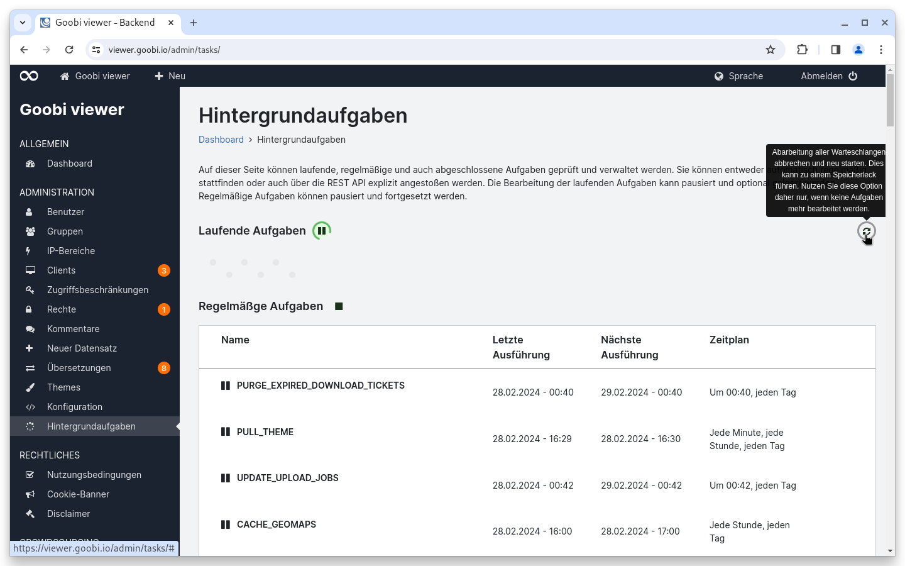
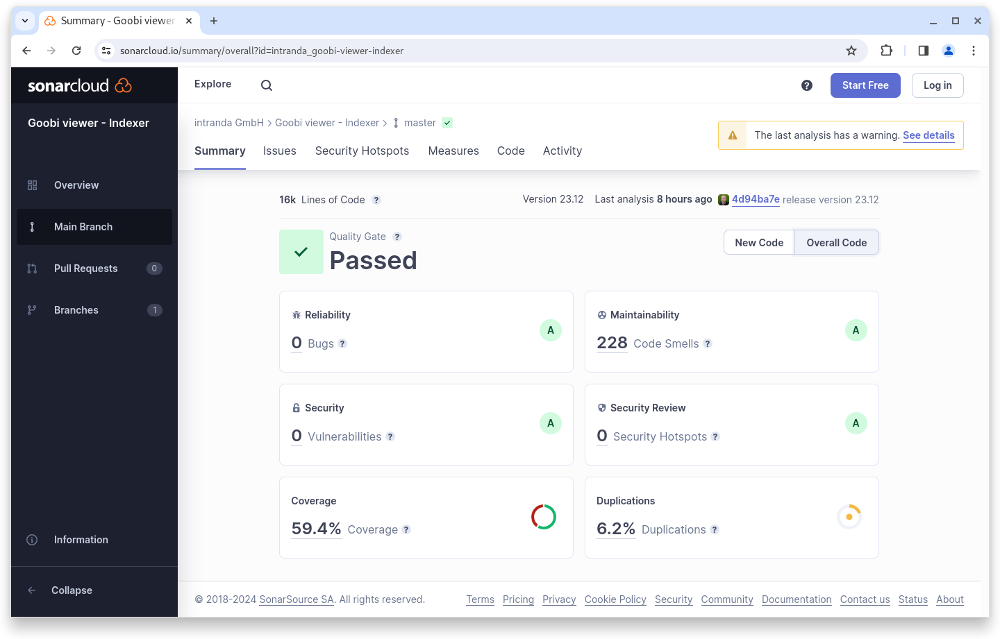
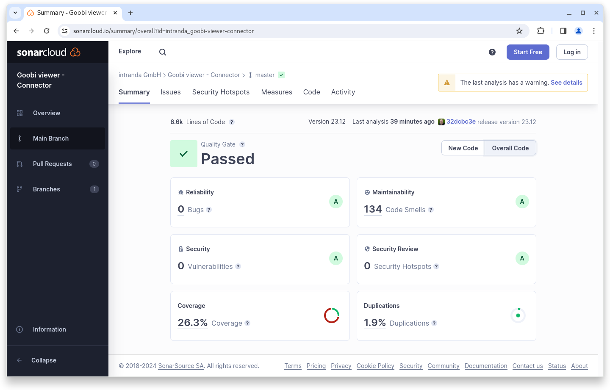

# Dezember

## Coming soon :rocket:

* **Java 17** und **Solr 9**
* **IIIF Manifeste** mit nur einem Bild
* **Neue Widgets** für Download, Metadaten, Links und Zitieren
* **Live-Aufbereitung** von Datensätzen

## Allgemein


Zum **1. Januar 2024** planen wir bei Neuinstallationen und Updates **Java 17** verpflichtend einzuführen. Weiter ist ein Update auf die aktuelle **Solr 9** Version geplant. Sollte ein System die Grundlagen dafür noch nicht erfüllen muss das nach diesem Termin spätestens mit einem Goobi viewer Update erfolgen. Beide Voraussetzungen sind mit einem aktuellen Ubuntu Linux erfüllt.


## Entwicklungen

### Suchmaschinenoptimierung

Nach längerer Zeit ist in diesem Kontext wieder etwas passiert. Wir haben die Auszeichnung von alternativen Links zu den Inhalten erweitert, um so für Suchmaschinen genauer kennzeichnen zu können, was die Primär-URL und was alternative URLs zum selben Inhalt sind.

### Facettierung

Der Slider in der Jahressuche kann jetzt optional auf einen Start- und Endzeitpunkt festgesetzt werden. Damit können Ausreißer in der Facette bewusst ausgeklammert werden, wenn die Datensätze nicht einfach zu korrigieren sind.

### CMS

Die Aktionen auf der Seite zum Bearbeiten einer CMS-Seite sind um eine Abbrechen-Möglichkeit erweitert worden, die auf die Übersichtsseite verlinkt.

### Hintergrundaufgaben

Manchmal kommt es vor, dass die Warteschlange stecken bleibt und ein Neustart notwendig ist. Dafür haben wir einen neuen Button in die Seite integriert.

<figure><figcaption><p>Button zum Neustart der Warteschlange</p></figcaption></figure>

### Hardening

Um die Sicherheit weiter zu erhöhen haben wir in diesem Release für die Benutzeravatare eine Beschränkung und Prüfung auf die verwendeten Bildtypen sowie eine Größenbeschränkung für die hochgeladenen Dateien eingeführt.


## Codeanalyse

Die folgenden Screenshots zeigen die SonarCloud Analyse des aktuellen Releases. Weitere Informationen gibt es direkt auf der [Projektseite](https://sonarcloud.io/organizations/intranda/projects).

<figure><figcaption><p>SonarCloud Analyse: Goobi viewer Core - für den Git Tag v23.12.1</p></figcaption></figure>

<figure><figcaption><p>SonarCloud Analyse: Goobi viewer Indexer - für den Git Tag v23.12</p></figcaption></figure>

<figure><figcaption><p>SonarCloud Analyse: Goobi viewer Connector - für den Git Tag v23.12</p></figcaption></figure>

## Versionsnummern

Die Versionen die in der `pom.xml` des Themes eingetragen werden müssen um die in diesem Digest beschriebenen Funktionen zu erhalten lauten:

```xml
<dependency>
    <groupId>io.goobi.viewer</groupId>
    <artifactId>viewer-core</artifactId>
    <version>23.12.2</version>
</dependency>
<dependency>
    <groupId>io.goobi.viewer</groupId>
    <artifactId>viewer-core-config</artifactId>
    <version>23.12</version>
</dependency>
<dependency>
    <groupId>io.goobi.viewer</groupId>
    <artifactId>viewer-connector</artifactId>
    <version>23.12</version>
</dependency>
```

Der Goobi viewer Indexer hat die Versionsnummer **23.12**\
Das Goobi viewer Crowdsourcing Modul hat die Versionsnummer **23.12**
