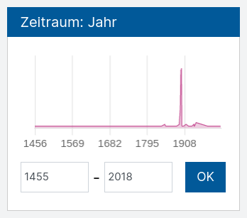
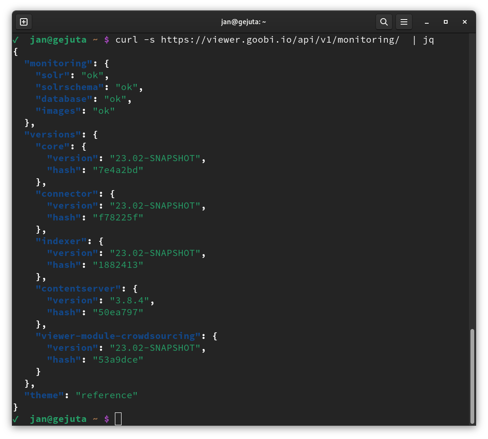
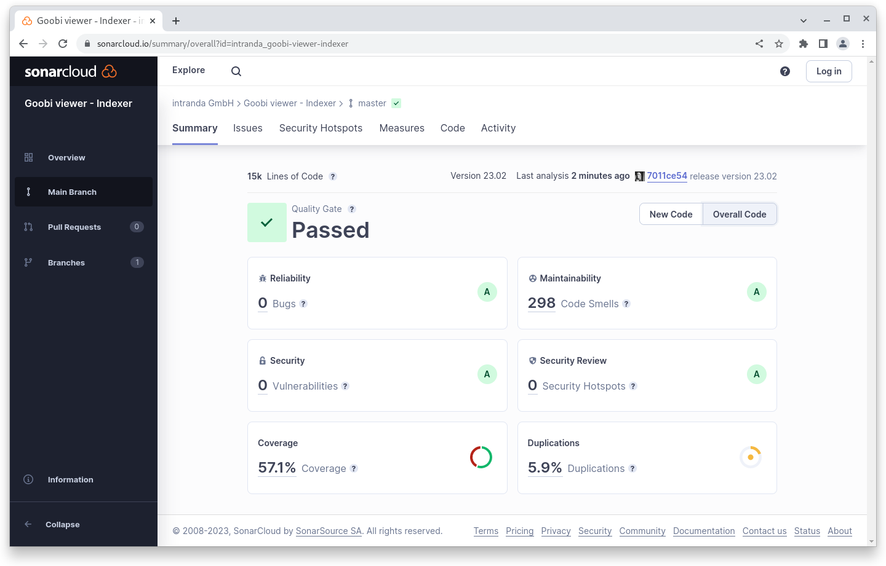
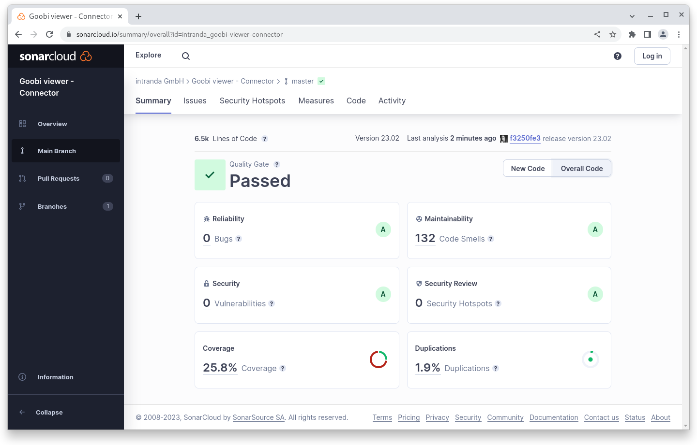

# Februar

## Coming soon :rocket:

* **kompakte** und hochaufgelöste **PDF Dateien**
* **Highlights**

## Ankündigungen

Im Februar haben wir viel für Projekte und weniger am Core selbst gearbeitet. Deswegen fällt der Digest in diesem Monat kürzer aus als sonst.

## Entwicklungen

### Facettierung

In der Facettierung ist es nun möglich mehr als eine Facette mit einem Slider anzuzeigen. So können zum Beispiel Werte wie "Geburtsdatum" und "Sterbedatum" beide konfiguriert werden.

Zusätzlich ist es möglich den Slider optional als Graphen anzuzeigen. Dadurch wird innerhalb der Facette direkt visuell hervorgehoben wie viele Treffer zu erwarten sind.

<figure><figcaption><p>Facette als Graph dargestellt</p></figcaption></figure>

### REST

Der REST Endpoint für das Monitoring wurde überarbeitet und beinhaltet nun weitere Statusinformationen die im Fehlerfall eine Diagnose vereinfachen.

<figure><figcaption><p>Erweiterte Informationen im Monitoring REST Endpoint</p></figcaption></figure>

## Codeanalyse

Die folgenden Screenshots zeigen die SonarCloud Analyse des aktuellen Releases. Weitere Informationen gibt es direkt auf der [Projektseite](https://sonarcloud.io/organizations/intranda/projects).

<figure><figcaption><p>SonarCloud Analyse: Goobi viewer Core - für den Git Tag v23.02</p></figcaption></figure>

<figure><figcaption><p>SonarCloud Analyse: Goobi viewer Indexer - für den Git Tag v23.02</p></figcaption></figure>

<figure><figcaption><p>SonarCloud Analyse: Goobi viewer Connector - für den Git Tag v23.02</p></figcaption></figure>

## Versionsnummern

Die Versionen die in der `pom.xml` des Themes eingetragen werden müssen um die in diesem Digest beschriebenen Funktionen zu erhalten lauten:

```xml
<dependency>
    <groupId>io.goobi.viewer</groupId>
    <artifactId>viewer-core</artifactId>
    <version>23.02</version>
</dependency>
<dependency>
    <groupId>io.goobi.viewer</groupId>
    <artifactId>viewer-core-config</artifactId>
    <version>23.02</version>
</dependency>
<dependency>
    <groupId>io.goobi.viewer</groupId>
    <artifactId>viewer-connector</artifactId>
    <version>23.02</version>
</dependency>
```

Der Goobi viewer Indexer hat die Versionsnummer **23.02**\
Das Goobi viewer Crowdsourcing Modul hat die Versionsnummer **23.02**
