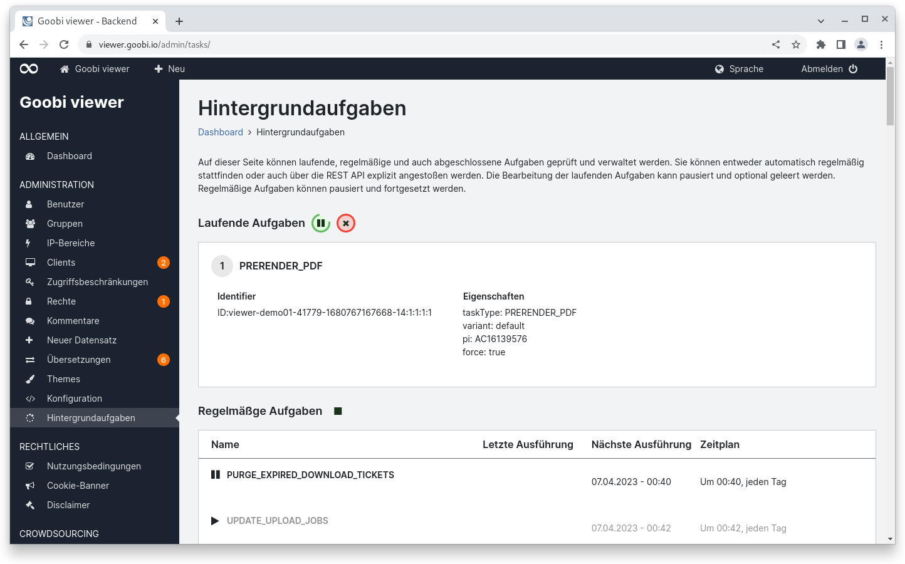
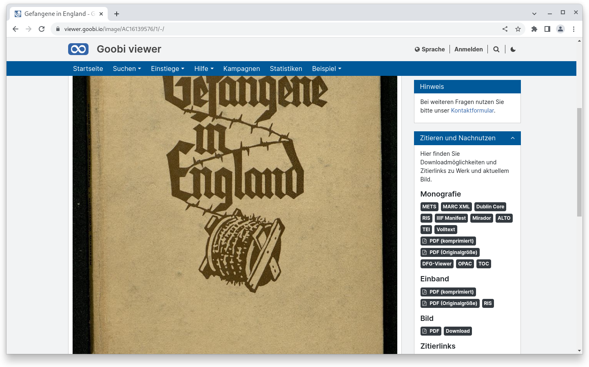
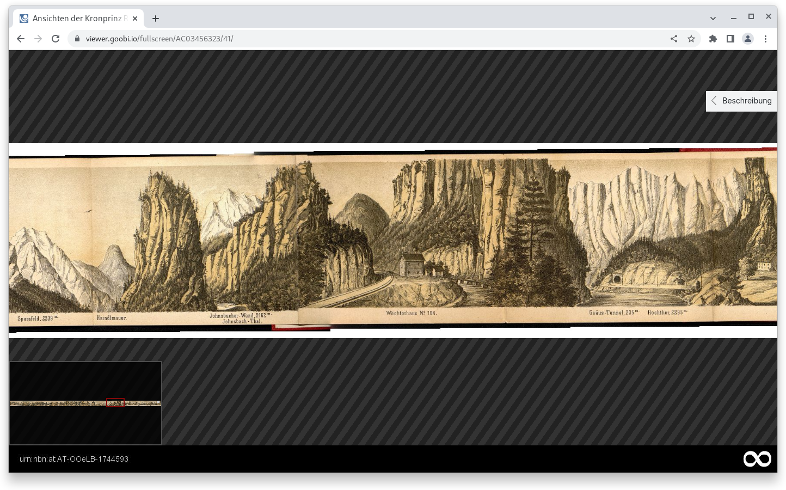
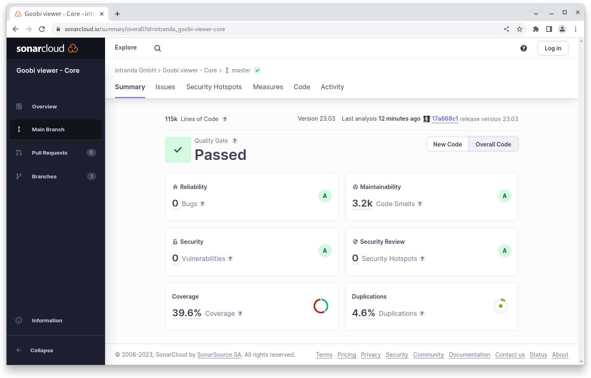
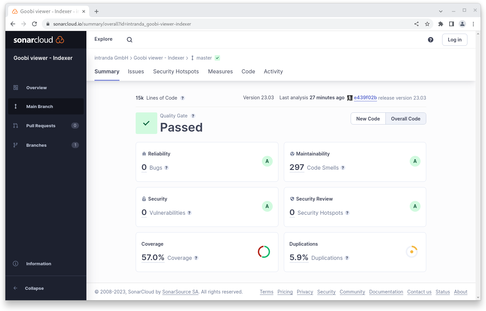

# März

## Coming soon :rocket:

* **Highlights**
* **Suchtreffergruppen**

## Ankündigungen


Wir stellen ein und suchen **Webdesigner  (m/w/d)** und **Java-Entwickler (m/w/d)** zur Unterstützung unseres Teams.


## Entwicklungen

### PDF-Generierung

Im Januar haben wir die Hintergrundaufgaben mit der Warteschlange in den Goobi viewer integriert. Mit dem Märzrelease wird diese Funktionalität genutzt um optional automatisch PDF-Dateien zu generieren und im Dateisystem vorzuhalten.

Die PDF-Generierung des Goobi viewers funktioniert so, dass basierend auf vorliegenden Bildern und optionaler METS-Datei und OCR-Ergebnissen eine PDF-Dateien on-the-fly generiert werden. Da wir nie im Vorfeld wissen können ob und wenn ja welche Seite eines Werkes, welches Strukturelement oder welches komplette Werk wann zum Download angefordert wird, kann durch diese Vorgehensweise der Speicherverbrauch minimiert werden. Die on-the-fly Generierung kann zum Clustering und für eine E-Mailbenachrichtung an den intranda TaskManager ausgelagert werden. Einmal generierte PDF-Dateien werden in einem Cache zwischengespeichert. Dieser ist in der Regel 30GB groß. Ist er voll, werden die jeweils ältesten Dateien gelöscht. Dadurch verbleiben oft angefragte Dateien im Cache und können schneller ausgeliefert werden.

Neben der on-the-fly Generierung unterstützt der Goobi viewer auch die Verkettung bereits vorhandener PDF-Dateien. Manchmal kommen aus einer OCR bereits PDF-Dateien für Einzelseiten. Liegen diese im Goobi viewer vor, wird nur noch eine Verkettung der vorhandenen Dateien vorgenommen. Das geht deutlich schneller als die on-the-fly Generierung.

Die PDF-Generierung wird vom ContentServer übernommen. Dieser wurde im letzten Monat erweitert um für die Generierung verschiedene Konfigurationsvarianten vorzuhalten. So kann die eine Variante die PDF-Dateien klein skalieren und stärker komprimieren während eine andere Variante die Originalgröße ausliefert.

Ob PDF-Dateien automatisch generiert und im Dateisystem vorgehalten werden sollen, wird vom Goobi viewer Indexer gesteuert. Die Konfigurationsdatei wurde erweitert um diese Funktionalität ein- oder ausschalten zu können. Wenn aktiv, wird die Generierung immer dann angestoßen, wenn während der Indexierung auch Bilder im Dateisystem lagen. So werden automatisch alle neuen Werke sowie die mit einem veränderten Bildstapel erfasst. Zusätzlich gibt es die Möglichkeit die Generierung zu forcieren, so dass bei der ersten Inbetriebnahme eine Neuindexierung der METS-Dateien ausreicht um für alle vorhandenen Datensätze die Generierung anzustoßen. Die zu verwendende Konfigurationsvariante im ContentServer kann über einen weiteren Schalter festgelegt werden.

Die Generierung wird dann über die Hintergrundaufgaben abgearbeitet. Dafür wurde eine zweite Warteschlange eingeführt, die parallel zu der bisherigen läuft. So kann die PDF-Generierung auch über mehrere Tage laufen und behindert die anderen Aufgaben wie das Erzeugen einer neuen Sitemap oder die Benachrichtigung bei neuen Suchtreffern nicht.

Sofern vorgenerierte PDF-Dateien vorliegen, wird in dem Widget "Zitieren und Nachnutzen" automatisch angeboten PDF-Dokumente komprimiert oder in Originalgröße herunterzuladen.

<figure><figcaption><p>Für einen Datensatz werden als Hintergrundaufgabe PDF-Dateien vorgeneriert</p></figcaption></figure>

<figure><figcaption><p>Liegen vorgenerierte PDF-Dateien vor werden diese Im Widget "Zitieren und Nachnutzen" angeboten</p></figcaption></figure>

### Bildnavigation

Im Vollbildmodus kann jetzt optional eine Navigation im Bild aktiviert werden. Dafür steht ein neuer Konfigurationsschalter zur Verfügung. Wenn aktiv wird in der linken unteren Ecke das Bild als Thumbnail inklusive eines Kastens angezeigt, der den aktuell ausgewählten Ausschnitt visualisiert. Das kann gerade bei größeren Karten sinnvoll sein.

<figure><figcaption><p>Vollbildmodus mit aktivem Navigator unten links</p></figcaption></figure>

### Security

Im März wurden wir auf eine Cross-Site-Scripting Sicherheitslücke im Goobi viewer hingewiesen. Das Verhalten konnte schnell bestätigt werden. Nach eingehender Beleuchtung der Sachlage schätzen wir dass Risiko für eine aktive Ausnutzung wie auch das potentielle Schadenspotential jedoch als nicht kritisch ein.

Im Zuge der Überprüfung haben wir potentielle Probleme an verschiedenen Stellen analysiert und bearbeitet. Dies betrifft vor allem:

* Möglichkeit des Cross-Site-Scripting über URL Parameter oder Eingabeformulare
* Überprüfen von potentiellen Möglichkeiten der Solr-Injection
* Hardening im Kontext Upload das eventuell zu einem Denial of Service führen kann

Für die Cross-Site-Scripting Lücken haben wir auf Github jeweils ein Security Advisory erstellt, dem die CVE IDs [CVE-2023-29014](https://github.com/intranda/goobi-viewer-core/security/advisories/GHSA-7v7g-9vx6-vcg2), [CVE-2023-29015](https://github.com/intranda/goobi-viewer-core/security/advisories/GHSA-622w-995c-3c3h) und [CVE-2023-29016](https://github.com/intranda/goobi-viewer-core/security/advisories/GHSA-2r9r-8fcg-m38g) zugewiesen wurden.

### Facettierung

Mehrere Facetten aus dem selben Feld wurden bisher mit ODER verknüpft. Das hat zu Verwirrung in der Bedienung geführt weswegen wir die Logik jetzt standardmäßig zu UND geändert haben. Sollte weiterhin eine ODER Verknüpfung gewünscht sein, kann das in der Konfigurationsdatei für das Feld innerhalb der Facetten explizit festgelegt werden.

## Codeanalyse

Die folgenden Screenshots zeigen die SonarCloud Analyse des aktuellen Releases. Weitere Informationen gibt es direkt auf der [Projektseite](https://sonarcloud.io/organizations/intranda/projects).

<figure><figcaption><p>SonarCloud Analyse: Goobi viewer Core - für den Git Tag v23.03</p></figcaption></figure>

<figure><figcaption><p>SonarCloud Analyse: Goobi viewer Indexer - für den Git Tag v23.03</p></figcaption></figure>

<figure><figcaption><p>SonarCloud Analyse: Goobi viewer Connector - für den Git Tag v23.03</p></figcaption></figure>

## Versionsnummern

Die Versionen die in der `pom.xml` des Themes eingetragen werden müssen um die in diesem Digest beschriebenen Funktionen zu erhalten lauten:

```xml
<dependency>
    <groupId>io.goobi.viewer</groupId>
    <artifactId>viewer-core</artifactId>
    <version>23.03</version>
</dependency>
<dependency>
    <groupId>io.goobi.viewer</groupId>
    <artifactId>viewer-core-config</artifactId>
    <version>23.03.1</version>
</dependency>
<dependency>
    <groupId>io.goobi.viewer</groupId>
    <artifactId>viewer-connector</artifactId>
    <version>23.03</version>
</dependency>
```

Der Goobi viewer Indexer hat die Versionsnummer **23.03.1**\
Das Goobi viewer Crowdsourcing Modul hat die Versionsnummer **23.03**
