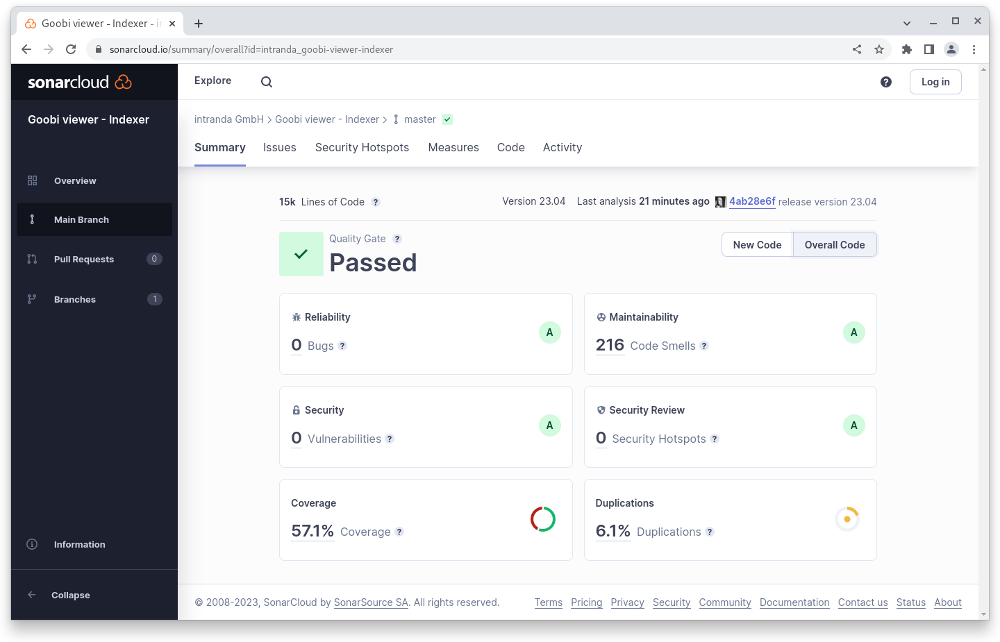

# April

## Coming soon :rocket:

* **Highlights**
* **Suchtreffergruppen**

## Ankündigungen


Wir stellen ein und suchen **Webdesigner  (m/w/d)** und **Java-Entwickler (m/w/d)** zur Unterstützung unseres Teams.


Im Hintergrund sind wir in verschiedenen Projekten voll ausgelastet. Featureentwicklungen die hier genannt werden könnten sind noch nicht abgeschlossen und fließen nach der Fertigstellung im Projektkontext dann in die kommenden Releases ein.

## Entwicklungen

### RIS Export

Suchtreffer können jetzt auch im RIS Format exportiert werden. Die Funktionalität kann analog zu dem Excel-Export genutzt werden.

### Docker Images

Das Unternehmen Docker Inc. hat in den letzten Monaten erst die Einstellung von kostenlosen Angeboten im Rahmen des Modells "Docker Free Team" angekündigt und Nutzer aufgefordert auf ein Bezahl-Abo-Modell umzustellen. Später wurde diese Ankündigung wieder zurückgezogen.

Wir haben uns dennoch entschieden von der Docker Hub Container Image Library zu der Github Container Registry zu wechseln.&#x20;

### Snippets

* Im Core ist die URL zur METS-Datei für den DFG-Viewer jetzt konfigurierbar. Das wird zum Beispiel benötigt, wenn diese in einem separaten Ordner liegen.
* Im Core wurde die Unterstützung von chinesischen Schriftzeichen in der Suche verbessert.
* Der Connector liefert XML-Antworten jetzt automatisch im korrekten Content Type aus
* Der Indexer hat verschiedene Verbesserungen erfahren, unter anderem eine bessere Fehlerbehandlung bei vermischten Rechten im Dateisystem

## Codeanalyse

Die folgenden Screenshots zeigen die SonarCloud Analyse des aktuellen Releases. Weitere Informationen gibt es direkt auf der [Projektseite](https://sonarcloud.io/organizations/intranda/projects).

<figure><figcaption><p>SonarCloud Analyse: Goobi viewer Core - für den Git Tag v23.04</p></figcaption></figure>

<figure><figcaption><p>SonarCloud Analyse: Goobi viewer Indexer - für den Git Tag v23.04</p></figcaption></figure>

<figure><figcaption><p>SonarCloud Analyse: Goobi viewer Connector - für den Git Tag v23.04</p></figcaption></figure>

## Versionsnummern

Die Versionen die in der `pom.xml` des Themes eingetragen werden müssen um die in diesem Digest beschriebenen Funktionen zu erhalten lauten:

```xml
<dependency>
    <groupId>io.goobi.viewer</groupId>
    <artifactId>viewer-core</artifactId>
    <version>23.04</version>
</dependency>
<dependency>
    <groupId>io.goobi.viewer</groupId>
    <artifactId>viewer-core-config</artifactId>
    <version>23.04</version>
</dependency>
<dependency>
    <groupId>io.goobi.viewer</groupId>
    <artifactId>viewer-connector</artifactId>
    <version>23.04</version>
</dependency>
```

Der Goobi viewer Indexer hat die Versionsnummer **23.04**\
Das Goobi viewer Crowdsourcing Modul hat die Versionsnummer **23.04**
