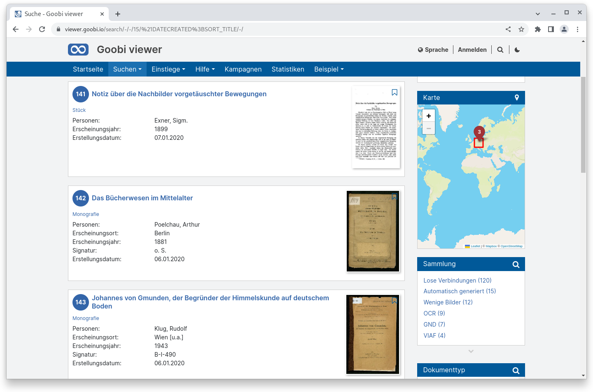
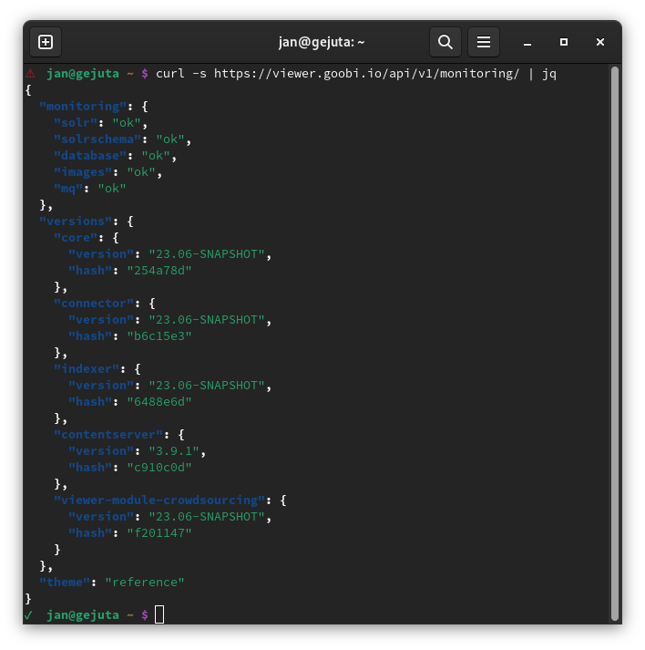
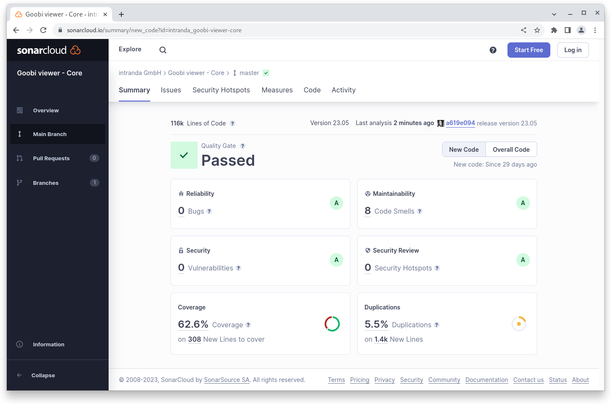
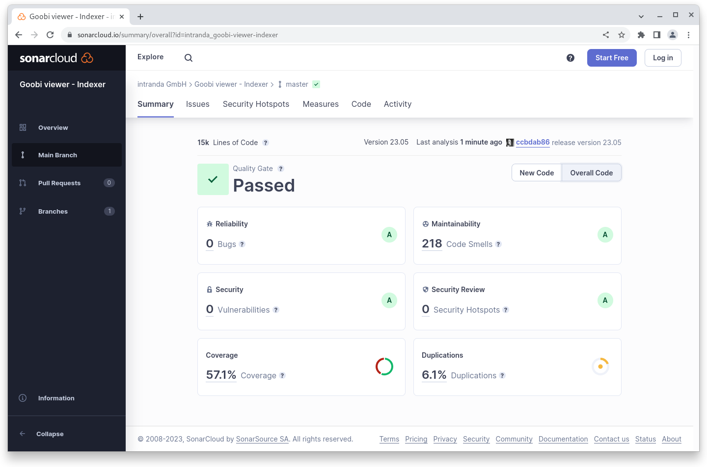
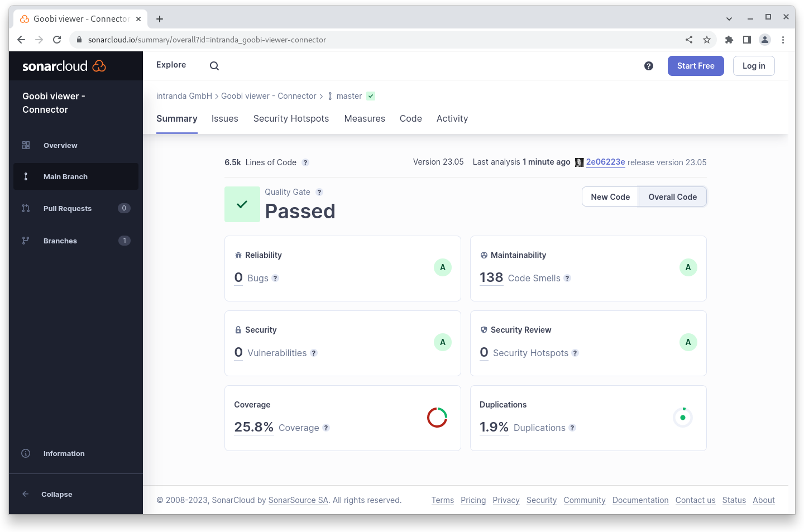

# Mai

## Coming soon :rocket:

* **Highlights**
* **Suchtreffergruppen**

## Entwicklungen

### Suchtreffer

Für die Darstellung von Suchtreffern hat es verschiedene kleine Entwicklungen gegeben. So können **Suchtreffer** jetzt optional **durchnummeriert** werden.&#x20;

Außerdem können **Metadaten in der Suchtrefferliste** automatisch in ihrer **Länge beschränkt** werden. Liegt zum Beispiel für eine E-Publikation ein kompletter Abstract als Metadatum vor, kann die Darstellung eines Suchtreffers sehr lang werden. Mit der Neuerung kann nur das relevante Snippet mit einer konfigurierbaren Anzahl von Zeichen davor und dahinter angezeigt werden.&#x20;

Gibt es **mehrere Einträge für ein Metadatum** wird jeder Eintrag in einer neuen Zeile angezeigt. Haben an einer E-Publikation mehrere Personen gearbeitet, kann auch dieses den Suchtreffer sehr in die Länge ziehen. Neu ist hier die Möglichkeit den **Separator** von einem Zeilenumbruch auf etwas eigenes zu **ändern**, zum Beispiel ein Semikolon. &#x20;

<figure><figcaption><p>Optionale Nummerierung von Suchtreffern</p></figcaption></figure>

Zuletzt gibt es bei der statischen, versteckten Sortierung von Suchtreffern noch eine kleine Neuerung, denn diese versteckten Sortierfelder können mit einem vorangestellten Ausrufezeichen jetzt auch andersherum sortiert werden.&#x20;

Anwendungsszenario für diesen Fall war, dass in einer Liste von Suchtreffern immer alle Datensätze mit Bildern oben und danach die ohne Bilder angezeigt werden sollten. Dafür steht im Index ein BOOL\_ Feld zur Verfügung in dem je nach Vorhandensein von Bildern der Wert `true` oder `false` steht. Da der Buchstabe f jedoch vor t kommt wurden immer alle Datensätze ohne Bilder zuerst angezeigt. Jetzt geht es auch wie gewünscht :wink:

### REST API

Der Monitoring Endpoint listet jetzt auch auf, ob die ActiveMQ Warteschlange läuft.

<figure><figcaption><p>JSON Ausgabe des Monitoring Endpoints vom Goobi viewer Core</p></figcaption></figure>

## Codeanalyse

Die folgenden Screenshots zeigen die SonarCloud Analyse des aktuellen Releases. Weitere Informationen gibt es direkt auf der [Projektseite](https://sonarcloud.io/organizations/intranda/projects).

<figure><figcaption><p>SonarCloud Analyse: Goobi viewer Core - für den Git Tag v23.05</p></figcaption></figure>

<figure><figcaption><p>SonarCloud Analyse: Goobi viewer Indexer - für den Git Tag v23.05</p></figcaption></figure>

<figure><figcaption><p>SonarCloud Analyse: Goobi viewer Connector - für den Git Tag v23.05</p></figcaption></figure>

## Versionsnummern

Die Versionen die in der `pom.xml` des Themes eingetragen werden müssen um die in diesem Digest beschriebenen Funktionen zu erhalten lauten:

```xml
<dependency>
    <groupId>io.goobi.viewer</groupId>
    <artifactId>viewer-core</artifactId>
    <version>23.05</version>
</dependency>
<dependency>
    <groupId>io.goobi.viewer</groupId>
    <artifactId>viewer-core-config</artifactId>
    <version>23.05</version>
</dependency>
<dependency>
    <groupId>io.goobi.viewer</groupId>
    <artifactId>viewer-connector</artifactId>
    <version>23.05</version>
</dependency>
```

Der Goobi viewer Indexer hat die Versionsnummer **23.05**\
Das Goobi viewer Crowdsourcing Modul hat die Versionsnummer **23.05**
