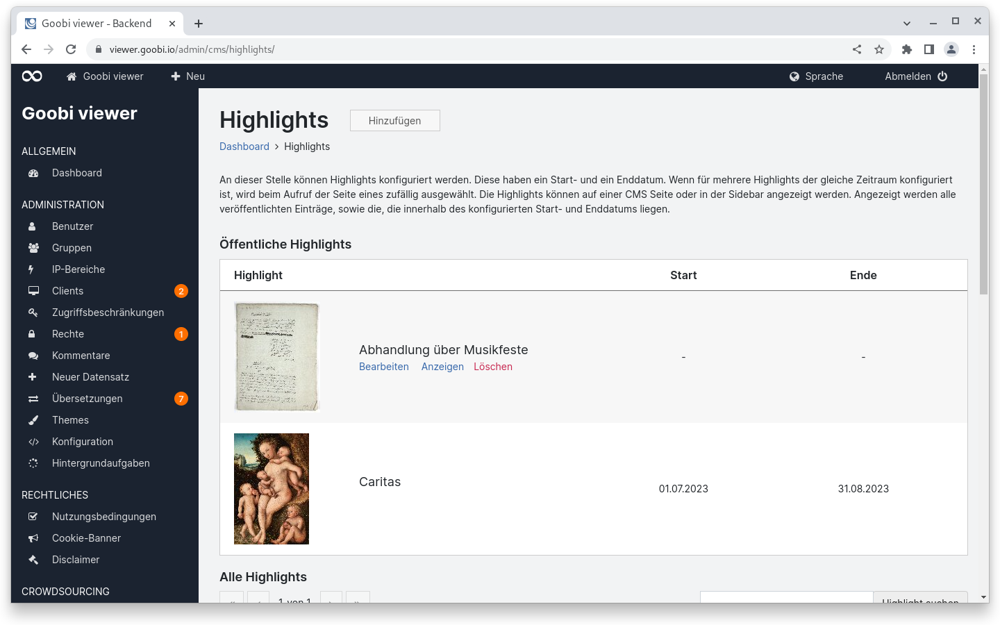
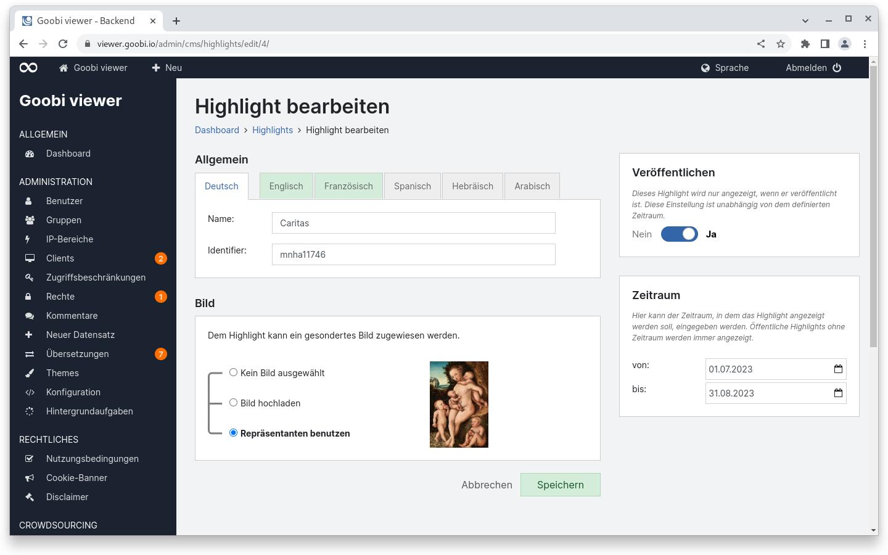
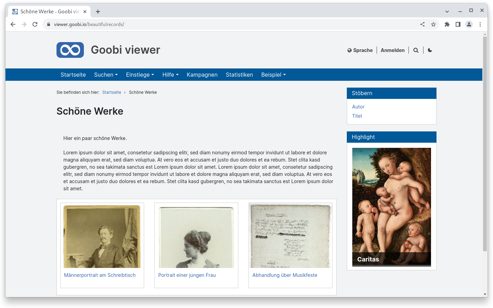

# Juni

## Coming soon :rocket:

* **Suchtreffergruppen**
* **externe Downloadlinks** für Datensätze

## Entwicklungen

### Highlights

Ob jetzt als "Objekt des Monats", als "Schätze aus dem Bestand" oder einfach nur Highlights: Im Backend können jetzt Datensätze oder alternativ auch URLs zu (CMS-)Seiten als Highlights definiert werden.

Highlights können vorbereitet und dann bei Bedarf veröffentlicht werden. Zusätzlich können sie auch automatisch für einen konfigurierten Zeitraum angezeigt werden, so dass zum Beispiel für mehrere Monate jeweils schon ein Objekt des Monats vorkonfiguriert werden kann.

Die Highlights können entweder als Widget in CMS-Seiten oder als Element auf einer CMS-Seite eingebettet werden.

<figure><figcaption><p>Highlights Übersicht im Backend</p></figcaption></figure>

<figure><figcaption><p>Highlight Konfiguration im Backend</p></figcaption></figure>

<figure><figcaption><p>Highlight in einem Sidebar Widget im Frontend</p></figcaption></figure>

### Goobi viewer Indexer

Die Indexierung von Repräsentanten ist jetzt weiter konfigurierbar. Die bisherige Logik sah vor, dass wenn in einem Datensatz ein Bild explizit als Repräsentant gekennzeichnet wurde diesen zu übernehmen. Wenn kein Bild markiert war gab es einen automatischen Fallback auf das erste Bild des Datensatzes.

Innerhalb dieser Logik gibt es jetzt zwei Neuerungen. Zum einen können Repräsentanten jetzt neben dem bereits bekannten `use="banner"` Attribut auch mit `xlink:label="START_PAGE"` gekennzeichnet sein. Zum anderen kann der Fallback auf das erste Bild ausgestellt werden, so dass Datensätze mit referenzierten Bildern gar keinen Repräsentanten haben.

### Snippets

* **Core**: Die Konfiguration der Metadatenlisten wurde vereinfacht. Aus den verschiedenen XML-Elementen wie `<searchHitMetadataList />` oder `<sidebBarMetadataList />` wurden `<metadataList type="searchHit" />` oder `<metadataList type="sideBar" />`. So können auch weitere Listen an Metadaten in Zukunft einfacher ohne umfassende Anpassungen am Code hinzugefügt werden
* **Connector**: Die über OAI ausgegebenen Metadaten für die Europeana wurden um isShownBy erweitert
* **Indexer**: Bildmaße können jetzt auch aus dem info.json von IIIF Bildmanifesten gelesen und indexiert werden.

## Codeanalyse

Die folgenden Screenshots zeigen die SonarCloud Analyse des aktuellen Releases. Weitere Informationen gibt es direkt auf der [Projektseite](https://sonarcloud.io/organizations/intranda/projects).

<figure><figcaption><p>SonarCloud Analyse: Goobi viewer Core - für den Git Tag v23.06</p></figcaption></figure>

<figure><figcaption><p>SonarCloud Analyse: Goobi viewer Indexer - für den Git Tag v23.06</p></figcaption></figure>

<figure><figcaption><p>SonarCloud Analyse: Goobi viewer Connector - für den Git Tag v23.06</p></figcaption></figure>

In SonarCloud lassen sich Qualitätsanforderungen, sogenannte Quality Gates, definieren. Die Quality Gates werden einmal auf den gesamten Quelltext angewendet und einmal auf den Quelltext der in den letzten 30 Tagen geändert wurde.

Das jetzt fehlschlagende Quality Gate im Goobi viewer Connector bezieht sich auf den angepassten Quelltext in den letzten 30 Tagen. Dort wird eine Testabdeckung von 25% gefordert, die aber nicht erreicht wird.

Das Quality Gate für den gesamten Quelltext wird erfüllt.

## Versionsnummern

Die Versionen die in der `pom.xml` des Themes eingetragen werden müssen um die in diesem Digest beschriebenen Funktionen zu erhalten lauten:

```xml
<dependency>
    <groupId>io.goobi.viewer</groupId>
    <artifactId>viewer-core</artifactId>
    <version>23.06</version>
</dependency>
<dependency>
    <groupId>io.goobi.viewer</groupId>
    <artifactId>viewer-core-config</artifactId>
    <version>23.06</version>
</dependency>
<dependency>
    <groupId>io.goobi.viewer</groupId>
    <artifactId>viewer-connector</artifactId>
    <version>23.06</version>
</dependency>
```

Der Goobi viewer Indexer hat die Versionsnummer **23.06**\
Das Goobi viewer Crowdsourcing Modul hat die Versionsnummer **23.06**
