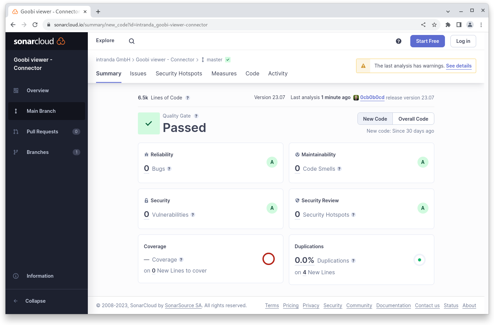

# Juli

## Coming soon :rocket:

* **Suchtreffergruppen**
* **Text** als Hauptanzeige für Werke

## Entwicklungen

### Externe Downloadlinks

Immer wieder kommt es vor, dass in METS-Dateien eine Dateigruppe `DOWNLOAD` existiert, in der für Portallösungen eine URL zu einer PDF-Datei oder einer dedizierten Download-Seite für das Werk verwiesen wird. Der Goobi viewer Indexer und der Goobi viewer Core unterstützen diese Lösung jetzt.

Hier ein Beispiel für die Dateigruppe:&#x20;

<pre class="language-xml"><code class="lang-xml">&#x3C;mets:fileGrp USE="DOWNLOAD">
<strong>    &#x3C;mets:file ID="DOWNLOAD_file_0000" MIMETYPE="text/html">
</strong>        &#x3C;mets:FLocat LOCTYPE="URL" xlink:href="https://repository.example.org/download/identifier=12345"/>
<strong>    &#x3C;/mets:file>
</strong>&#x3C;/mets:fileGrp>
</code></pre>

Sofern der Indexer die METS Dateigruppe erkennt, indexiert er die darin enthaltene URL in das Feld `MD2_DOWNLOAD_URL`. Der Goobi viewer wiederum erkennt eine solche URL und blendet dann in dem Inhaltsverzeichnis oder in dem Widget "Zitieren und Nachnutzen" die eigene Funktionalität zur PDF-Generierung aus. Anstelle dessen wird im Widget ein Download Badge angeboten, der auf die indexierte URL verweist.

### Zugriffsbeschränkungen

Wenn ein Werk mehreren Zugriffsbeschränkungen unterliegt, dann werden jetzt die Texte aller Beschränkungen im Sidebar Widget mit den Informationen zu Zugriffsbeschränkungen und Nutzungslizenz angezeigt.

### Suche

Das Standardfilterset für die Suche kann ab sofort mit einem neuen `default="true"` Attribut auf einen individuellen Filter festgelegt werden.

### Goobi viewer Indexer

Manche Dateisysteme sind nicht so schnell. Aus diesem Grund hält der Goobi viewer Indexer jetzt im Speicher eine Liste mit bis zu maximal 500 Dateien vor, die im Hotfolder liegen und abgearbeitet werden sollen. Dadurch wird ein potentiell zeitaufwendiges Dateisystemlisting vermieden, was bei langsamen Speichersystemen und vielen Dateien im Hotfolder die Performance stark ausgebremst hat.

Zusätzlich besteht ab diesem Release die Möglichkeit einen zweiten Hotfolder zu konfigurieren, der für Neuindexierungen verwendet werden kann. Ausschlaggebend ist die Reihenfolge in der `config_indexer.xml`. Dabei werden die Datensätze aus dem Standard Hotfolder prioritär behandelt, so dass eine normale Produktion mit dazugehörigem schnellen Export auch während einer umfangreichen Neuindexierung mit sehr vielen Datensätzen nicht gestört wird.

Der Goobi viewer Indexer kann einen Wert anhand des neuen Platzhalters {SPLIT} in mehrere aufteilen. In dem folgenden Beispiel wird nach über einen regulären Ausdruck nach "international" gesucht und dann anschließend im Index die Werte LUX\_YES und LUX\_NO geschrieben:

```xml
<replace regex="^international$">LUX_YES{SPLIT}LUX_NO</replace>
```

## Codeanalyse

Die folgenden Screenshots zeigen die SonarCloud Analyse des aktuellen Releases. Weitere Informationen gibt es direkt auf der [Projektseite](https://sonarcloud.io/organizations/intranda/projects).

<figure><figcaption><p>SonarCloud Analyse: Goobi viewer Core - für den Git Tag v23.07</p></figcaption></figure>

<figure><figcaption><p>SonarCloud Analyse: Goobi viewer Indexer - für den Git Tag v23.07</p></figcaption></figure>

<figure><figcaption><p>SonarCloud Analyse: Goobi viewer Connector - für den Git Tag v23.06</p></figcaption></figure>

## Versionsnummern

Die Versionen die in der `pom.xml` des Themes eingetragen werden müssen um die in diesem Digest beschriebenen Funktionen zu erhalten lauten:

```xml
<dependency>
    <groupId>io.goobi.viewer</groupId>
    <artifactId>viewer-core</artifactId>
    <version>23.07</version>
</dependency>
<dependency>
    <groupId>io.goobi.viewer</groupId>
    <artifactId>viewer-core-config</artifactId>
    <version>23.07.1</version>
</dependency>
<dependency>
    <groupId>io.goobi.viewer</groupId>
    <artifactId>viewer-connector</artifactId>
    <version>23.07</version>
</dependency>
```

Der Goobi viewer Indexer hat die Versionsnummer **23.07.1**\
Das Goobi viewer Crowdsourcing Modul hat die Versionsnummer **23.07**
