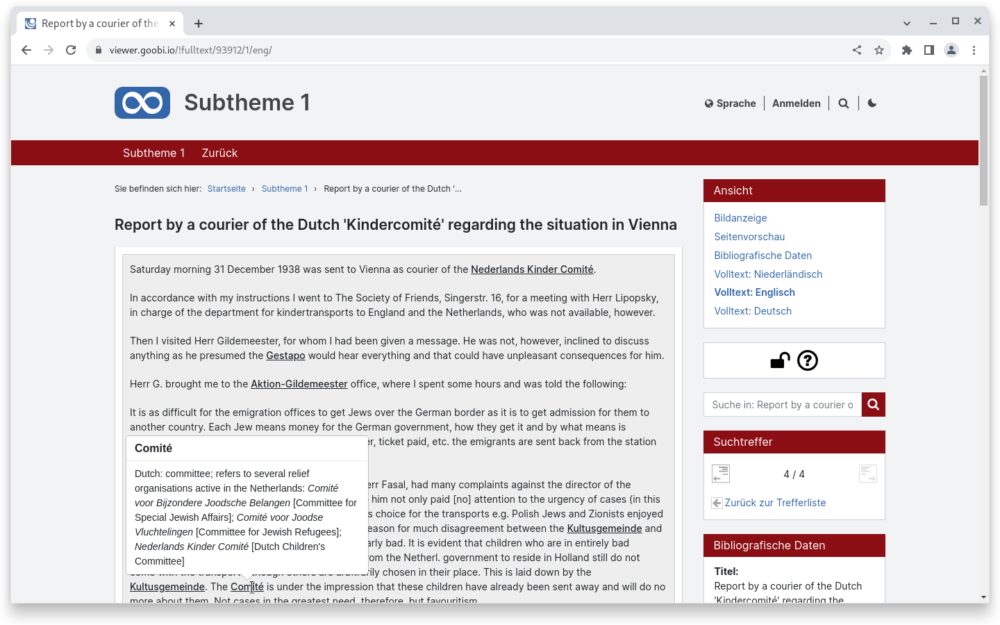
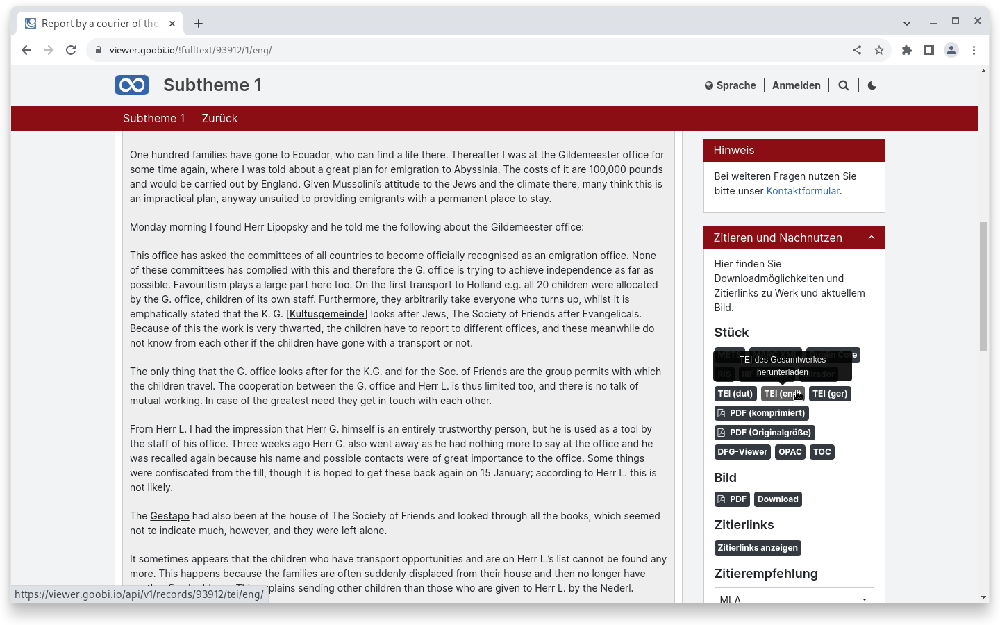
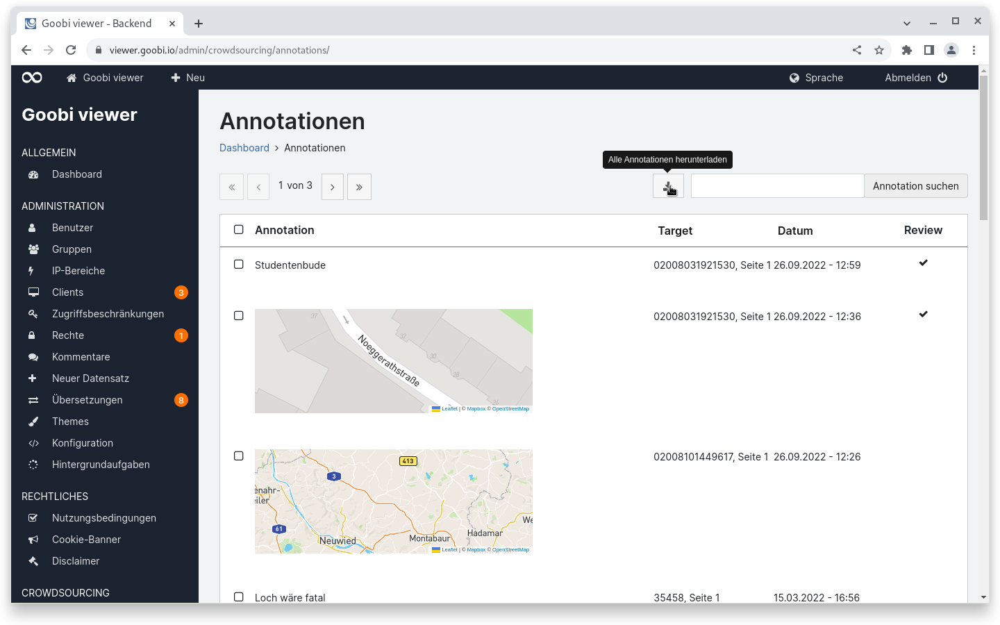

# August

## Coming soon :rocket:

* **Suchtreffergruppen**

## **Entwicklungen**

### TEI Anzeige

Was bisher über ein kundenspezifisches Modul realisiert wurde ist jetzt in den Goobi viewer Kern integriert: Eine native TEI Anzeige. Der hier abgedeckte Anwendungsfall ist, dass für ein digitalisiertes Werk eine TEI Datei mit einer Transkription sowie weitere TEI-Dateien mit Übersetzungen vorliegen. Die Dateien beziehen sich jeweils auf das gesamte Werk und nicht nur auf eine einzelne Seite.

Sofern diese TEI Dateien vorliegen werden sie bei der Indexierung mit bedacht und im Frontend des Goobi viewers stehen dann in der Werksansicht mehrere Volltextlinks zur Verfügung. Im Widget "Zitieren und Nachnutzen" können die einzelnen TEI-Dateien heruntergeladen werden.

<figure><figcaption>
Anzeige für eine englische Transkription mit Anmerkungen im TEI Format
</figcaption></figure>

<figure><figcaption>
Für jede vorliegende Sprache kann die TEI Datei im Widget "ZItieren und Nachnutzen" heruntergeladen werden
</figcaption></figure>

### Annotationen

Bisher konnten im Goobi viewer Backend auf der Seite "Annotationen" entweder nur die selektierten oder alle der aktuellen Seite heruntergeladen werden. Eine seitenübergreifende Downloadmöglichkeit für _alle_ Annotationen bestand nicht.

Dieses wurde im August implementiert und steht jetzt als zusätzlicher Download-Button oberhalb der Tabelle zur Verfügung

<figure><figcaption>
Im Goobi viewer Backend können auf der Seite "Annotationen" jetzt auch alle Einträge als Excel-Datei heruntergeladen werden
</figcaption></figure>

### Client

Der Druckdialog innerhalb des Goobi viewer Desktop Clients kann jetzt optional aktiviert werden. Dafür steht in der app.config.js eine neue Konfigurationsoption `allowPrint: true|false` zur Verfügung. Der Standardwert ist `false`.

Weiter können PDF-Dateien im Client jetzt nativ in einem eigenen Fenster angezeigt werden.

### Metadaten

Wenn ein Datum indexiert wurde, kann dieses in der Metadatenkonfiguration jetzt als `type="datefield"` konfiguriert und die Datumsanzeige dann mit dem `pattern=""` Attribut auf das gewünschte Format eingestellt werden.


Im August gab es kein dediziertes Goobi viewer Release.

