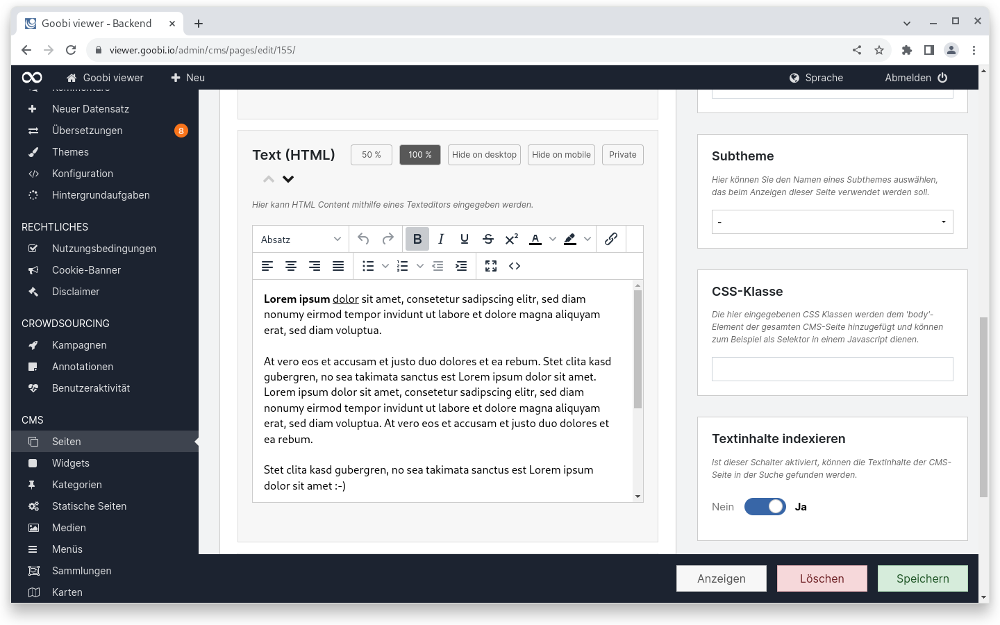
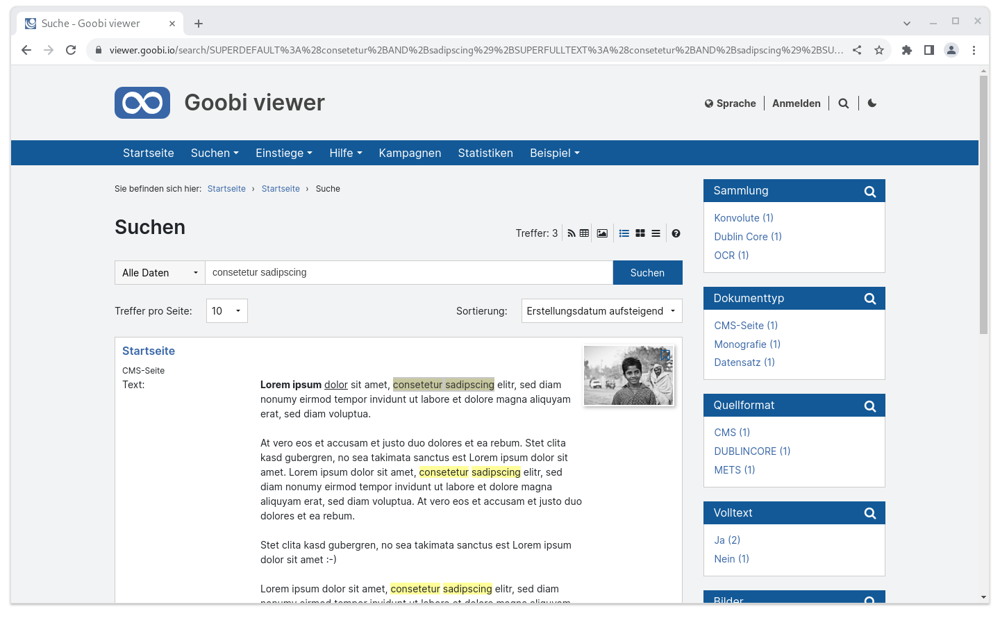
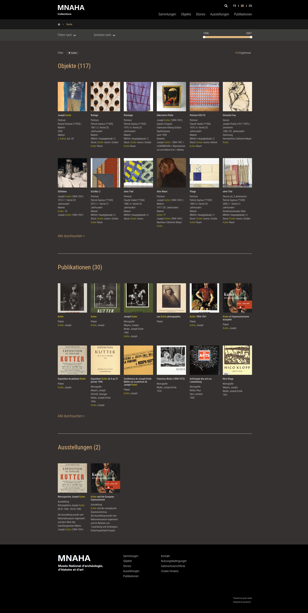

# September

## Coming soon :rocket:

* **Karten**
* **Suchmaschinenoptimierung**
* **Live-Aufbereitung** von Datensätzen

## Entwicklungen

### Suche in CMS-Seiten

Die Textinhalte von CMS-Seiten können optional mit indexiert werden, so dass sie in einer Suche gefunden werden. Dafür wurde der Goobi viewer Indexer entsprechend erweitert und im Goobi viewer Backend steht im CMS-Bereich bei der Bearbeitung von CMS-Seiten ein neues Widget zur Verfügung, bei dem die Indexierung der Textinhalte aktiviert werden kann.

Ist eine CMS-Seite einer Kategorie zugeordnet, wird diese als Publikationstyp angezeigt. Dadurch kann zwischen verschiedenen CMS-Seitentypen wie zum Beispiel FAQ Fragen und Antworten oder Projektseiten unterschieden werden. Ist eine CMS-Seite keiner Kategorie zugewiesen wird sie als "CMS-Seite" angezeigt.

Sofern ein Element "Vorschaubild" auf der CMS-Seite enthalten ist, wird das Bild in den Suchtreffern angezeigt, wenn die indexierten Inhalte gefunden werden.

<figure><figcaption><p>Neue Option in der Sidebar von CMS-Seiten um die Textinhalte zu indexieren</p></figcaption></figure>

<figure><figcaption><p>Inhalte von CMS-Seiten werden in der Suchtrefferliste angezeigt</p></figcaption></figure>

### Suchtreffergruppen

Neu ist die Entwicklung der Suchtreffergruppen. Sofern aktiviert, können Suchtreffer in einzelne Abschnitte aufgeteilt werden. Im folgenden Beispiel gibt es vier Suchtreffergruppen: LIDO Datensätze, Monographien, CMS-Seiten der Kategorie Stories und CMS-Seiten der Kategorie Exhibitions.

Sind Suchtreffergruppen aktiv, wird die eingegebene Suche nur über die jeweils konfigurierten Teilbestände durchgeführt. Sind Treffer auch in nicht konfigurierten Gruppen enthalten werden diese nicht angezeigt.

Pro Suchtreffergruppe kann festgelegt werden, wie viele Treffer in der Gruppenübersicht angezeigt werden sollen bis ein "Alle durchsuchen" Link gerendert wird.&#x20;

Konfiguration:


```xml
<search>
    <resultGroups enabled="true">
        <group name="lido_objects" query="SOURCEDOCFORMAT:LIDO" previewHitCount="12" />
        <group name="monographs" query="+DOCSTRCT:monograph" previewHitCount="12" />
        <group name="stories" query="+DOCSTRCT:cms_page +MD_CATEGORY:Stories" previewHitCount="12" />
        <group name="exhibitions" query="+DOCSTRCT:cms_page +MD_CATEGORY:Exhibitions" previewHitCount="12" />
    </resultGroups>
</search>
```


Hier eine Sneak Preview wie das ganze in einem Theme aussieht:

<figure><figcaption><p>Suchtreffergruppen bei einer Suche nach "kutter" in einer Sneak Preview</p></figcaption></figure>

### Suchtrefferperformance

In der Suche des Goobi viewers werden immer komplette Werke / Objekte / Datensätze gefunden. Darin enthalten sind eventuelle Untertreffer von verschiedenen Typen, zum Beispiel Volltext. Dieser Bereich wurde aufgeräumt und von der verwendeten Technologie vereinfacht. Dadurch konnte die Performance gesteigert und Komplexität verringert werden.


Im September gab es kein dediziertes Goobi viewer Release.

