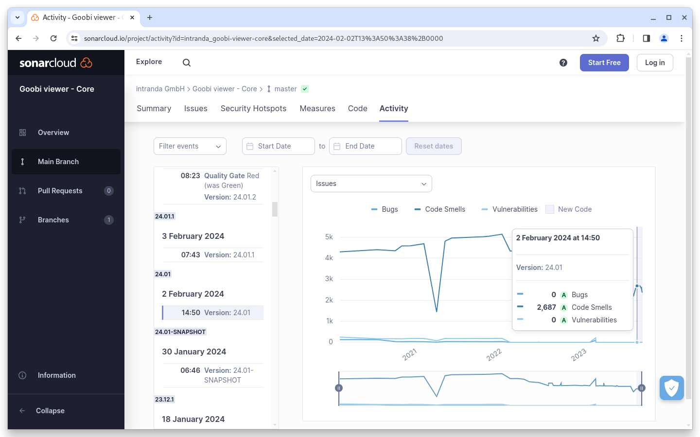
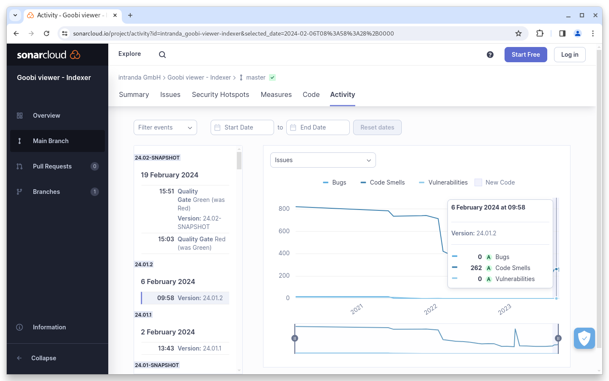

# Januar

## Coming soon :rocket:

* **Solr 9**
* **IIIF Manifeste** mit nur einem Bild
* **Neue Widgets** für Download, Metadaten, Links und Zitieren
* **Live-Aufbereitung** von Inhalten

## Ankündigungen


Mit dem **Januar Release** des Goobi viewers ist die Verwendung von **Java 17 verpflichtend**.&#x20;


## Entwicklungen

### Core

Der Januar war vor allem geprägt von dem Einspielen von Updates auf Kundensystemen und den Arbeiten darum herum. Deswegen gibt es keine nennenswerten Feature-Entwicklungen sondern vor allem Bugfixes.

Im Hintergrund gab es in der letzten Zeit dennoch viele Änderungen, die in dem Januar Digest Erwähnung finden sollen. Die Offensichtlichste ist, dass wir auf Java 17 geschwenkt sind. Das bedeutet, dass der Goobi viewer mit einer aktuellen Java Version kompiliert und auch betrieben werden muss. Die Umstellung ist zum Beispiel dafür notwendig, um auch in Zukunft aktuelle Java-Libraries einsetzen zu können. Nur so kann die Applikation aktuell gehalten und schnell auf etwaige Sicherheitslücken reagiert werden.

Außerdem wurden die automatischen Unit Tests auf JUnit 5 migriert. Auch hier kommt damit eine aktuelle Technologie zum Einsatz.

Zuletzt arbeiten wir im Hintergrund daran bestimmte stilistische Code-Konventionen zu erfüllen. Dafür haben wir das Tool Checkstyle in der CI-Pipeline im Einsatz. Über die vergangenen Monate konnten bereits tausende Anmerkungen bearbeitet und korrigiert werden, so dass nun nur noch knapp 200 übrig sind. Auch diese Violations werden wir in den nächsten Monaten noch weiter reduzieren um dann in Zukunft einen einheitlichen Programmierstil über den gesamten Quelltext hinweg sicherzustellen.

## Codeanalyse

Die folgenden Screenshots zeigen die SonarCloud Analyse des aktuellen Releases. Weitere Informationen gibt es direkt auf der [Projektseite](https://sonarcloud.io/organizations/intranda/projects).


Während des Releaseprozesses wurde vergessen entsprechende Screenshots zu machen. Deswegen zeigen die Screenshots diesen Monat den Status auf eine andere Weise. Die Quality Gates sind alle erfüllt worden.


<figure><figcaption><p>SonarCloud Analyse: Goobi viewer Core - für den Git Tag v24.01</p></figcaption></figure>

<figure><figcaption><p>SonarCloud Analyse: Goobi viewer Indexer - für den Git Tag v24.01.2</p></figcaption></figure>

<figure><figcaption><p>SonarCloud Analyse: Goobi viewer Connector - für den Git Tag v24.01</p></figcaption></figure>

## Versionsnummern

Die Versionen die in der `pom.xml` des Themes eingetragen werden müssen um die in diesem Digest beschriebenen Funktionen zu erhalten lauten:

```xml
<dependency>
    <groupId>io.goobi.viewer</groupId>
    <artifactId>viewer-core</artifactId>
    <version>24.01.7</version>
</dependency>
<dependency>
    <groupId>io.goobi.viewer</groupId>
    <artifactId>viewer-core-config</artifactId>
    <version>24.01</version>
</dependency>
<dependency>
    <groupId>io.goobi.viewer</groupId>
    <artifactId>viewer-connector</artifactId>
    <version>24.01</version>
</dependency>
```

Der Goobi viewer Indexer hat die Versionsnummer **24.01.2**\
Das Goobi viewer Crowdsourcing Modul hat die Versionsnummer **24.01.1**
