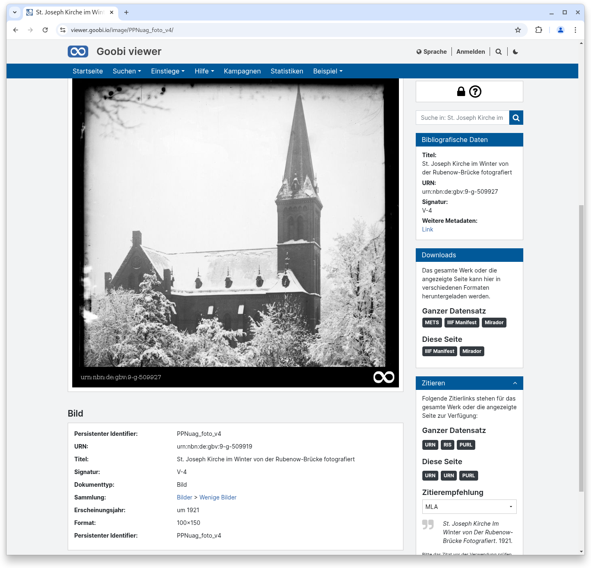
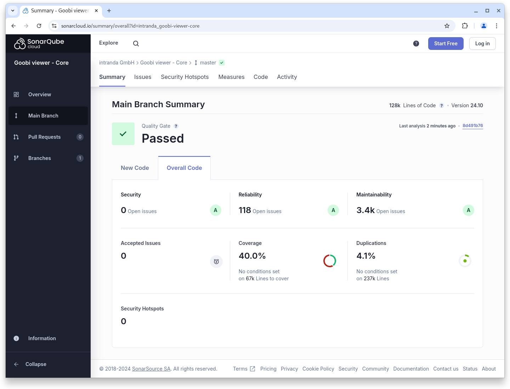
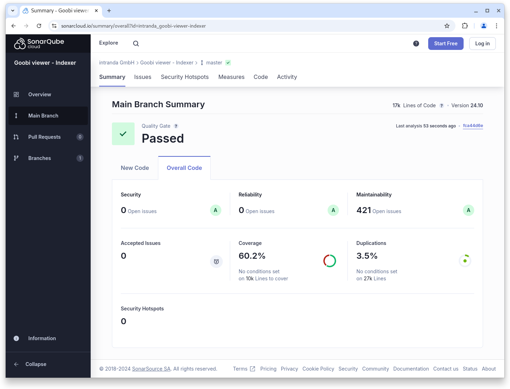
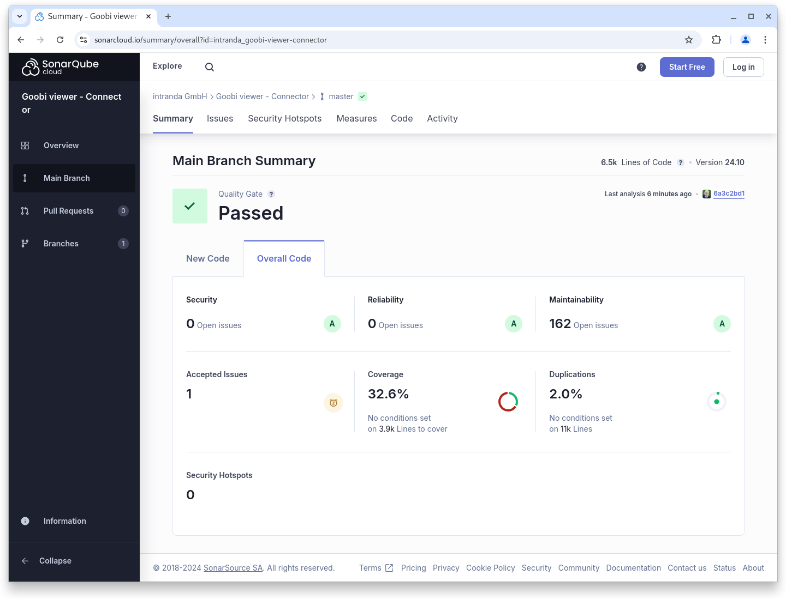

# Oktober

## Coming soon :rocket:

* **zugriffsbeschränkte Metadaten**
* **Tomcat 10** Unterstützung

## Ankündigungen


Wir planen für das **Januar 2025 Release** mit verschiedene **Breaking Changes:**

* Unterstützung für **Tomcat 10**
* Unterstützung für **Java 21**
* **Syntaxänderungen** in der **Konfiguration** des Goobi viewer **Indexers**
* **Veränderte Indexierung** der Solr-internen **Iddocs** auf  einen alternativen Datentyp


## Entwicklungen

### Metadatenanzeige

Neben der Anzeige der Metadaten auf einer eigenen Seite ist es ab sofort möglich die Metadaten auch unterhalb der Bildanzeige zu rendern. Dafür gibt es das neue location Attribut in dem metadataView Element. Diese Einstellung ergibt vor allem bei Datensätzen Sinn, die nur aus einem Bild und dazugehörigen Metadaten bestehen.

<figure><figcaption><p>Optionale Anzeige von Metadaten unterhalb des Bildes</p></figcaption></figure>


### Metadatenkonfiguration

Bei der Verknüpfung von Entitäten haben die Verknüpfungen selbst eine Typisierung. Mit dem neuen, optionalen `<filterQuery />` Element innerhalb einer Metadatenkonfiguration können die Verknüpfungen nach Typ gruppiert angezeigt werden.

### Snippets

* **OAI**: Beim Aufruf der OAI Schnittstelle über /oai, wird ab sofort nicht mehr automatisch ein Slash angehängt. Das behebt einige Probleme mit Harvestern.
* **Archive**: Die Performance beim Laden wurde verbessert.

## Codenanalyse

Die folgenden Screenshots zeigen die SonarCloud Analyse des aktuellen Releases. Weitere Informationen gibt es direkt auf der [Projektseite](https://sonarcloud.io/organizations/intranda/projects).

<figure><figcaption><p>SonarCloud Analyse: Goobi viewer Core - für den Git Tag v24.10</p></figcaption></figure>

<figure><figcaption><p>SonarCloud Analyse: Goobi viewer Indexer - für den Git Tag v24.10</p></figcaption></figure>

<figure><figcaption><p>SonarCloud Analyse: Goobi viewer Connector - für den Git Tag v24.10</p></figcaption></figure>

## Versionsnummern

Die Versionen die in der `pom.xml` des Themes eingetragen werden müssen um die in diesem Digest beschriebenen Funktionen zu erhalten lauten:

```xml
<dependency>
    <groupId>io.goobi.viewer</groupId>
    <artifactId>viewer-core</artifactId>
    <version>24.10.1</version>
</dependency>
<dependency>
    <groupId>io.goobi.viewer</groupId>
    <artifactId>viewer-core-config</artifactId>
    <version>24.10</version>
</dependency>
<dependency>
    <groupId>io.goobi.viewer</groupId>
    <artifactId>viewer-connector</artifactId>
    <version>24.10</version>
</dependency>
```

Der Goobi viewer Indexer hat die Versionsnummer **24.10**\
Das Goobi viewer Crowdsourcing Modul hat die Versionsnummer **24.10**
