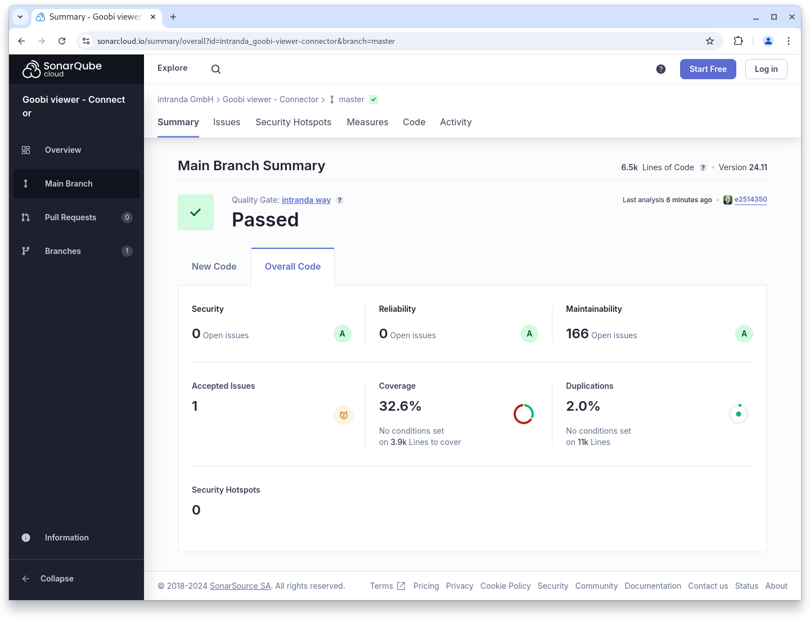

# November

## Coming soon :rocket:

* **zugriffsbeschränkte Metadaten**
* **Tomcat 10** Unterstützung
* **Bildwechsel** über **Scrolling** und **ohne Neuladen** der Seite

## Ankündigungen


Wir planen für das **Januar 2025 Release** mit verschiedene **Breaking Changes:**

* Unterstützung für **Tomcat 10**
* Unterstützung für **Java 21**
* **Syntaxänderungen** in der **Konfiguration** des Goobi viewer **Indexers**
* **Veränderte Indexierung** der Solr-internen **Iddocs** auf  einen alternativen Datentyp


## Entwicklungen

In dem November haben wir an ganz vielen Dingen gearbeitet, die aber vor allem unter der Haube passiert sind oder in Vorbereitung auf die Breaking Changes im Januar kommenden Jahres. Dazu kamen viele Theme Updates auf Kundensystemen. Einige Kleinigkeiten die in dem November Release enthalten sind:

* **Backend**: Rechte konnten angelegt werden, ohne dass alle Fragen dazu beantwortet wurden. Das führte zu einem invaliden Status in der Datenbank.&#x20;
* **Inhaltsverzeichnis**:  Im Inhaltsverzeichnis von Anchor Werken wurde bei den Thumbnails der gewählte Repräsentant des Volumes nicht mit berücksichtigt.
* **REST-API**: Der Monitoring-Endpoint gibt keinen Status `error`mehr aus, wenn die Message Queue in der Konfigurationsdatei deaktiviert wurde.

## Codenanalyse

Die folgenden Screenshots zeigen die SonarCloud Analyse des aktuellen Releases. Weitere Informationen gibt es direkt auf der [Projektseite](https://sonarcloud.io/organizations/intranda/projects).

<figure><figcaption><p>SonarCloud Analyse: Goobi viewer Core - für den Git Tag v24.11</p></figcaption></figure>

<figure><figcaption><p>SonarCloud Analyse: Goobi viewer Indexer - für den Git Tag v24.11</p></figcaption></figure>

<figure><figcaption><p>SonarCloud Analyse: Goobi viewer Connector - für den Git Tag v24.11</p></figcaption></figure>

## Versionsnummern

Die Versionen die in der `pom.xml` des Themes eingetragen werden müssen um die in diesem Digest beschriebenen Funktionen zu erhalten lauten:

```xml
<dependency>
    <groupId>io.goobi.viewer</groupId>
    <artifactId>viewer-core</artifactId>
    <version>24.11</version>
</dependency>
<dependency>
    <groupId>io.goobi.viewer</groupId>
    <artifactId>viewer-core-config</artifactId>
    <version>24.11</version>
</dependency>
<dependency>
    <groupId>io.goobi.viewer</groupId>
    <artifactId>viewer-connector</artifactId>
    <version>24.11</version>
</dependency>
```

Der Goobi viewer Indexer hat die Versionsnummer **24.11**\
Das Goobi viewer Crowdsourcing Modul hat die Versionsnummer **24.11**
