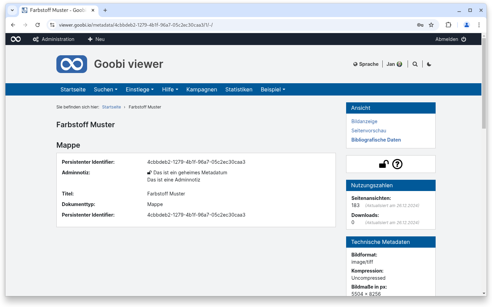
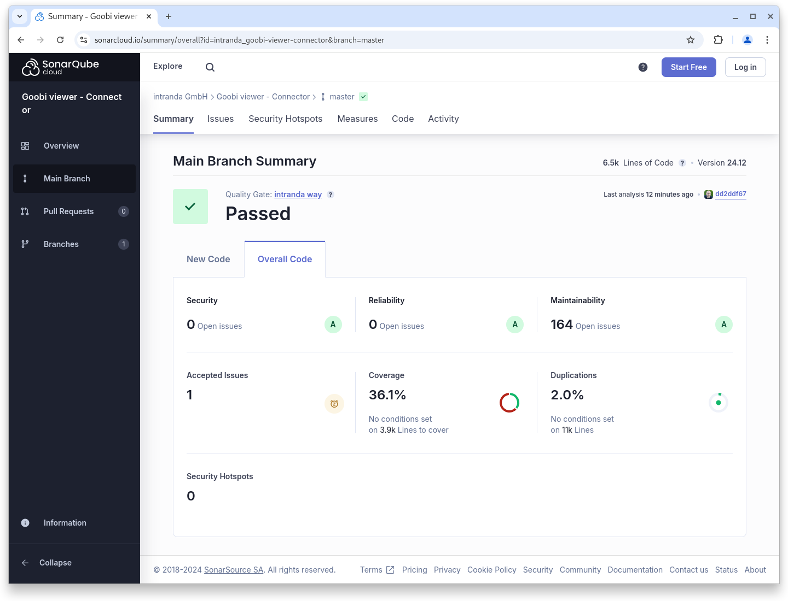

# Dezember

## Coming soon :rocket:

* **Tomcat 10** Unterstützung

## Ankündigungen


Wir planen für das **Januar 2025 Release** mit verschiedene **Breaking Changes:**

* Unterstützung für **Tomcat 10**
* Unterstützung für **Java 21**
* **Syntaxänderungen** in der **Konfiguration** des Goobi viewer **Indexers**
* **Veränderte Indexierung** der Solr-internen **Iddocs** auf  einen alternativen Datentyp


## Entwicklungen

### zugriffsbeschränkte Metadaten

Ab diesem Release unterstützt der Goobi viewer Zugriffsbeschränkungen für einzelne Metadaten. Dafür wird das Standard MODS Attribut `shareable="no"` ausgewertet. Der Goobi viewer Indexer schreibt dann automatisch die Zugriffsbeschränkung `metadata_access_restricted`, die dann im Backend konfiguriert werden muss.

Die zugriffsbeschränkten Metadaten werden bei der Auslieferung über OAI, SRU, IIIF, Sourcefile-Resolver etc. automatisch herausgefiltert.

Auf der Seite der Bibliographischen Daten sind zugriffsbeschränkte Metadaten - wenn man das Recht hat sie zu sehen - mit einem Schlosssymbol gekennzeichnet.

<figure><figcaption><p>zugriffsbeschränkte Metadaten sind mit einem Schlosssymbol gekennzeichnet</p></figcaption></figure>


Die aktuelle Implementierung erlaubt es nur einen Typ von zugriffsbeschränkten Metadaten zu haben. Man kann das Recht haben diese zu sehen, oder nicht. Eine Konfiguration von verschiedenen Beschränkungstypen wo zum Beispiel Benutzergruppe ABC etwas sehen kann und Benutzergruppe XYZ etwas anderes ist aktuell nicht vorgesehen.


### Bildwechsel über Scrolling

Mitte November erreichte uns der dringende Wunsch bis Ende des Jahres eine Funktionalität in den Goobi viewer zu implementieren, die es ermöglicht wie in einem PDF Reader durch ein Werk zu navigieren. Dafür sollte man mit dem Mausrad im Bildcontainer nicht zoomen, sondern im Bildstapel nach oben oder unten scrollen. Neben dem Bildcontainer soll eine Thumbnailleiste zur Verfügung stehen, die - analog zu einem PDF Reader - separat scrollbar ist und es ermöglicht schnell ein Bild anzuspringen.&#x20;

Neben der eigentlichen Implementierung war dann noch die Aufgabe zu lösen, dass sich auch weitere Informationen beim Bildwechsel mit aktualisieren müssen: Die URL in der Adresszeile des Browsers, die Bibliographischen Daten, das Inhaltsverzeichnis oder die URLs zum Download eines Bildes. Aber auch das wurde erfolgreich implementiert.

Der Sequence-Modus kann global ein- und ausgestellt werden. Im kommenden Jahr werden wir daran arbeiten diesen auch nur unter bestimmten Bedingungen, wie zum Beispiel bei bestimmten Publikationstypen oder Sammlungen aktiviert zu haben.



### Snippets

* **Passwortänderung:** In einem externen Pen-Test ist aufgefallen, dass Benutzer teilweise ihr Passwort ändern konnten wenn bei dem alten irgendetwas eingegeben wurde. Der Fehler wurde behoben.
* **Authentifizierung**: Bei der Authentifizierung über HTTP Header oder Attribut gab es einen Fehler der Behoben wurde.

## Codenanalyse

Die folgenden Screenshots zeigen die SonarCloud Analyse des aktuellen Releases. Weitere Informationen gibt es direkt auf der [Projektseite](https://sonarcloud.io/organizations/intranda/projects).

<figure><figcaption><p>SonarCloud Analyse: Goobi viewer Core - für den Git Tag v24.12</p></figcaption></figure>

<figure><figcaption><p>SonarCloud Analyse: Goobi viewer Indexer - für den Git Tag v24.12</p></figcaption></figure>

<figure><figcaption><p>SonarCloud Analyse: Goobi viewer Connector - für den Git Tag v24.12</p></figcaption></figure>

## Versionsnummern

Die Versionen die in der `pom.xml` des Themes eingetragen werden müssen um die in diesem Digest beschriebenen Funktionen zu erhalten lauten:

```xml
<dependency>
    <groupId>io.goobi.viewer</groupId>
    <artifactId>viewer-core</artifactId>
    <version>24.12</version>
</dependency>
<dependency>
    <groupId>io.goobi.viewer</groupId>
    <artifactId>viewer-core-config</artifactId>
    <version>24.12</version>
</dependency>
<dependency>
    <groupId>io.goobi.viewer</groupId>
    <artifactId>viewer-connector</artifactId>
    <version>24.12</version>
</dependency>
```

Der Goobi viewer Indexer hat die Versionsnummer **24.12**\
Das Goobi viewer Crowdsourcing Modul hat die Versionsnummer **24.12**
