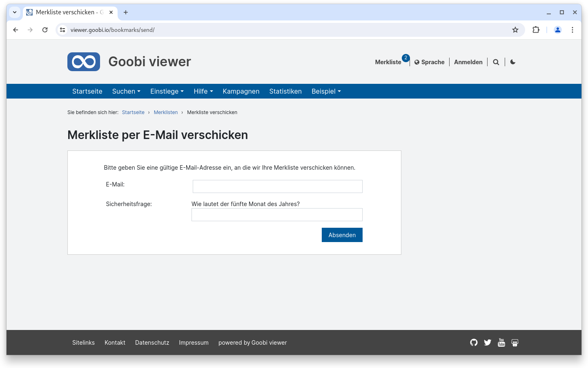
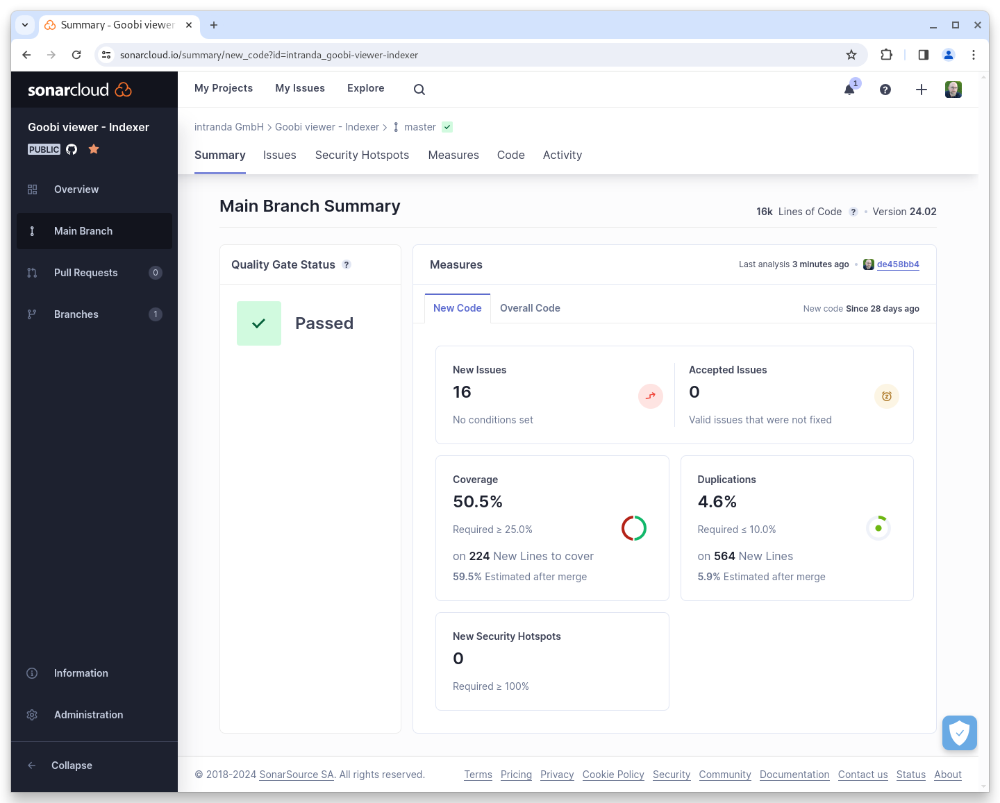
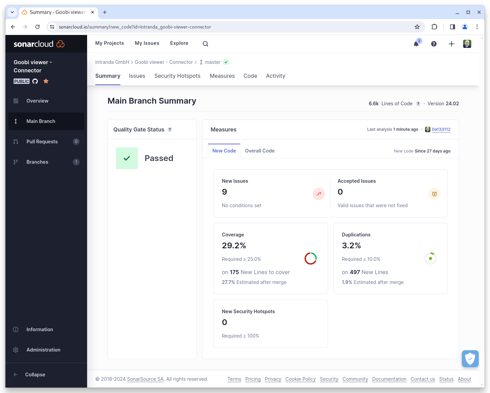

# Februar

## Coming soon :rocket:

* **IIIF Manifeste** mit nur einem Bild
* **Neue Widgets** für Download, Metadaten, Links und Zitieren
* **Live-Aufbereitung** von Inhalten
* **Überarbeitung von EAD** Strukturen

## Entwicklungen

### Solr

Die größte Änderung im Februar hat unter der Haube stattgefunden. Apache Solr wurde auf die Version 9.5.0 aktualisiert. Damit wird endlich eine aktuelle Version der Software eingesetzt.&#x20;


Bei einem Update auf das Februar Release des Goobi viewers ist ein Solr Update mit anschließender Neuindexierung zwingend erforderlich.


### Merkliste

Bei der Absicherung des E-Mailversands war uns eine Stelle noch durch die Lappen gegangen. Hier wurden wir im Februar auf die Möglichkeit zum Versand von Merklisten aufmerksam gemacht. Auch dieser Bereich ist jetzt mit einer Sicherheitsabfrage gesichert.

<figure><figcaption><p>Das Formular zum versenden einer Merkliste hat jetzt auch einen SPAM Schutz</p></figcaption></figure>

### Stöbern

Für die Stöbern Funktionalität gibt es jetzt das neue, optionale Attribut `skipInWidget="true"`. Das führt dazu, dass ein fürs Stöbern konfiguriertes Feld nicht im Widget angezeigt wird. Allerdings steht es weiterhin für das Stöbern-Element auf CMS-Seiten zur Verfügung. Dadurch können individuelle CMS-Stöbern Seiten angelegt werden.

### Goobi viewer Indexer

Im Goobi viewer Indexer gab es zwei nennenswerte Entwicklungen:

1. Es können Namen von METS Dateigruppen konfiguriert werden, die - bei Vorhandensein - für die Indexierung von Bilddateipfaden verwendet werden. Siehe dafür auch den Schalter mets/preferredImageFileGroup
2. Durch einen Fehler in der Logik wurden teilweise Werke gelöscht, wenn eine CMS-Seite, die mit einem Werk verknüpft war, depubliziert wurde. Dieser Fehler wurde behoben.

### Snippets

* Auch die Docker Container laufen jetzt komplett mit Java 17

## Codeanalyse

Die folgenden Screenshots zeigen die SonarCloud Analyse des aktuellen Releases. Weitere Informationen gibt es direkt auf der [Projektseite](https://sonarcloud.io/organizations/intranda/projects).

<figure><figcaption><p>SonarCloud Analyse: Goobi viewer Core - für den Git Tag v24.02</p></figcaption></figure>

<figure><figcaption><p>SonarCloud Analyse: Goobi viewer Indexere - für den Git Tag v24.02</p></figcaption></figure>

<figure><figcaption><p>SonarCloud Analyse: Goobi viewer Connector - für den Git Tag v24.02</p></figcaption></figure>

## Versionsnummern

Die Versionen die in der `pom.xml` des Themes eingetragen werden müssen um die in diesem Digest beschriebenen Funktionen zu erhalten lauten:

```xml
<dependency>
    <groupId>io.goobi.viewer</groupId>
    <artifactId>viewer-core</artifactId>
    <version>24.02.2</version>
</dependency>
<dependency>
    <groupId>io.goobi.viewer</groupId>
    <artifactId>viewer-core-config</artifactId>
    <version>24.02</version>
</dependency>
<dependency>
    <groupId>io.goobi.viewer</groupId>
    <artifactId>viewer-connector</artifactId>
    <version>24.02</version>
</dependency>
```

Der Goobi viewer Indexer hat die Versionsnummer **24.02**\
Das Goobi viewer Crowdsourcing Modul hat die Versionsnummer **24.02**
