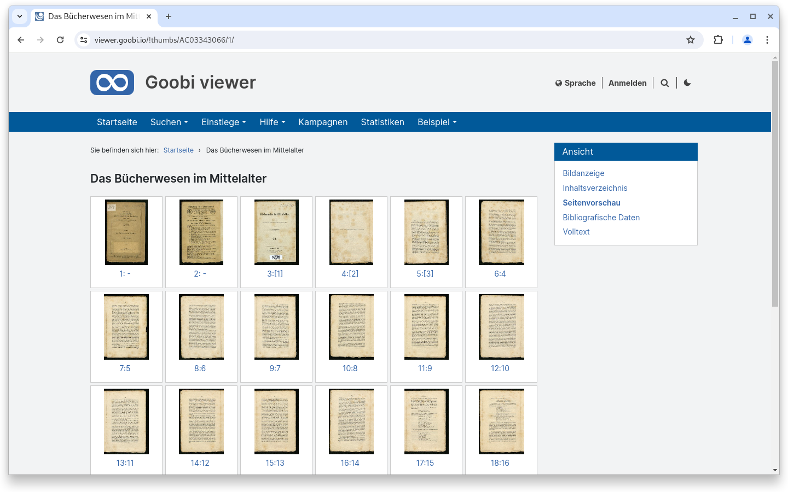
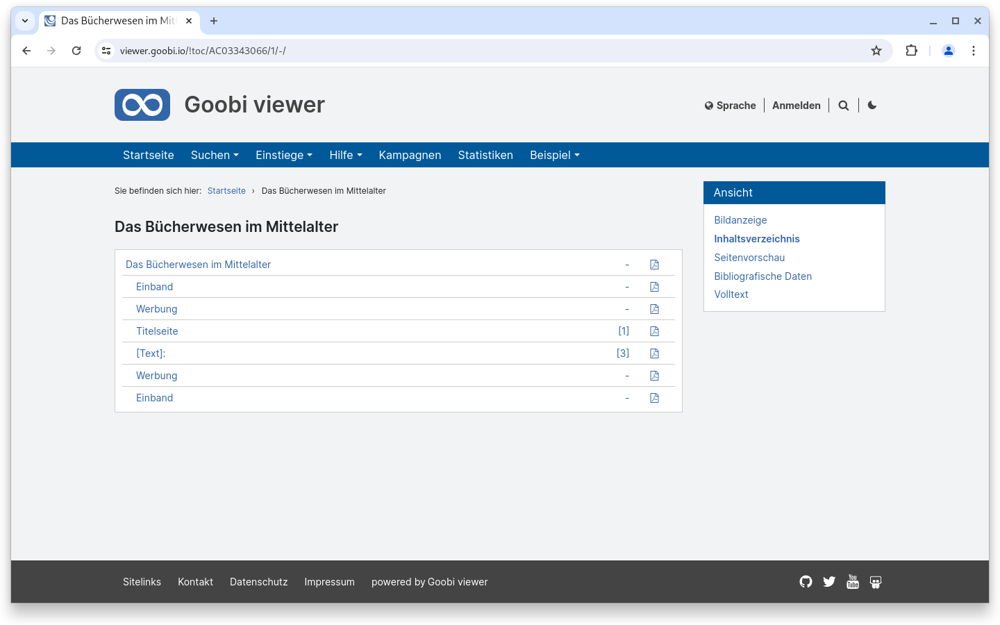
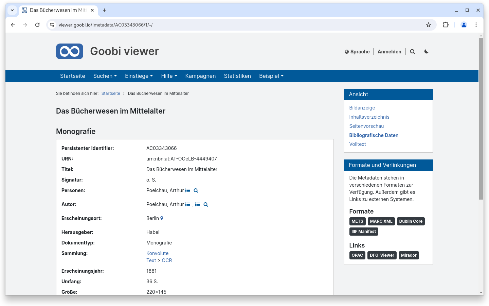
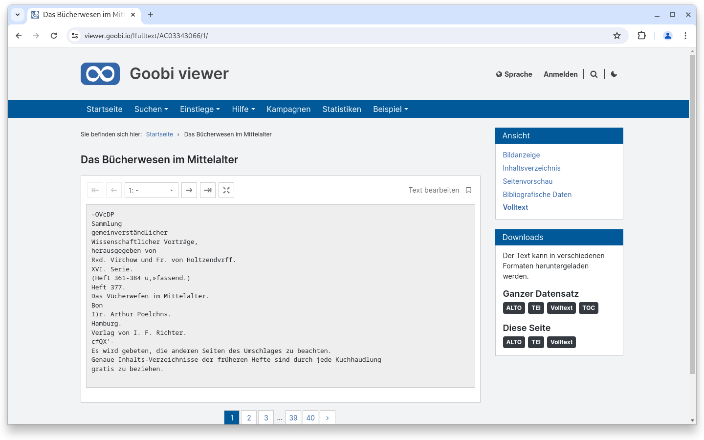
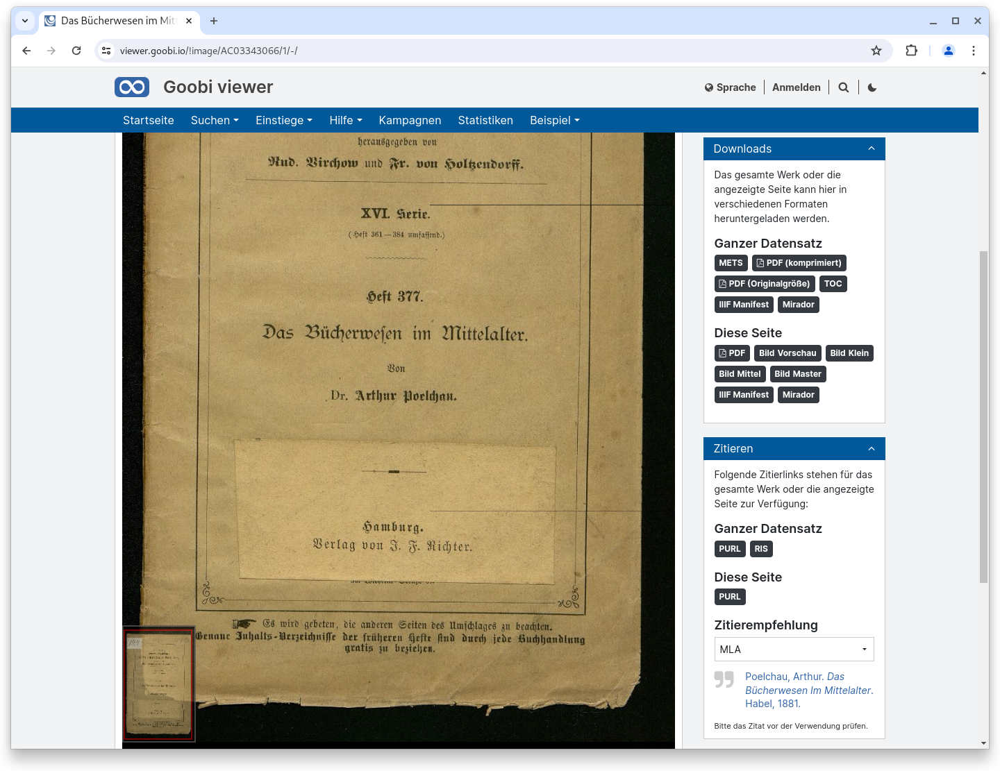
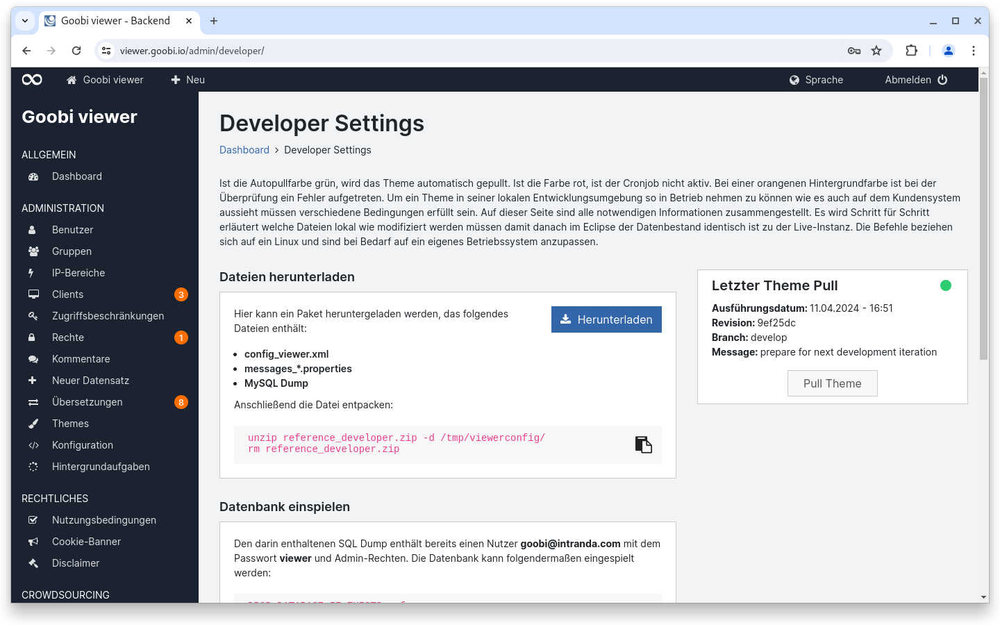
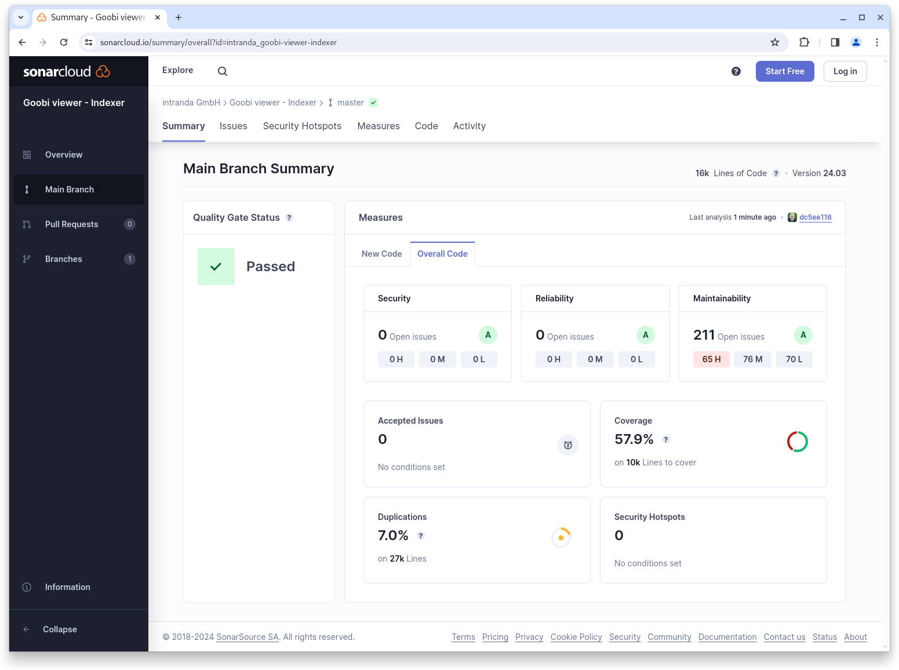
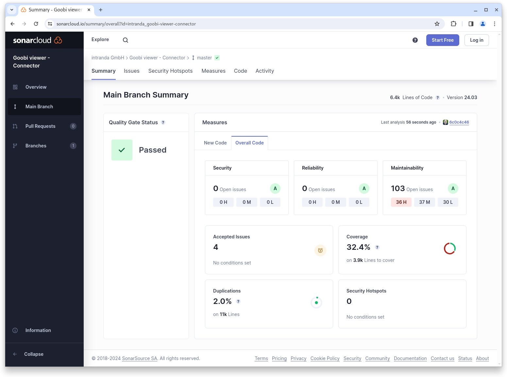

# März

## Coming soon :rocket:

* **Live-Aufbereitung** von Inhalten
* **Überarbeitung von EAD** Strukturen
* **Barrierefreiheit**

## Entwicklungen

### Widgets

Lange hat es gedauert, jetzt ist es endlich so weit. Das Widget "Zitieren und Nachnutzen" wurde aufgeteilt und die Sidebar auf den verschiedenen Ansichten der Werksansicht aufgeräumt und entschlackt. Basierend auf einem Feedback aus einer UX Studie haben wir das "Weniger ist mehr"-Motto zu Herzen genommen und uns die Fragen gestellt:

* Was für eine Terminologie wird erwartet? ... und
* Was für eine Funktionalität wird erwartet?

Herausgekommen sind verschiedene Widgets, die kontextbezogen Inhalte anbieten. Auf der Seite "Inhaltsverzeichnis" und "Seitenvorschau" ist die Sidebar jetzt sehr aufgeräumt und es stehen keine zusätzlichen Widgets mehr zur Verfügung. Auf der Seite "Bibliographische Daten" gibt es das neue Widget "Formate und Verlinkungen", bei dem die angezeigten Metadaten in verschiedenen Formaten aber auch Verlinkungen zu externen Seiten, wie zum Beispiel dem Bibliothekskatalog, dem DFG-Viewer oder auch einer Mirador-Instanz zur Verfügung stehen. Auf der Seite "Volltext" gibt es das neue Widget "Downloads". Hier kann entweder der aktuelle Text der Seite, oder auch der Volltext des gesamten Datensatzes in verschiedenen Formaten heruntergeladen werden.

<div>

<figure><figcaption><p>Die Sidebar in der Seitenvorschau wurde aufgeräumt</p></figcaption></figure>

 

<figure><figcaption><p>Auch in dem Inhaltsverzeichnis ist die Sidebar jetzt fast leer.</p></figcaption></figure>

</div>

<figure><figcaption><p>Auf der Seite der Bibliographischen Daten gibt es ein neues Widget "Formate und Verlinkungen"</p></figcaption></figure>

<figure><figcaption><p>Auf der Volltextseite stehen  im Widget "Downloads" die verschiedenen Textoptionen zur Verfügung</p></figcaption></figure>

<figure><figcaption><p>In der Bildanzeige gibt es jetzt die Widgets "Downloads" und "Zitieren"</p></figcaption></figure>

### Admin

Für Entwickler gibt es jetzt einen neuen Bereich im Backend, in dem ein Paket für die Inbetriebnahme in der lokalen Entwicklungsumgebung heruntergeladen werden kann. Außerdem gibt es die Möglichkeit ein per git auf dem Server ausgechecktes Theme über einen Knopfdruck im Backend zu aktualisieren. Dieser Bereich unterstützt die Entwickler beim Nachstellen von gemeldeten Bugs sowie dem Einspielen von kleinen Updates beim Styling.

<figure><figcaption><p>Neuer Entwickler-Bereich im Backend</p></figcaption></figure>

### IIIF

Ab sofort ist es auch Möglich ein vollständiges IIIF Presentation Manifest NUR mit dem aktuellen Bild zu generieren. Diese Möglichkeit steht in dem neuen "Downloads" Widget in der Werksansicht zur Verfügung.

### Goobi viewer Indexer

Der Goobi viewer Indexer hat die Möglichkeit erhalten vollständige EAD Dateien zu indexieren und im Solr Suchindex zu speichern. Dieses ist die Vorbereitung für eine überarbeitete Archivanzeige im Goobi viewer Core.

Weiter sind jetzt die Werte vom TYPE Attribut im physischen Baum von METS-Dateien, die der Goobi viewer als zulässige Werte erkennt, konfigurierbar. Bisher war hard codiert `page` erlaubt, ab jetzt können auch weitere Werte wie `object`, `audio` oder `video` konfiguriert werden, die dann als "Seite" im Werk prozessiert werden sollen.

Zuletzt wurde ein Bug behoben, bei dem die Prüfung auf verfügbaren freien Speicher fehlschlug, wenn dieser freie Speicherbereich sehr groß war. Siehe dazu auch den folgenden Thread im Community Forum:&#x20;



### Snippets

* Connector: Hier gab es einen Bugfix für den Cursor in Resumption Token
* Core: Inhalte aus CMS-Seiten, die noch nicht veröffentlicht waren, sind teilweise trotzdem sichtbar gewesen.
* Core: Japanisch und Polnisch sind als weitere potentielle Sprachen hinzugefügt worden

## Codeanalyse

Die folgenden Screenshots zeigen die SonarCloud Analyse des aktuellen Releases. Weitere Informationen gibt es direkt auf der [Projektseite](https://sonarcloud.io/organizations/intranda/projects).

<figure><figcaption><p>SonarCloud Analyse: Goobi viewer Core - für den Git Tag v24.03</p></figcaption></figure>

<figure><figcaption><p>SonarCloud Analyse: Goobi viewer Indexer - für den Git Tag v24.03</p></figcaption></figure>

<figure><figcaption><p>SonarCloud Analyse: Goobi viewer Connector - für den Git Tag v24.03</p></figcaption></figure>

## Versionsnummern

Die Versionen die in der `pom.xml` des Themes eingetragen werden müssen um die in diesem Digest beschriebenen Funktionen zu erhalten lauten:

```xml
<dependency>
    <groupId>io.goobi.viewer</groupId>
    <artifactId>viewer-core</artifactId>
    <version>24.03</version>
</dependency>
<dependency>
    <groupId>io.goobi.viewer</groupId>
    <artifactId>viewer-core-config</artifactId>
    <version>24.03</version>
</dependency>
<dependency>
    <groupId>io.goobi.viewer</groupId>
    <artifactId>viewer-connector</artifactId>
    <version>24.03</version>
</dependency>
```

Der Goobi viewer Indexer hat die Versionsnummer **24.03**\
Das Goobi viewer Crowdsourcing Modul hat die Versionsnummer **24.03**
