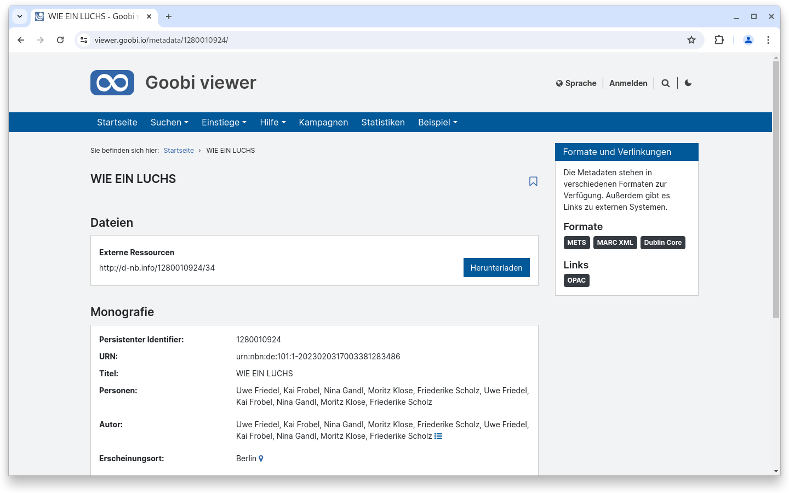
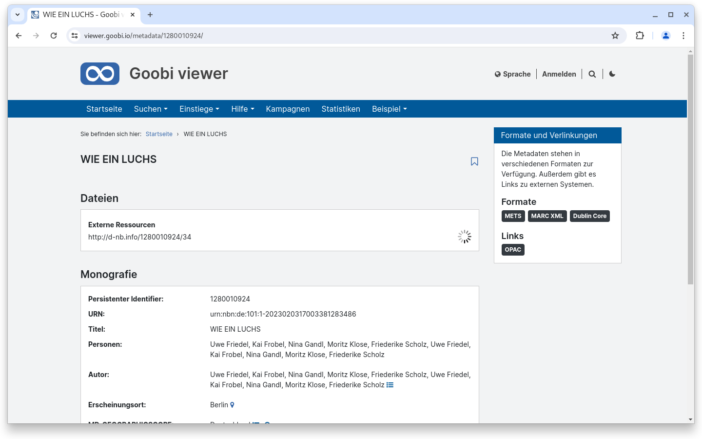
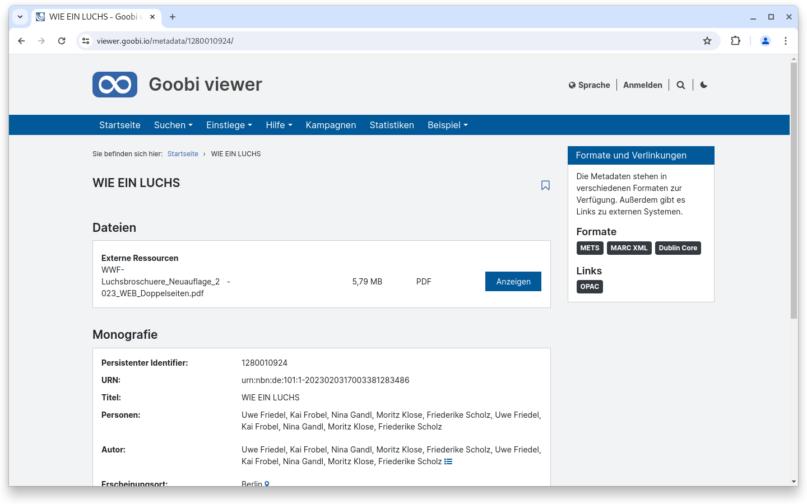
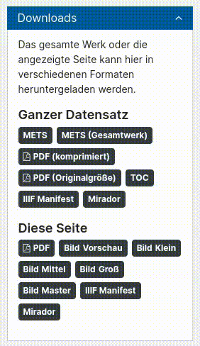
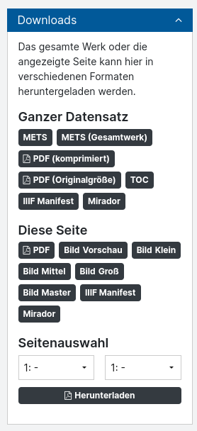
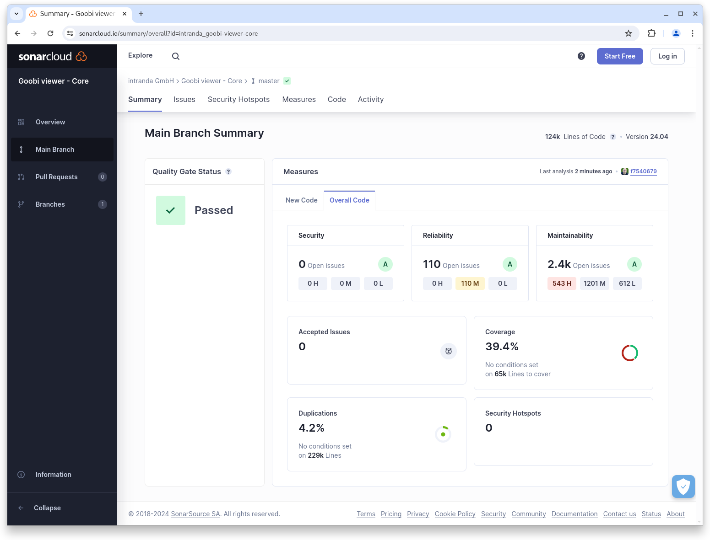

# April

## Coming soon :rocket:

* **Überarbeitung von EAD** Strukturen
* Styling von **Booleans** in der **Facettierung**
* neue **CMS-Elemente**
* **technische Metadaten** aus Bildern

## Core

### Live-Aufbereitung von Inhalten

Der Goobi viewer kann jetzt bei Born Digital Dokumenten externe Inhalte abfragen und live aufbereiten. Dadurch ist es möglich zu Born-Digital Dokumenten nur die Metadaten in den Goobi viewer zu exportieren und die eigentlichen Inhalte bei Bedarf herunterzuladen, aufzubereiten, zu präsentieren und nach einem definierten Zeitintervall auch wieder automatisch vom Server zu löschen.

<figure><figcaption><p>Eine externe Ressource wird zum Download angeboten</p></figcaption></figure>

<figure><figcaption><p>Während der Aufbereitung wird über den Fortschritt informiert</p></figcaption></figure>

<figure><figcaption><p>Wenn alles fertig ist, können die Dateien betrachtet werden.</p></figcaption></figure>

### Barrierefreiheit

Das Thema Barrierefreiheit ist wirklich nie zu Ende und begleitet uns kontinuierlich. Diesen Monat haben wir eine Verbesserung bei den Tooltips vorgenommen. Konkret ging es um die Anforderung, dass angezeigten Inhalte in Tooltips auch mit der Maus markiert werden können. Aufgefallen ist das, als wir eine BITV-Selbstbewertung durchgeführt haben. Erst folgten lange Diskussionen über die Sinnhaftigkeit dieser Anforderung, aber auch die Web Content Accessibility Guidelines (WCAG) in der Version 2.1 sagen in [Abschnit 1.4.13](https://www.w3.org/TR/WCAG21/#content-on-hover-or-focus) ganz klar:

> If pointer hover can trigger the additional content, then the pointer can be moved over the additional content without the additional content disappearing;

Gut, dann eben auch im Goobi viewer :wink:

<figure><figcaption><p>Barrierefreie Tooltips</p></figcaption></figure>

### Download einer Seitenauswahl

Vor vielen vielen Jahren haben wir für einen Kunden in einem Theme eine Funktionalität entwickelt um mit der Angabe einer Start- und Endseite genau diesen Bereich als PDF-Datei zu generieren. Diese Funktionalität haben wir jetzt komplett neu entwickelt, in den Core integriert und mit einem Konfigurationsschalter versehen, so dass sie bei Bedarf in jeder Installation aktiviert werden kann.

<figure><figcaption><p>optionaler Download einer Seitenauswahl</p></figcaption></figure>

### Download von zusätzlichen Dateien

Schon sehr lange gibt es die Möglichkeit zu einem Datensatz zusätzliche Dateien zum Download anzubieten. Dort existiert auch die Möglichkeit Dateien, die auf einen regulären Ausdruck matchen, auszublenden.

Der Bereich wurde überarbeitet und um generische Filter und Bedingungen erweitert. Damit ist es jetzt möglich nicht nur bestimmte Dateien auszublenden, sondern auch nur bestimmte Dateien anzuzeigen. Die Filter können weiterhin als regulärer Ausdruck angegeben werden, aber darin kann auch mit Variablen gearbeitet werden. Hier ein Beispiel, dass die Möglichkeiten auch mit den Bedingungen aufzeigt.

```xml
<sidebarWidgetAdditionalFiles enabled="true">
    <filter action="show" regex="^(Audio_{struct.MD_SHELFMARK}\.mp3|Notensatz_{struct.MD_SHELFMARK}\.pdf|{struct.MD_SHELFMARK}\.mp3|{struct.MD_SHELFMARK}\.pdf)$">
        <conditions>
            <filter action="show"
                    regex="archive\.100uaghgw\.020volksliedarchiv.*"
                    value="{record.DC}" />
        </conditions>
    </filter>
</sidebarWidgetAdditionalFiles>
```

Übersetzt bedeutet das folgendes: Zeige alle Dateien an, die `Audio_XXX.mp3` oder `Notensatz_XXX.pdf` oder `XXX.mp3` oder `XXX.pdf` heißen, wobei XXX jeweils die Signatur des aktuell aktiven Strukturelementes ist, aber nur unter der Bedingung, dass der komplette Datensatz in der Sammlung oder einer Untersammlung von `archive.100uaghgw.020volksliedarchiv` ist.

### IIIF

Sofern in den Metadaten URLs zu IIIF Presentation Manifesten vorliegen kann der Goobi viewer Core diese nun auch in seine Oberfläche weiterreichen und verwenden. Dafür steht ein neuer Konfigurationsschalter zur Verfügung. Ist dieser aktiv und ein Solr Feld konfiguriert, wird bei den in der Oberfläche angebotenen IIIF Manifesten auf den indexierten Wert verwiesen. Auch leitet der REST Endpoint für das IIIF Manifest fürs Werk automatisch auf die externe Manifest-URL weiter.



### Snippets

* Core: Die Funktionalität zur Doppelseitenansicht kann jetzt nicht nur ein- und ausgeschaltet, sondern auch standardmäßig aktiviert werden.
* Core: Bei dem OpenID Connect Authentifizierungsprovider können jetzt weitere Parameter konfiguriert werden, um auch speziellere Setups in Betrieb zu nehmen.

## Codeanalyse

Die folgenden Screenshots zeigen die SonarCloud Analyse des aktuellen Releases. Weitere Informationen gibt es direkt auf der [Projektseite](https://sonarcloud.io/organizations/intranda/projects).

<figure><figcaption><p>SonarCloud Analyse: Goobi viewer Core - für den Git Tag v24.04</p></figcaption></figure>

<figure><figcaption><p>SonarCloud Analyse: Goobi viewer Indexer - für den Git Tag v24.04</p></figcaption></figure>

<figure><figcaption><p>SonarCloud Analyse: Goobi viewer Connector - für den Git Tag v24.04</p></figcaption></figure>

## Versionsnummern

Die Versionen die in der `pom.xml` des Themes eingetragen werden müssen um die in diesem Digest beschriebenen Funktionen zu erhalten lauten:

```xml
<dependency>
    <groupId>io.goobi.viewer</groupId>
    <artifactId>viewer-core</artifactId>
    <version>24.04</version>
</dependency>
<dependency>
    <groupId>io.goobi.viewer</groupId>
    <artifactId>viewer-core-config</artifactId>
    <version>24.04</version>
</dependency>
<dependency>
    <groupId>io.goobi.viewer</groupId>
    <artifactId>viewer-connector</artifactId>
    <version>24.04</version>
</dependency>
```

Der Goobi viewer Indexer hat die Versionsnummer **24.04**\
Das Goobi viewer Crowdsourcing Modul hat die Versionsnummer **24.04**
