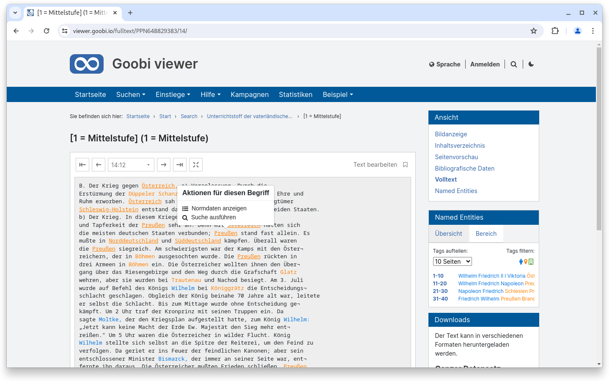
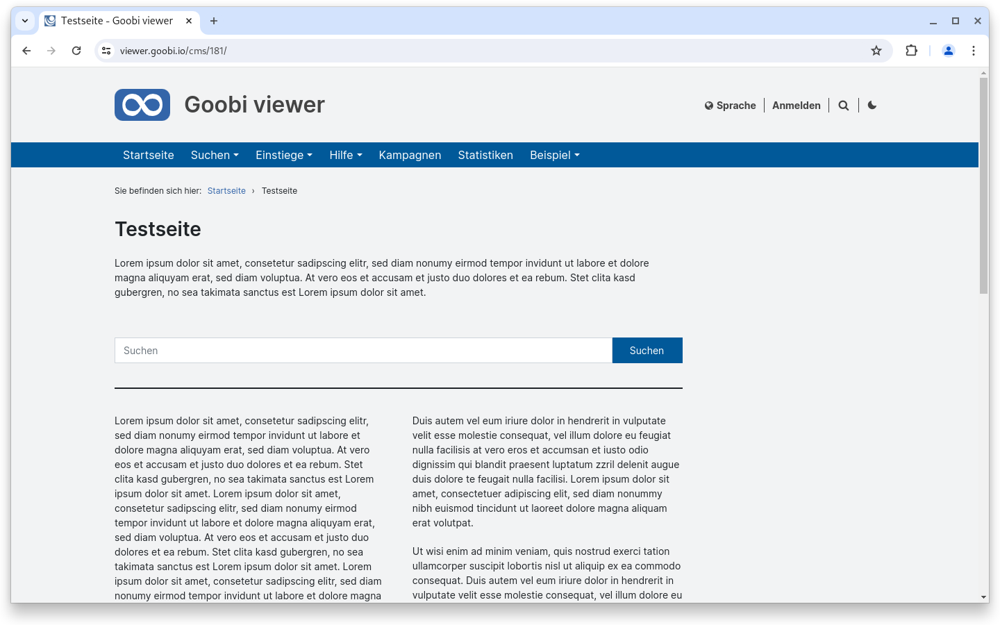

# Mai

## Coming soon :rocket:

* **Überarbeitung von EAD** Strukturen
* **technische Metadaten** aus Bildern
* **S3** Speicher
* **zugriffsbeschränkte Metadaten**

## Core

### Backend: Themes

Im Goobi viewer Backend gibt es die Möglichkeit Themes zu konfigurieren. Bereits seit längerem kann dort mit der **Quick CSS** Funktionalität das CSS des Goobi viewers überschrieben werden. Mit diesem Release kommen in dem Bereich verschiedene kleinere Veränderungen und Verbesserungen hinzu.

Zum einen wurde auch ein **Quick JS** eingeführt, so dass auch JavaScript Code im Theme gesetzt werden kann. Damit kann zum Beispiel eine generische Core Funktionalität themespezifisch konfiguriert werden. Zum anderen wurde für das Quick CSS wie auch für das Quick JS CodeMirror eingebunden. Damit steht ein Syntaxhighlighting zur Verfügung, mit dem auch Syntaxfehler einfacher erkannt werden können.

Zuletzt wurde auch bei der Logik der Einbindung in die Templates gearbeitet. Gibt es ein Haupt- und Subthemes, dann taucht ab sofort das Quick CSS und Quick JS aus dem Haupttheme auch in den Subthemes auf. Das war vorher nicht der Fall und jede Änderung die global gültig war, musste in jedem Subtheme einzeln hinterlegt werden.

<figure><figcaption><p>Quick CSS und Quick JS im Backend mit Syntaxhighlighting</p></figcaption></figure>

### Facettierung

Sofern in der Facettierung ein einfaches "Ja/Nein" angeboten wird, zum Beispiel "Bilder vorhanden Ja/Nein" oder "Volltext vorhanden Ja/Nein", kann diese Facette jetzt vom `type="boolean"` definiert werden. Anschließend wird nicht mehr die klassische Listenauswahl angezeigt, sondern zwei Buttons mit denen die Auswahl an- oder abgewählt werden kann.

<figure><figcaption><p>Ja/Nein Facetten können jetzt als zwei Buttons angezeigt werden</p></figcaption></figure>

### ALTO

Mit Named Entities angereichertes, getaggtes ALTO, wird im Goobi viewer schon lange unterstützt. Dabei werden die verschiedenen Entitäten farblich hervorgehoben. Neu ist, dass wir jetzt auch mit Normdaten angereicherte Named Entities unterstützen. Ist das vorhanden, wird über eine Unterstreichung visuell hervorgehoben, dass man das Wort anklicken kann. Es öffnet sich daraufhin ein Popover, aus dem heraus entweder der verlinkte Normdatensatz in dem bekannten Overlay angezeigt, oder alternativ eine Suche nach anderen Stellen mit dem Normdatensatz ausgelöst werden kann.

<figure><figcaption><p>Getaggtes ALTO inklusive Normdatenverknüpfung eines Tags mit neuem Aktionen-Popover</p></figcaption></figure>

### CMS

Für das Erstellen von CMS-Seiten gibt es jetzt drei neue Elemente: **Suchschlitz**, **Trennlinie** und **Text (zweispaltig)**.

Dem Suchschlitz kann eine optionale Überschrift mitgegeben werden, zeigt aber ansonsten einen Suchschlitz an, mit dem eine globale Suche ausgelöst werden kann.

Die Trennlinie kann eingesetzt werden, um Abschnitte auch visuell stärker voneinander abzusetzen.

Der Text (zweispaltig) zeigt den eingegebene Fließtext automatisch in zwei Spalten an.

<figure><figcaption><p>Neue Elemente für eine CMS-Seite</p></figcaption></figure>

### Slider

Die integrierte Slidervorschau wurde überarbeitet und wertet jetzt das Frontend-Styling aus. Außerdem ist es möglich die Breite der Vorschau dynamisch zu ändern, um so die Darstellung auf verschiedenen Bildschirmgrößen direkt testen zu können.

<figure><figcaption><p>Slider im Backend haben jetzt eine ans Frontend-Styling angepasste Vorschau</p></figcaption></figure>

### Barrierefreiheit

Zur Verbesserung der Barrierfreiheit sind verschiedene Änderungen in den Core eingeflossen. Die größte Änderung betrifft die Slider, die nun über ein Update der verwendeten Javascript Library erstmals barrierefrei sind. Ergänzend wurden dort noch übersetzte Sprachvariablen zur besseren Orientierung eingepflegt. Außerdem wurden in der Sprachumschaltung die Links zu Buttons geändert, da hier semantisch gesehen mehr die Aktion: "Ändere die Sprache" ausgeführt wird als das "Lade die Seite neu". Letzteres passiert zwar, ist aber nur eine Folge der Aktion. Schlussendlich wurden auch weitere `aria-label` oder `alt` Attribute ergänzt oder unnötige `title` Attribut entfernt. Die Bedienbarkeit vom Widget Chronology wurde genauso verbessert wie die Kompatibilität von Screenreadern im Bereich von Suchtreffergruppen sowie dem Highlighting innerhalb von Suchtreffern.

### Snippets

* Core: Bei dem Feedback Formular wird jetzt der reply-to Header auf den Absender des Feedbacks gesetzt.
* Core: Bei der Definition von Karten im Backend gab es kleinere Anpassungen am Wording und den Hilfetexten.
* Core: Die unscharfe Suche wird jetzt bei neuen Suchanfragen konsequent zurückgesetzt. Vorher kam es teilweise zu unerwünschten Verhalten.
* Connector: Für die OAI Schnittstelle wurden verschiedene kleine Anpassungen für eine verbesserte Validierung der ausgelieferten Ergebnisse vorgenommen.

## Indexer

Es gibt eine signifikante Performanceverbesserung bei der Indexierung von EAD Dateien nachdem wir eine 70MB große EAD Datei mit über 140.000 Knoten zum Testen bekommen haben. Diese wird jetzt in unter 30 Sekunden verarbeitet. Dieselbe Logik ist auch für andere Metadatenformate implementiert aber wir sind uns nicht sicher ob die Verbesserung hier auch spürbar oder eher theoretischer Natur ist.

Neu ist ebenfalls die Unterstützung für die Normdatenbank Kulturnav. Für das Mapping der Felder kann die optionale Konfigurationsdatei [`normdatamap_json.properties`](https://github.com/intranda/goobi-viewer-core-config/blob/develop/goobi-viewer-core-config/src/main/resources/install/normdatamap\_json.properties) verwendet werden.

## Codeanalyse

Die folgenden Screenshots zeigen die SonarCloud Analyse des aktuellen Releases. Weitere Informationen gibt es direkt auf der [Projektseite](https://sonarcloud.io/organizations/intranda/projects).

<figure><figcaption><p>SonarCloud Analyse: Goobi viewer Core - für den Git Tag v24.05</p></figcaption></figure>

<figure><figcaption><p>SonarCloud Analyse: Goobi viewer Indexer - für den Git Tag v24.05</p></figcaption></figure>

<figure><figcaption><p>SonarCloud Analyse: Goobi viewer Connector - für den Git Tag v24.05</p></figcaption></figure>

## Versionsnummern

Die Versionen die in der `pom.xml` des Themes eingetragen werden müssen um die in diesem Digest beschriebenen Funktionen zu erhalten lauten:

```xml
<dependency>
    <groupId>io.goobi.viewer</groupId>
    <artifactId>viewer-core</artifactId>
    <version>24.05</version>
</dependency>
<dependency>
    <groupId>io.goobi.viewer</groupId>
    <artifactId>viewer-core-config</artifactId>
    <version>24.05</version>
</dependency>
<dependency>
    <groupId>io.goobi.viewer</groupId>
    <artifactId>viewer-connector</artifactId>
    <version>24.05</version>
</dependency>
```

Der Goobi viewer Indexer hat die Versionsnummer **24.05**\
Das Goobi viewer Crowdsourcing Modul hat die Versionsnummer **24.05**
